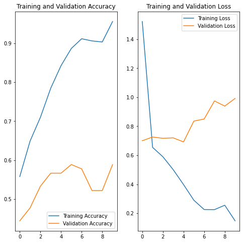
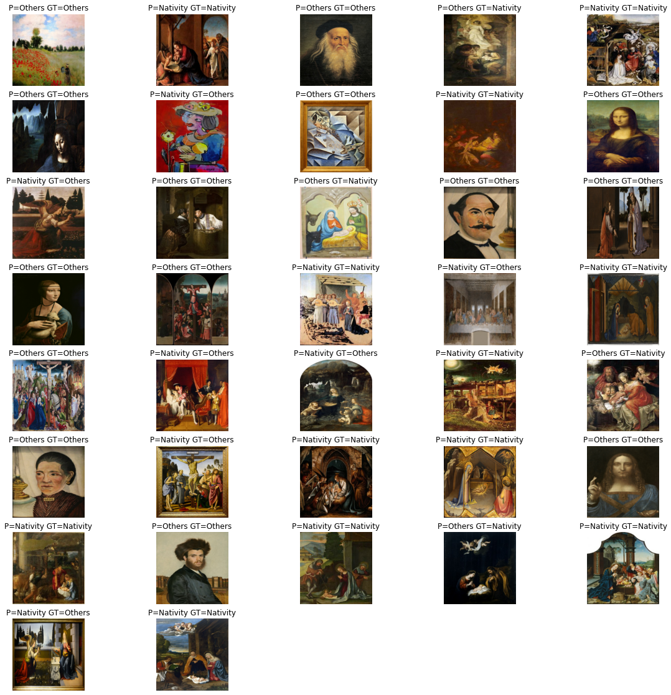
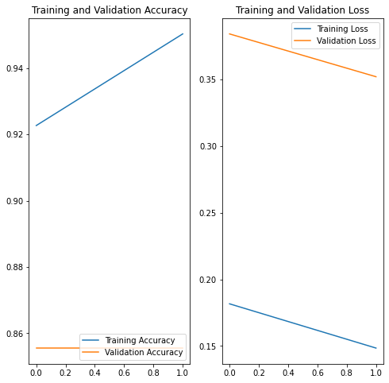

<a href="https://colab.research.google.com/github/armindocachada/tensorflow-custom-classification-art-nativity/blob/main/custom_image_classification_detect_if_a_painting_is_from_the_nativity.ipynb" target="_parent"></a>

# Tensorflow Custom Image Classification - Can I detect if a painting is a nativity painting?

Can I teach an AI model using Tensorflow Object Detection API, how to identify the theme of a painting?

The only way to find out is by trying! And I think you might be surprised by the outcome of this experiment.

But, I am going to narrow down my problem. I want to identify if a painting is about the **Nativity** or not.
Which is simple binary classification problem.

But first let me explain what a nativity painting is. A nativity painting is a painting where the subject is the birth of Jesus Christ, very revered in Christianity. 
During the last two thousand years, many famous artists like, for example, Leonardo Da Vinci, were commissioned to create paintings for Churches, so there should be plenty of paintings to pick about the nativity.


When trying to identify a painting about the **nativity** you will almost always see **Baby Jesus** in the center. And, almost always, you will see his **Mother Mary** and his **Father Joseph**. You will see sometimes **animals** around **Baby Jesus**, because he was born in a stable. Sometimes you will see him in a cave.
And sometimes he is outside and surrounded by shepherds, and so on. 

I hope you can agree with me. There is NO WAY that we can write any code that can take account of all these different variations. 

Remember what I just said? **Almost always** you will have Baby Jesus in the painting. But surely, a **nativity** painting without **Baby Jesus** makes no sense?
Right. Apparently **Leonardo Da Vinci**, didn't get that message and created a **nativity** painting without its central character. Mind that the **Virgin of the Rocks** is a very famous painting, but for me this is a clear **outlier**.  


Therefore for the sake of not confusing our **Deep Neural Network**, I am not going to include the **Virgin on the Rocks** in the training or validation while building our model. But just for fun at the end we will see if our model really can be smarter than what we think.

Ok. Now that you know what I am trying to build, for the sake of learning Tensorflow. You will quite rightly think. There is no way this will ever work?!

Before you rush into judgement, hold on to your paper! Let's find out!


# Before Starting

I created this notebook with code from the "Tensorflow tutorial on **Image Classification**. You can find the original tutorial in the link below: 

https://www.tensorflow.org/tutorials/images/classification


# Import TensorFlow and other libraries


```python
import matplotlib.pyplot as plt 
import PIL
import tensorflow as tf
import os
from tensorflow import keras
from tensorflow.keras import layers
from tensorflow.keras.models import Sequential

import pandas as pd
import requests # to get image from the web
import shutil # to save it locally
import time
import numpy as np
```

# Download Training, Validation and Test Image Data Sets

In order to train an image classifier we need to have a **training** image dataset, **validation** dataset and a **test** dataset.

Since we are training a binary image classifier, we will have images for two different classes:


*   Nativity
*   Others

During the training of our model we will use the training dataset to teach the model how to classify a painting: either a **nativity** painting or not(**other**).

At the end of each training cycle(epoch) we will use the validationg data-set to score how well the model is doing by calculating the **accuracy** and the **loss**. The **accuracy** measures how many times our model got the right answer. **Higher** is better. The **loss** measures the delta, i.e. the difference between the predicted value and the actual value. **Lower** is better.

It is important that the **validation** data set is **separate** from the **training** dataset because the AI model is very good at cheating. If you don't separate the two, the model, will simply memorise the answers instead of learning the intrinsic characteristics of what we are trying to teach it.

At the end of the training we will also use a separate **test** dataset from the **training** and **validation** dataset, to do an independent benchmark of the model performance. 

You will notice that we are downloading three files:
- nativity_dataset.csv - contains all nativity paintings
- other_dataset.csv - contains many paintings except nativity paintings
- test_dataset.csv - contains labeled paintings

Wait a moment! Did I not just say that the training data set should be separate from the validation data set, so why keep it in the same files?

Yes, but because we are doing data exploration, it is a good thing to have some flexibility. Typically you are advised to have 80% of the training data and 20% of the validation data. But, this is not a hard and fast rule. We might want to change these percentages and see what gives us better results as part of our experimentation. This is also known as **Hyperparameter tuning**. On the other hand the test data set should be fixed, so we can compare different models with different architectures in a consistent way.


Some more utility functions just to help download the images from our image dataset. Notice that **getFileNameFromUrl()** does some very basic **cleanup** and **extraction** of the **filename** in the url.


```python
def getFileNameFromUrl(url):
  firstpos=url.rindex("/")
  lastpos=len(url)
  filename=url[firstpos+1:lastpos]
  print(f"url={url} firstpos={firstpos} lastpos={lastpos} filename={filename}")
  return filename


def downloadImage(imageUrl, destinationFolder):
  filename = getFileNameFromUrl(imageUrl)
  # Open the url image, set stream to True, this will return the stream content.
  r = requests.get(imageUrl, stream = True)

  # Check if the image was retrieved successfully
  if r.status_code == 200:
      # Set decode_content value to True, otherwise the downloaded image file's size will be zero.
      r.raw.decode_content = True
      
      # Open a local file with wb ( write binary ) permission.
      filePath = os.path.join(destinationFolder, filename)
      if not os.path.exists(filePath):
        with open(filePath,'wb') as f:
            shutil.copyfileobj(r.raw, f)
        print('Image sucessfully Downloaded: ',filename)
        print("Sleeping for 1 seconds before attempting next download")
        time.sleep(1)
      else:
        print(f'Skipping image {filename} as it is already Downloaded: ')

  else:
      print(f'Image url={imageUrl} and filename={filename} Couldn\'t be retreived. HTTP Status={r.status_code}')


```


```python
df = pd.read_csv("nativity_dataset.csv")

# create directory to which we download if it doesn't exist
destinationFolder = "/content/dataset/nativity"
os.makedirs(destinationFolder, exist_ok=True)

for i, row in df.iterrows():
  print(f"Index: {i}")
  print(f"{row['Image URL']}\n")

  downloadImage(row["Image URL"], destinationFolder)
  
```

    Index: 0
    https://d3d00swyhr67nd.cloudfront.net/w1200h1200/collection/LSE/CUMU/LSE_CUMU_TN07034-001.jpg
    
    url=https://d3d00swyhr67nd.cloudfront.net/w1200h1200/collection/LSE/CUMU/LSE_CUMU_TN07034-001.jpg firstpos=68 lastpos=93 filename=LSE_CUMU_TN07034-001.jpg
    Image sucessfully Downloaded:  LSE_CUMU_TN07034-001.jpg
    Sleeping for 1 seconds before attempting next download
    Index: 1
    https://d3d00swyhr67nd.cloudfront.net/w1200h1200/collection/GMIII/MCAG/GMIII_MCAG_1947_188-001.jpg
    
    url=https://d3d00swyhr67nd.cloudfront.net/w1200h1200/collection/GMIII/MCAG/GMIII_MCAG_1947_188-001.jpg firstpos=70 lastpos=98 filename=GMIII_MCAG_1947_188-001.jpg
    Image sucessfully Downloaded:  GMIII_MCAG_1947_188-001.jpg
    Sleeping for 1 seconds before attempting next download
    Index: 2
    https://d3d00swyhr67nd.cloudfront.net/w1200h1200/collection/HMPS/SCAG/HMPS_SCAG_1408-001.jpg
    
    url=https://d3d00swyhr67nd.cloudfront.net/w1200h1200/collection/HMPS/SCAG/HMPS_SCAG_1408-001.jpg firstpos=69 lastpos=92 filename=HMPS_SCAG_1408-001.jpg
    Image sucessfully Downloaded:  HMPS_SCAG_1408-001.jpg
    Sleeping for 1 seconds before attempting next download
    Index: 3
    https://d3d00swyhr67nd.cloudfront.net/w1200h1200/collection/CAM/CCF/CAM_CCF_PD_119_1961-001.jpg
    
    url=https://d3d00swyhr67nd.cloudfront.net/w1200h1200/collection/CAM/CCF/CAM_CCF_PD_119_1961-001.jpg firstpos=67 lastpos=95 filename=CAM_CCF_PD_119_1961-001.jpg
    Image sucessfully Downloaded:  CAM_CCF_PD_119_1961-001.jpg
    Sleeping for 1 seconds before attempting next download
    Index: 4
    https://d3d00swyhr67nd.cloudfront.net/w944h944/collection/CW/MTE/CW_MTE_60-001.jpg
    
    url=https://d3d00swyhr67nd.cloudfront.net/w944h944/collection/CW/MTE/CW_MTE_60-001.jpg firstpos=64 lastpos=82 filename=CW_MTE_60-001.jpg
    Image sucessfully Downloaded:  CW_MTE_60-001.jpg
    Sleeping for 1 seconds before attempting next download
    Index: 5
    https://d3d00swyhr67nd.cloudfront.net/w944h944/collection/GL/GM/GL_GM_158-001.jpg
    
    url=https://d3d00swyhr67nd.cloudfront.net/w944h944/collection/GL/GM/GL_GM_158-001.jpg firstpos=63 lastpos=81 filename=GL_GM_158-001.jpg
    Image sucessfully Downloaded:  GL_GM_158-001.jpg
    Sleeping for 1 seconds before attempting next download
    Index: 6
    https://d3d00swyhr67nd.cloudfront.net/w1200h1200/collection/CW/RCM/CW_RCM_TRURI_1000_96-001.jpg
    
    url=https://d3d00swyhr67nd.cloudfront.net/w1200h1200/collection/CW/RCM/CW_RCM_TRURI_1000_96-001.jpg firstpos=66 lastpos=95 filename=CW_RCM_TRURI_1000_96-001.jpg
    Image sucessfully Downloaded:  CW_RCM_TRURI_1000_96-001.jpg
    Sleeping for 1 seconds before attempting next download
    Index: 7
    https://d3d00swyhr67nd.cloudfront.net/w1200h1200/collection/WYR/BPM/WYR_BPM_B18-001.jpg
    
    url=https://d3d00swyhr67nd.cloudfront.net/w1200h1200/collection/WYR/BPM/WYR_BPM_B18-001.jpg firstpos=67 lastpos=87 filename=WYR_BPM_B18-001.jpg
    Image sucessfully Downloaded:  WYR_BPM_B18-001.jpg
    Sleeping for 1 seconds before attempting next download
    Index: 8
    https://d3d00swyhr67nd.cloudfront.net/w944h944/collection/VA/PC/VA_PC_2006AW0757-001.jpg
    
    url=https://d3d00swyhr67nd.cloudfront.net/w944h944/collection/VA/PC/VA_PC_2006AW0757-001.jpg firstpos=63 lastpos=88 filename=VA_PC_2006AW0757-001.jpg
    Image sucessfully Downloaded:  VA_PC_2006AW0757-001.jpg
    Sleeping for 1 seconds before attempting next download
    Index: 9
    https://d3d00swyhr67nd.cloudfront.net/w1200h1200/collection/DUR/DBM/DUR_DBM_O_247-001.jpg
    
    url=https://d3d00swyhr67nd.cloudfront.net/w1200h1200/collection/DUR/DBM/DUR_DBM_O_247-001.jpg firstpos=67 lastpos=89 filename=DUR_DBM_O_247-001.jpg
    Image sucessfully Downloaded:  DUR_DBM_O_247-001.jpg
    Sleeping for 1 seconds before attempting next download
    Index: 10
    https://d3d00swyhr67nd.cloudfront.net/w944h944/collection/BCN/LBL/BCN_LBL_06-001.jpg
    
    url=https://d3d00swyhr67nd.cloudfront.net/w944h944/collection/BCN/LBL/BCN_LBL_06-001.jpg firstpos=65 lastpos=84 filename=BCN_LBL_06-001.jpg
    Image sucessfully Downloaded:  BCN_LBL_06-001.jpg
    Sleeping for 1 seconds before attempting next download
    Index: 11
    https://d3d00swyhr67nd.cloudfront.net/w1200h1200/collection/CAM/CCF/CAM_CCF_ML_64_1999-001.jpg
    
    url=https://d3d00swyhr67nd.cloudfront.net/w1200h1200/collection/CAM/CCF/CAM_CCF_ML_64_1999-001.jpg firstpos=67 lastpos=94 filename=CAM_CCF_ML_64_1999-001.jpg
    Image sucessfully Downloaded:  CAM_CCF_ML_64_1999-001.jpg
    Sleeping for 1 seconds before attempting next download
    Index: 12
    https://d3d00swyhr67nd.cloudfront.net/w1200h1200/collection/LSE/CUMU/LSE_CUMU_TN07034-001.jpg
    
    url=https://d3d00swyhr67nd.cloudfront.net/w1200h1200/collection/LSE/CUMU/LSE_CUMU_TN07034-001.jpg firstpos=68 lastpos=93 filename=LSE_CUMU_TN07034-001.jpg
    Skipping image LSE_CUMU_TN07034-001.jpg as it is already Downloaded: 
    Index: 13
    https://d3d00swyhr67nd.cloudfront.net/w1200h1200/collection/BRM/BIFA/BRM_BIFA_51_5-001.jpg
    
    url=https://d3d00swyhr67nd.cloudfront.net/w1200h1200/collection/BRM/BIFA/BRM_BIFA_51_5-001.jpg firstpos=68 lastpos=90 filename=BRM_BIFA_51_5-001.jpg
    Image sucessfully Downloaded:  BRM_BIFA_51_5-001.jpg
    Sleeping for 1 seconds before attempting next download
    Index: 14
    https://d3d00swyhr67nd.cloudfront.net/w1200h1200/collection/NML/WARG/NML_WARG_WAG_8514-001.jpg
    
    url=https://d3d00swyhr67nd.cloudfront.net/w1200h1200/collection/NML/WARG/NML_WARG_WAG_8514-001.jpg firstpos=68 lastpos=94 filename=NML_WARG_WAG_8514-001.jpg
    Image sucessfully Downloaded:  NML_WARG_WAG_8514-001.jpg
    Sleeping for 1 seconds before attempting next download
    Index: 15
    https://d3d00swyhr67nd.cloudfront.net/w1200h1200/collection/CW/RCM/CW_RCM_TRURI_1000_96-001.jpg
    
    url=https://d3d00swyhr67nd.cloudfront.net/w1200h1200/collection/CW/RCM/CW_RCM_TRURI_1000_96-001.jpg firstpos=66 lastpos=95 filename=CW_RCM_TRURI_1000_96-001.jpg
    Skipping image CW_RCM_TRURI_1000_96-001.jpg as it is already Downloaded: 
    Index: 16
    https://d3d00swyhr67nd.cloudfront.net/w1200h1200/collection/NY/YAG/NY_YAG_YORAG_814-001.jpg
    
    url=https://d3d00swyhr67nd.cloudfront.net/w1200h1200/collection/NY/YAG/NY_YAG_YORAG_814-001.jpg firstpos=66 lastpos=91 filename=NY_YAG_YORAG_814-001.jpg
    Image sucessfully Downloaded:  NY_YAG_YORAG_814-001.jpg
    Sleeping for 1 seconds before attempting next download
    Index: 17
    https://d3d00swyhr67nd.cloudfront.net/w1200h1200/collection/CAM/CCF/CAM_CCF_M_54-001.jpg
    
    url=https://d3d00swyhr67nd.cloudfront.net/w1200h1200/collection/CAM/CCF/CAM_CCF_M_54-001.jpg firstpos=67 lastpos=88 filename=CAM_CCF_M_54-001.jpg
    Image sucessfully Downloaded:  CAM_CCF_M_54-001.jpg
    Sleeping for 1 seconds before attempting next download
    Index: 18
    https://d3d00swyhr67nd.cloudfront.net/w800h800/collection/ASH/ASHM/ASH_ASHM_WA1855_570-001.jpg
    
    url=https://d3d00swyhr67nd.cloudfront.net/w800h800/collection/ASH/ASHM/ASH_ASHM_WA1855_570-001.jpg firstpos=66 lastpos=94 filename=ASH_ASHM_WA1855_570-001.jpg
    Image sucessfully Downloaded:  ASH_ASHM_WA1855_570-001.jpg
    Sleeping for 1 seconds before attempting next download
    Index: 19
    https://d3d00swyhr67nd.cloudfront.net/w1200h1200/collection/ES/TAG/ES_TAG_EASTG_1269-001.jpg
    
    url=https://d3d00swyhr67nd.cloudfront.net/w1200h1200/collection/ES/TAG/ES_TAG_EASTG_1269-001.jpg firstpos=66 lastpos=92 filename=ES_TAG_EASTG_1269-001.jpg
    Image sucessfully Downloaded:  ES_TAG_EASTG_1269-001.jpg
    Sleeping for 1 seconds before attempting next download
    Index: 20
    https://d3d00swyhr67nd.cloudfront.net/w944h944/collection/GL/GM/GL_GM_146-001.jpg
    
    url=https://d3d00swyhr67nd.cloudfront.net/w944h944/collection/GL/GM/GL_GM_146-001.jpg firstpos=63 lastpos=81 filename=GL_GM_146-001.jpg
    Image sucessfully Downloaded:  GL_GM_146-001.jpg
    Sleeping for 1 seconds before attempting next download
    Index: 21
    https://d3d00swyhr67nd.cloudfront.net/w1200h1200/collection/NTII/BDCL/NTII_BDCL_343179_6-001.jpg
    
    url=https://d3d00swyhr67nd.cloudfront.net/w1200h1200/collection/NTII/BDCL/NTII_BDCL_343179_6-001.jpg firstpos=69 lastpos=96 filename=NTII_BDCL_343179_6-001.jpg
    Image sucessfully Downloaded:  NTII_BDCL_343179_6-001.jpg
    Sleeping for 1 seconds before attempting next download
    Index: 22
    https://d3d00swyhr67nd.cloudfront.net/w1200h1200/collection/BRM/BMAG/BRM_BMAG_1973_P7-001.jpg
    
    url=https://d3d00swyhr67nd.cloudfront.net/w1200h1200/collection/BRM/BMAG/BRM_BMAG_1973_P7-001.jpg firstpos=68 lastpos=93 filename=BRM_BMAG_1973_P7-001.jpg
    Image sucessfully Downloaded:  BRM_BMAG_1973_P7-001.jpg
    Sleeping for 1 seconds before attempting next download
    Index: 23
    https://d3d00swyhr67nd.cloudfront.net/w1200h1200/collection/BRM/BMAG/BRM_BMAG_1992_P2-001.jpg
    
    url=https://d3d00swyhr67nd.cloudfront.net/w1200h1200/collection/BRM/BMAG/BRM_BMAG_1992_P2-001.jpg firstpos=68 lastpos=93 filename=BRM_BMAG_1992_P2-001.jpg
    Image sucessfully Downloaded:  BRM_BMAG_1992_P2-001.jpg
    Sleeping for 1 seconds before attempting next download
    Index: 24
    https://d3d00swyhr67nd.cloudfront.net/w1200h1200/collection/HRT/BUSMT/HRT_BUSMT_BUSMT_2019_21_6-001.jpg
    
    url=https://d3d00swyhr67nd.cloudfront.net/w1200h1200/collection/HRT/BUSMT/HRT_BUSMT_BUSMT_2019_21_6-001.jpg firstpos=69 lastpos=103 filename=HRT_BUSMT_BUSMT_2019_21_6-001.jpg
    Image sucessfully Downloaded:  HRT_BUSMT_BUSMT_2019_21_6-001.jpg
    Sleeping for 1 seconds before attempting next download
    Index: 25
    https://d3d00swyhr67nd.cloudfront.net/w1200h1200/collection/BRM/BMAG/BRM_BMAG_1928P554-001.jpg
    
    url=https://d3d00swyhr67nd.cloudfront.net/w1200h1200/collection/BRM/BMAG/BRM_BMAG_1928P554-001.jpg firstpos=68 lastpos=94 filename=BRM_BMAG_1928P554-001.jpg
    Image sucessfully Downloaded:  BRM_BMAG_1928P554-001.jpg
    Sleeping for 1 seconds before attempting next download
    Index: 26
    https://d3d00swyhr67nd.cloudfront.net/w1200h1200/collection/TWMS/LAG/TWMS_LAG_TWCMS_F4613b-001.jpg
    
    url=https://d3d00swyhr67nd.cloudfront.net/w1200h1200/collection/TWMS/LAG/TWMS_LAG_TWCMS_F4613b-001.jpg firstpos=68 lastpos=98 filename=TWMS_LAG_TWCMS_F4613b-001.jpg
    Image sucessfully Downloaded:  TWMS_LAG_TWCMS_F4613b-001.jpg
    Sleeping for 1 seconds before attempting next download
    Index: 27
    https://d3d00swyhr67nd.cloudfront.net/w1200h1200/collection/DEV/TOP/DEV_TOP_869-001.jpg
    
    url=https://d3d00swyhr67nd.cloudfront.net/w1200h1200/collection/DEV/TOP/DEV_TOP_869-001.jpg firstpos=67 lastpos=87 filename=DEV_TOP_869-001.jpg
    Image sucessfully Downloaded:  DEV_TOP_869-001.jpg
    Sleeping for 1 seconds before attempting next download
    Index: 28
    https://d3d00swyhr67nd.cloudfront.net/w1200h1200/collection/NTI/KHC/NTI_KHC_541114-001.jpg
    
    url=https://d3d00swyhr67nd.cloudfront.net/w1200h1200/collection/NTI/KHC/NTI_KHC_541114-001.jpg firstpos=67 lastpos=90 filename=NTI_KHC_541114-001.jpg
    Image sucessfully Downloaded:  NTI_KHC_541114-001.jpg
    Sleeping for 1 seconds before attempting next download
    Index: 29
    https://d3d00swyhr67nd.cloudfront.net/w1200h1200/collection/GMII/BMAA/GMII_BMAA_BOLMG_1963_P_49-001.jpg
    
    url=https://d3d00swyhr67nd.cloudfront.net/w1200h1200/collection/GMII/BMAA/GMII_BMAA_BOLMG_1963_P_49-001.jpg firstpos=69 lastpos=103 filename=GMII_BMAA_BOLMG_1963_P_49-001.jpg
    Image sucessfully Downloaded:  GMII_BMAA_BOLMG_1963_P_49-001.jpg
    Sleeping for 1 seconds before attempting next download
    Index: 30
    https://d3d00swyhr67nd.cloudfront.net/w944h944/collection/TWMS/LAG/TWMS_LAG_TWCMS_C677-001.jpg
    
    url=https://d3d00swyhr67nd.cloudfront.net/w944h944/collection/TWMS/LAG/TWMS_LAG_TWCMS_C677-001.jpg firstpos=66 lastpos=94 filename=TWMS_LAG_TWCMS_C677-001.jpg
    Image sucessfully Downloaded:  TWMS_LAG_TWCMS_C677-001.jpg
    Sleeping for 1 seconds before attempting next download
    Index: 31
    https://d3d00swyhr67nd.cloudfront.net/w1200h1200/collection/CIA/CIA/CIA_CIA_P_1966_GP_300_2-001.jpg
    
    url=https://d3d00swyhr67nd.cloudfront.net/w1200h1200/collection/CIA/CIA/CIA_CIA_P_1966_GP_300_2-001.jpg firstpos=67 lastpos=99 filename=CIA_CIA_P_1966_GP_300_2-001.jpg
    Image sucessfully Downloaded:  CIA_CIA_P_1966_GP_300_2-001.jpg
    Sleeping for 1 seconds before attempting next download
    Index: 32
    https://d3d00swyhr67nd.cloudfront.net/w800h800/collection/OU/CHCH/OU_CHCH_JBS_160-001.jpg
    
    url=https://d3d00swyhr67nd.cloudfront.net/w800h800/collection/OU/CHCH/OU_CHCH_JBS_160-001.jpg firstpos=65 lastpos=89 filename=OU_CHCH_JBS_160-001.jpg
    Image sucessfully Downloaded:  OU_CHCH_JBS_160-001.jpg
    Sleeping for 1 seconds before attempting next download
    Index: 33
    https://d3d00swyhr67nd.cloudfront.net/w800h800/collection/NG/NG/NG_NG_NG2492-001.jpg
    
    url=https://d3d00swyhr67nd.cloudfront.net/w800h800/collection/NG/NG/NG_NG_NG2492-001.jpg firstpos=63 lastpos=84 filename=NG_NG_NG2492-001.jpg
    Image sucessfully Downloaded:  NG_NG_NG2492-001.jpg
    Sleeping for 1 seconds before attempting next download
    Index: 34
    https://d3d00swyhr67nd.cloudfront.net/w800h800/collection/NG/NG/NG_NG_NG564-001.jpg
    
    url=https://d3d00swyhr67nd.cloudfront.net/w800h800/collection/NG/NG/NG_NG_NG564-001.jpg firstpos=63 lastpos=83 filename=NG_NG_NG564-001.jpg
    Image sucessfully Downloaded:  NG_NG_NG564-001.jpg
    Sleeping for 1 seconds before attempting next download
    Index: 35
    https://d3d00swyhr67nd.cloudfront.net/w1200h1200/collection/CAM/CCF/CAM_CCF_M_14-001.jpg
    
    url=https://d3d00swyhr67nd.cloudfront.net/w1200h1200/collection/CAM/CCF/CAM_CCF_M_14-001.jpg firstpos=67 lastpos=88 filename=CAM_CCF_M_14-001.jpg
    Image sucessfully Downloaded:  CAM_CCF_M_14-001.jpg
    Sleeping for 1 seconds before attempting next download
    Index: 36
    https://d3d00swyhr67nd.cloudfront.net/w1200h1200/collection/SYO/ROTMG/SYO_ROTMG_OP_1977_96-001.jpg
    
    url=https://d3d00swyhr67nd.cloudfront.net/w1200h1200/collection/SYO/ROTMG/SYO_ROTMG_OP_1977_96-001.jpg firstpos=69 lastpos=98 filename=SYO_ROTMG_OP_1977_96-001.jpg
    Image sucessfully Downloaded:  SYO_ROTMG_OP_1977_96-001.jpg
    Sleeping for 1 seconds before attempting next download
    Index: 37
    https://d3d00swyhr67nd.cloudfront.net/w944h944/collection/NLW/NLW/NLW_NLW_gcf05271-001.jpg
    
    url=https://d3d00swyhr67nd.cloudfront.net/w944h944/collection/NLW/NLW/NLW_NLW_gcf05271-001.jpg firstpos=65 lastpos=90 filename=NLW_NLW_gcf05271-001.jpg
    Image sucessfully Downloaded:  NLW_NLW_gcf05271-001.jpg
    Sleeping for 1 seconds before attempting next download
    Index: 38
    https://d3d00swyhr67nd.cloudfront.net/w1200h1200/collection/NML/WARG/NML_WARG_WAG_1193-001.jpg
    
    url=https://d3d00swyhr67nd.cloudfront.net/w1200h1200/collection/NML/WARG/NML_WARG_WAG_1193-001.jpg firstpos=68 lastpos=94 filename=NML_WARG_WAG_1193-001.jpg
    Image sucessfully Downloaded:  NML_WARG_WAG_1193-001.jpg
    Sleeping for 1 seconds before attempting next download
    Index: 39
    https://d3d00swyhr67nd.cloudfront.net/w1200h1200/collection/GMIII/MCAG/GMIII_MCAG_1947_185-001.jpg
    
    url=https://d3d00swyhr67nd.cloudfront.net/w1200h1200/collection/GMIII/MCAG/GMIII_MCAG_1947_185-001.jpg firstpos=70 lastpos=98 filename=GMIII_MCAG_1947_185-001.jpg
    Image sucessfully Downloaded:  GMIII_MCAG_1947_185-001.jpg
    Sleeping for 1 seconds before attempting next download
    Index: 40
    https://d3d00swyhr67nd.cloudfront.net/w1200h1200/collection/NTIV/POLY/NTIV_POLY_1246459_L-001.jpg
    
    url=https://d3d00swyhr67nd.cloudfront.net/w1200h1200/collection/NTIV/POLY/NTIV_POLY_1246459_L-001.jpg firstpos=69 lastpos=97 filename=NTIV_POLY_1246459_L-001.jpg
    Image sucessfully Downloaded:  NTIV_POLY_1246459_L-001.jpg
    Sleeping for 1 seconds before attempting next download
    Index: 41
    https://d3d00swyhr67nd.cloudfront.net/w1200h1200/collection/GLA/HAG/GLA_HAG_43811-001.jpg
    
    url=https://d3d00swyhr67nd.cloudfront.net/w1200h1200/collection/GLA/HAG/GLA_HAG_43811-001.jpg firstpos=67 lastpos=89 filename=GLA_HAG_43811-001.jpg
    Image sucessfully Downloaded:  GLA_HAG_43811-001.jpg
    Sleeping for 1 seconds before attempting next download
    Index: 42
    https://d3d00swyhr67nd.cloudfront.net/w1200h1200/collection/ES/BRHM/ES_BRHM_BNS_031_026A-001.jpg
    
    url=https://d3d00swyhr67nd.cloudfront.net/w1200h1200/collection/ES/BRHM/ES_BRHM_BNS_031_026A-001.jpg firstpos=67 lastpos=96 filename=ES_BRHM_BNS_031_026A-001.jpg
    Image sucessfully Downloaded:  ES_BRHM_BNS_031_026A-001.jpg
    Sleeping for 1 seconds before attempting next download
    Index: 43
    https://d3d00swyhr67nd.cloudfront.net/w1200h1200/collection/ERY/FUP/ERY_FUP_U3-001.jpg
    
    url=https://d3d00swyhr67nd.cloudfront.net/w1200h1200/collection/ERY/FUP/ERY_FUP_U3-001.jpg firstpos=67 lastpos=86 filename=ERY_FUP_U3-001.jpg
    Image sucessfully Downloaded:  ERY_FUP_U3-001.jpg
    Sleeping for 1 seconds before attempting next download
    Index: 44
    https://d3d00swyhr67nd.cloudfront.net/w1200h1200/collection/CIA/CIA/CIA_CIA_P_1947_LF_13-001.jpg
    
    url=https://d3d00swyhr67nd.cloudfront.net/w1200h1200/collection/CIA/CIA/CIA_CIA_P_1947_LF_13-001.jpg firstpos=67 lastpos=96 filename=CIA_CIA_P_1947_LF_13-001.jpg
    Image sucessfully Downloaded:  CIA_CIA_P_1947_LF_13-001.jpg
    Sleeping for 1 seconds before attempting next download
    Index: 45
    https://d3d00swyhr67nd.cloudfront.net/w1200h1200/collection/CIA/CIA/CIA_CIA_P_1978_PG_81_1-001.jpg
    
    url=https://d3d00swyhr67nd.cloudfront.net/w1200h1200/collection/CIA/CIA/CIA_CIA_P_1978_PG_81_1-001.jpg firstpos=67 lastpos=98 filename=CIA_CIA_P_1978_PG_81_1-001.jpg
    Image sucessfully Downloaded:  CIA_CIA_P_1978_PG_81_1-001.jpg
    Sleeping for 1 seconds before attempting next download
    Index: 46
    https://d3d00swyhr67nd.cloudfront.net/w1200h1200/collection/OU/CAMH/OU_CAMH_143-001.jpg
    
    url=https://d3d00swyhr67nd.cloudfront.net/w1200h1200/collection/OU/CAMH/OU_CAMH_143-001.jpg firstpos=67 lastpos=87 filename=OU_CAMH_143-001.jpg
    Image sucessfully Downloaded:  OU_CAMH_143-001.jpg
    Sleeping for 1 seconds before attempting next download
    Index: 47
    https://d3d00swyhr67nd.cloudfront.net/w1200h1200/collection/WLC/WLC/WLC_WLC_P549-001.jpg
    
    url=https://d3d00swyhr67nd.cloudfront.net/w1200h1200/collection/WLC/WLC/WLC_WLC_P549-001.jpg firstpos=67 lastpos=88 filename=WLC_WLC_P549-001.jpg
    Image sucessfully Downloaded:  WLC_WLC_P549-001.jpg
    Sleeping for 1 seconds before attempting next download
    Index: 48
    https://d3d00swyhr67nd.cloudfront.net/w1200h1200/collection/CIA/CIA/CIA_CIA_P_1947_LF_21-001.jpg
    
    url=https://d3d00swyhr67nd.cloudfront.net/w1200h1200/collection/CIA/CIA/CIA_CIA_P_1947_LF_21-001.jpg firstpos=67 lastpos=96 filename=CIA_CIA_P_1947_LF_21-001.jpg
    Image sucessfully Downloaded:  CIA_CIA_P_1947_LF_21-001.jpg
    Sleeping for 1 seconds before attempting next download
    Index: 49
    https://d3d00swyhr67nd.cloudfront.net/w1200h1200/collection/ABD/AAG/ABD_AAG_008479-001.jpg
    
    url=https://d3d00swyhr67nd.cloudfront.net/w1200h1200/collection/ABD/AAG/ABD_AAG_008479-001.jpg firstpos=67 lastpos=90 filename=ABD_AAG_008479-001.jpg
    Image sucessfully Downloaded:  ABD_AAG_008479-001.jpg
    Sleeping for 1 seconds before attempting next download
    Index: 50
    https://d3d00swyhr67nd.cloudfront.net/w1200h1200/collection/NTIV/PET/NTIV_PET_49010-001.jpg
    
    url=https://d3d00swyhr67nd.cloudfront.net/w1200h1200/collection/NTIV/PET/NTIV_PET_49010-001.jpg firstpos=68 lastpos=91 filename=NTIV_PET_49010-001.jpg
    Image sucessfully Downloaded:  NTIV_PET_49010-001.jpg
    Sleeping for 1 seconds before attempting next download
    Index: 51
    https://d3d00swyhr67nd.cloudfront.net/w1200h1200/collection/BST/BMAGG/BST_BMAGG_K1659-001.jpg
    
    url=https://d3d00swyhr67nd.cloudfront.net/w1200h1200/collection/BST/BMAGG/BST_BMAGG_K1659-001.jpg firstpos=69 lastpos=93 filename=BST_BMAGG_K1659-001.jpg
    Image sucessfully Downloaded:  BST_BMAGG_K1659-001.jpg
    Sleeping for 1 seconds before attempting next download
    Index: 52
    https://d3d00swyhr67nd.cloudfront.net/w800h800/collection/NG/NG/NG_NG_NG1034-001.jpg
    
    url=https://d3d00swyhr67nd.cloudfront.net/w800h800/collection/NG/NG/NG_NG_NG1034-001.jpg firstpos=63 lastpos=84 filename=NG_NG_NG1034-001.jpg
    Image sucessfully Downloaded:  NG_NG_NG1034-001.jpg
    Sleeping for 1 seconds before attempting next download
    Index: 53
    https://d3d00swyhr67nd.cloudfront.net/w800h800/collection/NG/NG/NG_NG_NG573-001.jpg
    
    url=https://d3d00swyhr67nd.cloudfront.net/w800h800/collection/NG/NG/NG_NG_NG573-001.jpg firstpos=63 lastpos=83 filename=NG_NG_NG573-001.jpg
    Image sucessfully Downloaded:  NG_NG_NG573-001.jpg
    Sleeping for 1 seconds before attempting next download
    Index: 54
    https://d3d00swyhr67nd.cloudfront.net/w800h800/collection/NG/NG/NG_NG_NG5114-001.jpg
    
    url=https://d3d00swyhr67nd.cloudfront.net/w800h800/collection/NG/NG/NG_NG_NG5114-001.jpg firstpos=63 lastpos=84 filename=NG_NG_NG5114-001.jpg
    Image sucessfully Downloaded:  NG_NG_NG5114-001.jpg
    Sleeping for 1 seconds before attempting next download
    Index: 55
    https://d3d00swyhr67nd.cloudfront.net/w1200h1200/collection/STC/INV/STC_INV_1977_722-001.jpg
    
    url=https://d3d00swyhr67nd.cloudfront.net/w1200h1200/collection/STC/INV/STC_INV_1977_722-001.jpg firstpos=67 lastpos=92 filename=STC_INV_1977_722-001.jpg
    Image sucessfully Downloaded:  STC_INV_1977_722-001.jpg
    Sleeping for 1 seconds before attempting next download
    Index: 56
    https://d3d00swyhr67nd.cloudfront.net/w1200h1200/collection/NGS/NGS/NGS_NGS_NG_1758-001.jpg
    
    url=https://d3d00swyhr67nd.cloudfront.net/w1200h1200/collection/NGS/NGS/NGS_NGS_NG_1758-001.jpg firstpos=67 lastpos=91 filename=NGS_NGS_NG_1758-001.jpg
    Image sucessfully Downloaded:  NGS_NGS_NG_1758-001.jpg
    Sleeping for 1 seconds before attempting next download
    Index: 57
    https://d3d00swyhr67nd.cloudfront.net/w1200h1200/collection/NML/WARG/NML_WARG_WAG_2864-001.jpg
    
    url=https://d3d00swyhr67nd.cloudfront.net/w1200h1200/collection/NML/WARG/NML_WARG_WAG_2864-001.jpg firstpos=68 lastpos=94 filename=NML_WARG_WAG_2864-001.jpg
    Image sucessfully Downloaded:  NML_WARG_WAG_2864-001.jpg
    Sleeping for 1 seconds before attempting next download
    Index: 58
    https://d3d00swyhr67nd.cloudfront.net/w1200h1200/collection/NML/WARG/NML_WARG_WAG_2846-001.jpg
    
    url=https://d3d00swyhr67nd.cloudfront.net/w1200h1200/collection/NML/WARG/NML_WARG_WAG_2846-001.jpg firstpos=68 lastpos=94 filename=NML_WARG_WAG_2846-001.jpg
    Image sucessfully Downloaded:  NML_WARG_WAG_2846-001.jpg
    Sleeping for 1 seconds before attempting next download
    Index: 59
    https://d3d00swyhr67nd.cloudfront.net/w1200h1200/collection/SFK/FEM/SFK_FEM_FX_12-001.jpg
    
    url=https://d3d00swyhr67nd.cloudfront.net/w1200h1200/collection/SFK/FEM/SFK_FEM_FX_12-001.jpg firstpos=67 lastpos=89 filename=SFK_FEM_FX_12-001.jpg
    Image sucessfully Downloaded:  SFK_FEM_FX_12-001.jpg
    Sleeping for 1 seconds before attempting next download
    Index: 60
    https://d3d00swyhr67nd.cloudfront.net/w944h944/collection/WMR/APH/WMR_APH_N070552-001.jpg
    
    url=https://d3d00swyhr67nd.cloudfront.net/w944h944/collection/WMR/APH/WMR_APH_N070552-001.jpg firstpos=65 lastpos=89 filename=WMR_APH_N070552-001.jpg
    Image sucessfully Downloaded:  WMR_APH_N070552-001.jpg
    Sleeping for 1 seconds before attempting next download
    Index: 61
    https://d3d00swyhr67nd.cloudfront.net/w1200h1200/collection/GMIII/MCAG/GMIII_MCAG_1926_34-001.jpg
    
    url=https://d3d00swyhr67nd.cloudfront.net/w1200h1200/collection/GMIII/MCAG/GMIII_MCAG_1926_34-001.jpg firstpos=70 lastpos=97 filename=GMIII_MCAG_1926_34-001.jpg
    Image sucessfully Downloaded:  GMIII_MCAG_1926_34-001.jpg
    Sleeping for 1 seconds before attempting next download
    Index: 62
    https://d3d00swyhr67nd.cloudfront.net/w800h800/collection/CI/GMAG/CI_GMAG_GMAG_5890-001.jpg
    
    url=https://d3d00swyhr67nd.cloudfront.net/w800h800/collection/CI/GMAG/CI_GMAG_GMAG_5890-001.jpg firstpos=65 lastpos=91 filename=CI_GMAG_GMAG_5890-001.jpg
    Image sucessfully Downloaded:  CI_GMAG_GMAG_5890-001.jpg
    Sleeping for 1 seconds before attempting next download
    Index: 63
    https://d3d00swyhr67nd.cloudfront.net/w1200h1200/collection/ES/BRHM/ES_BRHM_BNS_062_013-001.jpg
    
    url=https://d3d00swyhr67nd.cloudfront.net/w1200h1200/collection/ES/BRHM/ES_BRHM_BNS_062_013-001.jpg firstpos=67 lastpos=95 filename=ES_BRHM_BNS_062_013-001.jpg
    Image sucessfully Downloaded:  ES_BRHM_BNS_062_013-001.jpg
    Sleeping for 1 seconds before attempting next download
    Index: 64
    https://d3d00swyhr67nd.cloudfront.net/w944h944/collection/SS/TCT/SS_TCT_PCF_54-001.jpg
    
    url=https://d3d00swyhr67nd.cloudfront.net/w944h944/collection/SS/TCT/SS_TCT_PCF_54-001.jpg firstpos=64 lastpos=86 filename=SS_TCT_PCF_54-001.jpg
    Image sucessfully Downloaded:  SS_TCT_PCF_54-001.jpg
    Sleeping for 1 seconds before attempting next download
    Index: 65
    https://d3d00swyhr67nd.cloudfront.net/w944h944/collection/ERY/FG/ERY_FG_186998-001.jpg
    
    url=https://d3d00swyhr67nd.cloudfront.net/w944h944/collection/ERY/FG/ERY_FG_186998-001.jpg firstpos=64 lastpos=86 filename=ERY_FG_186998-001.jpg
    Image sucessfully Downloaded:  ERY_FG_186998-001.jpg
    Sleeping for 1 seconds before attempting next download
    Index: 66
    https://d3d00swyhr67nd.cloudfront.net/w800h800/collection/NG/NG/NG_NG_NG3647-001.jpg
    
    url=https://d3d00swyhr67nd.cloudfront.net/w800h800/collection/NG/NG/NG_NG_NG3647-001.jpg firstpos=63 lastpos=84 filename=NG_NG_NG3647-001.jpg
    Image sucessfully Downloaded:  NG_NG_NG3647-001.jpg
    Sleeping for 1 seconds before attempting next download
    Index: 67
    https://d3d00swyhr67nd.cloudfront.net/w800h800/collection/NG/NG/NG_NG_NG3114-001.jpg
    
    url=https://d3d00swyhr67nd.cloudfront.net/w800h800/collection/NG/NG/NG_NG_NG3114-001.jpg firstpos=63 lastpos=84 filename=NG_NG_NG3114-001.jpg
    Image sucessfully Downloaded:  NG_NG_NG3114-001.jpg
    Sleeping for 1 seconds before attempting next download
    Index: 68
    https://d3d00swyhr67nd.cloudfront.net/w800h800/collection/OU/CHCH/OU_CHCH_JBS_136-001.jpg
    
    url=https://d3d00swyhr67nd.cloudfront.net/w800h800/collection/OU/CHCH/OU_CHCH_JBS_136-001.jpg firstpos=65 lastpos=89 filename=OU_CHCH_JBS_136-001.jpg
    Image sucessfully Downloaded:  OU_CHCH_JBS_136-001.jpg
    Sleeping for 1 seconds before attempting next download
    Index: 69
    https://d3d00swyhr67nd.cloudfront.net/w1200h1200/collection/DUR/DBM/DUR_DBM_60-001.jpg
    
    url=https://d3d00swyhr67nd.cloudfront.net/w1200h1200/collection/DUR/DBM/DUR_DBM_60-001.jpg firstpos=67 lastpos=86 filename=DUR_DBM_60-001.jpg
    Image sucessfully Downloaded:  DUR_DBM_60-001.jpg
    Sleeping for 1 seconds before attempting next download
    Index: 70
    https://d3d00swyhr67nd.cloudfront.net/w800h800/collection/ASH/ASHM/ASH_ASHM_WA1958_22-001.jpg
    
    url=https://d3d00swyhr67nd.cloudfront.net/w800h800/collection/ASH/ASHM/ASH_ASHM_WA1958_22-001.jpg firstpos=66 lastpos=93 filename=ASH_ASHM_WA1958_22-001.jpg
    Image sucessfully Downloaded:  ASH_ASHM_WA1958_22-001.jpg
    Sleeping for 1 seconds before attempting next download
    Index: 71
    https://d3d00swyhr67nd.cloudfront.net/w1200h1200/collection/DUR/DBM/DUR_DBM_31-001.jpg
    
    url=https://d3d00swyhr67nd.cloudfront.net/w1200h1200/collection/DUR/DBM/DUR_DBM_31-001.jpg firstpos=67 lastpos=86 filename=DUR_DBM_31-001.jpg
    Image sucessfully Downloaded:  DUR_DBM_31-001.jpg
    Sleeping for 1 seconds before attempting next download
    Index: 72
    https://d3d00swyhr67nd.cloudfront.net/w944h944/collection/HRT/BUSMT/HRT_BUSMT_2007_138_5-001.jpg
    
    url=https://d3d00swyhr67nd.cloudfront.net/w944h944/collection/HRT/BUSMT/HRT_BUSMT_2007_138_5-001.jpg firstpos=67 lastpos=96 filename=HRT_BUSMT_2007_138_5-001.jpg
    Image sucessfully Downloaded:  HRT_BUSMT_2007_138_5-001.jpg
    Sleeping for 1 seconds before attempting next download
    Index: 73
    https://d3d00swyhr67nd.cloudfront.net/w1200h1200/collection/NTII/FOR/NTII_WGMA_1288033-001.jpg
    
    url=https://d3d00swyhr67nd.cloudfront.net/w1200h1200/collection/NTII/FOR/NTII_WGMA_1288033-001.jpg firstpos=68 lastpos=94 filename=NTII_WGMA_1288033-001.jpg
    Image sucessfully Downloaded:  NTII_WGMA_1288033-001.jpg
    Sleeping for 1 seconds before attempting next download
    Index: 74
    https://d3d00swyhr67nd.cloudfront.net/w800h800/collection/ASH/ASHM/ASH_ASHM_WA1933_23-001.jpg
    
    url=https://d3d00swyhr67nd.cloudfront.net/w800h800/collection/ASH/ASHM/ASH_ASHM_WA1933_23-001.jpg firstpos=66 lastpos=93 filename=ASH_ASHM_WA1933_23-001.jpg
    Image sucessfully Downloaded:  ASH_ASHM_WA1933_23-001.jpg
    Sleeping for 1 seconds before attempting next download
    Index: 75
    https://d3d00swyhr67nd.cloudfront.net/w1200h1200/collection/NTII/HVHL/NTII_HVHL_1542204-001.jpg
    
    url=https://d3d00swyhr67nd.cloudfront.net/w1200h1200/collection/NTII/HVHL/NTII_HVHL_1542204-001.jpg firstpos=69 lastpos=95 filename=NTII_HVHL_1542204-001.jpg
    Image sucessfully Downloaded:  NTII_HVHL_1542204-001.jpg
    Sleeping for 1 seconds before attempting next download
    Index: 76
    https://d3d00swyhr67nd.cloudfront.net/w1200h1200/collection/CIA/CIA/CIA_CIA_d_1978_pg_79-001.jpg
    
    url=https://d3d00swyhr67nd.cloudfront.net/w1200h1200/collection/CIA/CIA/CIA_CIA_d_1978_pg_79-001.jpg firstpos=67 lastpos=96 filename=CIA_CIA_d_1978_pg_79-001.jpg
    Image sucessfully Downloaded:  CIA_CIA_d_1978_pg_79-001.jpg
    Sleeping for 1 seconds before attempting next download
    Index: 77
    https://d3d00swyhr67nd.cloudfront.net/w1200h1200/collection/ES/BRHM/ES_BRHM_BNS_019_008-001.jpg
    
    url=https://d3d00swyhr67nd.cloudfront.net/w1200h1200/collection/ES/BRHM/ES_BRHM_BNS_019_008-001.jpg firstpos=67 lastpos=95 filename=ES_BRHM_BNS_019_008-001.jpg
    Image sucessfully Downloaded:  ES_BRHM_BNS_019_008-001.jpg
    Sleeping for 1 seconds before attempting next download
    Index: 78
    https://d3d00swyhr67nd.cloudfront.net/w1200h1200/collection/NGS/NGS/NGS_NGS_NG_2396-001.jpg
    
    url=https://d3d00swyhr67nd.cloudfront.net/w1200h1200/collection/NGS/NGS/NGS_NGS_NG_2396-001.jpg firstpos=67 lastpos=91 filename=NGS_NGS_NG_2396-001.jpg
    Image sucessfully Downloaded:  NGS_NGS_NG_2396-001.jpg
    Sleeping for 1 seconds before attempting next download
    Index: 79
    https://d3d00swyhr67nd.cloudfront.net/w1200h1200/collection/CIA/CIA/CIA_CIA_P_1966_GP_255-001.jpg
    
    url=https://d3d00swyhr67nd.cloudfront.net/w1200h1200/collection/CIA/CIA/CIA_CIA_P_1966_GP_255-001.jpg firstpos=67 lastpos=97 filename=CIA_CIA_P_1966_GP_255-001.jpg
    Image sucessfully Downloaded:  CIA_CIA_P_1966_GP_255-001.jpg
    Sleeping for 1 seconds before attempting next download
    Index: 80
    https://d3d00swyhr67nd.cloudfront.net/w1200h1200/collection/NTI/DYP/NTI_DYP_453820_1-001.jpg
    
    url=https://d3d00swyhr67nd.cloudfront.net/w1200h1200/collection/NTI/DYP/NTI_DYP_453820_1-001.jpg firstpos=67 lastpos=92 filename=NTI_DYP_453820_1-001.jpg
    Image sucessfully Downloaded:  NTI_DYP_453820_1-001.jpg
    Sleeping for 1 seconds before attempting next download
    Index: 81
    https://d3d00swyhr67nd.cloudfront.net/w1200h1200/collection/BRM/BMAG/BRM_BMAG_1960P61-001.jpg
    
    url=https://d3d00swyhr67nd.cloudfront.net/w1200h1200/collection/BRM/BMAG/BRM_BMAG_1960P61-001.jpg firstpos=68 lastpos=93 filename=BRM_BMAG_1960P61-001.jpg
    Image sucessfully Downloaded:  BRM_BMAG_1960P61-001.jpg
    Sleeping for 1 seconds before attempting next download
    Index: 82
    https://d3d00swyhr67nd.cloudfront.net/w944h944/collection/BCN/MUSL/BCN_MUSL_PCF_229-001.jpg
    
    url=https://d3d00swyhr67nd.cloudfront.net/w944h944/collection/BCN/MUSL/BCN_MUSL_PCF_229-001.jpg firstpos=66 lastpos=91 filename=BCN_MUSL_PCF_229-001.jpg
    Image sucessfully Downloaded:  BCN_MUSL_PCF_229-001.jpg
    Sleeping for 1 seconds before attempting next download
    Index: 83
    https://d3d00swyhr67nd.cloudfront.net/w800h800/collection/NG/NG/NG_NG_NG4647-001.jpg
    
    url=https://d3d00swyhr67nd.cloudfront.net/w800h800/collection/NG/NG/NG_NG_NG4647-001.jpg firstpos=63 lastpos=84 filename=NG_NG_NG4647-001.jpg
    Image sucessfully Downloaded:  NG_NG_NG4647-001.jpg
    Sleeping for 1 seconds before attempting next download
    Index: 84
    https://d3d00swyhr67nd.cloudfront.net/w1200h1200/collection/BCN/LH/BCN_LH_066-001.jpg
    
    url=https://d3d00swyhr67nd.cloudfront.net/w1200h1200/collection/BCN/LH/BCN_LH_066-001.jpg firstpos=66 lastpos=85 filename=BCN_LH_066-001.jpg
    Image sucessfully Downloaded:  BCN_LH_066-001.jpg
    Sleeping for 1 seconds before attempting next download
    Index: 85
    https://d3d00swyhr67nd.cloudfront.net/w800h800/collection/NG/NG/NG_NG_NG6279-001.jpg
    
    url=https://d3d00swyhr67nd.cloudfront.net/w800h800/collection/NG/NG/NG_NG_NG6279-001.jpg firstpos=63 lastpos=84 filename=NG_NG_NG6279-001.jpg
    Image sucessfully Downloaded:  NG_NG_NG6279-001.jpg
    Sleeping for 1 seconds before attempting next download
    Index: 86
    https://d3d00swyhr67nd.cloudfront.net/w800h800/collection/NG/NG/NG_NG_NG4081-001.jpg
    
    url=https://d3d00swyhr67nd.cloudfront.net/w800h800/collection/NG/NG/NG_NG_NG4081-001.jpg firstpos=63 lastpos=84 filename=NG_NG_NG4081-001.jpg
    Image sucessfully Downloaded:  NG_NG_NG4081-001.jpg
    Sleeping for 1 seconds before attempting next download
    Index: 87
    https://d3d00swyhr67nd.cloudfront.net/w1200h1200/collection/NTIII/KEDH/NTIII_KEDH_108837-001.jpg
    
    url=https://d3d00swyhr67nd.cloudfront.net/w1200h1200/collection/NTIII/KEDH/NTIII_KEDH_108837-001.jpg firstpos=70 lastpos=96 filename=NTIII_KEDH_108837-001.jpg
    Image sucessfully Downloaded:  NTIII_KEDH_108837-001.jpg
    Sleeping for 1 seconds before attempting next download
    Index: 88
    https://d3d00swyhr67nd.cloudfront.net/w1200h1200/collection/NML/WARG/NML_WARG_WAG_2895-001.jpg
    
    url=https://d3d00swyhr67nd.cloudfront.net/w1200h1200/collection/NML/WARG/NML_WARG_WAG_2895-001.jpg firstpos=68 lastpos=94 filename=NML_WARG_WAG_2895-001.jpg
    Image sucessfully Downloaded:  NML_WARG_WAG_2895-001.jpg
    Sleeping for 1 seconds before attempting next download
    Index: 89
    https://uploads5.wikiart.org/images/jacopo-bellini/triptych-of-the-nativity-1470.jpg
    
    url=https://uploads5.wikiart.org/images/jacopo-bellini/triptych-of-the-nativity-1470.jpg firstpos=50 lastpos=84 filename=triptych-of-the-nativity-1470.jpg
    Image sucessfully Downloaded:  triptych-of-the-nativity-1470.jpg
    Sleeping for 1 seconds before attempting next download
    Index: 90
    https://uploads2.wikiart.org/images/caravaggio/nativity-with-st-francis-and-st-lawrence-1609(1).jpg
    
    url=https://uploads2.wikiart.org/images/caravaggio/nativity-with-st-francis-and-st-lawrence-1609(1).jpg firstpos=46 lastpos=99 filename=nativity-with-st-francis-and-st-lawrence-1609(1).jpg
    Image sucessfully Downloaded:  nativity-with-st-francis-and-st-lawrence-1609(1).jpg
    Sleeping for 1 seconds before attempting next download
    Index: 91
    https://uploads0.wikiart.org/images/john-singleton-copley/the-nativity-1777.jpg
    
    url=https://uploads0.wikiart.org/images/john-singleton-copley/the-nativity-1777.jpg firstpos=57 lastpos=79 filename=the-nativity-1777.jpg
    Image sucessfully Downloaded:  the-nativity-1777.jpg
    Sleeping for 1 seconds before attempting next download
    Index: 92
    https://uploads3.wikiart.org/images/sandro-botticelli/the-mystical-nativity(1).jpg
    
    url=https://uploads3.wikiart.org/images/sandro-botticelli/the-mystical-nativity(1).jpg firstpos=53 lastpos=82 filename=the-mystical-nativity(1).jpg
    Image sucessfully Downloaded:  the-mystical-nativity(1).jpg
    Sleeping for 1 seconds before attempting next download
    Index: 93
    https://uploads0.wikiart.org/images/el-greco/the-nativity.jpg
    
    url=https://uploads0.wikiart.org/images/el-greco/the-nativity.jpg firstpos=44 lastpos=61 filename=the-nativity.jpg
    Image sucessfully Downloaded:  the-nativity.jpg
    Sleeping for 1 seconds before attempting next download
    Index: 94
    https://uploads8.wikiart.org/images/piero-della-francesca/nativity-1475(2).jpg
    
    url=https://uploads8.wikiart.org/images/piero-della-francesca/nativity-1475(2).jpg firstpos=57 lastpos=78 filename=nativity-1475(2).jpg
    Image sucessfully Downloaded:  nativity-1475(2).jpg
    Sleeping for 1 seconds before attempting next download
    Index: 95
    https://uploads6.wikiart.org/images/piero-della-francesca/nativity-detail-1475(1).jpg
    
    url=https://uploads6.wikiart.org/images/piero-della-francesca/nativity-detail-1475(1).jpg firstpos=57 lastpos=85 filename=nativity-detail-1475(1).jpg
    Image sucessfully Downloaded:  nativity-detail-1475(1).jpg
    Sleeping for 1 seconds before attempting next download
    Index: 96
    https://uploads3.wikiart.org/images/giotto/nativity.jpg
    
    url=https://uploads3.wikiart.org/images/giotto/nativity.jpg firstpos=42 lastpos=55 filename=nativity.jpg
    Image sucessfully Downloaded:  nativity.jpg
    Sleeping for 1 seconds before attempting next download
    Index: 97
    https://uploads0.wikiart.org/images/giotto/nativity-birth-of-jesus.jpg
    
    url=https://uploads0.wikiart.org/images/giotto/nativity-birth-of-jesus.jpg firstpos=42 lastpos=70 filename=nativity-birth-of-jesus.jpg
    Image sucessfully Downloaded:  nativity-birth-of-jesus.jpg
    Sleeping for 1 seconds before attempting next download
    Index: 98
    https://uploads4.wikiart.org/images/william-blake/illustration-to-milton-s-on-the-morning-of-christ-s-nativity-1809.jpg
    
    url=https://uploads4.wikiart.org/images/william-blake/illustration-to-milton-s-on-the-morning-of-christ-s-nativity-1809.jpg firstpos=49 lastpos=119 filename=illustration-to-milton-s-on-the-morning-of-christ-s-nativity-1809.jpg
    Image sucessfully Downloaded:  illustration-to-milton-s-on-the-morning-of-christ-s-nativity-1809.jpg
    Sleeping for 1 seconds before attempting next download
    Index: 99
    https://uploads6.wikiart.org/images/william-blake/illustration-to-milton-s-on-the-morning-of-christ-s-nativity-1809-2.jpg
    
    url=https://uploads6.wikiart.org/images/william-blake/illustration-to-milton-s-on-the-morning-of-christ-s-nativity-1809-2.jpg firstpos=49 lastpos=121 filename=illustration-to-milton-s-on-the-morning-of-christ-s-nativity-1809-2.jpg
    Image sucessfully Downloaded:  illustration-to-milton-s-on-the-morning-of-christ-s-nativity-1809-2.jpg
    Sleeping for 1 seconds before attempting next download
    Index: 100
    https://uploads1.wikiart.org/images/william-blake/the-nativity-1800.jpg
    
    url=https://uploads1.wikiart.org/images/william-blake/the-nativity-1800.jpg firstpos=49 lastpos=71 filename=the-nativity-1800.jpg
    Image sucessfully Downloaded:  the-nativity-1800.jpg
    Sleeping for 1 seconds before attempting next download
    Index: 101
    https://uploads5.wikiart.org/images/vladimir-borovikovsky/the-nativity-of-christ.jpg
    
    url=https://uploads5.wikiart.org/images/vladimir-borovikovsky/the-nativity-of-christ.jpg firstpos=57 lastpos=84 filename=the-nativity-of-christ.jpg
    Image sucessfully Downloaded:  the-nativity-of-christ.jpg
    Sleeping for 1 seconds before attempting next download
    Index: 102
    https://uploads5.wikiart.org/images/lucas-cranach-the-elder/nativity-holy-night-christmas.jpg
    
    url=https://uploads5.wikiart.org/images/lucas-cranach-the-elder/nativity-holy-night-christmas.jpg firstpos=59 lastpos=93 filename=nativity-holy-night-christmas.jpg
    Image sucessfully Downloaded:  nativity-holy-night-christmas.jpg
    Sleeping for 1 seconds before attempting next download
    Index: 103
    https://uploads0.wikiart.org/images/paolo-uccello/oculus-depicting-the-nativity-1443.jpg
    
    url=https://uploads0.wikiart.org/images/paolo-uccello/oculus-depicting-the-nativity-1443.jpg firstpos=49 lastpos=88 filename=oculus-depicting-the-nativity-1443.jpg
    Image sucessfully Downloaded:  oculus-depicting-the-nativity-1443.jpg
    Sleeping for 1 seconds before attempting next download
    Index: 104
    https://uploads3.wikiart.org/images/pietro-perugino/madonna-of-loreta-nativity.jpg
    
    url=https://uploads3.wikiart.org/images/pietro-perugino/madonna-of-loreta-nativity.jpg firstpos=51 lastpos=82 filename=madonna-of-loreta-nativity.jpg
    Image sucessfully Downloaded:  madonna-of-loreta-nativity.jpg
    Sleeping for 1 seconds before attempting next download
    Index: 105
    https://uploads8.wikiart.org/images/pietro-perugino/nativity-1500.jpg
    
    url=https://uploads8.wikiart.org/images/pietro-perugino/nativity-1500.jpg firstpos=51 lastpos=69 filename=nativity-1500.jpg
    Image sucessfully Downloaded:  nativity-1500.jpg
    Sleeping for 1 seconds before attempting next download
    Index: 106
    https://uploads8.wikiart.org/images/pietro-perugino/nativity-1502.jpg
    
    url=https://uploads8.wikiart.org/images/pietro-perugino/nativity-1502.jpg firstpos=51 lastpos=69 filename=nativity-1502.jpg
    Image sucessfully Downloaded:  nativity-1502.jpg
    Sleeping for 1 seconds before attempting next download
    Index: 107
    https://uploads3.wikiart.org/images/pietro-perugino/nativity.jpg
    
    url=https://uploads3.wikiart.org/images/pietro-perugino/nativity.jpg firstpos=51 lastpos=64 filename=nativity.jpg
    Skipping image nativity.jpg as it is already Downloaded: 
    Index: 108
    https://uploads6.wikiart.org/images/pietro-perugino/pala-di-fano-nativity-of-mary.jpg
    
    url=https://uploads6.wikiart.org/images/pietro-perugino/pala-di-fano-nativity-of-mary.jpg firstpos=51 lastpos=85 filename=pala-di-fano-nativity-of-mary.jpg
    Image sucessfully Downloaded:  pala-di-fano-nativity-of-mary.jpg
    Sleeping for 1 seconds before attempting next download
    Index: 109
    https://uploads2.wikiart.org/images/pietro-perugino/pala-di-corciano-nativity.jpg
    
    url=https://uploads2.wikiart.org/images/pietro-perugino/pala-di-corciano-nativity.jpg firstpos=51 lastpos=81 filename=pala-di-corciano-nativity.jpg
    Image sucessfully Downloaded:  pala-di-corciano-nativity.jpg
    Sleeping for 1 seconds before attempting next download
    Index: 110
    https://uploads3.wikiart.org/images/pietro-perugino/the-nativity-of-the-virgin-st-joseph-and-the-shepherds-adoring-the-infant-christ.jpg
    
    url=https://uploads3.wikiart.org/images/pietro-perugino/the-nativity-of-the-virgin-st-joseph-and-the-shepherds-adoring-the-infant-christ.jpg firstpos=51 lastpos=136 filename=the-nativity-of-the-virgin-st-joseph-and-the-shepherds-adoring-the-infant-christ.jpg
    Image sucessfully Downloaded:  the-nativity-of-the-virgin-st-joseph-and-the-shepherds-adoring-the-infant-christ.jpg
    Sleeping for 1 seconds before attempting next download
    Index: 111
    https://uploads2.wikiart.org/images/albrecht-durer/the-nativity-1511.jpg
    
    url=https://uploads2.wikiart.org/images/albrecht-durer/the-nativity-1511.jpg firstpos=50 lastpos=72 filename=the-nativity-1511.jpg
    Image sucessfully Downloaded:  the-nativity-1511.jpg
    Sleeping for 1 seconds before attempting next download
    Index: 112
    https://uploads4.wikiart.org/images/gustave-dore/the-nativity.jpg
    
    url=https://uploads4.wikiart.org/images/gustave-dore/the-nativity.jpg firstpos=48 lastpos=65 filename=the-nativity.jpg
    Skipping image the-nativity.jpg as it is already Downloaded: 
    Index: 113
    https://uploads5.wikiart.org/images/fra-angelico/nativity-1441.jpg
    
    url=https://uploads5.wikiart.org/images/fra-angelico/nativity-1441.jpg firstpos=48 lastpos=66 filename=nativity-1441.jpg
    Image sucessfully Downloaded:  nativity-1441.jpg
    Sleeping for 1 seconds before attempting next download
    Index: 114
    https://uploads0.wikiart.org/images/hans-memling/nativity.jpg
    
    url=https://uploads0.wikiart.org/images/hans-memling/nativity.jpg firstpos=48 lastpos=61 filename=nativity.jpg
    Skipping image nativity.jpg as it is already Downloaded: 
    Index: 115
    https://uploads2.wikiart.org/images/hans-memling/nativity-1.jpg
    
    url=https://uploads2.wikiart.org/images/hans-memling/nativity-1.jpg firstpos=48 lastpos=63 filename=nativity-1.jpg
    Image sucessfully Downloaded:  nativity-1.jpg
    Sleeping for 1 seconds before attempting next download
    Index: 116
    https://uploads8.wikiart.org/images/hans-memling/the-nativity-left-wing-of-a-triptych-of-the-adoration-of-the-magi-1472.jpg
    
    url=https://uploads8.wikiart.org/images/hans-memling/the-nativity-left-wing-of-a-triptych-of-the-adoration-of-the-magi-1472.jpg firstpos=48 lastpos=123 filename=the-nativity-left-wing-of-a-triptych-of-the-adoration-of-the-magi-1472.jpg
    Image sucessfully Downloaded:  the-nativity-left-wing-of-a-triptych-of-the-adoration-of-the-magi-1472.jpg
    Sleeping for 1 seconds before attempting next download
    Index: 117
    https://uploads3.wikiart.org/images/ilya-repin/nativity-1890.jpg
    
    url=https://uploads3.wikiart.org/images/ilya-repin/nativity-1890.jpg firstpos=46 lastpos=64 filename=nativity-1890.jpg
    Image sucessfully Downloaded:  nativity-1890.jpg
    Sleeping for 1 seconds before attempting next download
    Index: 118
    https://uploads6.wikiart.org/images/filippo-lippi/nativity-1469.jpg
    
    url=https://uploads6.wikiart.org/images/filippo-lippi/nativity-1469.jpg firstpos=49 lastpos=67 filename=nativity-1469.jpg
    Image sucessfully Downloaded:  nativity-1469.jpg
    Sleeping for 1 seconds before attempting next download
    Index: 119
    https://uploads0.wikiart.org/images/giovanni-battista-tiepolo/nativity-1732.jpg
    
    url=https://uploads0.wikiart.org/images/giovanni-battista-tiepolo/nativity-1732.jpg firstpos=61 lastpos=79 filename=nativity-1732.jpg
    Image sucessfully Downloaded:  nativity-1732.jpg
    Sleeping for 1 seconds before attempting next download
    Index: 120
    https://uploads2.wikiart.org/images/albrecht-altdorfer/nativity-1507.jpg
    
    url=https://uploads2.wikiart.org/images/albrecht-altdorfer/nativity-1507.jpg firstpos=54 lastpos=72 filename=nativity-1507.jpg
    Image sucessfully Downloaded:  nativity-1507.jpg
    Sleeping for 1 seconds before attempting next download
    Index: 121
    https://uploads2.wikiart.org/images/albrecht-altdorfer/nativity-1525.jpg
    
    url=https://uploads2.wikiart.org/images/albrecht-altdorfer/nativity-1525.jpg firstpos=54 lastpos=72 filename=nativity-1525.jpg
    Image sucessfully Downloaded:  nativity-1525.jpg
    Sleeping for 1 seconds before attempting next download
    Index: 122
    https://uploads1.wikiart.org/images/matthias-grnewald/nativity-detail-from-the-cental-right-crucifixion-panel-of-the-isenheim-altarpiece-1.jpg
    
    url=https://uploads1.wikiart.org/images/matthias-grnewald/nativity-detail-from-the-cental-right-crucifixion-panel-of-the-isenheim-altarpiece-1.jpg firstpos=54 lastpos=143 filename=nativity-detail-from-the-cental-right-crucifixion-panel-of-the-isenheim-altarpiece-1.jpg
    Image sucessfully Downloaded:  nativity-detail-from-the-cental-right-crucifixion-panel-of-the-isenheim-altarpiece-1.jpg
    Sleeping for 1 seconds before attempting next download
    Index: 123
    https://uploads8.wikiart.org/images/matthias-grnewald/nativity-and-concert-of-angels-from-the-isenheim-altarpiece-central-panel.jpg
    
    url=https://uploads8.wikiart.org/images/matthias-grnewald/nativity-and-concert-of-angels-from-the-isenheim-altarpiece-central-panel.jpg firstpos=54 lastpos=132 filename=nativity-and-concert-of-angels-from-the-isenheim-altarpiece-central-panel.jpg
    Image sucessfully Downloaded:  nativity-and-concert-of-angels-from-the-isenheim-altarpiece-central-panel.jpg
    Sleeping for 1 seconds before attempting next download
    Index: 124
    https://uploads3.wikiart.org/images/domenico-ghirlandaio/the-nativity.jpg
    
    url=https://uploads3.wikiart.org/images/domenico-ghirlandaio/the-nativity.jpg firstpos=56 lastpos=73 filename=the-nativity.jpg
    Skipping image the-nativity.jpg as it is already Downloaded: 
    Index: 125
    https://uploads5.wikiart.org/images/domenico-ghirlandaio/the-nativity-1.jpg
    
    url=https://uploads5.wikiart.org/images/domenico-ghirlandaio/the-nativity-1.jpg firstpos=56 lastpos=75 filename=the-nativity-1.jpg
    Image sucessfully Downloaded:  the-nativity-1.jpg
    Sleeping for 1 seconds before attempting next download
    Index: 126
    https://uploads5.wikiart.org/images/hans-baldung/nativity-1520.jpg
    
    url=https://uploads5.wikiart.org/images/hans-baldung/nativity-1520.jpg firstpos=48 lastpos=66 filename=nativity-1520.jpg
    Image sucessfully Downloaded:  nativity-1520.jpg
    Sleeping for 1 seconds before attempting next download
    Index: 127
    https://uploads1.wikiart.org/images/lorenzo-lotto/the-nativity-1527.jpg
    
    url=https://uploads1.wikiart.org/images/lorenzo-lotto/the-nativity-1527.jpg firstpos=49 lastpos=71 filename=the-nativity-1527.jpg
    Image sucessfully Downloaded:  the-nativity-1527.jpg
    Sleeping for 1 seconds before attempting next download
    Index: 128
    https://uploads2.wikiart.org/images/martin-schongauer/nativity-and-st-anthony.jpg
    
    url=https://uploads2.wikiart.org/images/martin-schongauer/nativity-and-st-anthony.jpg firstpos=53 lastpos=81 filename=nativity-and-st-anthony.jpg
    Image sucessfully Downloaded:  nativity-and-st-anthony.jpg
    Sleeping for 1 seconds before attempting next download
    Index: 129
    https://uploads5.wikiart.org/images/martin-schongauer/the-holy-family-1.jpg
    
    url=https://uploads5.wikiart.org/images/martin-schongauer/the-holy-family-1.jpg firstpos=53 lastpos=75 filename=the-holy-family-1.jpg
    Image sucessfully Downloaded:  the-holy-family-1.jpg
    Sleeping for 1 seconds before attempting next download
    Index: 130
    https://uploads0.wikiart.org/images/limbourg-brothers/the-nativity.jpg
    
    url=https://uploads0.wikiart.org/images/limbourg-brothers/the-nativity.jpg firstpos=53 lastpos=70 filename=the-nativity.jpg
    Skipping image the-nativity.jpg as it is already Downloaded: 
    Index: 131
    https://uploads2.wikiart.org/images/dirk-bouts/nativity-the-wing-of-polyptych.jpg
    
    url=https://uploads2.wikiart.org/images/dirk-bouts/nativity-the-wing-of-polyptych.jpg firstpos=46 lastpos=81 filename=nativity-the-wing-of-polyptych.jpg
    Image sucessfully Downloaded:  nativity-the-wing-of-polyptych.jpg
    Sleeping for 1 seconds before attempting next download
    Index: 132
    https://uploads7.wikiart.org/images/petrus-christus/annunciation-and-nativity-1452.jpg
    
    url=https://uploads7.wikiart.org/images/petrus-christus/annunciation-and-nativity-1452.jpg firstpos=51 lastpos=86 filename=annunciation-and-nativity-1452.jpg
    Image sucessfully Downloaded:  annunciation-and-nativity-1452.jpg
    Sleeping for 1 seconds before attempting next download
    Index: 133
    https://uploads8.wikiart.org/images/petrus-christus/nativity-1452.jpg
    
    url=https://uploads8.wikiart.org/images/petrus-christus/nativity-1452.jpg firstpos=51 lastpos=69 filename=nativity-1452.jpg
    Image sucessfully Downloaded:  nativity-1452.jpg
    Sleeping for 1 seconds before attempting next download
    Index: 134
    https://uploads6.wikiart.org/images/gerard-david/the-nativity-1.jpg
    
    url=https://uploads6.wikiart.org/images/gerard-david/the-nativity-1.jpg firstpos=48 lastpos=67 filename=the-nativity-1.jpg
    Skipping image the-nativity-1.jpg as it is already Downloaded: 
    Index: 135
    https://uploads0.wikiart.org/images/gentile-da-fabriano/gentile-da-fabriano-nativity.jpg
    
    url=https://uploads0.wikiart.org/images/gentile-da-fabriano/gentile-da-fabriano-nativity.jpg firstpos=55 lastpos=88 filename=gentile-da-fabriano-nativity.jpg
    Image sucessfully Downloaded:  gentile-da-fabriano-nativity.jpg
    Sleeping for 1 seconds before attempting next download
    Index: 136
    https://uploads1.wikiart.org/images/le-nain-brothers/nativity-with-the-torch.jpg
    
    url=https://uploads1.wikiart.org/images/le-nain-brothers/nativity-with-the-torch.jpg firstpos=52 lastpos=80 filename=nativity-with-the-torch.jpg
    Image sucessfully Downloaded:  nativity-with-the-torch.jpg
    Sleeping for 1 seconds before attempting next download
    Index: 137
    https://uploads6.wikiart.org/images/giorgio-vasari/the-nativity-with-the-adoration-of-the-shepherds.jpg
    
    url=https://uploads6.wikiart.org/images/giorgio-vasari/the-nativity-with-the-adoration-of-the-shepherds.jpg firstpos=50 lastpos=103 filename=the-nativity-with-the-adoration-of-the-shepherds.jpg
    Image sucessfully Downloaded:  the-nativity-with-the-adoration-of-the-shepherds.jpg
    Sleeping for 1 seconds before attempting next download
    Index: 138
    https://uploads5.wikiart.org/images/arthur-hughes/the-nativity.jpg
    
    url=https://uploads5.wikiart.org/images/arthur-hughes/the-nativity.jpg firstpos=49 lastpos=66 filename=the-nativity.jpg
    Skipping image the-nativity.jpg as it is already Downloaded: 
    Index: 139
    https://uploads2.wikiart.org/images/jacques-stella/the-nativity-1639.jpg
    
    url=https://uploads2.wikiart.org/images/jacques-stella/the-nativity-1639.jpg firstpos=50 lastpos=72 filename=the-nativity-1639.jpg
    Image sucessfully Downloaded:  the-nativity-1639.jpg
    Sleeping for 1 seconds before attempting next download
    Index: 140
    https://uploads3.wikiart.org/images/andrea-mantegna/the-nativity-1490.jpg
    
    url=https://uploads3.wikiart.org/images/andrea-mantegna/the-nativity-1490.jpg firstpos=51 lastpos=73 filename=the-nativity-1490.jpg
    Image sucessfully Downloaded:  the-nativity-1490.jpg
    Sleeping for 1 seconds before attempting next download
    Index: 141
    https://uploads0.wikiart.org/images/yov-kondzelevych/icon-the-nativity-of-virgin-mary-fragment-from-the-village-of-voshatyn-in-volhynia(1).jpg
    
    url=https://uploads0.wikiart.org/images/yov-kondzelevych/icon-the-nativity-of-virgin-mary-fragment-from-the-village-of-voshatyn-in-volhynia(1).jpg firstpos=52 lastpos=142 filename=icon-the-nativity-of-virgin-mary-fragment-from-the-village-of-voshatyn-in-volhynia(1).jpg
    Image sucessfully Downloaded:  icon-the-nativity-of-virgin-mary-fragment-from-the-village-of-voshatyn-in-volhynia(1).jpg
    Sleeping for 1 seconds before attempting next download
    Index: 142
    https://uploads7.wikiart.org/images/mario-tozzi/nativit.jpg
    
    url=https://uploads7.wikiart.org/images/mario-tozzi/nativit.jpg firstpos=47 lastpos=59 filename=nativit.jpg
    Image sucessfully Downloaded:  nativit.jpg
    Sleeping for 1 seconds before attempting next download
    Index: 143
    https://uploads5.wikiart.org/images/claricia/nativity.jpg
    
    url=https://uploads5.wikiart.org/images/claricia/nativity.jpg firstpos=44 lastpos=57 filename=nativity.jpg
    Skipping image nativity.jpg as it is already Downloaded: 
    Index: 144
    https://uploads3.wikiart.org/00103/images/maarten-de-vos/nativity-1577.jpg
    
    url=https://uploads3.wikiart.org/00103/images/maarten-de-vos/nativity-1577.jpg firstpos=56 lastpos=74 filename=nativity-1577.jpg
    Image sucessfully Downloaded:  nativity-1577.jpg
    Sleeping for 1 seconds before attempting next download
    Index: 145
    https://uploads7.wikiart.org/00119/images/jacques-daret/nativity.jpg
    
    url=https://uploads7.wikiart.org/00119/images/jacques-daret/nativity.jpg firstpos=55 lastpos=68 filename=nativity.jpg
    Skipping image nativity.jpg as it is already Downloaded: 
    Index: 146
    https://uploads5.wikiart.org/00153/images/fra-bartolomeo/fra-bartolomeo-the-nativity-google-art-project.jpg
    
    url=https://uploads5.wikiart.org/00153/images/fra-bartolomeo/fra-bartolomeo-the-nativity-google-art-project.jpg firstpos=56 lastpos=107 filename=fra-bartolomeo-the-nativity-google-art-project.jpg
    Image sucessfully Downloaded:  fra-bartolomeo-the-nativity-google-art-project.jpg
    Sleeping for 1 seconds before attempting next download
    Index: 147
    https://uploads1.wikiart.org/00207/images/giovanni-da-milano/giovanni-da-milano-polittico-di-prato-1353-1363-da-spedale-della-misericordia-predella-01-nativit.JPG
    
    url=https://uploads1.wikiart.org/00207/images/giovanni-da-milano/giovanni-da-milano-polittico-di-prato-1353-1363-da-spedale-della-misericordia-predella-01-nativit.JPG firstpos=60 lastpos=162 filename=giovanni-da-milano-polittico-di-prato-1353-1363-da-spedale-della-misericordia-predella-01-nativit.JPG
    Image sucessfully Downloaded:  giovanni-da-milano-polittico-di-prato-1353-1363-da-spedale-della-misericordia-predella-01-nativit.JPG
    Sleeping for 1 seconds before attempting next download
    Index: 148
    https://uploads4.wikiart.org/00281/images/bartolome-esteban-murillo/the-nativity-with-the-annunciation-to-the-shepherds-beyond.jpg
    
    url=https://uploads4.wikiart.org/00281/images/bartolome-esteban-murillo/the-nativity-with-the-annunciation-to-the-shepherds-beyond.jpg firstpos=67 lastpos=130 filename=the-nativity-with-the-annunciation-to-the-shepherds-beyond.jpg
    Image sucessfully Downloaded:  the-nativity-with-the-annunciation-to-the-shepherds-beyond.jpg
    Sleeping for 1 seconds before attempting next download
    Index: 149
    https://uploads3.wikiart.org/00288/images/defendente-ferrari/defendente-ferrari-nativity-in-nocturnal-light-wga07812.jpg
    
    url=https://uploads3.wikiart.org/00288/images/defendente-ferrari/defendente-ferrari-nativity-in-nocturnal-light-wga07812.jpg firstpos=60 lastpos=120 filename=defendente-ferrari-nativity-in-nocturnal-light-wga07812.jpg
    Image sucessfully Downloaded:  defendente-ferrari-nativity-in-nocturnal-light-wga07812.jpg
    Sleeping for 1 seconds before attempting next download
    Index: 150
    https://uploads6.wikiart.org/00289/images/giambattista-pittoni/the-nativity-with-god-the-father-and-the-holy-ghost-1740.jpg
    
    url=https://uploads6.wikiart.org/00289/images/giambattista-pittoni/the-nativity-with-god-the-father-and-the-holy-ghost-1740.jpg firstpos=62 lastpos=123 filename=the-nativity-with-god-the-father-and-the-holy-ghost-1740.jpg
    Image sucessfully Downloaded:  the-nativity-with-god-the-father-and-the-holy-ghost-1740.jpg
    Sleeping for 1 seconds before attempting next download
    Index: 151
    https://uploads6.wikiart.org/00289/images/eleanor-fortescue-brickdale/eleanor-fortescue-brickdale-the-nativity.jpg
    
    url=https://uploads6.wikiart.org/00289/images/eleanor-fortescue-brickdale/eleanor-fortescue-brickdale-the-nativity.jpg firstpos=69 lastpos=114 filename=eleanor-fortescue-brickdale-the-nativity.jpg
    Image sucessfully Downloaded:  eleanor-fortescue-brickdale-the-nativity.jpg
    Sleeping for 1 seconds before attempting next download
    Index: 152
    https://uploads5.wikiart.org/00290/images/palma-il-giovane/nativity-of-mary-by-palma-il-giovane-in-san-trovaso-venice.jpg
    
    url=https://uploads5.wikiart.org/00290/images/palma-il-giovane/nativity-of-mary-by-palma-il-giovane-in-san-trovaso-venice.jpg firstpos=58 lastpos=121 filename=nativity-of-mary-by-palma-il-giovane-in-san-trovaso-venice.jpg
    Image sucessfully Downloaded:  nativity-of-mary-by-palma-il-giovane-in-san-trovaso-venice.jpg
    Sleeping for 1 seconds before attempting next download
    Index: 153
    https://uploads5.wikiart.org/00290/images/palma-il-giovane/palma-il-giovane-nativit-di-maria-1591-1603-ca-03.jpg
    
    url=https://uploads5.wikiart.org/00290/images/palma-il-giovane/palma-il-giovane-nativit-di-maria-1591-1603-ca-03.jpg firstpos=58 lastpos=112 filename=palma-il-giovane-nativit-di-maria-1591-1603-ca-03.jpg
    Image sucessfully Downloaded:  palma-il-giovane-nativit-di-maria-1591-1603-ca-03.jpg
    Sleeping for 1 seconds before attempting next download
    Index: 154
    https://uploads2.wikiart.org/00290/images/gentile-bellini/trittico-di-san-lorenzo-di-jacopo-bellini-gentile-bellini-giovanni-bellini-e-collaboratori-2.JPG
    
    url=https://uploads2.wikiart.org/00290/images/gentile-bellini/trittico-di-san-lorenzo-di-jacopo-bellini-gentile-bellini-giovanni-bellini-e-collaboratori-2.JPG firstpos=57 lastpos=154 filename=trittico-di-san-lorenzo-di-jacopo-bellini-gentile-bellini-giovanni-bellini-e-collaboratori-2.JPG
    Image sucessfully Downloaded:  trittico-di-san-lorenzo-di-jacopo-bellini-gentile-bellini-giovanni-bellini-e-collaboratori-2.JPG
    Sleeping for 1 seconds before attempting next download
    Index: 155
    https://uploads1.wikiart.org/00310/images/domenico-tintoretto/madonna-dell-orto-venice-chapel-morosini-nativity-and-saint-dominic-by-tintoretto-1625.jpg
    
    url=https://uploads1.wikiart.org/00310/images/domenico-tintoretto/madonna-dell-orto-venice-chapel-morosini-nativity-and-saint-dominic-by-tintoretto-1625.jpg firstpos=61 lastpos=152 filename=madonna-dell-orto-venice-chapel-morosini-nativity-and-saint-dominic-by-tintoretto-1625.jpg
    Image sucessfully Downloaded:  madonna-dell-orto-venice-chapel-morosini-nativity-and-saint-dominic-by-tintoretto-1625.jpg
    Sleeping for 1 seconds before attempting next download
    Index: 156
    https://uploads0.wikiart.org/00310/images/gerard-van-honthorst/the-nativity-by-gherard-delle-notti-in-exeter-cathedral-3.JPG
    
    url=https://uploads0.wikiart.org/00310/images/gerard-van-honthorst/the-nativity-by-gherard-delle-notti-in-exeter-cathedral-3.JPG firstpos=62 lastpos=124 filename=the-nativity-by-gherard-delle-notti-in-exeter-cathedral-3.JPG
    Image sucessfully Downloaded:  the-nativity-by-gherard-delle-notti-in-exeter-cathedral-3.JPG
    Sleeping for 1 seconds before attempting next download
    Index: 157
    https://uploads5.wikiart.org/00311/images/stefan-lochner/stefan-lochner-nativity.jpg
    
    url=https://uploads5.wikiart.org/00311/images/stefan-lochner/stefan-lochner-nativity.jpg firstpos=56 lastpos=84 filename=stefan-lochner-nativity.jpg
    Image sucessfully Downloaded:  stefan-lochner-nativity.jpg
    Sleeping for 1 seconds before attempting next download
    Index: 158
    https://uploads2.wikiart.org/00316/images/sarah-purser/loughrea-st-brendan-s-cathedral-east-transept-nativity-by-sarah-purser-and-alfred-ernest-child.jpg
    
    url=https://uploads2.wikiart.org/00316/images/sarah-purser/loughrea-st-brendan-s-cathedral-east-transept-nativity-by-sarah-purser-and-alfred-ernest-child.jpg firstpos=54 lastpos=153 filename=loughrea-st-brendan-s-cathedral-east-transept-nativity-by-sarah-purser-and-alfred-ernest-child.jpg
    Image sucessfully Downloaded:  loughrea-st-brendan-s-cathedral-east-transept-nativity-by-sarah-purser-and-alfred-ernest-child.jpg
    Sleeping for 1 seconds before attempting next download
    Index: 159
    https://uploads4.wikiart.org/00316/images/giulio-cesare-procaccini/gcprocaccini.jpg
    
    url=https://uploads4.wikiart.org/00316/images/giulio-cesare-procaccini/gcprocaccini.jpg firstpos=66 lastpos=83 filename=gcprocaccini.jpg
    Image sucessfully Downloaded:  gcprocaccini.jpg
    Sleeping for 1 seconds before attempting next download
    Index: 160
    https://uploads2.wikiart.org/00318/images/antoniazzo-romano/antoniazzo-romano-nativit-civita-castellana-episcopio.jpg
    
    url=https://uploads2.wikiart.org/00318/images/antoniazzo-romano/antoniazzo-romano-nativit-civita-castellana-episcopio.jpg firstpos=59 lastpos=117 filename=antoniazzo-romano-nativit-civita-castellana-episcopio.jpg
    Image sucessfully Downloaded:  antoniazzo-romano-nativit-civita-castellana-episcopio.jpg
    Sleeping for 1 seconds before attempting next download
    Index: 161
    https://uploads3.wikiart.org/00318/images/antoniazzo-romano/the-nativity-met-dp207823-1.jpg
    
    url=https://uploads3.wikiart.org/00318/images/antoniazzo-romano/the-nativity-met-dp207823-1.jpg firstpos=59 lastpos=91 filename=the-nativity-met-dp207823-1.jpg
    Image sucessfully Downloaded:  the-nativity-met-dp207823-1.jpg
    Sleeping for 1 seconds before attempting next download
    Index: 162
    https://uploads5.wikiart.org/00319/images/antonio-allegri-corregio/correggio-007.jpg
    
    url=https://uploads5.wikiart.org/00319/images/antonio-allegri-corregio/correggio-007.jpg firstpos=66 lastpos=84 filename=correggio-007.jpg
    Image sucessfully Downloaded:  correggio-007.jpg
    Sleeping for 1 seconds before attempting next download
    Index: 163
    https://upload.wikimedia.org/wikipedia/commons/c/c4/Giotto%2C_Lower_Church_Assisi%2C_Nativity_01.jpg
    
    url=https://upload.wikimedia.org/wikipedia/commons/c/c4/Giotto%2C_Lower_Church_Assisi%2C_Nativity_01.jpg firstpos=51 lastpos=100 filename=Giotto%2C_Lower_Church_Assisi%2C_Nativity_01.jpg
    Image sucessfully Downloaded:  Giotto%2C_Lower_Church_Assisi%2C_Nativity_01.jpg
    Sleeping for 1 seconds before attempting next download
    Index: 164
    https://upload.wikimedia.org/wikipedia/commons/2/21/Fra_Diamante%27s_painting_%27The_Nativity%27%2C_1465-1470.jpg
    
    url=https://upload.wikimedia.org/wikipedia/commons/2/21/Fra_Diamante%27s_painting_%27The_Nativity%27%2C_1465-1470.jpg firstpos=51 lastpos=113 filename=Fra_Diamante%27s_painting_%27The_Nativity%27%2C_1465-1470.jpg
    Image sucessfully Downloaded:  Fra_Diamante%27s_painting_%27The_Nativity%27%2C_1465-1470.jpg
    Sleeping for 1 seconds before attempting next download
    Index: 165
    https://upload.wikimedia.org/wikipedia/commons/thumb/f/f8/Flemish_School_-_The_Nativity_-_1542204_-_National_Trust.jpg/973px-Flemish_School_-_The_Nativity_-_1542204_-_National_Trust.jpg
    
    url=https://upload.wikimedia.org/wikipedia/commons/thumb/f/f8/Flemish_School_-_The_Nativity_-_1542204_-_National_Trust.jpg/973px-Flemish_School_-_The_Nativity_-_1542204_-_National_Trust.jpg firstpos=118 lastpos=185 filename=973px-Flemish_School_-_The_Nativity_-_1542204_-_National_Trust.jpg
    Image sucessfully Downloaded:  973px-Flemish_School_-_The_Nativity_-_1542204_-_National_Trust.jpg
    Sleeping for 1 seconds before attempting next download
    Index: 166
    https://upload.wikimedia.org/wikipedia/commons/6/64/Geertgen_tot_Sint_Jans%2C_The_Nativity_at_Night%2C_c_1490.jpg
    
    url=https://upload.wikimedia.org/wikipedia/commons/6/64/Geertgen_tot_Sint_Jans%2C_The_Nativity_at_Night%2C_c_1490.jpg firstpos=51 lastpos=113 filename=Geertgen_tot_Sint_Jans%2C_The_Nativity_at_Night%2C_c_1490.jpg
    Image sucessfully Downloaded:  Geertgen_tot_Sint_Jans%2C_The_Nativity_at_Night%2C_c_1490.jpg
    Sleeping for 1 seconds before attempting next download
    Index: 167
    https://upload.wikimedia.org/wikipedia/commons/1/1a/1418_Antonio_Vivarini_Adoration_of_the_Magi_anagoria.JPG
    
    url=https://upload.wikimedia.org/wikipedia/commons/1/1a/1418_Antonio_Vivarini_Adoration_of_the_Magi_anagoria.JPG firstpos=51 lastpos=108 filename=1418_Antonio_Vivarini_Adoration_of_the_Magi_anagoria.JPG
    Image sucessfully Downloaded:  1418_Antonio_Vivarini_Adoration_of_the_Magi_anagoria.JPG
    Sleeping for 1 seconds before attempting next download
    Index: 168
    https://upload.wikimedia.org/wikipedia/commons/6/69/1496_Aspertini_Adoration_of_the_Shepherds_anagoria.JPG
    
    url=https://upload.wikimedia.org/wikipedia/commons/6/69/1496_Aspertini_Adoration_of_the_Shepherds_anagoria.JPG firstpos=51 lastpos=106 filename=1496_Aspertini_Adoration_of_the_Shepherds_anagoria.JPG
    Image sucessfully Downloaded:  1496_Aspertini_Adoration_of_the_Shepherds_anagoria.JPG
    Sleeping for 1 seconds before attempting next download
    Index: 169
    https://upload.wikimedia.org/wikipedia/commons/1/1c/Adam_Elsheimer_-_Die_Flucht_nach_%C3%84gypten_%28Alte_Pinakothek%29_2.jpg
    
    url=https://upload.wikimedia.org/wikipedia/commons/1/1c/Adam_Elsheimer_-_Die_Flucht_nach_%C3%84gypten_%28Alte_Pinakothek%29_2.jpg firstpos=51 lastpos=125 filename=Adam_Elsheimer_-_Die_Flucht_nach_%C3%84gypten_%28Alte_Pinakothek%29_2.jpg
    Image sucessfully Downloaded:  Adam_Elsheimer_-_Die_Flucht_nach_%C3%84gypten_%28Alte_Pinakothek%29_2.jpg
    Sleeping for 1 seconds before attempting next download
    Index: 170
    https://upload.wikimedia.org/wikipedia/commons/9/95/Adam_de_Colone30.jpg
    
    url=https://upload.wikimedia.org/wikipedia/commons/9/95/Adam_de_Colone30.jpg firstpos=51 lastpos=72 filename=Adam_de_Colone30.jpg
    Image sucessfully Downloaded:  Adam_de_Colone30.jpg
    Sleeping for 1 seconds before attempting next download
    Index: 171
    https://upload.wikimedia.org/wikipedia/commons/a/a6/Adoration-shepherds-sabbatini.jpg
    
    url=https://upload.wikimedia.org/wikipedia/commons/a/a6/Adoration-shepherds-sabbatini.jpg firstpos=51 lastpos=85 filename=Adoration-shepherds-sabbatini.jpg
    Image sucessfully Downloaded:  Adoration-shepherds-sabbatini.jpg
    Sleeping for 1 seconds before attempting next download
    Index: 172
    https://upload.wikimedia.org/wikipedia/commons/5/52/Adoration_of_the_magi_st.michael_toronto.jpg
    
    url=https://upload.wikimedia.org/wikipedia/commons/5/52/Adoration_of_the_magi_st.michael_toronto.jpg firstpos=51 lastpos=96 filename=Adoration_of_the_magi_st.michael_toronto.jpg
    Image sucessfully Downloaded:  Adoration_of_the_magi_st.michael_toronto.jpg
    Sleeping for 1 seconds before attempting next download
    Index: 173
    https://upload.wikimedia.org/wikipedia/commons/f/f9/Adoration_of_the_sheperds_-_Matthias_Stomer.jpg
    
    url=https://upload.wikimedia.org/wikipedia/commons/f/f9/Adoration_of_the_sheperds_-_Matthias_Stomer.jpg firstpos=51 lastpos=99 filename=Adoration_of_the_sheperds_-_Matthias_Stomer.jpg
    Image sucessfully Downloaded:  Adoration_of_the_sheperds_-_Matthias_Stomer.jpg
    Sleeping for 1 seconds before attempting next download
    Index: 174
    https://upload.wikimedia.org/wikipedia/commons/1/1b/Adoration_of_the_shepherds%2C_Great_Witley.jpg
    
    url=https://upload.wikimedia.org/wikipedia/commons/1/1b/Adoration_of_the_shepherds%2C_Great_Witley.jpg firstpos=51 lastpos=98 filename=Adoration_of_the_shepherds%2C_Great_Witley.jpg
    Image sucessfully Downloaded:  Adoration_of_the_shepherds%2C_Great_Witley.jpg
    Sleeping for 1 seconds before attempting next download
    Index: 175
    https://upload.wikimedia.org/wikipedia/commons/5/58/Adoration_of_the_shepherds_1663_Abraham_Hondius.jpg
    
    url=https://upload.wikimedia.org/wikipedia/commons/5/58/Adoration_of_the_shepherds_1663_Abraham_Hondius.jpg firstpos=51 lastpos=103 filename=Adoration_of_the_shepherds_1663_Abraham_Hondius.jpg
    Image sucessfully Downloaded:  Adoration_of_the_shepherds_1663_Abraham_Hondius.jpg
    Sleeping for 1 seconds before attempting next download
    Index: 176
    https://upload.wikimedia.org/wikipedia/commons/0/03/Adoration_of_the_shepherds_reni.JPG
    
    url=https://upload.wikimedia.org/wikipedia/commons/0/03/Adoration_of_the_shepherds_reni.JPG firstpos=51 lastpos=87 filename=Adoration_of_the_shepherds_reni.JPG
    Image sucessfully Downloaded:  Adoration_of_the_shepherds_reni.JPG
    Sleeping for 1 seconds before attempting next download
    Index: 177
    https://upload.wikimedia.org/wikipedia/commons/4/49/Andrea_Celesti_Presentaci%C3%B3n_de_Jes%C3%BAs_en_el_Templo_1710_San_Zaccaria_Venecia.jpg
    
    url=https://upload.wikimedia.org/wikipedia/commons/4/49/Andrea_Celesti_Presentaci%C3%B3n_de_Jes%C3%BAs_en_el_Templo_1710_San_Zaccaria_Venecia.jpg firstpos=51 lastpos=141 filename=Andrea_Celesti_Presentaci%C3%B3n_de_Jes%C3%BAs_en_el_Templo_1710_San_Zaccaria_Venecia.jpg
    Image sucessfully Downloaded:  Andrea_Celesti_Presentaci%C3%B3n_de_Jes%C3%BAs_en_el_Templo_1710_San_Zaccaria_Venecia.jpg
    Sleeping for 1 seconds before attempting next download
    Index: 178
    https://upload.wikimedia.org/wikipedia/commons/7/7e/Anoniem_-_Rust_op_de_vlucht_naar_Egypte.JPG
    
    url=https://upload.wikimedia.org/wikipedia/commons/7/7e/Anoniem_-_Rust_op_de_vlucht_naar_Egypte.JPG firstpos=51 lastpos=95 filename=Anoniem_-_Rust_op_de_vlucht_naar_Egypte.JPG
    Image sucessfully Downloaded:  Anoniem_-_Rust_op_de_vlucht_naar_Egypte.JPG
    Sleeping for 1 seconds before attempting next download
    Index: 179
    https://upload.wikimedia.org/wikipedia/commons/1/19/Attributed_to_Carel_Fabritius_002.jpg
    
    url=https://upload.wikimedia.org/wikipedia/commons/1/19/Attributed_to_Carel_Fabritius_002.jpg firstpos=51 lastpos=89 filename=Attributed_to_Carel_Fabritius_002.jpg
    Image sucessfully Downloaded:  Attributed_to_Carel_Fabritius_002.jpg
    Sleeping for 1 seconds before attempting next download
    Index: 180
    https://upload.wikimedia.org/wikipedia/commons/8/83/Azulejos-Adoration_by_the_shepherds.JPG
    
    url=https://upload.wikimedia.org/wikipedia/commons/8/83/Azulejos-Adoration_by_the_shepherds.JPG firstpos=51 lastpos=91 filename=Azulejos-Adoration_by_the_shepherds.JPG
    Image sucessfully Downloaded:  Azulejos-Adoration_by_the_shepherds.JPG
    Sleeping for 1 seconds before attempting next download
    Index: 181
    https://upload.wikimedia.org/wikipedia/commons/4/40/Bellini-circumcision-NG1455-fm.jpg
    
    url=https://upload.wikimedia.org/wikipedia/commons/4/40/Bellini-circumcision-NG1455-fm.jpg firstpos=51 lastpos=86 filename=Bellini-circumcision-NG1455-fm.jpg
    Image sucessfully Downloaded:  Bellini-circumcision-NG1455-fm.jpg
    Sleeping for 1 seconds before attempting next download
    Index: 182
    https://upload.wikimedia.org/wikipedia/commons/1/1a/Bernardino_Luini_-_Nativity_and_Annunciation_to_the_Shepherds_-_WGA13754.jpg
    
    url=https://upload.wikimedia.org/wikipedia/commons/1/1a/Bernardino_Luini_-_Nativity_and_Annunciation_to_the_Shepherds_-_WGA13754.jpg firstpos=51 lastpos=128 filename=Bernardino_Luini_-_Nativity_and_Annunciation_to_the_Shepherds_-_WGA13754.jpg
    Image sucessfully Downloaded:  Bernardino_Luini_-_Nativity_and_Annunciation_to_the_Shepherds_-_WGA13754.jpg
    Sleeping for 1 seconds before attempting next download
    Index: 183
    https://upload.wikimedia.org/wikipedia/commons/a/ab/Bowyer_Bible_artists_image_9_of_10._the_visitation_of_Mary_to_Elizabeth._Bonvicino.png
    
    url=https://upload.wikimedia.org/wikipedia/commons/a/ab/Bowyer_Bible_artists_image_9_of_10._the_visitation_of_Mary_to_Elizabeth._Bonvicino.png firstpos=51 lastpos=138 filename=Bowyer_Bible_artists_image_9_of_10._the_visitation_of_Mary_to_Elizabeth._Bonvicino.png
    Image sucessfully Downloaded:  Bowyer_Bible_artists_image_9_of_10._the_visitation_of_Mary_to_Elizabeth._Bonvicino.png
    Sleeping for 1 seconds before attempting next download
    Index: 184
    https://upload.wikimedia.org/wikipedia/commons/c/cf/Bray%2C_Jan_de_-_The_Adoration_of_the_Magi_-_1674.jpg
    
    url=https://upload.wikimedia.org/wikipedia/commons/c/cf/Bray%2C_Jan_de_-_The_Adoration_of_the_Magi_-_1674.jpg firstpos=51 lastpos=105 filename=Bray%2C_Jan_de_-_The_Adoration_of_the_Magi_-_1674.jpg
    Image sucessfully Downloaded:  Bray%2C_Jan_de_-_The_Adoration_of_the_Magi_-_1674.jpg
    Sleeping for 1 seconds before attempting next download
    Index: 185
    https://upload.wikimedia.org/wikipedia/commons/a/a1/Brooklyn_Museum_-_Adoration_of_the_Magi_-_Giovanni_Paolo_Panini.jpg
    
    url=https://upload.wikimedia.org/wikipedia/commons/a/a1/Brooklyn_Museum_-_Adoration_of_the_Magi_-_Giovanni_Paolo_Panini.jpg firstpos=51 lastpos=119 filename=Brooklyn_Museum_-_Adoration_of_the_Magi_-_Giovanni_Paolo_Panini.jpg
    Image sucessfully Downloaded:  Brooklyn_Museum_-_Adoration_of_the_Magi_-_Giovanni_Paolo_Panini.jpg
    Sleeping for 1 seconds before attempting next download
    Index: 186
    https://upload.wikimedia.org/wikipedia/commons/4/4b/Brooklyn_Museum_-_The_Flight_into_Egypt_%28Fuite_en_%C3%89gypte%29_-_Alexandre-Gabriel_Decamps_-_overall.jpg
    
    url=https://upload.wikimedia.org/wikipedia/commons/4/4b/Brooklyn_Museum_-_The_Flight_into_Egypt_%28Fuite_en_%C3%89gypte%29_-_Alexandre-Gabriel_Decamps_-_overall.jpg firstpos=51 lastpos=160 filename=Brooklyn_Museum_-_The_Flight_into_Egypt_%28Fuite_en_%C3%89gypte%29_-_Alexandre-Gabriel_Decamps_-_overall.jpg
    Image sucessfully Downloaded:  Brooklyn_Museum_-_The_Flight_into_Egypt_%28Fuite_en_%C3%89gypte%29_-_Alexandre-Gabriel_Decamps_-_overall.jpg
    Sleeping for 1 seconds before attempting next download
    Index: 187
    https://upload.wikimedia.org/wikipedia/commons/f/f9/Carpaccio_Holy_Family_with_Two_Donors.jpg
    
    url=https://upload.wikimedia.org/wikipedia/commons/f/f9/Carpaccio_Holy_Family_with_Two_Donors.jpg firstpos=51 lastpos=93 filename=Carpaccio_Holy_Family_with_Two_Donors.jpg
    Image sucessfully Downloaded:  Carpaccio_Holy_Family_with_Two_Donors.jpg
    Sleeping for 1 seconds before attempting next download
    Index: 188
    https://upload.wikimedia.org/wikipedia/commons/7/7f/DPAG-2004-Weihnachten-DieAnbetungderKoenige.jpg
    
    url=https://upload.wikimedia.org/wikipedia/commons/7/7f/DPAG-2004-Weihnachten-DieAnbetungderKoenige.jpg firstpos=51 lastpos=99 filename=DPAG-2004-Weihnachten-DieAnbetungderKoenige.jpg
    Image sucessfully Downloaded:  DPAG-2004-Weihnachten-DieAnbetungderKoenige.jpg
    Sleeping for 1 seconds before attempting next download
    Index: 189
    https://upload.wikimedia.org/wikipedia/commons/8/82/DPAG-2004-Weihnachten-FluchtnachAegypten.jpg
    
    url=https://upload.wikimedia.org/wikipedia/commons/8/82/DPAG-2004-Weihnachten-FluchtnachAegypten.jpg firstpos=51 lastpos=96 filename=DPAG-2004-Weihnachten-FluchtnachAegypten.jpg
    Image sucessfully Downloaded:  DPAG-2004-Weihnachten-FluchtnachAegypten.jpg
    Sleeping for 1 seconds before attempting next download
    Index: 190
    https://upload.wikimedia.org/wikipedia/commons/8/80/Fra_Angelico_-_Adoration_of_the_Magi_-_WGA00640.jpg
    
    url=https://upload.wikimedia.org/wikipedia/commons/8/80/Fra_Angelico_-_Adoration_of_the_Magi_-_WGA00640.jpg firstpos=51 lastpos=103 filename=Fra_Angelico_-_Adoration_of_the_Magi_-_WGA00640.jpg
    Image sucessfully Downloaded:  Fra_Angelico_-_Adoration_of_the_Magi_-_WGA00640.jpg
    Sleeping for 1 seconds before attempting next download
    Index: 191
    https://upload.wikimedia.org/wikipedia/commons/7/72/Fran_Camilo_Adoraci%C3%B3n_de_los_Reyes_Magos_M_B_A_Bilbao.jpg
    
    url=https://upload.wikimedia.org/wikipedia/commons/7/72/Fran_Camilo_Adoraci%C3%B3n_de_los_Reyes_Magos_M_B_A_Bilbao.jpg firstpos=51 lastpos=114 filename=Fran_Camilo_Adoraci%C3%B3n_de_los_Reyes_Magos_M_B_A_Bilbao.jpg
    Image sucessfully Downloaded:  Fran_Camilo_Adoraci%C3%B3n_de_los_Reyes_Magos_M_B_A_Bilbao.jpg
    Sleeping for 1 seconds before attempting next download
    Index: 192
    https://upload.wikimedia.org/wikipedia/commons/d/d5/Francesco_Bassano_the_Younger_-_Adoration_of_the_Magi_-_WGA01414.jpg
    
    url=https://upload.wikimedia.org/wikipedia/commons/d/d5/Francesco_Bassano_the_Younger_-_Adoration_of_the_Magi_-_WGA01414.jpg firstpos=51 lastpos=120 filename=Francesco_Bassano_the_Younger_-_Adoration_of_the_Magi_-_WGA01414.jpg
    Image sucessfully Downloaded:  Francesco_Bassano_the_Younger_-_Adoration_of_the_Magi_-_WGA01414.jpg
    Sleeping for 1 seconds before attempting next download
    Index: 193
    https://upload.wikimedia.org/wikipedia/commons/3/38/Gerard_van_Honthorst_001.jpg
    
    url=https://upload.wikimedia.org/wikipedia/commons/3/38/Gerard_van_Honthorst_001.jpg firstpos=51 lastpos=80 filename=Gerard_van_Honthorst_001.jpg
    Image sucessfully Downloaded:  Gerard_van_Honthorst_001.jpg
    Sleeping for 1 seconds before attempting next download
    Index: 194
    https://upload.wikimedia.org/wikipedia/commons/5/57/Gospel_of_Luke_Chapter_2-2_%28Bible_Illustrations_by_Sweet_Media%29.jpg
    
    url=https://upload.wikimedia.org/wikipedia/commons/5/57/Gospel_of_Luke_Chapter_2-2_%28Bible_Illustrations_by_Sweet_Media%29.jpg firstpos=51 lastpos=123 filename=Gospel_of_Luke_Chapter_2-2_%28Bible_Illustrations_by_Sweet_Media%29.jpg
    Image sucessfully Downloaded:  Gospel_of_Luke_Chapter_2-2_%28Bible_Illustrations_by_Sweet_Media%29.jpg
    Sleeping for 1 seconds before attempting next download
    Index: 195
    https://upload.wikimedia.org/wikipedia/commons/3/3e/Gospel_of_Luke_Chapter_2-5_%28Bible_Illustrations_by_Sweet_Media%29.jpg
    
    url=https://upload.wikimedia.org/wikipedia/commons/3/3e/Gospel_of_Luke_Chapter_2-5_%28Bible_Illustrations_by_Sweet_Media%29.jpg firstpos=51 lastpos=123 filename=Gospel_of_Luke_Chapter_2-5_%28Bible_Illustrations_by_Sweet_Media%29.jpg
    Image sucessfully Downloaded:  Gospel_of_Luke_Chapter_2-5_%28Bible_Illustrations_by_Sweet_Media%29.jpg
    Sleeping for 1 seconds before attempting next download
    Index: 196
    https://upload.wikimedia.org/wikipedia/commons/c/cd/Guido_Reni_003.jpg
    
    url=https://upload.wikimedia.org/wikipedia/commons/c/cd/Guido_Reni_003.jpg firstpos=51 lastpos=70 filename=Guido_Reni_003.jpg
    Image sucessfully Downloaded:  Guido_Reni_003.jpg
    Sleeping for 1 seconds before attempting next download
    Index: 197
    https://upload.wikimedia.org/wikipedia/commons/d/db/Hechingen_Hohenzollerisches_Landesmuseum_sp%C3%A4tgotischer_Altar_Anbetung17525.jpg
    
    url=https://upload.wikimedia.org/wikipedia/commons/d/db/Hechingen_Hohenzollerisches_Landesmuseum_sp%C3%A4tgotischer_Altar_Anbetung17525.jpg firstpos=51 lastpos=135 filename=Hechingen_Hohenzollerisches_Landesmuseum_sp%C3%A4tgotischer_Altar_Anbetung17525.jpg
    Image sucessfully Downloaded:  Hechingen_Hohenzollerisches_Landesmuseum_sp%C3%A4tgotischer_Altar_Anbetung17525.jpg
    Sleeping for 1 seconds before attempting next download
    Index: 198
    https://upload.wikimedia.org/wikipedia/commons/e/e9/Juan_D%C3%B2_Adoraci%C3%B3n_de_los_Magos_col_Intesa_Sanpaolo_N%C3%A1poles.jpg
    
    url=https://upload.wikimedia.org/wikipedia/commons/e/e9/Juan_D%C3%B2_Adoraci%C3%B3n_de_los_Magos_col_Intesa_Sanpaolo_N%C3%A1poles.jpg firstpos=51 lastpos=129 filename=Juan_D%C3%B2_Adoraci%C3%B3n_de_los_Magos_col_Intesa_Sanpaolo_N%C3%A1poles.jpg
    Image sucessfully Downloaded:  Juan_D%C3%B2_Adoraci%C3%B3n_de_los_Magos_col_Intesa_Sanpaolo_N%C3%A1poles.jpg
    Sleeping for 1 seconds before attempting next download
    Index: 199
    https://upload.wikimedia.org/wikipedia/commons/b/b6/L%27Adoration_des_mages.jpg
    
    url=https://upload.wikimedia.org/wikipedia/commons/b/b6/L%27Adoration_des_mages.jpg firstpos=51 lastpos=79 filename=L%27Adoration_des_mages.jpg
    Image sucessfully Downloaded:  L%27Adoration_des_mages.jpg
    Sleeping for 1 seconds before attempting next download
    Index: 200
    https://upload.wikimedia.org/wikipedia/commons/a/aa/Luca_di_Tomm%C3%A8_-_Adoration_of_the_Magi_-_WGA13737.jpg
    
    url=https://upload.wikimedia.org/wikipedia/commons/a/aa/Luca_di_Tomm%C3%A8_-_Adoration_of_the_Magi_-_WGA13737.jpg firstpos=51 lastpos=109 filename=Luca_di_Tomm%C3%A8_-_Adoration_of_the_Magi_-_WGA13737.jpg
    Image sucessfully Downloaded:  Luca_di_Tomm%C3%A8_-_Adoration_of_the_Magi_-_WGA13737.jpg
    Sleeping for 1 seconds before attempting next download
    Index: 201
    https://upload.wikimedia.org/wikipedia/commons/e/ec/Mattia_Preti_-_The_Adoration_of_the_Shepherds_-_Google_Art_Project.jpg
    
    url=https://upload.wikimedia.org/wikipedia/commons/e/ec/Mattia_Preti_-_The_Adoration_of_the_Shepherds_-_Google_Art_Project.jpg firstpos=51 lastpos=122 filename=Mattia_Preti_-_The_Adoration_of_the_Shepherds_-_Google_Art_Project.jpg
    Image sucessfully Downloaded:  Mattia_Preti_-_The_Adoration_of_the_Shepherds_-_Google_Art_Project.jpg
    Sleeping for 1 seconds before attempting next download
    Index: 202
    https://upload.wikimedia.org/wikipedia/commons/9/9e/Mikael_Toppelius_Adoration_by_Shepherds_1774.JPG
    
    url=https://upload.wikimedia.org/wikipedia/commons/9/9e/Mikael_Toppelius_Adoration_by_Shepherds_1774.JPG firstpos=51 lastpos=100 filename=Mikael_Toppelius_Adoration_by_Shepherds_1774.JPG
    Image sucessfully Downloaded:  Mikael_Toppelius_Adoration_by_Shepherds_1774.JPG
    Sleeping for 1 seconds before attempting next download
    Index: 203
    https://upload.wikimedia.org/wikipedia/commons/4/4c/Monforte_Altarpiece.jpg
    
    url=https://upload.wikimedia.org/wikipedia/commons/4/4c/Monforte_Altarpiece.jpg firstpos=51 lastpos=75 filename=Monforte_Altarpiece.jpg
    Image sucessfully Downloaded:  Monforte_Altarpiece.jpg
    Sleeping for 1 seconds before attempting next download
    Index: 204
    https://upload.wikimedia.org/wikipedia/commons/d/d0/Nativit%C3%A9_de_Costa.jpg
    
    url=https://upload.wikimedia.org/wikipedia/commons/d/d0/Nativit%C3%A9_de_Costa.jpg firstpos=51 lastpos=78 filename=Nativit%C3%A9_de_Costa.jpg
    Image sucessfully Downloaded:  Nativit%C3%A9_de_Costa.jpg
    Sleeping for 1 seconds before attempting next download
    Index: 205
    https://upload.wikimedia.org/wikipedia/commons/d/d5/N%C3%BCrnberg_Frauenkirche_Krippe_Anbetung_der_K%C3%B6nige.jpg
    
    url=https://upload.wikimedia.org/wikipedia/commons/d/d5/N%C3%BCrnberg_Frauenkirche_Krippe_Anbetung_der_K%C3%B6nige.jpg firstpos=51 lastpos=114 filename=N%C3%BCrnberg_Frauenkirche_Krippe_Anbetung_der_K%C3%B6nige.jpg
    Image sucessfully Downloaded:  N%C3%BCrnberg_Frauenkirche_Krippe_Anbetung_der_K%C3%B6nige.jpg
    Sleeping for 1 seconds before attempting next download
    Index: 206
    https://upload.wikimedia.org/wikipedia/commons/e/ec/Peter_Paul_Rubens_-_L%27adoration_des_Mages.jpg
    
    url=https://upload.wikimedia.org/wikipedia/commons/e/ec/Peter_Paul_Rubens_-_L%27adoration_des_Mages.jpg firstpos=51 lastpos=99 filename=Peter_Paul_Rubens_-_L%27adoration_des_Mages.jpg
    Image sucessfully Downloaded:  Peter_Paul_Rubens_-_L%27adoration_des_Mages.jpg
    Sleeping for 1 seconds before attempting next download
    Index: 207
    https://upload.wikimedia.org/wikipedia/commons/8/82/Peter_Paul_Rubens_009.jpg
    
    url=https://upload.wikimedia.org/wikipedia/commons/8/82/Peter_Paul_Rubens_009.jpg firstpos=51 lastpos=77 filename=Peter_Paul_Rubens_009.jpg
    Image sucessfully Downloaded:  Peter_Paul_Rubens_009.jpg
    Sleeping for 1 seconds before attempting next download
    Index: 208
    https://upload.wikimedia.org/wikipedia/commons/c/c1/Rogier_van_der_Weyden_-_Bladelin_Triptych_-_WGA25617.jpg
    
    url=https://upload.wikimedia.org/wikipedia/commons/c/c1/Rogier_van_der_Weyden_-_Bladelin_Triptych_-_WGA25617.jpg firstpos=51 lastpos=108 filename=Rogier_van_der_Weyden_-_Bladelin_Triptych_-_WGA25617.jpg
    Image sucessfully Downloaded:  Rogier_van_der_Weyden_-_Bladelin_Triptych_-_WGA25617.jpg
    Sleeping for 1 seconds before attempting next download
    Index: 209
    https://upload.wikimedia.org/wikipedia/commons/7/72/Rubens-adoration_des_mages.jpg
    
    url=https://upload.wikimedia.org/wikipedia/commons/7/72/Rubens-adoration_des_mages.jpg firstpos=51 lastpos=82 filename=Rubens-adoration_des_mages.jpg
    Image sucessfully Downloaded:  Rubens-adoration_des_mages.jpg
    Sleeping for 1 seconds before attempting next download
    Index: 210
    https://upload.wikimedia.org/wikipedia/commons/b/b7/Sarabia-adoracion_pastores.jpg
    
    url=https://upload.wikimedia.org/wikipedia/commons/b/b7/Sarabia-adoracion_pastores.jpg firstpos=51 lastpos=82 filename=Sarabia-adoracion_pastores.jpg
    Image sucessfully Downloaded:  Sarabia-adoracion_pastores.jpg
    Sleeping for 1 seconds before attempting next download
    Index: 211
    https://upload.wikimedia.org/wikipedia/commons/3/36/Savoldo%2C_adorazione_dei_pastori%2C_brescia.jpg
    
    url=https://upload.wikimedia.org/wikipedia/commons/3/36/Savoldo%2C_adorazione_dei_pastori%2C_brescia.jpg firstpos=51 lastpos=100 filename=Savoldo%2C_adorazione_dei_pastori%2C_brescia.jpg
    Image sucessfully Downloaded:  Savoldo%2C_adorazione_dei_pastori%2C_brescia.jpg
    Sleeping for 1 seconds before attempting next download
    Index: 212
    https://upload.wikimedia.org/wikipedia/commons/5/56/The_Adoration_of_the_Magi_LACMA_M.81.177.jpg
    
    url=https://upload.wikimedia.org/wikipedia/commons/5/56/The_Adoration_of_the_Magi_LACMA_M.81.177.jpg firstpos=51 lastpos=96 filename=The_Adoration_of_the_Magi_LACMA_M.81.177.jpg
    Image sucessfully Downloaded:  The_Adoration_of_the_Magi_LACMA_M.81.177.jpg
    Sleeping for 1 seconds before attempting next download
    Index: 213
    https://upload.wikimedia.org/wikipedia/commons/3/36/Worship_of_the_shepherds_by_bronzino.jpg
    
    url=https://upload.wikimedia.org/wikipedia/commons/3/36/Worship_of_the_shepherds_by_bronzino.jpg firstpos=51 lastpos=92 filename=Worship_of_the_shepherds_by_bronzino.jpg
    Image sucessfully Downloaded:  Worship_of_the_shepherds_by_bronzino.jpg
    Sleeping for 1 seconds before attempting next download
    Index: 214
    https://upload.wikimedia.org/wikipedia/commons/2/29/Lucas_Cranach_the_elder_%281472-1553%29_%28studio_of%29_-_The_Nativity_-_541114_-_National_Trust.jpg
    
    url=https://upload.wikimedia.org/wikipedia/commons/2/29/Lucas_Cranach_the_elder_%281472-1553%29_%28studio_of%29_-_The_Nativity_-_541114_-_National_Trust.jpg firstpos=51 lastpos=152 filename=Lucas_Cranach_the_elder_%281472-1553%29_%28studio_of%29_-_The_Nativity_-_541114_-_National_Trust.jpg
    Image sucessfully Downloaded:  Lucas_Cranach_the_elder_%281472-1553%29_%28studio_of%29_-_The_Nativity_-_541114_-_National_Trust.jpg
    Sleeping for 1 seconds before attempting next download
    Index: 215
    https://upload.wikimedia.org/wikipedia/commons/4/46/Herri_met_de_Bles_%28c.1510-after_1550%29_-_Nativity_-_1960P61_-_Birmingham_Museums_Trust.jpg
    
    url=https://upload.wikimedia.org/wikipedia/commons/4/46/Herri_met_de_Bles_%28c.1510-after_1550%29_-_Nativity_-_1960P61_-_Birmingham_Museums_Trust.jpg firstpos=51 lastpos=145 filename=Herri_met_de_Bles_%28c.1510-after_1550%29_-_Nativity_-_1960P61_-_Birmingham_Museums_Trust.jpg
    Image sucessfully Downloaded:  Herri_met_de_Bles_%28c.1510-after_1550%29_-_Nativity_-_1960P61_-_Birmingham_Museums_Trust.jpg
    Sleeping for 1 seconds before attempting next download
    Index: 216
    https://preview.redd.it/4tc6qepayw521.jpg?width=640&crop=smart&auto=webp&s=02e066adfcb851ff3cb9b1b3189199e46d9d2aff
    
    url=https://preview.redd.it/4tc6qepayw521.jpg?width=640&crop=smart&auto=webp&s=02e066adfcb851ff3cb9b1b3189199e46d9d2aff firstpos=23 lastpos=115 filename=4tc6qepayw521.jpg?width=640&crop=smart&auto=webp&s=02e066adfcb851ff3cb9b1b3189199e46d9d2aff
    Image sucessfully Downloaded:  4tc6qepayw521.jpg?width=640&crop=smart&auto=webp&s=02e066adfcb851ff3cb9b1b3189199e46d9d2aff
    Sleeping for 1 seconds before attempting next download
    Index: 217
    https://upload.wikimedia.org/wikipedia/commons/b/b7/Adoracao_dos_magos_de_Vicente_Gil.jpg
    
    url=https://upload.wikimedia.org/wikipedia/commons/b/b7/Adoracao_dos_magos_de_Vicente_Gil.jpg firstpos=51 lastpos=89 filename=Adoracao_dos_magos_de_Vicente_Gil.jpg
    Image sucessfully Downloaded:  Adoracao_dos_magos_de_Vicente_Gil.jpg
    Sleeping for 1 seconds before attempting next download
    Index: 218
    https://upload.wikimedia.org/wikipedia/commons/4/43/Koelner_Dom_-_Bayernfenster_10.jpg
    
    url=https://upload.wikimedia.org/wikipedia/commons/4/43/Koelner_Dom_-_Bayernfenster_10.jpg firstpos=51 lastpos=86 filename=Koelner_Dom_-_Bayernfenster_10.jpg
    Image sucessfully Downloaded:  Koelner_Dom_-_Bayernfenster_10.jpg
    Sleeping for 1 seconds before attempting next download
    Index: 219
    https://upload.wikimedia.org/wikipedia/commons/7/7b/The_visit_of_the_wise-men.jpg
    
    url=https://upload.wikimedia.org/wikipedia/commons/7/7b/The_visit_of_the_wise-men.jpg firstpos=51 lastpos=81 filename=The_visit_of_the_wise-men.jpg
    Image sucessfully Downloaded:  The_visit_of_the_wise-men.jpg
    Sleeping for 1 seconds before attempting next download
    


```python
df = pd.read_csv("other_dataset.csv")

# create directory to which we download if it doesn't exist
destinationFolder = "/content/dataset/others"
os.makedirs(destinationFolder, exist_ok=True)

for i, row in df.iterrows():
  print(f"Index: {i}")
  print(f"{row['Image URL']}\n")

  downloadImage(row["Image URL"], destinationFolder)
  
```

    Index: 0
    https://d3d00swyhr67nd.cloudfront.net/w800h800/collection/ASH/ASHM/ASH_ASHM_WA1933_22-001.jpg
    
    url=https://d3d00swyhr67nd.cloudfront.net/w800h800/collection/ASH/ASHM/ASH_ASHM_WA1933_22-001.jpg firstpos=66 lastpos=93 filename=ASH_ASHM_WA1933_22-001.jpg
    Image sucessfully Downloaded:  ASH_ASHM_WA1933_22-001.jpg
    Sleeping for 1 seconds before attempting next download
    Index: 1
    https://d3d00swyhr67nd.cloudfront.net/w800h800/collection/ASH/ASHM/ASH_ASHM_WA1940_2_34-001.jpg
    
    url=https://d3d00swyhr67nd.cloudfront.net/w800h800/collection/ASH/ASHM/ASH_ASHM_WA1940_2_34-001.jpg firstpos=66 lastpos=95 filename=ASH_ASHM_WA1940_2_34-001.jpg
    Image sucessfully Downloaded:  ASH_ASHM_WA1940_2_34-001.jpg
    Sleeping for 1 seconds before attempting next download
    Index: 2
    https://upload.wikimedia.org/wikipedia/commons/8/8c/Albrecht_D%C3%BCrer_039.jpg
    
    url=https://upload.wikimedia.org/wikipedia/commons/8/8c/Albrecht_D%C3%BCrer_039.jpg firstpos=51 lastpos=79 filename=Albrecht_D%C3%BCrer_039.jpg
    Image sucessfully Downloaded:  Albrecht_D%C3%BCrer_039.jpg
    Sleeping for 1 seconds before attempting next download
    Index: 3
    https://upload.wikimedia.org/wikipedia/commons/7/73/Accademia_-_Madonna_con_Bambino_tra_le_sante_Caterina_e_Maria_Maddalena_-_Giovanni_Bellini_-_Cat_613.jpg
    
    url=https://upload.wikimedia.org/wikipedia/commons/7/73/Accademia_-_Madonna_con_Bambino_tra_le_sante_Caterina_e_Maria_Maddalena_-_Giovanni_Bellini_-_Cat_613.jpg firstpos=51 lastpos=156 filename=Accademia_-_Madonna_con_Bambino_tra_le_sante_Caterina_e_Maria_Maddalena_-_Giovanni_Bellini_-_Cat_613.jpg
    Image sucessfully Downloaded:  Accademia_-_Madonna_con_Bambino_tra_le_sante_Caterina_e_Maria_Maddalena_-_Giovanni_Bellini_-_Cat_613.jpg
    Sleeping for 1 seconds before attempting next download
    Index: 4
    https://upload.wikimedia.org/wikipedia/commons/4/48/Adao_eva.PNG
    
    url=https://upload.wikimedia.org/wikipedia/commons/4/48/Adao_eva.PNG firstpos=51 lastpos=64 filename=Adao_eva.PNG
    Image sucessfully Downloaded:  Adao_eva.PNG
    Sleeping for 1 seconds before attempting next download
    Index: 5
    https://upload.wikimedia.org/wikipedia/commons/4/4a/Adriaen_Isenbrant102.JPG
    
    url=https://upload.wikimedia.org/wikipedia/commons/4/4a/Adriaen_Isenbrant102.JPG firstpos=51 lastpos=76 filename=Adriaen_Isenbrant102.JPG
    Image sucessfully Downloaded:  Adriaen_Isenbrant102.JPG
    Sleeping for 1 seconds before attempting next download
    Index: 6
    https://upload.wikimedia.org/wikipedia/commons/8/8a/Adriaen_Isenbrant_001.jpg
    
    url=https://upload.wikimedia.org/wikipedia/commons/8/8a/Adriaen_Isenbrant_001.jpg firstpos=51 lastpos=77 filename=Adriaen_Isenbrant_001.jpg
    Image sucessfully Downloaded:  Adriaen_Isenbrant_001.jpg
    Sleeping for 1 seconds before attempting next download
    Index: 7
    https://upload.wikimedia.org/wikipedia/commons/2/27/Adriaen_Isenbrant_002.jpg
    
    url=https://upload.wikimedia.org/wikipedia/commons/2/27/Adriaen_Isenbrant_002.jpg firstpos=51 lastpos=77 filename=Adriaen_Isenbrant_002.jpg
    Image sucessfully Downloaded:  Adriaen_Isenbrant_002.jpg
    Sleeping for 1 seconds before attempting next download
    Index: 8
    https://upload.wikimedia.org/wikipedia/commons/f/f3/Albrecht_Altdorfer_-_Landschaft_mit_einem_Steg.jpg
    
    url=https://upload.wikimedia.org/wikipedia/commons/f/f3/Albrecht_Altdorfer_-_Landschaft_mit_einem_Steg.jpg firstpos=51 lastpos=102 filename=Albrecht_Altdorfer_-_Landschaft_mit_einem_Steg.jpg
    Image sucessfully Downloaded:  Albrecht_Altdorfer_-_Landschaft_mit_einem_Steg.jpg
    Sleeping for 1 seconds before attempting next download
    Index: 9
    https://upload.wikimedia.org/wikipedia/commons/5/5c/Albrecht_Altdorfer_007.jpg
    
    url=https://upload.wikimedia.org/wikipedia/commons/5/5c/Albrecht_Altdorfer_007.jpg firstpos=51 lastpos=78 filename=Albrecht_Altdorfer_007.jpg
    Image sucessfully Downloaded:  Albrecht_Altdorfer_007.jpg
    Sleeping for 1 seconds before attempting next download
    Index: 10
    https://upload.wikimedia.org/wikipedia/commons/d/df/Albrecht_Altdorfer_013.jpg
    
    url=https://upload.wikimedia.org/wikipedia/commons/d/df/Albrecht_Altdorfer_013.jpg firstpos=51 lastpos=78 filename=Albrecht_Altdorfer_013.jpg
    Image sucessfully Downloaded:  Albrecht_Altdorfer_013.jpg
    Sleeping for 1 seconds before attempting next download
    Index: 11
    https://upload.wikimedia.org/wikipedia/commons/b/b1/Albrecht_Altdorfer_023.jpg
    
    url=https://upload.wikimedia.org/wikipedia/commons/b/b1/Albrecht_Altdorfer_023.jpg firstpos=51 lastpos=78 filename=Albrecht_Altdorfer_023.jpg
    Image sucessfully Downloaded:  Albrecht_Altdorfer_023.jpg
    Sleeping for 1 seconds before attempting next download
    Index: 12
    https://upload.wikimedia.org/wikipedia/commons/d/d6/Albrecht_D%C3%BCrer_-_Bernard_von_Reesen_-_Gem%C3%A4ldegalerie_Alte_Meister_Dresden.jpg
    
    url=https://upload.wikimedia.org/wikipedia/commons/d/d6/Albrecht_D%C3%BCrer_-_Bernard_von_Reesen_-_Gem%C3%A4ldegalerie_Alte_Meister_Dresden.jpg firstpos=51 lastpos=139 filename=Albrecht_D%C3%BCrer_-_Bernard_von_Reesen_-_Gem%C3%A4ldegalerie_Alte_Meister_Dresden.jpg
    Image sucessfully Downloaded:  Albrecht_D%C3%BCrer_-_Bernard_von_Reesen_-_Gem%C3%A4ldegalerie_Alte_Meister_Dresden.jpg
    Sleeping for 1 seconds before attempting next download
    Index: 13
    https://upload.wikimedia.org/wikipedia/commons/4/4c/Albrecht_D%C3%BCrer_049.jpg
    
    url=https://upload.wikimedia.org/wikipedia/commons/4/4c/Albrecht_D%C3%BCrer_049.jpg firstpos=51 lastpos=79 filename=Albrecht_D%C3%BCrer_049.jpg
    Image sucessfully Downloaded:  Albrecht_D%C3%BCrer_049.jpg
    Sleeping for 1 seconds before attempting next download
    Index: 14
    https://upload.wikimedia.org/wikipedia/commons/f/fd/Albrecht_D%C3%BCrer_050.jpg
    
    url=https://upload.wikimedia.org/wikipedia/commons/f/fd/Albrecht_D%C3%BCrer_050.jpg firstpos=51 lastpos=79 filename=Albrecht_D%C3%BCrer_050.jpg
    Image sucessfully Downloaded:  Albrecht_D%C3%BCrer_050.jpg
    Sleeping for 1 seconds before attempting next download
    Index: 15
    https://upload.wikimedia.org/wikipedia/commons/3/34/Albrecht_D%C3%BCrer_061.jpg
    
    url=https://upload.wikimedia.org/wikipedia/commons/3/34/Albrecht_D%C3%BCrer_061.jpg firstpos=51 lastpos=79 filename=Albrecht_D%C3%BCrer_061.jpg
    Image sucessfully Downloaded:  Albrecht_D%C3%BCrer_061.jpg
    Sleeping for 1 seconds before attempting next download
    Index: 16
    https://upload.wikimedia.org/wikipedia/commons/9/93/Alonso_S%C3%A1nchez_Coello_005.jpg
    
    url=https://upload.wikimedia.org/wikipedia/commons/9/93/Alonso_S%C3%A1nchez_Coello_005.jpg firstpos=51 lastpos=86 filename=Alonso_S%C3%A1nchez_Coello_005.jpg
    Image sucessfully Downloaded:  Alonso_S%C3%A1nchez_Coello_005.jpg
    Sleeping for 1 seconds before attempting next download
    Index: 17
    https://upload.wikimedia.org/wikipedia/commons/d/d6/Alonso_S%C3%A1nchez_Coello_006.jpg
    
    url=https://upload.wikimedia.org/wikipedia/commons/d/d6/Alonso_S%C3%A1nchez_Coello_006.jpg firstpos=51 lastpos=86 filename=Alonso_S%C3%A1nchez_Coello_006.jpg
    Image sucessfully Downloaded:  Alonso_S%C3%A1nchez_Coello_006.jpg
    Sleeping for 1 seconds before attempting next download
    Index: 18
    https://upload.wikimedia.org/wikipedia/commons/8/80/Alonso_S%C3%A1nchez_Coello_007.jpg
    
    url=https://upload.wikimedia.org/wikipedia/commons/8/80/Alonso_S%C3%A1nchez_Coello_007.jpg firstpos=51 lastpos=86 filename=Alonso_S%C3%A1nchez_Coello_007.jpg
    Image sucessfully Downloaded:  Alonso_S%C3%A1nchez_Coello_007.jpg
    Sleeping for 1 seconds before attempting next download
    Index: 19
    https://upload.wikimedia.org/wikipedia/commons/0/04/Alonso_S%C3%A1nchez_Coello_009.jpg
    
    url=https://upload.wikimedia.org/wikipedia/commons/0/04/Alonso_S%C3%A1nchez_Coello_009.jpg firstpos=51 lastpos=86 filename=Alonso_S%C3%A1nchez_Coello_009.jpg
    Image sucessfully Downloaded:  Alonso_S%C3%A1nchez_Coello_009.jpg
    Sleeping for 1 seconds before attempting next download
    Index: 20
    https://upload.wikimedia.org/wikipedia/commons/b/ba/Andrea_Mantegna_022.jpg
    
    url=https://upload.wikimedia.org/wikipedia/commons/b/ba/Andrea_Mantegna_022.jpg firstpos=51 lastpos=75 filename=Andrea_Mantegna_022.jpg
    Image sucessfully Downloaded:  Andrea_Mantegna_022.jpg
    Sleeping for 1 seconds before attempting next download
    Index: 21
    https://upload.wikimedia.org/wikipedia/commons/f/fc/Andrea_del_Sarto_009.jpg
    
    url=https://upload.wikimedia.org/wikipedia/commons/f/fc/Andrea_del_Sarto_009.jpg firstpos=51 lastpos=76 filename=Andrea_del_Sarto_009.jpg
    Image sucessfully Downloaded:  Andrea_del_Sarto_009.jpg
    Sleeping for 1 seconds before attempting next download
    Index: 22
    https://upload.wikimedia.org/wikipedia/commons/b/ba/Angelo_Bronzino_026.jpg
    
    url=https://upload.wikimedia.org/wikipedia/commons/b/ba/Angelo_Bronzino_026.jpg firstpos=51 lastpos=75 filename=Angelo_Bronzino_026.jpg
    Image sucessfully Downloaded:  Angelo_Bronzino_026.jpg
    Sleeping for 1 seconds before attempting next download
    Index: 23
    https://upload.wikimedia.org/wikipedia/commons/6/69/Anthonis_Mor_004.jpg
    
    url=https://upload.wikimedia.org/wikipedia/commons/6/69/Anthonis_Mor_004.jpg firstpos=51 lastpos=72 filename=Anthonis_Mor_004.jpg
    Image sucessfully Downloaded:  Anthonis_Mor_004.jpg
    Sleeping for 1 seconds before attempting next download
    Index: 24
    https://upload.wikimedia.org/wikipedia/commons/a/ab/Anthonis_Mor_009.jpg
    
    url=https://upload.wikimedia.org/wikipedia/commons/a/ab/Anthonis_Mor_009.jpg firstpos=51 lastpos=72 filename=Anthonis_Mor_009.jpg
    Image sucessfully Downloaded:  Anthonis_Mor_009.jpg
    Sleeping for 1 seconds before attempting next download
    Index: 25
    https://upload.wikimedia.org/wikipedia/commons/3/3f/Antonello_da_Messina_033.jpg
    
    url=https://upload.wikimedia.org/wikipedia/commons/3/3f/Antonello_da_Messina_033.jpg firstpos=51 lastpos=80 filename=Antonello_da_Messina_033.jpg
    Image sucessfully Downloaded:  Antonello_da_Messina_033.jpg
    Sleeping for 1 seconds before attempting next download
    Index: 26
    https://upload.wikimedia.org/wikipedia/commons/c/c2/Arcimboldo_Summer_1563.jpg
    
    url=https://upload.wikimedia.org/wikipedia/commons/c/c2/Arcimboldo_Summer_1563.jpg firstpos=51 lastpos=78 filename=Arcimboldo_Summer_1563.jpg
    Image sucessfully Downloaded:  Arcimboldo_Summer_1563.jpg
    Sleeping for 1 seconds before attempting next download
    Index: 27
    https://upload.wikimedia.org/wikipedia/commons/2/28/Arcimboldo_Verano.jpg
    
    url=https://upload.wikimedia.org/wikipedia/commons/2/28/Arcimboldo_Verano.jpg firstpos=51 lastpos=73 filename=Arcimboldo_Verano.jpg
    Image sucessfully Downloaded:  Arcimboldo_Verano.jpg
    Sleeping for 1 seconds before attempting next download
    Index: 28
    https://upload.wikimedia.org/wikipedia/commons/0/03/Bernaerd_van_Orley_002.jpg
    
    url=https://upload.wikimedia.org/wikipedia/commons/0/03/Bernaerd_van_Orley_002.jpg firstpos=51 lastpos=78 filename=Bernaerd_van_Orley_002.jpg
    Image sucessfully Downloaded:  Bernaerd_van_Orley_002.jpg
    Sleeping for 1 seconds before attempting next download
    Index: 29
    https://upload.wikimedia.org/wikipedia/commons/3/30/Bernaerd_van_Orley_005.jpg
    
    url=https://upload.wikimedia.org/wikipedia/commons/3/30/Bernaerd_van_Orley_005.jpg firstpos=51 lastpos=78 filename=Bernaerd_van_Orley_005.jpg
    Image sucessfully Downloaded:  Bernaerd_van_Orley_005.jpg
    Sleeping for 1 seconds before attempting next download
    Index: 30
    https://upload.wikimedia.org/wikipedia/commons/c/ca/Bernaerd_van_Orley_007.jpg
    
    url=https://upload.wikimedia.org/wikipedia/commons/c/ca/Bernaerd_van_Orley_007.jpg firstpos=51 lastpos=78 filename=Bernaerd_van_Orley_007.jpg
    Image sucessfully Downloaded:  Bernaerd_van_Orley_007.jpg
    Sleeping for 1 seconds before attempting next download
    Index: 31
    https://upload.wikimedia.org/wikipedia/commons/3/33/Bernaerd_van_Orley_010.jpg
    
    url=https://upload.wikimedia.org/wikipedia/commons/3/33/Bernaerd_van_Orley_010.jpg firstpos=51 lastpos=78 filename=Bernaerd_van_Orley_010.jpg
    Image sucessfully Downloaded:  Bernaerd_van_Orley_010.jpg
    Sleeping for 1 seconds before attempting next download
    Index: 32
    https://upload.wikimedia.org/wikipedia/commons/1/15/Bernard_Van_Orley101.JPG
    
    url=https://upload.wikimedia.org/wikipedia/commons/1/15/Bernard_Van_Orley101.JPG firstpos=51 lastpos=76 filename=Bernard_Van_Orley101.JPG
    Image sucessfully Downloaded:  Bernard_Van_Orley101.JPG
    Sleeping for 1 seconds before attempting next download
    Index: 33
    https://upload.wikimedia.org/wikipedia/commons/3/32/Bottega_di_Anthonis_Mor_-_Ritratto_di_Maria_di_Portogallo.jpg
    
    url=https://upload.wikimedia.org/wikipedia/commons/3/32/Bottega_di_Anthonis_Mor_-_Ritratto_di_Maria_di_Portogallo.jpg firstpos=51 lastpos=113 filename=Bottega_di_Anthonis_Mor_-_Ritratto_di_Maria_di_Portogallo.jpg
    Image sucessfully Downloaded:  Bottega_di_Anthonis_Mor_-_Ritratto_di_Maria_di_Portogallo.jpg
    Sleeping for 1 seconds before attempting next download
    Index: 34
    https://upload.wikimedia.org/wikipedia/commons/f/ff/Charles_V._-_after_Bernaerd_van_Orley_-_depot_Louvre-Mus%C3%A9e_de_Brou%2C_Bourg-en-Bresse.jpg
    
    url=https://upload.wikimedia.org/wikipedia/commons/f/ff/Charles_V._-_after_Bernaerd_van_Orley_-_depot_Louvre-Mus%C3%A9e_de_Brou%2C_Bourg-en-Bresse.jpg firstpos=51 lastpos=146 filename=Charles_V._-_after_Bernaerd_van_Orley_-_depot_Louvre-Mus%C3%A9e_de_Brou%2C_Bourg-en-Bresse.jpg
    Image sucessfully Downloaded:  Charles_V._-_after_Bernaerd_van_Orley_-_depot_Louvre-Mus%C3%A9e_de_Brou%2C_Bourg-en-Bresse.jpg
    Sleeping for 1 seconds before attempting next download
    Index: 35
    https://upload.wikimedia.org/wikipedia/commons/b/be/Chenonceau_Diane_de_Poitiers.jpg
    
    url=https://upload.wikimedia.org/wikipedia/commons/b/be/Chenonceau_Diane_de_Poitiers.jpg firstpos=51 lastpos=84 filename=Chenonceau_Diane_de_Poitiers.jpg
    Image sucessfully Downloaded:  Chenonceau_Diane_de_Poitiers.jpg
    Sleeping for 1 seconds before attempting next download
    Index: 36
    https://upload.wikimedia.org/wikipedia/commons/0/00/Christina_of_Denmark.jpg
    
    url=https://upload.wikimedia.org/wikipedia/commons/0/00/Christina_of_Denmark.jpg firstpos=51 lastpos=76 filename=Christina_of_Denmark.jpg
    Image sucessfully Downloaded:  Christina_of_Denmark.jpg
    Sleeping for 1 seconds before attempting next download
    Index: 37
    https://upload.wikimedia.org/wikipedia/commons/1/12/Correggio_045.jpg
    
    url=https://upload.wikimedia.org/wikipedia/commons/1/12/Correggio_045.jpg firstpos=51 lastpos=69 filename=Correggio_045.jpg
    Image sucessfully Downloaded:  Correggio_045.jpg
    Sleeping for 1 seconds before attempting next download
    Index: 38
    https://upload.wikimedia.org/wikipedia/commons/0/04/Cosm%C3%A8_Tura_021.jpg
    
    url=https://upload.wikimedia.org/wikipedia/commons/0/04/Cosm%C3%A8_Tura_021.jpg firstpos=51 lastpos=75 filename=Cosm%C3%A8_Tura_021.jpg
    Image sucessfully Downloaded:  Cosm%C3%A8_Tura_021.jpg
    Sleeping for 1 seconds before attempting next download
    Index: 39
    https://upload.wikimedia.org/wikipedia/commons/b/b5/Cranach_-_Adam_and_Eve_1528.jpg
    
    url=https://upload.wikimedia.org/wikipedia/commons/b/b5/Cranach_-_Adam_and_Eve_1528.jpg firstpos=51 lastpos=83 filename=Cranach_-_Adam_and_Eve_1528.jpg
    Image sucessfully Downloaded:  Cranach_-_Adam_and_Eve_1528.jpg
    Sleeping for 1 seconds before attempting next download
    Index: 40
    https://upload.wikimedia.org/wikipedia/commons/0/02/Del_Cossa_Triumph_of_Minerva_March_Needlwork.jpg
    
    url=https://upload.wikimedia.org/wikipedia/commons/0/02/Del_Cossa_Triumph_of_Minerva_March_Needlwork.jpg firstpos=51 lastpos=100 filename=Del_Cossa_Triumph_of_Minerva_March_Needlwork.jpg
    Image sucessfully Downloaded:  Del_Cossa_Triumph_of_Minerva_March_Needlwork.jpg
    Sleeping for 1 seconds before attempting next download
    Index: 41
    https://upload.wikimedia.org/wikipedia/commons/f/f1/Domenico_Ghirlandaio%2C_Cappella_Sassetti%2C_Resurrezione_del_fanciullo%2C_dettaglio_2%2C_1485_circa.jpg
    
    url=https://upload.wikimedia.org/wikipedia/commons/f/f1/Domenico_Ghirlandaio%2C_Cappella_Sassetti%2C_Resurrezione_del_fanciullo%2C_dettaglio_2%2C_1485_circa.jpg firstpos=51 lastpos=156 filename=Domenico_Ghirlandaio%2C_Cappella_Sassetti%2C_Resurrezione_del_fanciullo%2C_dettaglio_2%2C_1485_circa.jpg
    Image sucessfully Downloaded:  Domenico_Ghirlandaio%2C_Cappella_Sassetti%2C_Resurrezione_del_fanciullo%2C_dettaglio_2%2C_1485_circa.jpg
    Sleeping for 1 seconds before attempting next download
    Index: 42
    https://upload.wikimedia.org/wikipedia/commons/1/1b/El_Greco_042.jpg
    
    url=https://upload.wikimedia.org/wikipedia/commons/1/1b/El_Greco_042.jpg firstpos=51 lastpos=68 filename=El_Greco_042.jpg
    Image sucessfully Downloaded:  El_Greco_042.jpg
    Sleeping for 1 seconds before attempting next download
    Index: 43
    https://upload.wikimedia.org/wikipedia/commons/d/d7/El_Greco_12.jpg
    
    url=https://upload.wikimedia.org/wikipedia/commons/d/d7/El_Greco_12.jpg firstpos=51 lastpos=67 filename=El_Greco_12.jpg
    Image sucessfully Downloaded:  El_Greco_12.jpg
    Sleeping for 1 seconds before attempting next download
    Index: 44
    https://upload.wikimedia.org/wikipedia/commons/b/bb/El_Greco_13.jpg
    
    url=https://upload.wikimedia.org/wikipedia/commons/b/bb/El_Greco_13.jpg firstpos=51 lastpos=67 filename=El_Greco_13.jpg
    Image sucessfully Downloaded:  El_Greco_13.jpg
    Sleeping for 1 seconds before attempting next download
    Index: 45
    https://upload.wikimedia.org/wikipedia/commons/f/fc/El_Greco_14.jpg
    
    url=https://upload.wikimedia.org/wikipedia/commons/f/fc/El_Greco_14.jpg firstpos=51 lastpos=67 filename=El_Greco_14.jpg
    Image sucessfully Downloaded:  El_Greco_14.jpg
    Sleeping for 1 seconds before attempting next download
    Index: 46
    https://upload.wikimedia.org/wikipedia/commons/6/60/Elisabeth_of_Austria_France.jpg
    
    url=https://upload.wikimedia.org/wikipedia/commons/6/60/Elisabeth_of_Austria_France.jpg firstpos=51 lastpos=83 filename=Elisabeth_of_Austria_France.jpg
    Image sucessfully Downloaded:  Elisabeth_of_Austria_France.jpg
    Sleeping for 1 seconds before attempting next download
    Index: 47
    https://upload.wikimedia.org/wikipedia/commons/0/04/Eva_prima_pandora.jpg
    
    url=https://upload.wikimedia.org/wikipedia/commons/0/04/Eva_prima_pandora.jpg firstpos=51 lastpos=73 filename=Eva_prima_pandora.jpg
    Image sucessfully Downloaded:  Eva_prima_pandora.jpg
    Sleeping for 1 seconds before attempting next download
    Index: 48
    https://upload.wikimedia.org/wikipedia/commons/2/28/Filippino_Lippi_001.jpg
    
    url=https://upload.wikimedia.org/wikipedia/commons/2/28/Filippino_Lippi_001.jpg firstpos=51 lastpos=75 filename=Filippino_Lippi_001.jpg
    Image sucessfully Downloaded:  Filippino_Lippi_001.jpg
    Sleeping for 1 seconds before attempting next download
    Index: 49
    https://upload.wikimedia.org/wikipedia/commons/b/b5/FlorisvanEgmond.jpg
    
    url=https://upload.wikimedia.org/wikipedia/commons/b/b5/FlorisvanEgmond.jpg firstpos=51 lastpos=71 filename=FlorisvanEgmond.jpg
    Image sucessfully Downloaded:  FlorisvanEgmond.jpg
    Sleeping for 1 seconds before attempting next download
    Index: 50
    https://upload.wikimedia.org/wikipedia/commons/e/e2/Fra_Angelico_046.jpg
    
    url=https://upload.wikimedia.org/wikipedia/commons/e/e2/Fra_Angelico_046.jpg firstpos=51 lastpos=72 filename=Fra_Angelico_046.jpg
    Image sucessfully Downloaded:  Fra_Angelico_046.jpg
    Sleeping for 1 seconds before attempting next download
    Index: 51
    https://upload.wikimedia.org/wikipedia/commons/b/bc/Francesco_Primaticcio_001.jpg
    
    url=https://upload.wikimedia.org/wikipedia/commons/b/bc/Francesco_Primaticcio_001.jpg firstpos=51 lastpos=81 filename=Francesco_Primaticcio_001.jpg
    Image sucessfully Downloaded:  Francesco_Primaticcio_001.jpg
    Sleeping for 1 seconds before attempting next download
    Index: 52
    https://upload.wikimedia.org/wikipedia/commons/3/31/Francesco_Primaticcio_002.jpg
    
    url=https://upload.wikimedia.org/wikipedia/commons/3/31/Francesco_Primaticcio_002.jpg firstpos=51 lastpos=81 filename=Francesco_Primaticcio_002.jpg
    Image sucessfully Downloaded:  Francesco_Primaticcio_002.jpg
    Sleeping for 1 seconds before attempting next download
    Index: 53
    https://upload.wikimedia.org/wikipedia/commons/1/1a/Francesco_Primaticcio_003.jpg
    
    url=https://upload.wikimedia.org/wikipedia/commons/1/1a/Francesco_Primaticcio_003.jpg firstpos=51 lastpos=81 filename=Francesco_Primaticcio_003.jpg
    Image sucessfully Downloaded:  Francesco_Primaticcio_003.jpg
    Sleeping for 1 seconds before attempting next download
    Index: 54
    https://upload.wikimedia.org/wikipedia/commons/3/35/Frans_Hals-_Jester_with_a_Lute.JPG
    
    url=https://upload.wikimedia.org/wikipedia/commons/3/35/Frans_Hals-_Jester_with_a_Lute.JPG firstpos=51 lastpos=86 filename=Frans_Hals-_Jester_with_a_Lute.JPG
    Image sucessfully Downloaded:  Frans_Hals-_Jester_with_a_Lute.JPG
    Sleeping for 1 seconds before attempting next download
    Index: 55
    https://upload.wikimedia.org/wikipedia/commons/3/34/Frans_Hals_023.jpg
    
    url=https://upload.wikimedia.org/wikipedia/commons/3/34/Frans_Hals_023.jpg firstpos=51 lastpos=70 filename=Frans_Hals_023.jpg
    Image sucessfully Downloaded:  Frans_Hals_023.jpg
    Sleeping for 1 seconds before attempting next download
    Index: 56
    https://upload.wikimedia.org/wikipedia/commons/f/f2/Frans_Hals_043.jpg
    
    url=https://upload.wikimedia.org/wikipedia/commons/f/f2/Frans_Hals_043.jpg firstpos=51 lastpos=70 filename=Frans_Hals_043.jpg
    Image sucessfully Downloaded:  Frans_Hals_043.jpg
    Sleeping for 1 seconds before attempting next download
    Index: 57
    https://upload.wikimedia.org/wikipedia/commons/5/53/Franshals.jpg
    
    url=https://upload.wikimedia.org/wikipedia/commons/5/53/Franshals.jpg firstpos=51 lastpos=65 filename=Franshals.jpg
    Image sucessfully Downloaded:  Franshals.jpg
    Sleeping for 1 seconds before attempting next download
    Index: 58
    https://upload.wikimedia.org/wikipedia/commons/0/00/Giorgio_Vasar_retour_id%C3%A9alis%C3%A9_de_Gr%C3%A9goire_XI_%C3%A0_Rome.jpg
    
    url=https://upload.wikimedia.org/wikipedia/commons/0/00/Giorgio_Vasar_retour_id%C3%A9alis%C3%A9_de_Gr%C3%A9goire_XI_%C3%A0_Rome.jpg firstpos=51 lastpos=127 filename=Giorgio_Vasar_retour_id%C3%A9alis%C3%A9_de_Gr%C3%A9goire_XI_%C3%A0_Rome.jpg
    Image sucessfully Downloaded:  Giorgio_Vasar_retour_id%C3%A9alis%C3%A9_de_Gr%C3%A9goire_XI_%C3%A0_Rome.jpg
    Sleeping for 1 seconds before attempting next download
    Index: 59
    https://upload.wikimedia.org/wikipedia/commons/b/b7/Giuseppe_Arcimboldi_004.jpg
    
    url=https://upload.wikimedia.org/wikipedia/commons/b/b7/Giuseppe_Arcimboldi_004.jpg firstpos=51 lastpos=79 filename=Giuseppe_Arcimboldi_004.jpg
    Image sucessfully Downloaded:  Giuseppe_Arcimboldi_004.jpg
    Sleeping for 1 seconds before attempting next download
    Index: 60
    https://upload.wikimedia.org/wikipedia/commons/b/b6/Gozzoli_z02.jpg
    
    url=https://upload.wikimedia.org/wikipedia/commons/b/b6/Gozzoli_z02.jpg firstpos=51 lastpos=67 filename=Gozzoli_z02.jpg
    Image sucessfully Downloaded:  Gozzoli_z02.jpg
    Sleeping for 1 seconds before attempting next download
    Index: 61
    https://upload.wikimedia.org/wikipedia/commons/b/bf/Hans_Holbein_d.J._-_Portr%C3%A4t_eines_Mitgliedes_der_Familie_Wedigh.jpg
    
    url=https://upload.wikimedia.org/wikipedia/commons/b/bf/Hans_Holbein_d.J._-_Portr%C3%A4t_eines_Mitgliedes_der_Familie_Wedigh.jpg firstpos=51 lastpos=124 filename=Hans_Holbein_d.J._-_Portr%C3%A4t_eines_Mitgliedes_der_Familie_Wedigh.jpg
    Image sucessfully Downloaded:  Hans_Holbein_d.J._-_Portr%C3%A4t_eines_Mitgliedes_der_Familie_Wedigh.jpg
    Sleeping for 1 seconds before attempting next download
    Index: 62
    https://upload.wikimedia.org/wikipedia/commons/1/14/Hans_Holbein_the_Younger_-_Jane_Seymour%2C_Queen_of_England_-_Google_Art_Project.jpg
    
    url=https://upload.wikimedia.org/wikipedia/commons/1/14/Hans_Holbein_the_Younger_-_Jane_Seymour%2C_Queen_of_England_-_Google_Art_Project.jpg firstpos=51 lastpos=136 filename=Hans_Holbein_the_Younger_-_Jane_Seymour%2C_Queen_of_England_-_Google_Art_Project.jpg
    Image sucessfully Downloaded:  Hans_Holbein_the_Younger_-_Jane_Seymour%2C_Queen_of_England_-_Google_Art_Project.jpg
    Sleeping for 1 seconds before attempting next download
    Index: 63
    https://upload.wikimedia.org/wikipedia/commons/1/14/Henri2.jpg
    
    url=https://upload.wikimedia.org/wikipedia/commons/1/14/Henri2.jpg firstpos=51 lastpos=62 filename=Henri2.jpg
    Image sucessfully Downloaded:  Henri2.jpg
    Sleeping for 1 seconds before attempting next download
    Index: 64
    https://upload.wikimedia.org/wikipedia/commons/3/3d/Hercule-Francois_Duke_of_Alencon.jpg
    
    url=https://upload.wikimedia.org/wikipedia/commons/3/3d/Hercule-Francois_Duke_of_Alencon.jpg firstpos=51 lastpos=88 filename=Hercule-Francois_Duke_of_Alencon.jpg
    Image sucessfully Downloaded:  Hercule-Francois_Duke_of_Alencon.jpg
    Sleeping for 1 seconds before attempting next download
    Index: 65
    https://upload.wikimedia.org/wikipedia/commons/d/d9/Hieronymus_Bosch_018.jpg
    
    url=https://upload.wikimedia.org/wikipedia/commons/d/d9/Hieronymus_Bosch_018.jpg firstpos=51 lastpos=76 filename=Hieronymus_Bosch_018.jpg
    Image sucessfully Downloaded:  Hieronymus_Bosch_018.jpg
    Sleeping for 1 seconds before attempting next download
    Index: 66
    https://upload.wikimedia.org/wikipedia/commons/a/ab/Hieronymus_Bosch_041.jpg
    
    url=https://upload.wikimedia.org/wikipedia/commons/a/ab/Hieronymus_Bosch_041.jpg firstpos=51 lastpos=76 filename=Hieronymus_Bosch_041.jpg
    Image sucessfully Downloaded:  Hieronymus_Bosch_041.jpg
    Sleeping for 1 seconds before attempting next download
    Index: 67
    https://upload.wikimedia.org/wikipedia/commons/b/bb/Hieronymus_Bosch_055.jpg
    
    url=https://upload.wikimedia.org/wikipedia/commons/b/bb/Hieronymus_Bosch_055.jpg firstpos=51 lastpos=76 filename=Hieronymus_Bosch_055.jpg
    Image sucessfully Downloaded:  Hieronymus_Bosch_055.jpg
    Sleeping for 1 seconds before attempting next download
    Index: 68
    https://upload.wikimedia.org/wikipedia/commons/7/74/Holbein_-_henryhoward01.jpg
    
    url=https://upload.wikimedia.org/wikipedia/commons/7/74/Holbein_-_henryhoward01.jpg firstpos=51 lastpos=79 filename=Holbein_-_henryhoward01.jpg
    Image sucessfully Downloaded:  Holbein_-_henryhoward01.jpg
    Sleeping for 1 seconds before attempting next download
    Index: 69
    https://upload.wikimedia.org/wikipedia/commons/8/89/Huybrecht_Beuckelaer_-_The_first_Passover_feast.jpg
    
    url=https://upload.wikimedia.org/wikipedia/commons/8/89/Huybrecht_Beuckelaer_-_The_first_Passover_feast.jpg firstpos=51 lastpos=103 filename=Huybrecht_Beuckelaer_-_The_first_Passover_feast.jpg
    Image sucessfully Downloaded:  Huybrecht_Beuckelaer_-_The_first_Passover_feast.jpg
    Sleeping for 1 seconds before attempting next download
    Index: 70
    https://upload.wikimedia.org/wikipedia/commons/c/cb/Huybrecht_Beuckeleer_%28Attr.%29_-_Blackberries%2C_cherries%2C_pears%2C_melons_and_other_fruits%2C_parsnips%2C_bread%2C_cheese_and_a_waffle%2C_roemer%2C_tazza_and_salt_cellar_on_a_draped_table.jpg
    
    url=https://upload.wikimedia.org/wikipedia/commons/c/cb/Huybrecht_Beuckeleer_%28Attr.%29_-_Blackberries%2C_cherries%2C_pears%2C_melons_and_other_fruits%2C_parsnips%2C_bread%2C_cheese_and_a_waffle%2C_roemer%2C_tazza_and_salt_cellar_on_a_draped_table.jpg firstpos=51 lastpos=248 filename=Huybrecht_Beuckeleer_%28Attr.%29_-_Blackberries%2C_cherries%2C_pears%2C_melons_and_other_fruits%2C_parsnips%2C_bread%2C_cheese_and_a_waffle%2C_roemer%2C_tazza_and_salt_cellar_on_a_draped_table.jpg
    Image sucessfully Downloaded:  Huybrecht_Beuckeleer_%28Attr.%29_-_Blackberries%2C_cherries%2C_pears%2C_melons_and_other_fruits%2C_parsnips%2C_bread%2C_cheese_and_a_waffle%2C_roemer%2C_tazza_and_salt_cellar_on_a_draped_table.jpg
    Sleeping for 1 seconds before attempting next download
    Index: 71
    https://upload.wikimedia.org/wikipedia/commons/3/39/Huybrecht_Beuckeleer_-_De_Verloren_Zoon.jpg
    
    url=https://upload.wikimedia.org/wikipedia/commons/3/39/Huybrecht_Beuckeleer_-_De_Verloren_Zoon.jpg firstpos=51 lastpos=95 filename=Huybrecht_Beuckeleer_-_De_Verloren_Zoon.jpg
    Image sucessfully Downloaded:  Huybrecht_Beuckeleer_-_De_Verloren_Zoon.jpg
    Sleeping for 1 seconds before attempting next download
    Index: 72
    https://upload.wikimedia.org/wikipedia/commons/d/d6/Huybrecht_Beuckeleer_-_The_egg_seller.jpg
    
    url=https://upload.wikimedia.org/wikipedia/commons/d/d6/Huybrecht_Beuckeleer_-_The_egg_seller.jpg firstpos=51 lastpos=93 filename=Huybrecht_Beuckeleer_-_The_egg_seller.jpg
    Image sucessfully Downloaded:  Huybrecht_Beuckeleer_-_The_egg_seller.jpg
    Sleeping for 1 seconds before attempting next download
    Index: 73
    https://upload.wikimedia.org/wikipedia/commons/4/4a/Isabella_of_Spain_Denmark.jpg
    
    url=https://upload.wikimedia.org/wikipedia/commons/4/4a/Isabella_of_Spain_Denmark.jpg firstpos=51 lastpos=81 filename=Isabella_of_Spain_Denmark.jpg
    Image sucessfully Downloaded:  Isabella_of_Spain_Denmark.jpg
    Sleeping for 1 seconds before attempting next download
    Index: 74
    https://upload.wikimedia.org/wikipedia/commons/f/fe/J._Bosch_Adoration_of_the_Magi_Triptych_%28detail_2%29.jpg
    
    url=https://upload.wikimedia.org/wikipedia/commons/f/fe/J._Bosch_Adoration_of_the_Magi_Triptych_%28detail_2%29.jpg firstpos=51 lastpos=110 filename=J._Bosch_Adoration_of_the_Magi_Triptych_%28detail_2%29.jpg
    Image sucessfully Downloaded:  J._Bosch_Adoration_of_the_Magi_Triptych_%28detail_2%29.jpg
    Sleeping for 1 seconds before attempting next download
    Index: 75
    https://upload.wikimedia.org/wikipedia/commons/f/f0/Jacopo_Pontormo_010.jpg
    
    url=https://upload.wikimedia.org/wikipedia/commons/f/f0/Jacopo_Pontormo_010.jpg firstpos=51 lastpos=75 filename=Jacopo_Pontormo_010.jpg
    Image sucessfully Downloaded:  Jacopo_Pontormo_010.jpg
    Sleeping for 1 seconds before attempting next download
    Index: 76
    https://upload.wikimedia.org/wikipedia/commons/a/af/Jan_Gossaert_003.jpg
    
    url=https://upload.wikimedia.org/wikipedia/commons/a/af/Jan_Gossaert_003.jpg firstpos=51 lastpos=72 filename=Jan_Gossaert_003.jpg
    Image sucessfully Downloaded:  Jan_Gossaert_003.jpg
    Sleeping for 1 seconds before attempting next download
    Index: 77
    https://upload.wikimedia.org/wikipedia/commons/7/79/Jan_Gossaert_004.jpg
    
    url=https://upload.wikimedia.org/wikipedia/commons/7/79/Jan_Gossaert_004.jpg firstpos=51 lastpos=72 filename=Jan_Gossaert_004.jpg
    Image sucessfully Downloaded:  Jan_Gossaert_004.jpg
    Sleeping for 1 seconds before attempting next download
    Index: 78
    https://upload.wikimedia.org/wikipedia/commons/9/90/Jan_Gossaert_005.jpg
    
    url=https://upload.wikimedia.org/wikipedia/commons/9/90/Jan_Gossaert_005.jpg firstpos=51 lastpos=72 filename=Jan_Gossaert_005.jpg
    Image sucessfully Downloaded:  Jan_Gossaert_005.jpg
    Sleeping for 1 seconds before attempting next download
    Index: 79
    https://upload.wikimedia.org/wikipedia/commons/9/90/Jan_Gossaert_007.jpg
    
    url=https://upload.wikimedia.org/wikipedia/commons/9/90/Jan_Gossaert_007.jpg firstpos=51 lastpos=72 filename=Jan_Gossaert_007.jpg
    Image sucessfully Downloaded:  Jan_Gossaert_007.jpg
    Sleeping for 1 seconds before attempting next download
    Index: 80
    https://upload.wikimedia.org/wikipedia/commons/6/67/Jan_Gossaert_010.jpg
    
    url=https://upload.wikimedia.org/wikipedia/commons/6/67/Jan_Gossaert_010.jpg firstpos=51 lastpos=72 filename=Jan_Gossaert_010.jpg
    Image sucessfully Downloaded:  Jan_Gossaert_010.jpg
    Sleeping for 1 seconds before attempting next download
    Index: 81
    https://upload.wikimedia.org/wikipedia/commons/6/62/Joachim_Beuckelaer_-_Keukensc%C3%A8ne_met_Christus_en_de_Emma%C3%BCsgangers.jpg
    
    url=https://upload.wikimedia.org/wikipedia/commons/6/62/Joachim_Beuckelaer_-_Keukensc%C3%A8ne_met_Christus_en_de_Emma%C3%BCsgangers.jpg firstpos=51 lastpos=131 filename=Joachim_Beuckelaer_-_Keukensc%C3%A8ne_met_Christus_en_de_Emma%C3%BCsgangers.jpg
    Image sucessfully Downloaded:  Joachim_Beuckelaer_-_Keukensc%C3%A8ne_met_Christus_en_de_Emma%C3%BCsgangers.jpg
    Sleeping for 1 seconds before attempting next download
    Index: 82
    https://upload.wikimedia.org/wikipedia/commons/9/99/Joachim_Beuckelaer_-_Market_farmers.jpg
    
    url=https://upload.wikimedia.org/wikipedia/commons/9/99/Joachim_Beuckelaer_-_Market_farmers.jpg firstpos=51 lastpos=91 filename=Joachim_Beuckelaer_-_Market_farmers.jpg
    Image sucessfully Downloaded:  Joachim_Beuckelaer_-_Market_farmers.jpg
    Sleeping for 1 seconds before attempting next download
    Index: 83
    https://upload.wikimedia.org/wikipedia/commons/f/fe/Joachim_Beuckelaer_-_Market_woman.jpg
    
    url=https://upload.wikimedia.org/wikipedia/commons/f/fe/Joachim_Beuckelaer_-_Market_woman.jpg firstpos=51 lastpos=89 filename=Joachim_Beuckelaer_-_Market_woman.jpg
    Image sucessfully Downloaded:  Joachim_Beuckelaer_-_Market_woman.jpg
    Sleeping for 1 seconds before attempting next download
    Index: 84
    https://upload.wikimedia.org/wikipedia/commons/b/bd/Joachim_Beuckelaer_-_Slaughtered_Pig_-_WGA2122.jpg
    
    url=https://upload.wikimedia.org/wikipedia/commons/b/bd/Joachim_Beuckelaer_-_Slaughtered_Pig_-_WGA2122.jpg firstpos=51 lastpos=102 filename=Joachim_Beuckelaer_-_Slaughtered_Pig_-_WGA2122.jpg
    Image sucessfully Downloaded:  Joachim_Beuckelaer_-_Slaughtered_Pig_-_WGA2122.jpg
    Sleeping for 1 seconds before attempting next download
    Index: 85
    https://upload.wikimedia.org/wikipedia/commons/1/1c/Joachim_Patinir_-_Landscape_with_the_Flight_into_Egypt.jpg
    
    url=https://upload.wikimedia.org/wikipedia/commons/1/1c/Joachim_Patinir_-_Landscape_with_the_Flight_into_Egypt.jpg firstpos=51 lastpos=110 filename=Joachim_Patinir_-_Landscape_with_the_Flight_into_Egypt.jpg
    Image sucessfully Downloaded:  Joachim_Patinir_-_Landscape_with_the_Flight_into_Egypt.jpg
    Sleeping for 1 seconds before attempting next download
    Index: 86
    https://upload.wikimedia.org/wikipedia/commons/f/f3/Joachim_Patinir_006.jpg
    
    url=https://upload.wikimedia.org/wikipedia/commons/f/f3/Joachim_Patinir_006.jpg firstpos=51 lastpos=75 filename=Joachim_Patinir_006.jpg
    Image sucessfully Downloaded:  Joachim_Patinir_006.jpg
    Sleeping for 1 seconds before attempting next download
    Index: 87
    https://upload.wikimedia.org/wikipedia/commons/1/15/Joachim_Patinir_008.jpg
    
    url=https://upload.wikimedia.org/wikipedia/commons/1/15/Joachim_Patinir_008.jpg firstpos=51 lastpos=75 filename=Joachim_Patinir_008.jpg
    Image sucessfully Downloaded:  Joachim_Patinir_008.jpg
    Sleeping for 1 seconds before attempting next download
    Index: 88
    https://upload.wikimedia.org/wikipedia/commons/5/5d/Juan_Pantoja_de_la_Cruz_001.jpg
    
    url=https://upload.wikimedia.org/wikipedia/commons/5/5d/Juan_Pantoja_de_la_Cruz_001.jpg firstpos=51 lastpos=83 filename=Juan_Pantoja_de_la_Cruz_001.jpg
    Image sucessfully Downloaded:  Juan_Pantoja_de_la_Cruz_001.jpg
    Sleeping for 1 seconds before attempting next download
    Index: 89
    https://upload.wikimedia.org/wikipedia/commons/e/e4/Juan_Pantoja_de_la_Cruz_002.jpg
    
    url=https://upload.wikimedia.org/wikipedia/commons/e/e4/Juan_Pantoja_de_la_Cruz_002.jpg firstpos=51 lastpos=83 filename=Juan_Pantoja_de_la_Cruz_002.jpg
    Image sucessfully Downloaded:  Juan_Pantoja_de_la_Cruz_002.jpg
    Sleeping for 1 seconds before attempting next download
    Index: 90
    https://upload.wikimedia.org/wikipedia/commons/e/e4/Juan_Pantoja_de_la_Cruz_003.jpg
    
    url=https://upload.wikimedia.org/wikipedia/commons/e/e4/Juan_Pantoja_de_la_Cruz_003.jpg firstpos=51 lastpos=83 filename=Juan_Pantoja_de_la_Cruz_003.jpg
    Image sucessfully Downloaded:  Juan_Pantoja_de_la_Cruz_003.jpg
    Sleeping for 1 seconds before attempting next download
    Index: 91
    https://upload.wikimedia.org/wikipedia/commons/4/46/Juan_Pantoja_de_la_Cruz_004.jpg
    
    url=https://upload.wikimedia.org/wikipedia/commons/4/46/Juan_Pantoja_de_la_Cruz_004.jpg firstpos=51 lastpos=83 filename=Juan_Pantoja_de_la_Cruz_004.jpg
    Image sucessfully Downloaded:  Juan_Pantoja_de_la_Cruz_004.jpg
    Sleeping for 1 seconds before attempting next download
    Index: 92
    https://upload.wikimedia.org/wikipedia/commons/f/ff/Katharina-von-Bora-04.jpg
    
    url=https://upload.wikimedia.org/wikipedia/commons/f/ff/Katharina-von-Bora-04.jpg firstpos=51 lastpos=77 filename=Katharina-von-Bora-04.jpg
    Image sucessfully Downloaded:  Katharina-von-Bora-04.jpg
    Sleeping for 1 seconds before attempting next download
    Index: 93
    https://upload.wikimedia.org/wikipedia/commons/c/cf/Last_judgement.jpg
    
    url=https://upload.wikimedia.org/wikipedia/commons/c/cf/Last_judgement.jpg firstpos=51 lastpos=70 filename=Last_judgement.jpg
    Image sucessfully Downloaded:  Last_judgement.jpg
    Sleeping for 1 seconds before attempting next download
    Index: 94
    https://upload.wikimedia.org/wikipedia/commons/a/a5/LeBaindeDianeClouet.jpg
    
    url=https://upload.wikimedia.org/wikipedia/commons/a/a5/LeBaindeDianeClouet.jpg firstpos=51 lastpos=75 filename=LeBaindeDianeClouet.jpg
    Image sucessfully Downloaded:  LeBaindeDianeClouet.jpg
    Sleeping for 1 seconds before attempting next download
    Index: 95
    https://upload.wikimedia.org/wikipedia/commons/c/c3/Leonardo_da_Vinci_%28attrib%29-_la_Belle_Ferroniere.jpg
    
    url=https://upload.wikimedia.org/wikipedia/commons/c/c3/Leonardo_da_Vinci_%28attrib%29-_la_Belle_Ferroniere.jpg firstpos=51 lastpos=107 filename=Leonardo_da_Vinci_%28attrib%29-_la_Belle_Ferroniere.jpg
    Image sucessfully Downloaded:  Leonardo_da_Vinci_%28attrib%29-_la_Belle_Ferroniere.jpg
    Sleeping for 1 seconds before attempting next download
    Index: 96
    https://upload.wikimedia.org/wikipedia/commons/3/3d/Lucas_Cranach_d._A._025.jpg
    
    url=https://upload.wikimedia.org/wikipedia/commons/3/3d/Lucas_Cranach_d._A._025.jpg firstpos=51 lastpos=79 filename=Lucas_Cranach_d._A._025.jpg
    Image sucessfully Downloaded:  Lucas_Cranach_d._A._025.jpg
    Sleeping for 1 seconds before attempting next download
    Index: 97
    https://upload.wikimedia.org/wikipedia/commons/2/23/Lucas_Cranach_d._%C3%84._062.jpg
    
    url=https://upload.wikimedia.org/wikipedia/commons/2/23/Lucas_Cranach_d._%C3%84._062.jpg firstpos=51 lastpos=84 filename=Lucas_Cranach_d._%C3%84._062.jpg
    Image sucessfully Downloaded:  Lucas_Cranach_d._%C3%84._062.jpg
    Sleeping for 1 seconds before attempting next download
    Index: 98
    https://upload.wikimedia.org/wikipedia/commons/3/3d/Lucas_van_Leyden-aria_mit_dem_Kinde%2C_der_hl._Maria_Magdalena_und_einem_Stifter.jpg
    
    url=https://upload.wikimedia.org/wikipedia/commons/3/3d/Lucas_van_Leyden-aria_mit_dem_Kinde%2C_der_hl._Maria_Magdalena_und_einem_Stifter.jpg firstpos=51 lastpos=136 filename=Lucas_van_Leyden-aria_mit_dem_Kinde%2C_der_hl._Maria_Magdalena_und_einem_Stifter.jpg
    Image sucessfully Downloaded:  Lucas_van_Leyden-aria_mit_dem_Kinde%2C_der_hl._Maria_Magdalena_und_einem_Stifter.jpg
    Sleeping for 1 seconds before attempting next download
    Index: 99
    https://upload.wikimedia.org/wikipedia/commons/4/45/Lucas_van_Leyden_-_Kartenlegerin_-_1200_dpi.jpg
    
    url=https://upload.wikimedia.org/wikipedia/commons/4/45/Lucas_van_Leyden_-_Kartenlegerin_-_1200_dpi.jpg firstpos=51 lastpos=99 filename=Lucas_van_Leyden_-_Kartenlegerin_-_1200_dpi.jpg
    Image sucessfully Downloaded:  Lucas_van_Leyden_-_Kartenlegerin_-_1200_dpi.jpg
    Sleeping for 1 seconds before attempting next download
    Index: 100
    https://upload.wikimedia.org/wikipedia/commons/9/97/Lucas_van_Leyden_-_Verlobung_%28Koniklijk_Museum%29_-_600_dpi.jpg
    
    url=https://upload.wikimedia.org/wikipedia/commons/9/97/Lucas_van_Leyden_-_Verlobung_%28Koniklijk_Museum%29_-_600_dpi.jpg firstpos=51 lastpos=117 filename=Lucas_van_Leyden_-_Verlobung_%28Koniklijk_Museum%29_-_600_dpi.jpg
    Image sucessfully Downloaded:  Lucas_van_Leyden_-_Verlobung_%28Koniklijk_Museum%29_-_600_dpi.jpg
    Sleeping for 1 seconds before attempting next download
    Index: 101
    https://upload.wikimedia.org/wikipedia/commons/4/41/Luis_de_Morales_008.jpg
    
    url=https://upload.wikimedia.org/wikipedia/commons/4/41/Luis_de_Morales_008.jpg firstpos=51 lastpos=75 filename=Luis_de_Morales_008.jpg
    Image sucessfully Downloaded:  Luis_de_Morales_008.jpg
    Sleeping for 1 seconds before attempting next download
    Index: 102
    https://upload.wikimedia.org/wikipedia/commons/9/9b/Luis_de_Morales_009.jpg
    
    url=https://upload.wikimedia.org/wikipedia/commons/9/9b/Luis_de_Morales_009.jpg firstpos=51 lastpos=75 filename=Luis_de_Morales_009.jpg
    Image sucessfully Downloaded:  Luis_de_Morales_009.jpg
    Sleeping for 1 seconds before attempting next download
    Index: 103
    https://upload.wikimedia.org/wikipedia/commons/8/8e/Luis_de_Morales_010.jpg
    
    url=https://upload.wikimedia.org/wikipedia/commons/8/8e/Luis_de_Morales_010.jpg firstpos=51 lastpos=75 filename=Luis_de_Morales_010.jpg
    Image sucessfully Downloaded:  Luis_de_Morales_010.jpg
    Sleeping for 1 seconds before attempting next download
    Index: 104
    https://upload.wikimedia.org/wikipedia/commons/d/d6/Luis_de_Morales_011.jpg
    
    url=https://upload.wikimedia.org/wikipedia/commons/d/d6/Luis_de_Morales_011.jpg firstpos=51 lastpos=75 filename=Luis_de_Morales_011.jpg
    Image sucessfully Downloaded:  Luis_de_Morales_011.jpg
    Sleeping for 1 seconds before attempting next download
    Index: 105
    https://upload.wikimedia.org/wikipedia/commons/7/79/MadeleinedeValois.jpg
    
    url=https://upload.wikimedia.org/wikipedia/commons/7/79/MadeleinedeValois.jpg firstpos=51 lastpos=73 filename=MadeleinedeValois.jpg
    Image sucessfully Downloaded:  MadeleinedeValois.jpg
    Sleeping for 1 seconds before attempting next download
    Index: 106
    https://upload.wikimedia.org/wikipedia/commons/8/8f/Madonna_and_Child.jpg
    
    url=https://upload.wikimedia.org/wikipedia/commons/8/8f/Madonna_and_Child.jpg firstpos=51 lastpos=73 filename=Madonna_and_Child.jpg
    Image sucessfully Downloaded:  Madonna_and_Child.jpg
    Sleeping for 1 seconds before attempting next download
    Index: 107
    https://upload.wikimedia.org/wikipedia/commons/6/6e/Maria_Tudor1.jpg
    
    url=https://upload.wikimedia.org/wikipedia/commons/6/6e/Maria_Tudor1.jpg firstpos=51 lastpos=68 filename=Maria_Tudor1.jpg
    Image sucessfully Downloaded:  Maria_Tudor1.jpg
    Sleeping for 1 seconds before attempting next download
    Index: 108
    https://upload.wikimedia.org/wikipedia/commons/4/4f/Marten_van_Heemskerck_001.jpg
    
    url=https://upload.wikimedia.org/wikipedia/commons/4/4f/Marten_van_Heemskerck_001.jpg firstpos=51 lastpos=81 filename=Marten_van_Heemskerck_001.jpg
    Image sucessfully Downloaded:  Marten_van_Heemskerck_001.jpg
    Sleeping for 1 seconds before attempting next download
    Index: 109
    https://upload.wikimedia.org/wikipedia/commons/a/ae/Marten_van_Heemskerck_002.jpg
    
    url=https://upload.wikimedia.org/wikipedia/commons/a/ae/Marten_van_Heemskerck_002.jpg firstpos=51 lastpos=81 filename=Marten_van_Heemskerck_002.jpg
    Image sucessfully Downloaded:  Marten_van_Heemskerck_002.jpg
    Sleeping for 1 seconds before attempting next download
    Index: 110
    https://upload.wikimedia.org/wikipedia/commons/3/3c/Marten_van_Heemskerck_003.jpg
    
    url=https://upload.wikimedia.org/wikipedia/commons/3/3c/Marten_van_Heemskerck_003.jpg firstpos=51 lastpos=81 filename=Marten_van_Heemskerck_003.jpg
    Image sucessfully Downloaded:  Marten_van_Heemskerck_003.jpg
    Sleeping for 1 seconds before attempting next download
    Index: 111
    https://upload.wikimedia.org/wikipedia/commons/8/81/Mary_Magdalene_Ambrosius_Benson.jpg
    
    url=https://upload.wikimedia.org/wikipedia/commons/8/81/Mary_Magdalene_Ambrosius_Benson.jpg firstpos=51 lastpos=87 filename=Mary_Magdalene_Ambrosius_Benson.jpg
    Image sucessfully Downloaded:  Mary_Magdalene_Ambrosius_Benson.jpg
    Sleeping for 1 seconds before attempting next download
    Index: 112
    https://upload.wikimedia.org/wikipedia/commons/5/5e/Mary_Magdalene_Reading_Ambrosius_Benson.jpg
    
    url=https://upload.wikimedia.org/wikipedia/commons/5/5e/Mary_Magdalene_Reading_Ambrosius_Benson.jpg firstpos=51 lastpos=95 filename=Mary_Magdalene_Reading_Ambrosius_Benson.jpg
    Image sucessfully Downloaded:  Mary_Magdalene_Reading_Ambrosius_Benson.jpg
    Sleeping for 1 seconds before attempting next download
    Index: 113
    https://upload.wikimedia.org/wikipedia/commons/0/02/Maryofguise1.jpg
    
    url=https://upload.wikimedia.org/wikipedia/commons/0/02/Maryofguise1.jpg firstpos=51 lastpos=68 filename=Maryofguise1.jpg
    Image sucessfully Downloaded:  Maryofguise1.jpg
    Sleeping for 1 seconds before attempting next download
    Index: 114
    https://upload.wikimedia.org/wikipedia/commons/1/13/Masaccio_Adam_and_Eve_detail.jpg
    
    url=https://upload.wikimedia.org/wikipedia/commons/1/13/Masaccio_Adam_and_Eve_detail.jpg firstpos=51 lastpos=84 filename=Masaccio_Adam_and_Eve_detail.jpg
    Image sucessfully Downloaded:  Masaccio_Adam_and_Eve_detail.jpg
    Sleeping for 1 seconds before attempting next download
    Index: 115
    https://upload.wikimedia.org/wikipedia/commons/e/e0/Mathis_Gothart_Gr%C3%BCnewald_026.jpg
    
    url=https://upload.wikimedia.org/wikipedia/commons/e/e0/Mathis_Gothart_Gr%C3%BCnewald_026.jpg firstpos=51 lastpos=89 filename=Mathis_Gothart_Gr%C3%BCnewald_026.jpg
    Image sucessfully Downloaded:  Mathis_Gothart_Gr%C3%BCnewald_026.jpg
    Sleeping for 1 seconds before attempting next download
    Index: 116
    https://upload.wikimedia.org/wikipedia/commons/a/ab/Mathis_Gothart_Gr%C3%BCnewald_033.jpg
    
    url=https://upload.wikimedia.org/wikipedia/commons/a/ab/Mathis_Gothart_Gr%C3%BCnewald_033.jpg firstpos=51 lastpos=89 filename=Mathis_Gothart_Gr%C3%BCnewald_033.jpg
    Image sucessfully Downloaded:  Mathis_Gothart_Gr%C3%BCnewald_033.jpg
    Sleeping for 1 seconds before attempting next download
    Index: 117
    https://upload.wikimedia.org/wikipedia/commons/7/7a/Mathis_Gothart_Gr%C3%BCnewald_043.jpg
    
    url=https://upload.wikimedia.org/wikipedia/commons/7/7a/Mathis_Gothart_Gr%C3%BCnewald_043.jpg firstpos=51 lastpos=89 filename=Mathis_Gothart_Gr%C3%BCnewald_043.jpg
    Image sucessfully Downloaded:  Mathis_Gothart_Gr%C3%BCnewald_043.jpg
    Sleeping for 1 seconds before attempting next download
    Index: 118
    https://upload.wikimedia.org/wikipedia/commons/f/f4/Niccol%C3%B2_dell%27_Abbate_-_Bildnis_einer_Dame.jpg
    
    url=https://upload.wikimedia.org/wikipedia/commons/f/f4/Niccol%C3%B2_dell%27_Abbate_-_Bildnis_einer_Dame.jpg firstpos=51 lastpos=104 filename=Niccol%C3%B2_dell%27_Abbate_-_Bildnis_einer_Dame.jpg
    Image sucessfully Downloaded:  Niccol%C3%B2_dell%27_Abbate_-_Bildnis_einer_Dame.jpg
    Sleeping for 1 seconds before attempting next download
    Index: 119
    https://upload.wikimedia.org/wikipedia/commons/f/f4/Niccol%C3%B2_dell%27_Abbate_001.jpg
    
    url=https://upload.wikimedia.org/wikipedia/commons/f/f4/Niccol%C3%B2_dell%27_Abbate_001.jpg firstpos=51 lastpos=87 filename=Niccol%C3%B2_dell%27_Abbate_001.jpg
    Image sucessfully Downloaded:  Niccol%C3%B2_dell%27_Abbate_001.jpg
    Sleeping for 1 seconds before attempting next download
    Index: 120
    https://upload.wikimedia.org/wikipedia/commons/b/b1/Niccol%C3%B2_dell%27_Abbate_004.jpg
    
    url=https://upload.wikimedia.org/wikipedia/commons/b/b1/Niccol%C3%B2_dell%27_Abbate_004.jpg firstpos=51 lastpos=87 filename=Niccol%C3%B2_dell%27_Abbate_004.jpg
    Image sucessfully Downloaded:  Niccol%C3%B2_dell%27_Abbate_004.jpg
    Sleeping for 1 seconds before attempting next download
    Index: 121
    https://upload.wikimedia.org/wikipedia/commons/c/c0/Niccol%C3%B2_dell%27_Abbate_005.jpg
    
    url=https://upload.wikimedia.org/wikipedia/commons/c/c0/Niccol%C3%B2_dell%27_Abbate_005.jpg firstpos=51 lastpos=87 filename=Niccol%C3%B2_dell%27_Abbate_005.jpg
    Image sucessfully Downloaded:  Niccol%C3%B2_dell%27_Abbate_005.jpg
    Sleeping for 1 seconds before attempting next download
    Index: 122
    https://upload.wikimedia.org/wikipedia/commons/f/f3/Original_Sin_Michel_Coxcie.jpg
    
    url=https://upload.wikimedia.org/wikipedia/commons/f/f3/Original_Sin_Michel_Coxcie.jpg firstpos=51 lastpos=82 filename=Original_Sin_Michel_Coxcie.jpg
    Image sucessfully Downloaded:  Original_Sin_Michel_Coxcie.jpg
    Sleeping for 1 seconds before attempting next download
    Index: 123
    https://upload.wikimedia.org/wikipedia/commons/6/61/Paolo_Uccello_062.jpg
    
    url=https://upload.wikimedia.org/wikipedia/commons/6/61/Paolo_Uccello_062.jpg firstpos=51 lastpos=73 filename=Paolo_Uccello_062.jpg
    Image sucessfully Downloaded:  Paolo_Uccello_062.jpg
    Sleeping for 1 seconds before attempting next download
    Index: 124
    https://upload.wikimedia.org/wikipedia/commons/e/ef/Paolo_Veronese_018.jpg
    
    url=https://upload.wikimedia.org/wikipedia/commons/e/ef/Paolo_Veronese_018.jpg firstpos=51 lastpos=74 filename=Paolo_Veronese_018.jpg
    Image sucessfully Downloaded:  Paolo_Veronese_018.jpg
    Sleeping for 1 seconds before attempting next download
    Index: 125
    https://upload.wikimedia.org/wikipedia/commons/1/1e/Parmigianino_009.jpg
    
    url=https://upload.wikimedia.org/wikipedia/commons/1/1e/Parmigianino_009.jpg firstpos=51 lastpos=72 filename=Parmigianino_009.jpg
    Image sucessfully Downloaded:  Parmigianino_009.jpg
    Sleeping for 1 seconds before attempting next download
    Index: 126
    https://upload.wikimedia.org/wikipedia/commons/2/2e/PatenierChristopher.jpg
    
    url=https://upload.wikimedia.org/wikipedia/commons/2/2e/PatenierChristopher.jpg firstpos=51 lastpos=75 filename=PatenierChristopher.jpg
    Image sucessfully Downloaded:  PatenierChristopher.jpg
    Sleeping for 1 seconds before attempting next download
    Index: 127
    https://upload.wikimedia.org/wikipedia/commons/f/f9/Piero_della_Francesca_011.jpg
    
    url=https://upload.wikimedia.org/wikipedia/commons/f/f9/Piero_della_Francesca_011.jpg firstpos=51 lastpos=81 filename=Piero_della_Francesca_011.jpg
    Image sucessfully Downloaded:  Piero_della_Francesca_011.jpg
    Sleeping for 1 seconds before attempting next download
    Index: 128
    https://upload.wikimedia.org/wikipedia/commons/4/44/Pieter_Aertsen_002.jpg
    
    url=https://upload.wikimedia.org/wikipedia/commons/4/44/Pieter_Aertsen_002.jpg firstpos=51 lastpos=74 filename=Pieter_Aertsen_002.jpg
    Image sucessfully Downloaded:  Pieter_Aertsen_002.jpg
    Sleeping for 1 seconds before attempting next download
    Index: 129
    https://upload.wikimedia.org/wikipedia/commons/2/2e/Pieter_Aertsen_005.jpg
    
    url=https://upload.wikimedia.org/wikipedia/commons/2/2e/Pieter_Aertsen_005.jpg firstpos=51 lastpos=74 filename=Pieter_Aertsen_005.jpg
    Image sucessfully Downloaded:  Pieter_Aertsen_005.jpg
    Sleeping for 1 seconds before attempting next download
    Index: 130
    https://upload.wikimedia.org/wikipedia/commons/c/c8/Pieter_Aertsen_013.jpg
    
    url=https://upload.wikimedia.org/wikipedia/commons/c/c8/Pieter_Aertsen_013.jpg firstpos=51 lastpos=74 filename=Pieter_Aertsen_013.jpg
    Image sucessfully Downloaded:  Pieter_Aertsen_013.jpg
    Sleeping for 1 seconds before attempting next download
    Index: 131
    https://upload.wikimedia.org/wikipedia/commons/0/0d/Pieter_Aertsen_014.jpg
    
    url=https://upload.wikimedia.org/wikipedia/commons/0/0d/Pieter_Aertsen_014.jpg firstpos=51 lastpos=74 filename=Pieter_Aertsen_014.jpg
    Image sucessfully Downloaded:  Pieter_Aertsen_014.jpg
    Sleeping for 1 seconds before attempting next download
    Index: 132
    https://upload.wikimedia.org/wikipedia/commons/e/e9/Pieter_Bruegel_d._%C3%84._030.jpg
    
    url=https://upload.wikimedia.org/wikipedia/commons/e/e9/Pieter_Bruegel_d._%C3%84._030.jpg firstpos=51 lastpos=85 filename=Pieter_Bruegel_d._%C3%84._030.jpg
    Image sucessfully Downloaded:  Pieter_Bruegel_d._%C3%84._030.jpg
    Sleeping for 1 seconds before attempting next download
    Index: 133
    https://upload.wikimedia.org/wikipedia/commons/9/97/Pieter_Bruegel_d._%C3%84._064.jpg
    
    url=https://upload.wikimedia.org/wikipedia/commons/9/97/Pieter_Bruegel_d._%C3%84._064.jpg firstpos=51 lastpos=85 filename=Pieter_Bruegel_d._%C3%84._064.jpg
    Image sucessfully Downloaded:  Pieter_Bruegel_d._%C3%84._064.jpg
    Sleeping for 1 seconds before attempting next download
    Index: 134
    https://upload.wikimedia.org/wikipedia/commons/7/73/Pieter_Bruegel_d._%C3%84._092.jpg
    
    url=https://upload.wikimedia.org/wikipedia/commons/7/73/Pieter_Bruegel_d._%C3%84._092.jpg firstpos=51 lastpos=85 filename=Pieter_Bruegel_d._%C3%84._092.jpg
    Image sucessfully Downloaded:  Pieter_Bruegel_d._%C3%84._092.jpg
    Sleeping for 1 seconds before attempting next download
    Index: 135
    https://upload.wikimedia.org/wikipedia/commons/a/ad/Pieter_Bruegel_d._%C3%84._105.jpg
    
    url=https://upload.wikimedia.org/wikipedia/commons/a/ad/Pieter_Bruegel_d._%C3%84._105.jpg firstpos=51 lastpos=85 filename=Pieter_Bruegel_d._%C3%84._105.jpg
    Image sucessfully Downloaded:  Pieter_Bruegel_d._%C3%84._105.jpg
    Sleeping for 1 seconds before attempting next download
    Index: 136
    https://upload.wikimedia.org/wikipedia/commons/e/e3/Pietro_Perugino_075.jpg
    
    url=https://upload.wikimedia.org/wikipedia/commons/e/e3/Pietro_Perugino_075.jpg firstpos=51 lastpos=75 filename=Pietro_Perugino_075.jpg
    Image sucessfully Downloaded:  Pietro_Perugino_075.jpg
    Sleeping for 1 seconds before attempting next download
    Index: 137
    https://upload.wikimedia.org/wikipedia/commons/d/d0/Pintoricchio_and_assistant_-_Madonna_Adoring_the_Child%2C_c._1500.jpg
    
    url=https://upload.wikimedia.org/wikipedia/commons/d/d0/Pintoricchio_and_assistant_-_Madonna_Adoring_the_Child%2C_c._1500.jpg firstpos=51 lastpos=121 filename=Pintoricchio_and_assistant_-_Madonna_Adoring_the_Child%2C_c._1500.jpg
    Image sucessfully Downloaded:  Pintoricchio_and_assistant_-_Madonna_Adoring_the_Child%2C_c._1500.jpg
    Sleeping for 1 seconds before attempting next download
    Index: 138
    https://upload.wikimedia.org/wikipedia/commons/c/c8/Portrait_of_James_V_of_Scotland_%281512_-_1542%29.jpg
    
    url=https://upload.wikimedia.org/wikipedia/commons/c/c8/Portrait_of_James_V_of_Scotland_%281512_-_1542%29.jpg firstpos=51 lastpos=105 filename=Portrait_of_James_V_of_Scotland_%281512_-_1542%29.jpg
    Image sucessfully Downloaded:  Portrait_of_James_V_of_Scotland_%281512_-_1542%29.jpg
    Sleeping for 1 seconds before attempting next download
    Index: 139
    https://upload.wikimedia.org/wikipedia/commons/e/eb/Portrait_of_a_Man_-_attributed_to_Corneille_de_Lyon.jpg
    
    url=https://upload.wikimedia.org/wikipedia/commons/e/eb/Portrait_of_a_Man_-_attributed_to_Corneille_de_Lyon.jpg firstpos=51 lastpos=107 filename=Portrait_of_a_Man_-_attributed_to_Corneille_de_Lyon.jpg
    Image sucessfully Downloaded:  Portrait_of_a_Man_-_attributed_to_Corneille_de_Lyon.jpg
    Sleeping for 1 seconds before attempting next download
    Index: 140
    https://upload.wikimedia.org/wikipedia/commons/7/70/Quentin_Massys-The_Adoration_of_the_Magi-1526%2CMetropolitan_Museum_of_Art%2CNew_York.jpg
    
    url=https://upload.wikimedia.org/wikipedia/commons/7/70/Quentin_Massys-The_Adoration_of_the_Magi-1526%2CMetropolitan_Museum_of_Art%2CNew_York.jpg firstpos=51 lastpos=141 filename=Quentin_Massys-The_Adoration_of_the_Magi-1526%2CMetropolitan_Museum_of_Art%2CNew_York.jpg
    Image sucessfully Downloaded:  Quentin_Massys-The_Adoration_of_the_Magi-1526%2CMetropolitan_Museum_of_Art%2CNew_York.jpg
    Sleeping for 1 seconds before attempting next download
    Index: 141
    https://upload.wikimedia.org/wikipedia/commons/1/18/Quentin_Massys-The_Virgin_and_Child%2C1529%2CMus%C3%A9e_du_Louvre%2C_Paris.jpg
    
    url=https://upload.wikimedia.org/wikipedia/commons/1/18/Quentin_Massys-The_Virgin_and_Child%2C1529%2CMus%C3%A9e_du_Louvre%2C_Paris.jpg firstpos=51 lastpos=130 filename=Quentin_Massys-The_Virgin_and_Child%2C1529%2CMus%C3%A9e_du_Louvre%2C_Paris.jpg
    Image sucessfully Downloaded:  Quentin_Massys-The_Virgin_and_Child%2C1529%2CMus%C3%A9e_du_Louvre%2C_Paris.jpg
    Sleeping for 1 seconds before attempting next download
    Index: 142
    https://upload.wikimedia.org/wikipedia/commons/8/8e/Quentin_Massys_-_Portrait_of_a_Man_-_National_Gallery_of_Scotland.jpg
    
    url=https://upload.wikimedia.org/wikipedia/commons/8/8e/Quentin_Massys_-_Portrait_of_a_Man_-_National_Gallery_of_Scotland.jpg firstpos=51 lastpos=121 filename=Quentin_Massys_-_Portrait_of_a_Man_-_National_Gallery_of_Scotland.jpg
    Image sucessfully Downloaded:  Quentin_Massys_-_Portrait_of_a_Man_-_National_Gallery_of_Scotland.jpg
    Sleeping for 1 seconds before attempting next download
    Index: 143
    https://upload.wikimedia.org/wikipedia/commons/0/0a/Quentin_Massys_009.jpg
    
    url=https://upload.wikimedia.org/wikipedia/commons/0/0a/Quentin_Massys_009.jpg firstpos=51 lastpos=74 filename=Quentin_Massys_009.jpg
    Image sucessfully Downloaded:  Quentin_Massys_009.jpg
    Sleeping for 1 seconds before attempting next download
    Index: 144
    https://upload.wikimedia.org/wikipedia/commons/b/b1/Raffaello_Madonna_Cowper.jpg
    
    url=https://upload.wikimedia.org/wikipedia/commons/b/b1/Raffaello_Madonna_Cowper.jpg firstpos=51 lastpos=80 filename=Raffaello_Madonna_Cowper.jpg
    Image sucessfully Downloaded:  Raffaello_Madonna_Cowper.jpg
    Sleeping for 1 seconds before attempting next download
    Index: 145
    https://upload.wikimedia.org/wikipedia/commons/7/79/Raphael_Coxie_-_Het_Laatste_Oordeel.JPG
    
    url=https://upload.wikimedia.org/wikipedia/commons/7/79/Raphael_Coxie_-_Het_Laatste_Oordeel.JPG firstpos=51 lastpos=91 filename=Raphael_Coxie_-_Het_Laatste_Oordeel.JPG
    Image sucessfully Downloaded:  Raphael_Coxie_-_Het_Laatste_Oordeel.JPG
    Sleeping for 1 seconds before attempting next download
    Index: 146
    https://upload.wikimedia.org/wikipedia/commons/5/5c/Rest_on_the_Flight_into_Egypt.jpg
    
    url=https://upload.wikimedia.org/wikipedia/commons/5/5c/Rest_on_the_Flight_into_Egypt.jpg firstpos=51 lastpos=85 filename=Rest_on_the_Flight_into_Egypt.jpg
    Image sucessfully Downloaded:  Rest_on_the_Flight_into_Egypt.jpg
    Sleeping for 1 seconds before attempting next download
    Index: 147
    https://upload.wikimedia.org/wikipedia/commons/0/03/Saint_Cecilia_Michel_Coxcie.jpg
    
    url=https://upload.wikimedia.org/wikipedia/commons/0/03/Saint_Cecilia_Michel_Coxcie.jpg firstpos=51 lastpos=83 filename=Saint_Cecilia_Michel_Coxcie.jpg
    Image sucessfully Downloaded:  Saint_Cecilia_Michel_Coxcie.jpg
    Sleeping for 1 seconds before attempting next download
    Index: 148
    https://upload.wikimedia.org/wikipedia/commons/a/a1/Saint_mammes_and_Duke_Alexander.jpg
    
    url=https://upload.wikimedia.org/wikipedia/commons/a/a1/Saint_mammes_and_Duke_Alexander.jpg firstpos=51 lastpos=87 filename=Saint_mammes_and_Duke_Alexander.jpg
    Image sucessfully Downloaded:  Saint_mammes_and_Duke_Alexander.jpg
    Sleeping for 1 seconds before attempting next download
    Index: 149
    https://upload.wikimedia.org/wikipedia/commons/6/64/Salvator_Mundi%2C_by_Albrecht_D%C3%BCrer%2C_MET.jpg
    
    url=https://upload.wikimedia.org/wikipedia/commons/6/64/Salvator_Mundi%2C_by_Albrecht_D%C3%BCrer%2C_MET.jpg firstpos=51 lastpos=103 filename=Salvator_Mundi%2C_by_Albrecht_D%C3%BCrer%2C_MET.jpg
    Image sucessfully Downloaded:  Salvator_Mundi%2C_by_Albrecht_D%C3%BCrer%2C_MET.jpg
    Sleeping for 1 seconds before attempting next download
    Index: 150
    https://upload.wikimedia.org/wikipedia/commons/3/33/Self-portrait_with_the_Colosseum%2C_by_Maerten_van_Heemskerck.png
    
    url=https://upload.wikimedia.org/wikipedia/commons/3/33/Self-portrait_with_the_Colosseum%2C_by_Maerten_van_Heemskerck.png firstpos=51 lastpos=117 filename=Self-portrait_with_the_Colosseum%2C_by_Maerten_van_Heemskerck.png
    Image sucessfully Downloaded:  Self-portrait_with_the_Colosseum%2C_by_Maerten_van_Heemskerck.png
    Sleeping for 1 seconds before attempting next download
    Index: 151
    https://upload.wikimedia.org/wikipedia/commons/c/c9/The_Card_Players_sc1065.jpg
    
    url=https://upload.wikimedia.org/wikipedia/commons/c/c9/The_Card_Players_sc1065.jpg firstpos=51 lastpos=79 filename=The_Card_Players_sc1065.jpg
    Image sucessfully Downloaded:  The_Card_Players_sc1065.jpg
    Sleeping for 1 seconds before attempting next download
    Index: 152
    https://upload.wikimedia.org/wikipedia/commons/0/0e/Tintoretto%2C_Jacopo_-_Christ_at_the_Sea_of_Galilee.jpg
    
    url=https://upload.wikimedia.org/wikipedia/commons/0/0e/Tintoretto%2C_Jacopo_-_Christ_at_the_Sea_of_Galilee.jpg firstpos=51 lastpos=107 filename=Tintoretto%2C_Jacopo_-_Christ_at_the_Sea_of_Galilee.jpg
    Image sucessfully Downloaded:  Tintoretto%2C_Jacopo_-_Christ_at_the_Sea_of_Galilee.jpg
    Sleeping for 1 seconds before attempting next download
    Index: 153
    https://upload.wikimedia.org/wikipedia/commons/1/1b/Tizian_toaleta_mlade_zeny.jpg
    
    url=https://upload.wikimedia.org/wikipedia/commons/1/1b/Tizian_toaleta_mlade_zeny.jpg firstpos=51 lastpos=81 filename=Tizian_toaleta_mlade_zeny.jpg
    Image sucessfully Downloaded:  Tizian_toaleta_mlade_zeny.jpg
    Sleeping for 1 seconds before attempting next download
    Index: 154
    https://upload.wikimedia.org/wikipedia/commons/a/a3/Tomyris-Castagno.jpg
    
    url=https://upload.wikimedia.org/wikipedia/commons/a/a3/Tomyris-Castagno.jpg firstpos=51 lastpos=72 filename=Tomyris-Castagno.jpg
    Image sucessfully Downloaded:  Tomyris-Castagno.jpg
    Sleeping for 1 seconds before attempting next download
    Index: 155
    https://upload.wikimedia.org/wikipedia/commons/d/d7/Valued_image_seal.svg
    
    url=https://upload.wikimedia.org/wikipedia/commons/d/d7/Valued_image_seal.svg firstpos=51 lastpos=73 filename=Valued_image_seal.svg
    Image sucessfully Downloaded:  Valued_image_seal.svg
    Sleeping for 1 seconds before attempting next download
    Index: 156
    https://upload.wikimedia.org/wikipedia/commons/7/7b/Venus_dormida.jpg
    
    url=https://upload.wikimedia.org/wikipedia/commons/7/7b/Venus_dormida.jpg firstpos=51 lastpos=69 filename=Venus_dormida.jpg
    Image sucessfully Downloaded:  Venus_dormida.jpg
    Sleeping for 1 seconds before attempting next download
    Index: 157
    https://upload.wikimedia.org/wikipedia/commons/b/b5/Vertumnus_%C3%A5rstidernas_gud_m%C3%A5lad_av_Giuseppe_Arcimboldo_1591_-_Skoklosters_slott_-_91503.tiff
    
    url=https://upload.wikimedia.org/wikipedia/commons/b/b5/Vertumnus_%C3%A5rstidernas_gud_m%C3%A5lad_av_Giuseppe_Arcimboldo_1591_-_Skoklosters_slott_-_91503.tiff firstpos=51 lastpos=154 filename=Vertumnus_%C3%A5rstidernas_gud_m%C3%A5lad_av_Giuseppe_Arcimboldo_1591_-_Skoklosters_slott_-_91503.tiff
    Image sucessfully Downloaded:  Vertumnus_%C3%A5rstidernas_gud_m%C3%A5lad_av_Giuseppe_Arcimboldo_1591_-_Skoklosters_slott_-_91503.tiff
    Sleeping for 1 seconds before attempting next download
    Index: 158
    https://upload.wikimedia.org/wikipedia/commons/f/f4/Vierge_au_jardinet%2C_Ma%C3%AEtre_rh%C3%A9nan_anonyme%2C_Mus%C3%A9e_de_l%27Oeuvre_Notre-Dame.jpg
    
    url=https://upload.wikimedia.org/wikipedia/commons/f/f4/Vierge_au_jardinet%2C_Ma%C3%AEtre_rh%C3%A9nan_anonyme%2C_Mus%C3%A9e_de_l%27Oeuvre_Notre-Dame.jpg firstpos=51 lastpos=148 filename=Vierge_au_jardinet%2C_Ma%C3%AEtre_rh%C3%A9nan_anonyme%2C_Mus%C3%A9e_de_l%27Oeuvre_Notre-Dame.jpg
    Image sucessfully Downloaded:  Vierge_au_jardinet%2C_Ma%C3%AEtre_rh%C3%A9nan_anonyme%2C_Mus%C3%A9e_de_l%27Oeuvre_Notre-Dame.jpg
    Sleeping for 1 seconds before attempting next download
    Index: 159
    https://upload.wikimedia.org/wikipedia/commons/4/44/Virgen_con_el_Ni%C3%B1o_%28Van_Orley%29.jpg
    
    url=https://upload.wikimedia.org/wikipedia/commons/4/44/Virgen_con_el_Ni%C3%B1o_%28Van_Orley%29.jpg firstpos=51 lastpos=95 filename=Virgen_con_el_Ni%C3%B1o_%28Van_Orley%29.jpg
    Image sucessfully Downloaded:  Virgen_con_el_Ni%C3%B1o_%28Van_Orley%29.jpg
    Sleeping for 1 seconds before attempting next download
    Index: 160
    https://upload.wikimedia.org/wikipedia/commons/0/04/Virgin_and_Child_with_Saints_Ambrosius_Benson.jpg
    
    url=https://upload.wikimedia.org/wikipedia/commons/0/04/Virgin_and_Child_with_Saints_Ambrosius_Benson.jpg firstpos=51 lastpos=101 filename=Virgin_and_Child_with_Saints_Ambrosius_Benson.jpg
    Image sucessfully Downloaded:  Virgin_and_Child_with_Saints_Ambrosius_Benson.jpg
    Sleeping for 1 seconds before attempting next download
    Index: 161
    https://upload.wikimedia.org/wikipedia/commons/6/69/Workshop_of_Hans_Holbein_the_Younger_-_Portrait_of_Margaret_Wyatt%2C_Lady_Lee_%281540%29.jpg
    
    url=https://upload.wikimedia.org/wikipedia/commons/6/69/Workshop_of_Hans_Holbein_the_Younger_-_Portrait_of_Margaret_Wyatt%2C_Lady_Lee_%281540%29.jpg firstpos=51 lastpos=144 filename=Workshop_of_Hans_Holbein_the_Younger_-_Portrait_of_Margaret_Wyatt%2C_Lady_Lee_%281540%29.jpg
    Image sucessfully Downloaded:  Workshop_of_Hans_Holbein_the_Younger_-_Portrait_of_Margaret_Wyatt%2C_Lady_Lee_%281540%29.jpg
    Sleeping for 1 seconds before attempting next download
    Index: 162
    https://upload.wikimedia.org/wikipedia/commons/5/51/091_Vincent_Van_Gogh_Portrait_de_l%27artiste.jpg
    
    url=https://upload.wikimedia.org/wikipedia/commons/5/51/091_Vincent_Van_Gogh_Portrait_de_l%27artiste.jpg firstpos=51 lastpos=100 filename=091_Vincent_Van_Gogh_Portrait_de_l%27artiste.jpg
    Image sucessfully Downloaded:  091_Vincent_Van_Gogh_Portrait_de_l%27artiste.jpg
    Sleeping for 1 seconds before attempting next download
    Index: 163
    https://upload.wikimedia.org/wikipedia/commons/c/c8/An_Old_Man_Putting_Dry_Rice_on_the_Hearth_1881_Vincent_van_Gogh.jpg
    
    url=https://upload.wikimedia.org/wikipedia/commons/c/c8/An_Old_Man_Putting_Dry_Rice_on_the_Hearth_1881_Vincent_van_Gogh.jpg firstpos=51 lastpos=119 filename=An_Old_Man_Putting_Dry_Rice_on_the_Hearth_1881_Vincent_van_Gogh.jpg
    Image sucessfully Downloaded:  An_Old_Man_Putting_Dry_Rice_on_the_Hearth_1881_Vincent_van_Gogh.jpg
    Sleeping for 1 seconds before attempting next download
    Index: 164
    https://upload.wikimedia.org/wikipedia/commons/7/76/Basket_of_Potatoes_by_Vincent_Van_Gogh.jpg
    
    url=https://upload.wikimedia.org/wikipedia/commons/7/76/Basket_of_Potatoes_by_Vincent_Van_Gogh.jpg firstpos=51 lastpos=94 filename=Basket_of_Potatoes_by_Vincent_Van_Gogh.jpg
    Image sucessfully Downloaded:  Basket_of_Potatoes_by_Vincent_Van_Gogh.jpg
    Sleeping for 1 seconds before attempting next download
    Index: 165
    https://upload.wikimedia.org/wikipedia/commons/8/8f/First_Steps%2C_after_Millet_MET_DP124808.jpg
    
    url=https://upload.wikimedia.org/wikipedia/commons/8/8f/First_Steps%2C_after_Millet_MET_DP124808.jpg firstpos=51 lastpos=96 filename=First_Steps%2C_after_Millet_MET_DP124808.jpg
    Image sucessfully Downloaded:  First_Steps%2C_after_Millet_MET_DP124808.jpg
    Sleeping for 1 seconds before attempting next download
    Index: 166
    https://upload.wikimedia.org/wikipedia/commons/b/b6/Gogh4.jpg
    
    url=https://upload.wikimedia.org/wikipedia/commons/b/b6/Gogh4.jpg firstpos=51 lastpos=61 filename=Gogh4.jpg
    Image sucessfully Downloaded:  Gogh4.jpg
    Sleeping for 1 seconds before attempting next download
    Index: 167
    https://upload.wikimedia.org/wikipedia/commons/d/dd/Gogh_Goupil%26Cie.jpg
    
    url=https://upload.wikimedia.org/wikipedia/commons/d/dd/Gogh_Goupil%26Cie.jpg firstpos=51 lastpos=73 filename=Gogh_Goupil%26Cie.jpg
    Image sucessfully Downloaded:  Gogh_Goupil%26Cie.jpg
    Sleeping for 1 seconds before attempting next download
    Index: 168
    https://upload.wikimedia.org/wikipedia/commons/4/43/Gogh_Ravoux_Auvers.jpg
    
    url=https://upload.wikimedia.org/wikipedia/commons/4/43/Gogh_Ravoux_Auvers.jpg firstpos=51 lastpos=74 filename=Gogh_Ravoux_Auvers.jpg
    Image sucessfully Downloaded:  Gogh_Ravoux_Auvers.jpg
    Sleeping for 1 seconds before attempting next download
    Index: 169
    https://upload.wikimedia.org/wikipedia/commons/7/7f/Gogh_Saint-Paul-de_Mausole.jpg
    
    url=https://upload.wikimedia.org/wikipedia/commons/7/7f/Gogh_Saint-Paul-de_Mausole.jpg firstpos=51 lastpos=82 filename=Gogh_Saint-Paul-de_Mausole.jpg
    Image sucessfully Downloaded:  Gogh_Saint-Paul-de_Mausole.jpg
    Sleeping for 1 seconds before attempting next download
    Index: 170
    https://upload.wikimedia.org/wikipedia/commons/1/19/John_Peter_Russell%2C_Vincent_van_Gogh%2C_1886.jpg
    
    url=https://upload.wikimedia.org/wikipedia/commons/1/19/John_Peter_Russell%2C_Vincent_van_Gogh%2C_1886.jpg firstpos=51 lastpos=102 filename=John_Peter_Russell%2C_Vincent_van_Gogh%2C_1886.jpg
    Image sucessfully Downloaded:  John_Peter_Russell%2C_Vincent_van_Gogh%2C_1886.jpg
    Sleeping for 1 seconds before attempting next download
    Index: 171
    https://upload.wikimedia.org/wikipedia/commons/9/9e/L%27%C3%A9glise_d%27Auvers-sur-Oise.jpg
    
    url=https://upload.wikimedia.org/wikipedia/commons/9/9e/L%27%C3%A9glise_d%27Auvers-sur-Oise.jpg firstpos=51 lastpos=91 filename=L%27%C3%A9glise_d%27Auvers-sur-Oise.jpg
    Image sucessfully Downloaded:  L%27%C3%A9glise_d%27Auvers-sur-Oise.jpg
    Sleeping for 1 seconds before attempting next download
    Index: 172
    https://upload.wikimedia.org/wikipedia/commons/2/27/Olivenb%C3%A4ume_in_der_Nacht_of_Van_Gogh.jpg
    
    url=https://upload.wikimedia.org/wikipedia/commons/2/27/Olivenb%C3%A4ume_in_der_Nacht_of_Van_Gogh.jpg firstpos=51 lastpos=97 filename=Olivenb%C3%A4ume_in_der_Nacht_of_Van_Gogh.jpg
    Image sucessfully Downloaded:  Olivenb%C3%A4ume_in_der_Nacht_of_Van_Gogh.jpg
    Sleeping for 1 seconds before attempting next download
    Index: 173
    https://upload.wikimedia.org/wikipedia/commons/7/71/Paul_Gauguin_104.jpg
    
    url=https://upload.wikimedia.org/wikipedia/commons/7/71/Paul_Gauguin_104.jpg firstpos=51 lastpos=72 filename=Paul_Gauguin_104.jpg
    Image sucessfully Downloaded:  Paul_Gauguin_104.jpg
    Sleeping for 1 seconds before attempting next download
    Index: 174
    https://upload.wikimedia.org/wikipedia/commons/4/4c/Paul_Signac_Maison_de_Van_Gogh_Arles_1933.jpg
    
    url=https://upload.wikimedia.org/wikipedia/commons/4/4c/Paul_Signac_Maison_de_Van_Gogh_Arles_1933.jpg firstpos=51 lastpos=97 filename=Paul_Signac_Maison_de_Van_Gogh_Arles_1933.jpg
    Image sucessfully Downloaded:  Paul_Signac_Maison_de_Van_Gogh_Arles_1933.jpg
    Sleeping for 1 seconds before attempting next download
    Index: 175
    https://upload.wikimedia.org/wikipedia/commons/7/7d/Peasant_and_peasant_woman_planting_potatoes_by_Vincent_Van_Gogh.jpg
    
    url=https://upload.wikimedia.org/wikipedia/commons/7/7d/Peasant_and_peasant_woman_planting_potatoes_by_Vincent_Van_Gogh.jpg firstpos=51 lastpos=119 filename=Peasant_and_peasant_woman_planting_potatoes_by_Vincent_Van_Gogh.jpg
    Image sucessfully Downloaded:  Peasant_and_peasant_woman_planting_potatoes_by_Vincent_Van_Gogh.jpg
    Sleeping for 1 seconds before attempting next download
    Index: 176
    https://upload.wikimedia.org/wikipedia/commons/6/65/Peasant_woman_peeling_potatoes_by_Vincent_Van_Gogh.jpg
    
    url=https://upload.wikimedia.org/wikipedia/commons/6/65/Peasant_woman_peeling_potatoes_by_Vincent_Van_Gogh.jpg firstpos=51 lastpos=106 filename=Peasant_woman_peeling_potatoes_by_Vincent_Van_Gogh.jpg
    Image sucessfully Downloaded:  Peasant_woman_peeling_potatoes_by_Vincent_Van_Gogh.jpg
    Sleeping for 1 seconds before attempting next download
    Index: 177
    https://upload.wikimedia.org/wikipedia/commons/7/79/Portrait_of_Alexander_Reid.jpg
    
    url=https://upload.wikimedia.org/wikipedia/commons/7/79/Portrait_of_Alexander_Reid.jpg firstpos=51 lastpos=82 filename=Portrait_of_Alexander_Reid.jpg
    Image sucessfully Downloaded:  Portrait_of_Alexander_Reid.jpg
    Sleeping for 1 seconds before attempting next download
    Index: 178
    https://upload.wikimedia.org/wikipedia/commons/1/1e/Portrait_of_Dr._Gachet.jpg
    
    url=https://upload.wikimedia.org/wikipedia/commons/1/1e/Portrait_of_Dr._Gachet.jpg firstpos=51 lastpos=78 filename=Portrait_of_Dr._Gachet.jpg
    Image sucessfully Downloaded:  Portrait_of_Dr._Gachet.jpg
    Sleeping for 1 seconds before attempting next download
    Index: 179
    https://upload.wikimedia.org/wikipedia/commons/3/35/Scarpe.jpg
    
    url=https://upload.wikimedia.org/wikipedia/commons/3/35/Scarpe.jpg firstpos=51 lastpos=62 filename=Scarpe.jpg
    Image sucessfully Downloaded:  Scarpe.jpg
    Sleeping for 1 seconds before attempting next download
    Index: 180
    https://upload.wikimedia.org/wikipedia/commons/6/6b/SelbstPortrait_VG2.jpg
    
    url=https://upload.wikimedia.org/wikipedia/commons/6/6b/SelbstPortrait_VG2.jpg firstpos=51 lastpos=74 filename=SelbstPortrait_VG2.jpg
    Image sucessfully Downloaded:  SelbstPortrait_VG2.jpg
    Sleeping for 1 seconds before attempting next download
    Index: 181
    https://upload.wikimedia.org/wikipedia/commons/b/b7/Self-Portrait_in_Front_of_the_Easel17.jpg
    
    url=https://upload.wikimedia.org/wikipedia/commons/b/b7/Self-Portrait_in_Front_of_the_Easel17.jpg firstpos=51 lastpos=93 filename=Self-Portrait_in_Front_of_the_Easel17.jpg
    Image sucessfully Downloaded:  Self-Portrait_in_Front_of_the_Easel17.jpg
    Sleeping for 1 seconds before attempting next download
    Index: 182
    https://upload.wikimedia.org/wikipedia/commons/9/94/Starry_Night_Over_the_Rhone.jpg
    
    url=https://upload.wikimedia.org/wikipedia/commons/9/94/Starry_Night_Over_the_Rhone.jpg firstpos=51 lastpos=83 filename=Starry_Night_Over_the_Rhone.jpg
    Image sucessfully Downloaded:  Starry_Night_Over_the_Rhone.jpg
    Sleeping for 1 seconds before attempting next download
    Index: 183
    https://upload.wikimedia.org/wikipedia/commons/c/cd/Still_Life_with_an_Earthen_Bowl_and_Potatoes_by_Vincent_van_Gogh.jpg
    
    url=https://upload.wikimedia.org/wikipedia/commons/c/cd/Still_Life_with_an_Earthen_Bowl_and_Potatoes_by_Vincent_van_Gogh.jpg firstpos=51 lastpos=120 filename=Still_Life_with_an_Earthen_Bowl_and_Potatoes_by_Vincent_van_Gogh.jpg
    Image sucessfully Downloaded:  Still_Life_with_an_Earthen_Bowl_and_Potatoes_by_Vincent_van_Gogh.jpg
    Sleeping for 1 seconds before attempting next download
    Index: 184
    https://upload.wikimedia.org/wikipedia/commons/2/28/Still_life_with_a_basket_of_vegetables_by_Vincent_Van_Gogh.jpg
    
    url=https://upload.wikimedia.org/wikipedia/commons/2/28/Still_life_with_a_basket_of_vegetables_by_Vincent_Van_Gogh.jpg firstpos=51 lastpos=114 filename=Still_life_with_a_basket_of_vegetables_by_Vincent_Van_Gogh.jpg
    Image sucessfully Downloaded:  Still_life_with_a_basket_of_vegetables_by_Vincent_Van_Gogh.jpg
    Sleeping for 1 seconds before attempting next download
    Index: 185
    https://upload.wikimedia.org/wikipedia/commons/d/db/The_Potato_Eaters_-_Lithography_by_Vincent_van_Gogh.jpg
    
    url=https://upload.wikimedia.org/wikipedia/commons/d/db/The_Potato_Eaters_-_Lithography_by_Vincent_van_Gogh.jpg firstpos=51 lastpos=107 filename=The_Potato_Eaters_-_Lithography_by_Vincent_van_Gogh.jpg
    Image sucessfully Downloaded:  The_Potato_Eaters_-_Lithography_by_Vincent_van_Gogh.jpg
    Sleeping for 1 seconds before attempting next download
    Index: 186
    https://upload.wikimedia.org/wikipedia/commons/5/5c/The_Potato_Eaters_-_Vincent_van_Gogh_-_.jpg
    
    url=https://upload.wikimedia.org/wikipedia/commons/5/5c/The_Potato_Eaters_-_Vincent_van_Gogh_-_.jpg firstpos=51 lastpos=95 filename=The_Potato_Eaters_-_Vincent_van_Gogh_-_.jpg
    Image sucessfully Downloaded:  The_Potato_Eaters_-_Vincent_van_Gogh_-_.jpg
    Sleeping for 1 seconds before attempting next download
    Index: 187
    https://upload.wikimedia.org/wikipedia/commons/9/9f/Toulouse-Lautrec_de_Henri_Vincent_van_Gogh_Sun.jpg
    
    url=https://upload.wikimedia.org/wikipedia/commons/9/9f/Toulouse-Lautrec_de_Henri_Vincent_van_Gogh_Sun.jpg firstpos=51 lastpos=102 filename=Toulouse-Lautrec_de_Henri_Vincent_van_Gogh_Sun.jpg
    Image sucessfully Downloaded:  Toulouse-Lautrec_de_Henri_Vincent_van_Gogh_Sun.jpg
    Sleeping for 1 seconds before attempting next download
    Index: 188
    https://upload.wikimedia.org/wikipedia/commons/b/b1/Van-willem-vincent-gogh-die-kartoffelesser-03850.jpg
    
    url=https://upload.wikimedia.org/wikipedia/commons/b/b1/Van-willem-vincent-gogh-die-kartoffelesser-03850.jpg firstpos=51 lastpos=104 filename=Van-willem-vincent-gogh-die-kartoffelesser-03850.jpg
    Image sucessfully Downloaded:  Van-willem-vincent-gogh-die-kartoffelesser-03850.jpg
    Sleeping for 1 seconds before attempting next download
    Index: 189
    https://upload.wikimedia.org/wikipedia/commons/8/89/VanGogh-Houses_Seen_from_the_Back.jpg
    
    url=https://upload.wikimedia.org/wikipedia/commons/8/89/VanGogh-Houses_Seen_from_the_Back.jpg firstpos=51 lastpos=89 filename=VanGogh-Houses_Seen_from_the_Back.jpg
    Image sucessfully Downloaded:  VanGogh-Houses_Seen_from_the_Back.jpg
    Sleeping for 1 seconds before attempting next download
    Index: 190
    https://upload.wikimedia.org/wikipedia/commons/6/6a/VanGogh-Irises_1.jpg
    
    url=https://upload.wikimedia.org/wikipedia/commons/6/6a/VanGogh-Irises_1.jpg firstpos=51 lastpos=72 filename=VanGogh-Irises_1.jpg
    Image sucessfully Downloaded:  VanGogh-Irises_1.jpg
    Sleeping for 1 seconds before attempting next download
    Index: 191
    https://upload.wikimedia.org/wikipedia/commons/e/e0/VanGogh-Irises_2.jpg
    
    url=https://upload.wikimedia.org/wikipedia/commons/e/e0/VanGogh-Irises_2.jpg firstpos=51 lastpos=72 filename=VanGogh-Irises_2.jpg
    Image sucessfully Downloaded:  VanGogh-Irises_2.jpg
    Sleeping for 1 seconds before attempting next download
    Index: 192
    https://upload.wikimedia.org/wikipedia/commons/5/5c/VanGogh-Irises_3.jpg
    
    url=https://upload.wikimedia.org/wikipedia/commons/5/5c/VanGogh-Irises_3.jpg firstpos=51 lastpos=72 filename=VanGogh-Irises_3.jpg
    Image sucessfully Downloaded:  VanGogh-Irises_3.jpg
    Sleeping for 1 seconds before attempting next download
    Index: 193
    https://upload.wikimedia.org/wikipedia/commons/9/9f/VanGogh-View_of_Arles_with_Irises.jpg
    
    url=https://upload.wikimedia.org/wikipedia/commons/9/9f/VanGogh-View_of_Arles_with_Irises.jpg firstpos=51 lastpos=89 filename=VanGogh-View_of_Arles_with_Irises.jpg
    Image sucessfully Downloaded:  VanGogh-View_of_Arles_with_Irises.jpg
    Sleeping for 1 seconds before attempting next download
    Index: 194
    https://upload.wikimedia.org/wikipedia/commons/f/f0/VanGogh-self-portrait-with_bandaged_ear.jpg
    
    url=https://upload.wikimedia.org/wikipedia/commons/f/f0/VanGogh-self-portrait-with_bandaged_ear.jpg firstpos=51 lastpos=95 filename=VanGogh-self-portrait-with_bandaged_ear.jpg
    Image sucessfully Downloaded:  VanGogh-self-portrait-with_bandaged_ear.jpg
    Sleeping for 1 seconds before attempting next download
    Index: 195
    https://upload.wikimedia.org/wikipedia/commons/c/cd/VanGogh-starry_night.jpg
    
    url=https://upload.wikimedia.org/wikipedia/commons/c/cd/VanGogh-starry_night.jpg firstpos=51 lastpos=76 filename=VanGogh-starry_night.jpg
    Image sucessfully Downloaded:  VanGogh-starry_night.jpg
    Sleeping for 1 seconds before attempting next download
    Index: 196
    https://upload.wikimedia.org/wikipedia/commons/4/42/VanGogh-still-life-four_sunflowers.jpg
    
    url=https://upload.wikimedia.org/wikipedia/commons/4/42/VanGogh-still-life-four_sunflowers.jpg firstpos=51 lastpos=90 filename=VanGogh-still-life-four_sunflowers.jpg
    Image sucessfully Downloaded:  VanGogh-still-life-four_sunflowers.jpg
    Sleeping for 1 seconds before attempting next download
    Index: 197
    https://upload.wikimedia.org/wikipedia/commons/c/c6/VanGogh.jpg
    
    url=https://upload.wikimedia.org/wikipedia/commons/c/c6/VanGogh.jpg firstpos=51 lastpos=63 filename=VanGogh.jpg
    Image sucessfully Downloaded:  VanGogh.jpg
    Sleeping for 1 seconds before attempting next download
    Index: 198
    https://upload.wikimedia.org/wikipedia/commons/3/38/VanGogh_1887_Selbstbildnis.jpg
    
    url=https://upload.wikimedia.org/wikipedia/commons/3/38/VanGogh_1887_Selbstbildnis.jpg firstpos=51 lastpos=82 filename=VanGogh_1887_Selbstbildnis.jpg
    Image sucessfully Downloaded:  VanGogh_1887_Selbstbildnis.jpg
    Sleeping for 1 seconds before attempting next download
    Index: 199
    https://upload.wikimedia.org/wikipedia/commons/6/62/Van_Gogh_-_Blumentopf_mit_Aschenkraut.jpeg
    
    url=https://upload.wikimedia.org/wikipedia/commons/6/62/Van_Gogh_-_Blumentopf_mit_Aschenkraut.jpeg firstpos=51 lastpos=94 filename=Van_Gogh_-_Blumentopf_mit_Aschenkraut.jpeg
    Image sucessfully Downloaded:  Van_Gogh_-_Blumentopf_mit_Aschenkraut.jpeg
    Sleeping for 1 seconds before attempting next download
    Index: 200
    https://upload.wikimedia.org/wikipedia/commons/2/2d/Van_Gogh_-_Pappelallee_bei_Nuenen.jpeg
    
    url=https://upload.wikimedia.org/wikipedia/commons/2/2d/Van_Gogh_-_Pappelallee_bei_Nuenen.jpeg firstpos=51 lastpos=90 filename=Van_Gogh_-_Pappelallee_bei_Nuenen.jpeg
    Image sucessfully Downloaded:  Van_Gogh_-_Pappelallee_bei_Nuenen.jpeg
    Sleeping for 1 seconds before attempting next download
    Index: 201
    https://upload.wikimedia.org/wikipedia/commons/5/5f/Van_Gogh_-_Portrait_of_Pere_Tanguy_1887-8.JPG
    
    url=https://upload.wikimedia.org/wikipedia/commons/5/5f/Van_Gogh_-_Portrait_of_Pere_Tanguy_1887-8.JPG firstpos=51 lastpos=97 filename=Van_Gogh_-_Portrait_of_Pere_Tanguy_1887-8.JPG
    Image sucessfully Downloaded:  Van_Gogh_-_Portrait_of_Pere_Tanguy_1887-8.JPG
    Sleeping for 1 seconds before attempting next download
    Index: 202
    https://upload.wikimedia.org/wikipedia/commons/3/30/Van_Gogh_-_Potato_planters_-_KM.jpg
    
    url=https://upload.wikimedia.org/wikipedia/commons/3/30/Van_Gogh_-_Potato_planters_-_KM.jpg firstpos=51 lastpos=87 filename=Van_Gogh_-_Potato_planters_-_KM.jpg
    Image sucessfully Downloaded:  Van_Gogh_-_Potato_planters_-_KM.jpg
    Sleeping for 1 seconds before attempting next download
    Index: 203
    https://upload.wikimedia.org/wikipedia/commons/e/ee/Van_Gogh_-_Vase_mit_Nelken1.jpeg
    
    url=https://upload.wikimedia.org/wikipedia/commons/e/ee/Van_Gogh_-_Vase_mit_Nelken1.jpeg firstpos=51 lastpos=84 filename=Van_Gogh_-_Vase_mit_Nelken1.jpeg
    Image sucessfully Downloaded:  Van_Gogh_-_Vase_mit_Nelken1.jpeg
    Sleeping for 1 seconds before attempting next download
    Index: 204
    https://upload.wikimedia.org/wikipedia/commons/c/cd/Van_Gogh_Irises_in_NYC_partial.JPG
    
    url=https://upload.wikimedia.org/wikipedia/commons/c/cd/Van_Gogh_Irises_in_NYC_partial.JPG firstpos=51 lastpos=86 filename=Van_Gogh_Irises_in_NYC_partial.JPG
    Image sucessfully Downloaded:  Van_Gogh_Irises_in_NYC_partial.JPG
    Sleeping for 1 seconds before attempting next download
    Index: 205
    https://upload.wikimedia.org/wikipedia/commons/d/de/Van_Gogh_Starry_Night_Drawing.jpg
    
    url=https://upload.wikimedia.org/wikipedia/commons/d/de/Van_Gogh_Starry_Night_Drawing.jpg firstpos=51 lastpos=85 filename=Van_Gogh_Starry_Night_Drawing.jpg
    Image sucessfully Downloaded:  Van_Gogh_Starry_Night_Drawing.jpg
    Sleeping for 1 seconds before attempting next download
    Index: 206
    https://upload.wikimedia.org/wikipedia/commons/7/7c/Van_Gogh_The_Night_Cafe.jpg
    
    url=https://upload.wikimedia.org/wikipedia/commons/7/7c/Van_Gogh_The_Night_Cafe.jpg firstpos=51 lastpos=79 filename=Van_Gogh_The_Night_Cafe.jpg
    Image sucessfully Downloaded:  Van_Gogh_The_Night_Cafe.jpg
    Sleeping for 1 seconds before attempting next download
    Index: 207
    https://upload.wikimedia.org/wikipedia/commons/8/8e/Van_Gogh_self-portrait_dedicated_to_Gauguin.jpg
    
    url=https://upload.wikimedia.org/wikipedia/commons/8/8e/Van_Gogh_self-portrait_dedicated_to_Gauguin.jpg firstpos=51 lastpos=99 filename=Van_Gogh_self-portrait_dedicated_to_Gauguin.jpg
    Image sucessfully Downloaded:  Van_Gogh_self-portrait_dedicated_to_Gauguin.jpg
    Sleeping for 1 seconds before attempting next download
    Index: 208
    https://upload.wikimedia.org/wikipedia/commons/b/b5/Vier_uitgebloeide_zonnebloemen.jpg
    
    url=https://upload.wikimedia.org/wikipedia/commons/b/b5/Vier_uitgebloeide_zonnebloemen.jpg firstpos=51 lastpos=86 filename=Vier_uitgebloeide_zonnebloemen.jpg
    Image sucessfully Downloaded:  Vier_uitgebloeide_zonnebloemen.jpg
    Sleeping for 1 seconds before attempting next download
    Index: 209
    https://upload.wikimedia.org/wikipedia/commons/4/49/VincentVanGoghArmandRoulin1888.jpg
    
    url=https://upload.wikimedia.org/wikipedia/commons/4/49/VincentVanGoghArmandRoulin1888.jpg firstpos=51 lastpos=86 filename=VincentVanGoghArmandRoulin1888.jpg
    Image sucessfully Downloaded:  VincentVanGoghArmandRoulin1888.jpg
    Sleeping for 1 seconds before attempting next download
    Index: 210
    https://upload.wikimedia.org/wikipedia/commons/d/d7/VincentVanGoghDieArlesierin1890.jpg
    
    url=https://upload.wikimedia.org/wikipedia/commons/d/d7/VincentVanGoghDieArlesierin1890.jpg firstpos=51 lastpos=87 filename=VincentVanGoghDieArlesierin1890.jpg
    Image sucessfully Downloaded:  VincentVanGoghDieArlesierin1890.jpg
    Sleeping for 1 seconds before attempting next download
    Index: 211
    https://upload.wikimedia.org/wikipedia/commons/a/af/Vincent_Van_Gogh_-_The_Potato_Eaters.png
    
    url=https://upload.wikimedia.org/wikipedia/commons/a/af/Vincent_Van_Gogh_-_The_Potato_Eaters.png firstpos=51 lastpos=92 filename=Vincent_Van_Gogh_-_The_Potato_Eaters.png
    Image sucessfully Downloaded:  Vincent_Van_Gogh_-_The_Potato_Eaters.png
    Sleeping for 1 seconds before attempting next download
    Index: 212
    https://upload.wikimedia.org/wikipedia/commons/0/0c/Vincent_Van_Gogh_0010.jpg
    
    url=https://upload.wikimedia.org/wikipedia/commons/0/0c/Vincent_Van_Gogh_0010.jpg firstpos=51 lastpos=77 filename=Vincent_Van_Gogh_0010.jpg
    Image sucessfully Downloaded:  Vincent_Van_Gogh_0010.jpg
    Sleeping for 1 seconds before attempting next download
    Index: 213
    https://upload.wikimedia.org/wikipedia/commons/3/3b/Vincent_Van_Gogh_0011.jpg
    
    url=https://upload.wikimedia.org/wikipedia/commons/3/3b/Vincent_Van_Gogh_0011.jpg firstpos=51 lastpos=77 filename=Vincent_Van_Gogh_0011.jpg
    Image sucessfully Downloaded:  Vincent_Van_Gogh_0011.jpg
    Sleeping for 1 seconds before attempting next download
    Index: 214
    https://upload.wikimedia.org/wikipedia/commons/a/a2/Vincent_Van_Gogh_0012.jpg
    
    url=https://upload.wikimedia.org/wikipedia/commons/a/a2/Vincent_Van_Gogh_0012.jpg firstpos=51 lastpos=77 filename=Vincent_Van_Gogh_0012.jpg
    Image sucessfully Downloaded:  Vincent_Van_Gogh_0012.jpg
    Sleeping for 1 seconds before attempting next download
    Index: 215
    https://upload.wikimedia.org/wikipedia/commons/0/07/Vincent_Van_Gogh_0013.jpg
    
    url=https://upload.wikimedia.org/wikipedia/commons/0/07/Vincent_Van_Gogh_0013.jpg firstpos=51 lastpos=77 filename=Vincent_Van_Gogh_0013.jpg
    Image sucessfully Downloaded:  Vincent_Van_Gogh_0013.jpg
    Sleeping for 1 seconds before attempting next download
    Index: 216
    https://upload.wikimedia.org/wikipedia/commons/d/d5/Vincent_Van_Gogh_0014.jpg
    
    url=https://upload.wikimedia.org/wikipedia/commons/d/d5/Vincent_Van_Gogh_0014.jpg firstpos=51 lastpos=77 filename=Vincent_Van_Gogh_0014.jpg
    Image sucessfully Downloaded:  Vincent_Van_Gogh_0014.jpg
    Sleeping for 1 seconds before attempting next download
    Index: 217
    https://upload.wikimedia.org/wikipedia/commons/7/76/Vincent_Van_Gogh_0015.jpg
    
    url=https://upload.wikimedia.org/wikipedia/commons/7/76/Vincent_Van_Gogh_0015.jpg firstpos=51 lastpos=77 filename=Vincent_Van_Gogh_0015.jpg
    Image sucessfully Downloaded:  Vincent_Van_Gogh_0015.jpg
    Sleeping for 1 seconds before attempting next download
    Index: 218
    https://upload.wikimedia.org/wikipedia/commons/1/11/Vincent_Van_Gogh_0016.jpg
    
    url=https://upload.wikimedia.org/wikipedia/commons/1/11/Vincent_Van_Gogh_0016.jpg firstpos=51 lastpos=77 filename=Vincent_Van_Gogh_0016.jpg
    Image sucessfully Downloaded:  Vincent_Van_Gogh_0016.jpg
    Sleeping for 1 seconds before attempting next download
    Index: 219
    https://upload.wikimedia.org/wikipedia/commons/a/af/Vincent_Van_Gogh_0017.jpg
    
    url=https://upload.wikimedia.org/wikipedia/commons/a/af/Vincent_Van_Gogh_0017.jpg firstpos=51 lastpos=77 filename=Vincent_Van_Gogh_0017.jpg
    Image sucessfully Downloaded:  Vincent_Van_Gogh_0017.jpg
    Sleeping for 1 seconds before attempting next download
    Index: 220
    https://upload.wikimedia.org/wikipedia/commons/9/95/Vincent_Van_Gogh_0018.jpg
    
    url=https://upload.wikimedia.org/wikipedia/commons/9/95/Vincent_Van_Gogh_0018.jpg firstpos=51 lastpos=77 filename=Vincent_Van_Gogh_0018.jpg
    Image sucessfully Downloaded:  Vincent_Van_Gogh_0018.jpg
    Sleeping for 1 seconds before attempting next download
    Index: 221
    https://upload.wikimedia.org/wikipedia/commons/c/c8/Vincent_Van_Gogh_0019.jpg
    
    url=https://upload.wikimedia.org/wikipedia/commons/c/c8/Vincent_Van_Gogh_0019.jpg firstpos=51 lastpos=77 filename=Vincent_Van_Gogh_0019.jpg
    Image sucessfully Downloaded:  Vincent_Van_Gogh_0019.jpg
    Sleeping for 1 seconds before attempting next download
    Index: 222
    https://upload.wikimedia.org/wikipedia/commons/0/02/Vincent_Van_Gogh_0020.jpg
    
    url=https://upload.wikimedia.org/wikipedia/commons/0/02/Vincent_Van_Gogh_0020.jpg firstpos=51 lastpos=77 filename=Vincent_Van_Gogh_0020.jpg
    Image sucessfully Downloaded:  Vincent_Van_Gogh_0020.jpg
    Sleeping for 1 seconds before attempting next download
    Index: 223
    https://upload.wikimedia.org/wikipedia/commons/2/2c/Vincent_Van_Gogh_0021.jpg
    
    url=https://upload.wikimedia.org/wikipedia/commons/2/2c/Vincent_Van_Gogh_0021.jpg firstpos=51 lastpos=77 filename=Vincent_Van_Gogh_0021.jpg
    Image sucessfully Downloaded:  Vincent_Van_Gogh_0021.jpg
    Sleeping for 1 seconds before attempting next download
    Index: 224
    https://upload.wikimedia.org/wikipedia/commons/2/2e/Vincent_Van_Gogh_0022.jpg
    
    url=https://upload.wikimedia.org/wikipedia/commons/2/2e/Vincent_Van_Gogh_0022.jpg firstpos=51 lastpos=77 filename=Vincent_Van_Gogh_0022.jpg
    Image sucessfully Downloaded:  Vincent_Van_Gogh_0022.jpg
    Sleeping for 1 seconds before attempting next download
    Index: 225
    https://upload.wikimedia.org/wikipedia/commons/e/e9/Vincent_Van_Gogh_0023.jpg
    
    url=https://upload.wikimedia.org/wikipedia/commons/e/e9/Vincent_Van_Gogh_0023.jpg firstpos=51 lastpos=77 filename=Vincent_Van_Gogh_0023.jpg
    Image sucessfully Downloaded:  Vincent_Van_Gogh_0023.jpg
    Sleeping for 1 seconds before attempting next download
    Index: 226
    https://upload.wikimedia.org/wikipedia/commons/4/45/Vincent_Van_Gogh_0024.jpg
    
    url=https://upload.wikimedia.org/wikipedia/commons/4/45/Vincent_Van_Gogh_0024.jpg firstpos=51 lastpos=77 filename=Vincent_Van_Gogh_0024.jpg
    Image sucessfully Downloaded:  Vincent_Van_Gogh_0024.jpg
    Sleeping for 1 seconds before attempting next download
    Index: 227
    https://upload.wikimedia.org/wikipedia/commons/9/9e/Vincent_Van_Gogh_0025.jpg
    
    url=https://upload.wikimedia.org/wikipedia/commons/9/9e/Vincent_Van_Gogh_0025.jpg firstpos=51 lastpos=77 filename=Vincent_Van_Gogh_0025.jpg
    Image sucessfully Downloaded:  Vincent_Van_Gogh_0025.jpg
    Sleeping for 1 seconds before attempting next download
    Index: 228
    https://upload.wikimedia.org/wikipedia/commons/9/9e/Vincent_Willem_van_Gogh_037.jpg
    
    url=https://upload.wikimedia.org/wikipedia/commons/9/9e/Vincent_Willem_van_Gogh_037.jpg firstpos=51 lastpos=83 filename=Vincent_Willem_van_Gogh_037.jpg
    Image sucessfully Downloaded:  Vincent_Willem_van_Gogh_037.jpg
    Sleeping for 1 seconds before attempting next download
    Index: 229
    https://upload.wikimedia.org/wikipedia/commons/e/e1/Vincent_Willem_van_Gogh_087.jpg
    
    url=https://upload.wikimedia.org/wikipedia/commons/e/e1/Vincent_Willem_van_Gogh_087.jpg firstpos=51 lastpos=83 filename=Vincent_Willem_van_Gogh_087.jpg
    Image sucessfully Downloaded:  Vincent_Willem_van_Gogh_087.jpg
    Sleeping for 1 seconds before attempting next download
    Index: 230
    https://upload.wikimedia.org/wikipedia/commons/c/cf/Vincent_Willem_van_Gogh_098.jpg
    
    url=https://upload.wikimedia.org/wikipedia/commons/c/cf/Vincent_Willem_van_Gogh_098.jpg firstpos=51 lastpos=83 filename=Vincent_Willem_van_Gogh_098.jpg
    Image sucessfully Downloaded:  Vincent_Willem_van_Gogh_098.jpg
    Sleeping for 1 seconds before attempting next download
    Index: 231
    https://upload.wikimedia.org/wikipedia/commons/7/71/Vincent_Willem_van_Gogh_102.jpg
    
    url=https://upload.wikimedia.org/wikipedia/commons/7/71/Vincent_Willem_van_Gogh_102.jpg firstpos=51 lastpos=83 filename=Vincent_Willem_van_Gogh_102.jpg
    Image sucessfully Downloaded:  Vincent_Willem_van_Gogh_102.jpg
    Sleeping for 1 seconds before attempting next download
    Index: 232
    https://upload.wikimedia.org/wikipedia/commons/a/a4/Vincent_Willem_van_Gogh_103.jpg
    
    url=https://upload.wikimedia.org/wikipedia/commons/a/a4/Vincent_Willem_van_Gogh_103.jpg firstpos=51 lastpos=83 filename=Vincent_Willem_van_Gogh_103.jpg
    Image sucessfully Downloaded:  Vincent_Willem_van_Gogh_103.jpg
    Sleeping for 1 seconds before attempting next download
    Index: 233
    https://upload.wikimedia.org/wikipedia/commons/a/a4/Vincent_Willem_van_Gogh_106.jpg
    
    url=https://upload.wikimedia.org/wikipedia/commons/a/a4/Vincent_Willem_van_Gogh_106.jpg firstpos=51 lastpos=83 filename=Vincent_Willem_van_Gogh_106.jpg
    Image sucessfully Downloaded:  Vincent_Willem_van_Gogh_106.jpg
    Sleeping for 1 seconds before attempting next download
    Index: 234
    https://upload.wikimedia.org/wikipedia/commons/6/60/Vincent_Willem_van_Gogh_107.jpg
    
    url=https://upload.wikimedia.org/wikipedia/commons/6/60/Vincent_Willem_van_Gogh_107.jpg firstpos=51 lastpos=83 filename=Vincent_Willem_van_Gogh_107.jpg
    Image sucessfully Downloaded:  Vincent_Willem_van_Gogh_107.jpg
    Sleeping for 1 seconds before attempting next download
    Index: 235
    https://upload.wikimedia.org/wikipedia/commons/f/f7/Vincent_Willem_van_Gogh_108.jpg
    
    url=https://upload.wikimedia.org/wikipedia/commons/f/f7/Vincent_Willem_van_Gogh_108.jpg firstpos=51 lastpos=83 filename=Vincent_Willem_van_Gogh_108.jpg
    Image sucessfully Downloaded:  Vincent_Willem_van_Gogh_108.jpg
    Sleeping for 1 seconds before attempting next download
    Index: 236
    https://upload.wikimedia.org/wikipedia/commons/f/f8/Vincent_Willem_van_Gogh_110.jpg
    
    url=https://upload.wikimedia.org/wikipedia/commons/f/f8/Vincent_Willem_van_Gogh_110.jpg firstpos=51 lastpos=83 filename=Vincent_Willem_van_Gogh_110.jpg
    Image sucessfully Downloaded:  Vincent_Willem_van_Gogh_110.jpg
    Sleeping for 1 seconds before attempting next download
    Index: 237
    https://upload.wikimedia.org/wikipedia/commons/b/b4/Vincent_Willem_van_Gogh_128.jpg
    
    url=https://upload.wikimedia.org/wikipedia/commons/b/b4/Vincent_Willem_van_Gogh_128.jpg firstpos=51 lastpos=83 filename=Vincent_Willem_van_Gogh_128.jpg
    Image sucessfully Downloaded:  Vincent_Willem_van_Gogh_128.jpg
    Sleeping for 1 seconds before attempting next download
    Index: 238
    https://upload.wikimedia.org/wikipedia/commons/7/71/Vincent_van_Gogh%2C_Green_Wheat_Fields%2C_Auvers.jpg
    
    url=https://upload.wikimedia.org/wikipedia/commons/7/71/Vincent_van_Gogh%2C_Green_Wheat_Fields%2C_Auvers.jpg firstpos=51 lastpos=104 filename=Vincent_van_Gogh%2C_Green_Wheat_Fields%2C_Auvers.jpg
    Image sucessfully Downloaded:  Vincent_van_Gogh%2C_Green_Wheat_Fields%2C_Auvers.jpg
    Sleeping for 1 seconds before attempting next download
    Index: 239
    https://upload.wikimedia.org/wikipedia/commons/2/2e/Vincent_van_Gogh%2C_Wheat_Field%2C_June_1888%2C_Oil_on_canvas.jpg
    
    url=https://upload.wikimedia.org/wikipedia/commons/2/2e/Vincent_van_Gogh%2C_Wheat_Field%2C_June_1888%2C_Oil_on_canvas.jpg firstpos=51 lastpos=117 filename=Vincent_van_Gogh%2C_Wheat_Field%2C_June_1888%2C_Oil_on_canvas.jpg
    Image sucessfully Downloaded:  Vincent_van_Gogh%2C_Wheat_Field%2C_June_1888%2C_Oil_on_canvas.jpg
    Sleeping for 1 seconds before attempting next download
    Index: 240
    https://upload.wikimedia.org/wikipedia/commons/4/47/Vincent_van_Gogh_%281853-1890%29_-_The_Old_Mill_%281888%29.jpg
    
    url=https://upload.wikimedia.org/wikipedia/commons/4/47/Vincent_van_Gogh_%281853-1890%29_-_The_Old_Mill_%281888%29.jpg firstpos=51 lastpos=114 filename=Vincent_van_Gogh_%281853-1890%29_-_The_Old_Mill_%281888%29.jpg
    Image sucessfully Downloaded:  Vincent_van_Gogh_%281853-1890%29_-_The_Old_Mill_%281888%29.jpg
    Sleeping for 1 seconds before attempting next download
    Index: 241
    https://upload.wikimedia.org/wikipedia/commons/c/c5/Vincent_van_Gogh_%281853-1890%29_-_The_Olive_Trees_%281889%29.jpg
    
    url=https://upload.wikimedia.org/wikipedia/commons/c/c5/Vincent_van_Gogh_%281853-1890%29_-_The_Olive_Trees_%281889%29.jpg firstpos=51 lastpos=117 filename=Vincent_van_Gogh_%281853-1890%29_-_The_Olive_Trees_%281889%29.jpg
    Image sucessfully Downloaded:  Vincent_van_Gogh_%281853-1890%29_-_The_Olive_Trees_%281889%29.jpg
    Sleeping for 1 seconds before attempting next download
    Index: 242
    https://upload.wikimedia.org/wikipedia/commons/f/f3/Vincent_van_Gogh_%281853-1890%29_-_Wheat_Field_with_Crows_%281890%29.jpg
    
    url=https://upload.wikimedia.org/wikipedia/commons/f/f3/Vincent_van_Gogh_%281853-1890%29_-_Wheat_Field_with_Crows_%281890%29.jpg firstpos=51 lastpos=124 filename=Vincent_van_Gogh_%281853-1890%29_-_Wheat_Field_with_Crows_%281890%29.jpg
    Image sucessfully Downloaded:  Vincent_van_Gogh_%281853-1890%29_-_Wheat_Field_with_Crows_%281890%29.jpg
    Sleeping for 1 seconds before attempting next download
    Index: 243
    https://upload.wikimedia.org/wikipedia/commons/6/68/Vincent_van_Gogh_-_Almond_blossom_-_Google_Art_Project.jpg
    
    url=https://upload.wikimedia.org/wikipedia/commons/6/68/Vincent_van_Gogh_-_Almond_blossom_-_Google_Art_Project.jpg firstpos=51 lastpos=110 filename=Vincent_van_Gogh_-_Almond_blossom_-_Google_Art_Project.jpg
    Image sucessfully Downloaded:  Vincent_van_Gogh_-_Almond_blossom_-_Google_Art_Project.jpg
    Sleeping for 1 seconds before attempting next download
    Index: 244
    https://upload.wikimedia.org/wikipedia/commons/3/3c/Vincent_van_Gogh_-_Dr_Paul_Gachet_-_Google_Art_Project.jpg
    
    url=https://upload.wikimedia.org/wikipedia/commons/3/3c/Vincent_van_Gogh_-_Dr_Paul_Gachet_-_Google_Art_Project.jpg firstpos=51 lastpos=110 filename=Vincent_van_Gogh_-_Dr_Paul_Gachet_-_Google_Art_Project.jpg
    Image sucessfully Downloaded:  Vincent_van_Gogh_-_Dr_Paul_Gachet_-_Google_Art_Project.jpg
    Sleeping for 1 seconds before attempting next download
    Index: 245
    https://upload.wikimedia.org/wikipedia/commons/6/60/Vincent_van_Gogh_-_Field_with_Poppies_%281889%29.jpg
    
    url=https://upload.wikimedia.org/wikipedia/commons/6/60/Vincent_van_Gogh_-_Field_with_Poppies_%281889%29.jpg firstpos=51 lastpos=104 filename=Vincent_van_Gogh_-_Field_with_Poppies_%281889%29.jpg
    Image sucessfully Downloaded:  Vincent_van_Gogh_-_Field_with_Poppies_%281889%29.jpg
    Sleeping for 1 seconds before attempting next download
    Index: 246
    https://upload.wikimedia.org/wikipedia/commons/7/7f/Vincent_van_Gogh_-_Le_Moulin_de_Blute-Fin.jpg
    
    url=https://upload.wikimedia.org/wikipedia/commons/7/7f/Vincent_van_Gogh_-_Le_Moulin_de_Blute-Fin.jpg firstpos=51 lastpos=97 filename=Vincent_van_Gogh_-_Le_Moulin_de_Blute-Fin.jpg
    Image sucessfully Downloaded:  Vincent_van_Gogh_-_Le_Moulin_de_Blute-Fin.jpg
    Sleeping for 1 seconds before attempting next download
    Index: 247
    https://upload.wikimedia.org/wikipedia/commons/3/3f/Vincent_van_Gogh_-_Le_Moulin_de_blute-fin%281886%29.jpg
    
    url=https://upload.wikimedia.org/wikipedia/commons/3/3f/Vincent_van_Gogh_-_Le_Moulin_de_blute-fin%281886%29.jpg firstpos=51 lastpos=107 filename=Vincent_van_Gogh_-_Le_Moulin_de_blute-fin%281886%29.jpg
    Image sucessfully Downloaded:  Vincent_van_Gogh_-_Le_Moulin_de_blute-fin%281886%29.jpg
    Sleeping for 1 seconds before attempting next download
    Index: 248
    https://upload.wikimedia.org/wikipedia/commons/3/32/Vincent_van_Gogh_-_National_Gallery_of_Art.JPG
    
    url=https://upload.wikimedia.org/wikipedia/commons/3/32/Vincent_van_Gogh_-_National_Gallery_of_Art.JPG firstpos=51 lastpos=98 filename=Vincent_van_Gogh_-_National_Gallery_of_Art.JPG
    Image sucessfully Downloaded:  Vincent_van_Gogh_-_National_Gallery_of_Art.JPG
    Sleeping for 1 seconds before attempting next download
    Index: 249
    https://upload.wikimedia.org/wikipedia/commons/6/6f/Vincent_van_Gogh_-_Portrait_of_Joseph_Roulin_-_Google_Art_Project.jpg
    
    url=https://upload.wikimedia.org/wikipedia/commons/6/6f/Vincent_van_Gogh_-_Portrait_of_Joseph_Roulin_-_Google_Art_Project.jpg firstpos=51 lastpos=121 filename=Vincent_van_Gogh_-_Portrait_of_Joseph_Roulin_-_Google_Art_Project.jpg
    Image sucessfully Downloaded:  Vincent_van_Gogh_-_Portrait_of_Joseph_Roulin_-_Google_Art_Project.jpg
    Sleeping for 1 seconds before attempting next download
    Index: 250
    https://upload.wikimedia.org/wikipedia/commons/a/aa/Vincent_van_Gogh_-_Self-portrait_with_grey_felt_hat_-_Google_Art_Project.jpg
    
    url=https://upload.wikimedia.org/wikipedia/commons/a/aa/Vincent_van_Gogh_-_Self-portrait_with_grey_felt_hat_-_Google_Art_Project.jpg firstpos=51 lastpos=128 filename=Vincent_van_Gogh_-_Self-portrait_with_grey_felt_hat_-_Google_Art_Project.jpg
    Image sucessfully Downloaded:  Vincent_van_Gogh_-_Self-portrait_with_grey_felt_hat_-_Google_Art_Project.jpg
    Sleeping for 1 seconds before attempting next download
    Index: 251
    https://upload.wikimedia.org/wikipedia/commons/f/fe/Vincent_van_Gogh_0141.jpg
    
    url=https://upload.wikimedia.org/wikipedia/commons/f/fe/Vincent_van_Gogh_0141.jpg firstpos=51 lastpos=77 filename=Vincent_van_Gogh_0141.jpg
    Image sucessfully Downloaded:  Vincent_van_Gogh_0141.jpg
    Sleeping for 1 seconds before attempting next download
    Index: 252
    https://upload.wikimedia.org/wikipedia/commons/1/13/Yiddish_Flag.svg
    
    url=https://upload.wikimedia.org/wikipedia/commons/1/13/Yiddish_Flag.svg firstpos=51 lastpos=68 filename=Yiddish_Flag.svg
    Image sucessfully Downloaded:  Yiddish_Flag.svg
    Sleeping for 1 seconds before attempting next download
    Index: 253
    https://upload.wikimedia.org/wikipedia/commons/8/8d/Zelfportret_als_schilder_-_s0022V1962_-_Van_Gogh_Museum.jpg
    
    url=https://upload.wikimedia.org/wikipedia/commons/8/8d/Zelfportret_als_schilder_-_s0022V1962_-_Van_Gogh_Museum.jpg firstpos=51 lastpos=111 filename=Zelfportret_als_schilder_-_s0022V1962_-_Van_Gogh_Museum.jpg
    Image sucessfully Downloaded:  Zelfportret_als_schilder_-_s0022V1962_-_Van_Gogh_Museum.jpg
    Sleeping for 1 seconds before attempting next download
    


```python
df = pd.read_csv("test_dataset.csv")

# create directory to which we download if it doesn't exist
destinationFolder = "/content/test_dataset/"
os.makedirs(destinationFolder, exist_ok=True)

for i, row in df.iterrows():
  labelName = row["Label"]
  print(f"Index: {i}")
  print(f"{row['Image URL']}\n")
  destinationFolderLabel= os.path.join(destinationFolder, labelName)
  os.makedirs(destinationFolderLabel, exist_ok=True)
  downloadImage(row["Image URL"], destinationFolderLabel)
  
```

    Index: 0
    https://upload.wikimedia.org/wikipedia/commons/e/e9/%27The_Nativity_of_Christ%27%2C_anonymous_Mexican_retablo%2C_oil_on_tin%2C_late_19th_century%2C_El_Paso_Museum_of_Art.JPG
    
    url=https://upload.wikimedia.org/wikipedia/commons/e/e9/%27The_Nativity_of_Christ%27%2C_anonymous_Mexican_retablo%2C_oil_on_tin%2C_late_19th_century%2C_El_Paso_Museum_of_Art.JPG firstpos=51 lastpos=173 filename=%27The_Nativity_of_Christ%27%2C_anonymous_Mexican_retablo%2C_oil_on_tin%2C_late_19th_century%2C_El_Paso_Museum_of_Art.JPG
    Image sucessfully Downloaded:  %27The_Nativity_of_Christ%27%2C_anonymous_Mexican_retablo%2C_oil_on_tin%2C_late_19th_century%2C_El_Paso_Museum_of_Art.JPG
    Sleeping for 1 seconds before attempting next download
    Index: 1
    https://upload.wikimedia.org/wikipedia/commons/8/8d/Alessandro_Tiarini_Natividad_Uffizi.jpg
    
    url=https://upload.wikimedia.org/wikipedia/commons/8/8d/Alessandro_Tiarini_Natividad_Uffizi.jpg firstpos=51 lastpos=91 filename=Alessandro_Tiarini_Natividad_Uffizi.jpg
    Image sucessfully Downloaded:  Alessandro_Tiarini_Natividad_Uffizi.jpg
    Sleeping for 1 seconds before attempting next download
    Index: 2
    https://upload.wikimedia.org/wikipedia/commons/7/70/Benjamin_West_%281738-1820%29_-_The_Nativity_-_486289_-_National_Trust.jpg
    
    url=https://upload.wikimedia.org/wikipedia/commons/7/70/Benjamin_West_%281738-1820%29_-_The_Nativity_-_486289_-_National_Trust.jpg firstpos=51 lastpos=126 filename=Benjamin_West_%281738-1820%29_-_The_Nativity_-_486289_-_National_Trust.jpg
    Image sucessfully Downloaded:  Benjamin_West_%281738-1820%29_-_The_Nativity_-_486289_-_National_Trust.jpg
    Sleeping for 1 seconds before attempting next download
    Index: 3
    https://commons.wikimedia.org/wiki/File:Monet_-_Wildenstein_1996,_182.png
    
    url=https://commons.wikimedia.org/wiki/File:Monet_-_Wildenstein_1996,_182.png firstpos=34 lastpos=73 filename=File:Monet_-_Wildenstein_1996,_182.png
    Image sucessfully Downloaded:  File:Monet_-_Wildenstein_1996,_182.png
    Sleeping for 1 seconds before attempting next download
    Index: 4
    https://upload.wikimedia.org/wikipedia/commons/2/22/Monet_Poppies.jpg
    
    url=https://upload.wikimedia.org/wikipedia/commons/2/22/Monet_Poppies.jpg firstpos=51 lastpos=69 filename=Monet_Poppies.jpg
    Image sucessfully Downloaded:  Monet_Poppies.jpg
    Sleeping for 1 seconds before attempting next download
    Index: 5
    https://upload.wikimedia.org/wikipedia/commons/d/d3/Italian_School_-_The_Nativity_-_485141_-_National_Trust.jpg
    
    url=https://upload.wikimedia.org/wikipedia/commons/d/d3/Italian_School_-_The_Nativity_-_485141_-_National_Trust.jpg firstpos=51 lastpos=111 filename=Italian_School_-_The_Nativity_-_485141_-_National_Trust.jpg
    Image sucessfully Downloaded:  Italian_School_-_The_Nativity_-_485141_-_National_Trust.jpg
    Sleeping for 1 seconds before attempting next download
    Index: 6
    https://upload.wikimedia.org/wikipedia/commons/7/70/Benjamin_West_%281738-1820%29_-_The_Nativity_-_486289_-_National_Trust.jpg
    
    url=https://upload.wikimedia.org/wikipedia/commons/7/70/Benjamin_West_%281738-1820%29_-_The_Nativity_-_486289_-_National_Trust.jpg firstpos=51 lastpos=126 filename=Benjamin_West_%281738-1820%29_-_The_Nativity_-_486289_-_National_Trust.jpg
    Skipping image Benjamin_West_%281738-1820%29_-_The_Nativity_-_486289_-_National_Trust.jpg as it is already Downloaded: 
    Index: 7
    https://upload.wikimedia.org/wikipedia/commons/a/af/Isidor_Kaufmann_-_The_Kabbalist_%28c._1910-20%29.jpg
    
    url=https://upload.wikimedia.org/wikipedia/commons/a/af/Isidor_Kaufmann_-_The_Kabbalist_%28c._1910-20%29.jpg firstpos=51 lastpos=104 filename=Isidor_Kaufmann_-_The_Kabbalist_%28c._1910-20%29.jpg
    Image sucessfully Downloaded:  Isidor_Kaufmann_-_The_Kabbalist_%28c._1910-20%29.jpg
    Sleeping for 1 seconds before attempting next download
    Index: 8
    https://upload.wikimedia.org/wikipedia/commons/thumb/0/0c/BoschTheCrucifixionOfStJulia.jpg/4096px-BoschTheCrucifixionOfStJulia.jpg
    
    url=https://upload.wikimedia.org/wikipedia/commons/thumb/0/0c/BoschTheCrucifixionOfStJulia.jpg/4096px-BoschTheCrucifixionOfStJulia.jpg firstpos=90 lastpos=130 filename=4096px-BoschTheCrucifixionOfStJulia.jpg
    Image sucessfully Downloaded:  4096px-BoschTheCrucifixionOfStJulia.jpg
    Sleeping for 1 seconds before attempting next download
    Index: 9
    https://upload.wikimedia.org/wikipedia/commons/3/32/Artgate_Fondazione_Cariplo_-_Molteni_Giuseppe%2C_La_confessione.jpg
    
    url=https://upload.wikimedia.org/wikipedia/commons/3/32/Artgate_Fondazione_Cariplo_-_Molteni_Giuseppe%2C_La_confessione.jpg firstpos=51 lastpos=119 filename=Artgate_Fondazione_Cariplo_-_Molteni_Giuseppe%2C_La_confessione.jpg
    Image sucessfully Downloaded:  Artgate_Fondazione_Cariplo_-_Molteni_Giuseppe%2C_La_confessione.jpg
    Sleeping for 1 seconds before attempting next download
    Index: 10
    https://upload.wikimedia.org/wikipedia/commons/thumb/0/0b/Crucifixion_of_Christ_by_Pietro_Perugino.jpg/931px-Crucifixion_of_Christ_by_Pietro_Perugino.jpg
    
    url=https://upload.wikimedia.org/wikipedia/commons/thumb/0/0b/Crucifixion_of_Christ_by_Pietro_Perugino.jpg/931px-Crucifixion_of_Christ_by_Pietro_Perugino.jpg firstpos=102 lastpos=153 filename=931px-Crucifixion_of_Christ_by_Pietro_Perugino.jpg
    Image sucessfully Downloaded:  931px-Crucifixion_of_Christ_by_Pietro_Perugino.jpg
    Sleeping for 1 seconds before attempting next download
    Index: 11
    https://upload.wikimedia.org/wikipedia/commons/3/31/Dreux_Bud%C3%A9_Master_-_The_Crucifixion_-_Google_Art_Project%2C_FXD.jpg
    
    url=https://upload.wikimedia.org/wikipedia/commons/3/31/Dreux_Bud%C3%A9_Master_-_The_Crucifixion_-_Google_Art_Project%2C_FXD.jpg firstpos=51 lastpos=124 filename=Dreux_Bud%C3%A9_Master_-_The_Crucifixion_-_Google_Art_Project%2C_FXD.jpg
    Image sucessfully Downloaded:  Dreux_Bud%C3%A9_Master_-_The_Crucifixion_-_Google_Art_Project%2C_FXD.jpg
    Sleeping for 1 seconds before attempting next download
    Index: 12
    https://upload.wikimedia.org/wikipedia/commons/1/1a/Lodovico_Mazzolino_%28c.1480-c.1530%29_-_The_Nativity_-_NG3114_-_National_Gallery.jpg
    
    url=https://upload.wikimedia.org/wikipedia/commons/1/1a/Lodovico_Mazzolino_%28c.1480-c.1530%29_-_The_Nativity_-_NG3114_-_National_Gallery.jpg firstpos=51 lastpos=137 filename=Lodovico_Mazzolino_%28c.1480-c.1530%29_-_The_Nativity_-_NG3114_-_National_Gallery.jpg
    Image sucessfully Downloaded:  Lodovico_Mazzolino_%28c.1480-c.1530%29_-_The_Nativity_-_NG3114_-_National_Gallery.jpg
    Sleeping for 1 seconds before attempting next download
    Index: 13
    https://upload.wikimedia.org/wikipedia/commons/1/19/The_Nativity.jpg
    
    url=https://upload.wikimedia.org/wikipedia/commons/1/19/The_Nativity.jpg firstpos=51 lastpos=68 filename=The_Nativity.jpg
    Image sucessfully Downloaded:  The_Nativity.jpg
    Sleeping for 1 seconds before attempting next download
    Index: 14
    https://upload.wikimedia.org/wikipedia/commons/d/dc/Angels_pray_at_the_birth_of_Christ%2C_nativity_Wellcome_V0034629.jpg
    
    url=https://upload.wikimedia.org/wikipedia/commons/d/dc/Angels_pray_at_the_birth_of_Christ%2C_nativity_Wellcome_V0034629.jpg firstpos=51 lastpos=120 filename=Angels_pray_at_the_birth_of_Christ%2C_nativity_Wellcome_V0034629.jpg
    Image sucessfully Downloaded:  Angels_pray_at_the_birth_of_Christ%2C_nativity_Wellcome_V0034629.jpg
    Sleeping for 1 seconds before attempting next download
    Index: 15
    https://upload.wikimedia.org/wikipedia/commons/9/98/Bartolom%C3%A9_Esteb%C3%A1n_Murillo_-_The_Nativity_-_94.1143_-_Museum_of_Fine_Arts.jpg
    
    url=https://upload.wikimedia.org/wikipedia/commons/9/98/Bartolom%C3%A9_Esteb%C3%A1n_Murillo_-_The_Nativity_-_94.1143_-_Museum_of_Fine_Arts.jpg firstpos=51 lastpos=138 filename=Bartolom%C3%A9_Esteb%C3%A1n_Murillo_-_The_Nativity_-_94.1143_-_Museum_of_Fine_Arts.jpg
    Image sucessfully Downloaded:  Bartolom%C3%A9_Esteb%C3%A1n_Murillo_-_The_Nativity_-_94.1143_-_Museum_of_Fine_Arts.jpg
    Sleeping for 1 seconds before attempting next download
    Index: 16
    https://upload.wikimedia.org/wikipedia/commons/e/ee/Piero_della_Francesca_-_Nativity_-_WGA17620.jpg
    
    url=https://upload.wikimedia.org/wikipedia/commons/e/ee/Piero_della_Francesca_-_Nativity_-_WGA17620.jpg firstpos=51 lastpos=99 filename=Piero_della_Francesca_-_Nativity_-_WGA17620.jpg
    Image sucessfully Downloaded:  Piero_della_Francesca_-_Nativity_-_WGA17620.jpg
    Sleeping for 1 seconds before attempting next download
    Index: 17
    https://upload.wikimedia.org/wikipedia/commons/2/26/Robert_Campin_-_The_Nativity_-_WGA14426.jpg
    
    url=https://upload.wikimedia.org/wikipedia/commons/2/26/Robert_Campin_-_The_Nativity_-_WGA14426.jpg firstpos=51 lastpos=95 filename=Robert_Campin_-_The_Nativity_-_WGA14426.jpg
    Image sucessfully Downloaded:  Robert_Campin_-_The_Nativity_-_WGA14426.jpg
    Sleeping for 1 seconds before attempting next download
    Index: 18
    https://upload.wikimedia.org/wikipedia/commons/3/3a/Albrecht_Altdorfer_-_Nativity.jpg
    
    url=https://upload.wikimedia.org/wikipedia/commons/3/3a/Albrecht_Altdorfer_-_Nativity.jpg firstpos=51 lastpos=85 filename=Albrecht_Altdorfer_-_Nativity.jpg
    Image sucessfully Downloaded:  Albrecht_Altdorfer_-_Nativity.jpg
    Sleeping for 1 seconds before attempting next download
    Index: 19
    https://upload.wikimedia.org/wikipedia/commons/3/3c/Jacob_de_Backer_-_The_Nativity_-_WGA1127.jpg
    
    url=https://upload.wikimedia.org/wikipedia/commons/3/3c/Jacob_de_Backer_-_The_Nativity_-_WGA1127.jpg firstpos=51 lastpos=96 filename=Jacob_de_Backer_-_The_Nativity_-_WGA1127.jpg
    Image sucessfully Downloaded:  Jacob_de_Backer_-_The_Nativity_-_WGA1127.jpg
    Sleeping for 1 seconds before attempting next download
    Index: 20
    https://upload.wikimedia.org/wikipedia/commons/7/76/Bartholom%C3%A4us_Bruyn_%28I%29_-_The_Nativity_%28Thyssen-Bornemisza_Museum%29.jpg
    
    url=https://upload.wikimedia.org/wikipedia/commons/7/76/Bartholom%C3%A4us_Bruyn_%28I%29_-_The_Nativity_%28Thyssen-Bornemisza_Museum%29.jpg firstpos=51 lastpos=134 filename=Bartholom%C3%A4us_Bruyn_%28I%29_-_The_Nativity_%28Thyssen-Bornemisza_Museum%29.jpg
    Image sucessfully Downloaded:  Bartholom%C3%A4us_Bruyn_%28I%29_-_The_Nativity_%28Thyssen-Bornemisza_Museum%29.jpg
    Sleeping for 1 seconds before attempting next download
    Index: 21
    https://upload.wikimedia.org/wikipedia/commons/f/f7/Francesco_Vecellio_-_The_Nativity_with_Shepherds_-_Google_Art_Project.jpg
    
    url=https://upload.wikimedia.org/wikipedia/commons/f/f7/Francesco_Vecellio_-_The_Nativity_with_Shepherds_-_Google_Art_Project.jpg firstpos=51 lastpos=125 filename=Francesco_Vecellio_-_The_Nativity_with_Shepherds_-_Google_Art_Project.jpg
    Image sucessfully Downloaded:  Francesco_Vecellio_-_The_Nativity_with_Shepherds_-_Google_Art_Project.jpg
    Sleeping for 1 seconds before attempting next download
    Index: 22
    https://upload.wikimedia.org/wikipedia/commons/c/c5/Fra_Angelico_-_Nativity_-_2014.89_-_Indianapolis_Museum_of_Art.jpg
    
    url=https://upload.wikimedia.org/wikipedia/commons/c/c5/Fra_Angelico_-_Nativity_-_2014.89_-_Indianapolis_Museum_of_Art.jpg firstpos=51 lastpos=118 filename=Fra_Angelico_-_Nativity_-_2014.89_-_Indianapolis_Museum_of_Art.jpg
    Image sucessfully Downloaded:  Fra_Angelico_-_Nativity_-_2014.89_-_Indianapolis_Museum_of_Art.jpg
    Sleeping for 1 seconds before attempting next download
    Index: 23
    https://upload.wikimedia.org/wikipedia/commons/4/49/Titian-Nativity-1532-33.jpg
    
    url=https://upload.wikimedia.org/wikipedia/commons/4/49/Titian-Nativity-1532-33.jpg firstpos=51 lastpos=79 filename=Titian-Nativity-1532-33.jpg
    Image sucessfully Downloaded:  Titian-Nativity-1532-33.jpg
    Sleeping for 1 seconds before attempting next download
    Index: 24
    https://upload.wikimedia.org/wikipedia/commons/c/c5/Juan_gris%2C_ritratto_di_pablo_picasso%2C_1912%2C_01.jpg
    
    url=https://upload.wikimedia.org/wikipedia/commons/c/c5/Juan_gris%2C_ritratto_di_pablo_picasso%2C_1912%2C_01.jpg firstpos=51 lastpos=108 filename=Juan_gris%2C_ritratto_di_pablo_picasso%2C_1912%2C_01.jpg
    Image sucessfully Downloaded:  Juan_gris%2C_ritratto_di_pablo_picasso%2C_1912%2C_01.jpg
    Sleeping for 1 seconds before attempting next download
    Index: 25
    https://upload.wikimedia.org/wikipedia/commons/e/ec/Mona_Lisa%2C_by_Leonardo_da_Vinci%2C_from_C2RMF_retouched.jpg
    
    url=https://upload.wikimedia.org/wikipedia/commons/e/ec/Mona_Lisa%2C_by_Leonardo_da_Vinci%2C_from_C2RMF_retouched.jpg firstpos=51 lastpos=113 filename=Mona_Lisa%2C_by_Leonardo_da_Vinci%2C_from_C2RMF_retouched.jpg
    Image sucessfully Downloaded:  Mona_Lisa%2C_by_Leonardo_da_Vinci%2C_from_C2RMF_retouched.jpg
    Sleeping for 1 seconds before attempting next download
    Index: 26
    https://upload.wikimedia.org/wikipedia/commons/8/83/Picasso%2C_Jacob_Chayat.jpg
    
    url=https://upload.wikimedia.org/wikipedia/commons/8/83/Picasso%2C_Jacob_Chayat.jpg firstpos=51 lastpos=79 filename=Picasso%2C_Jacob_Chayat.jpg
    Image sucessfully Downloaded:  Picasso%2C_Jacob_Chayat.jpg
    Sleeping for 1 seconds before attempting next download
    Index: 27
    https://upload.wikimedia.org/wikipedia/commons/7/72/Portrait_de_l%27artiste_%C3%A0_la_lampe_-_Henri_Rousseau_-_Mus%C3%A9e_Picasso_Paris.jpg
    
    url=https://upload.wikimedia.org/wikipedia/commons/7/72/Portrait_de_l%27artiste_%C3%A0_la_lampe_-_Henri_Rousseau_-_Mus%C3%A9e_Picasso_Paris.jpg firstpos=51 lastpos=139 filename=Portrait_de_l%27artiste_%C3%A0_la_lampe_-_Henri_Rousseau_-_Mus%C3%A9e_Picasso_Paris.jpg
    Image sucessfully Downloaded:  Portrait_de_l%27artiste_%C3%A0_la_lampe_-_Henri_Rousseau_-_Mus%C3%A9e_Picasso_Paris.jpg
    Sleeping for 1 seconds before attempting next download
    Index: 28
    https://upload.wikimedia.org/wikipedia/commons/7/7f/Portrait_de_la_seconde_femme_de_l%27artiste_-_Henri_Rousseau_-_Mus%C3%A9e_Picasso_Paris.jpg
    
    url=https://upload.wikimedia.org/wikipedia/commons/7/7f/Portrait_de_la_seconde_femme_de_l%27artiste_-_Henri_Rousseau_-_Mus%C3%A9e_Picasso_Paris.jpg firstpos=51 lastpos=143 filename=Portrait_de_la_seconde_femme_de_l%27artiste_-_Henri_Rousseau_-_Mus%C3%A9e_Picasso_Paris.jpg
    Image sucessfully Downloaded:  Portrait_de_la_seconde_femme_de_l%27artiste_-_Henri_Rousseau_-_Mus%C3%A9e_Picasso_Paris.jpg
    Sleeping for 1 seconds before attempting next download
    Index: 29
    https://upload.wikimedia.org/wikipedia/commons/5/5c/Leonardo_da_Vinci%2C_Salvator_Mundi%2C_c.1500%2C_oil_on_walnut%2C_45.4_%C3%97_65.6_cm.jpg
    
    url=https://upload.wikimedia.org/wikipedia/commons/5/5c/Leonardo_da_Vinci%2C_Salvator_Mundi%2C_c.1500%2C_oil_on_walnut%2C_45.4_%C3%97_65.6_cm.jpg firstpos=51 lastpos=141 filename=Leonardo_da_Vinci%2C_Salvator_Mundi%2C_c.1500%2C_oil_on_walnut%2C_45.4_%C3%97_65.6_cm.jpg
    Image sucessfully Downloaded:  Leonardo_da_Vinci%2C_Salvator_Mundi%2C_c.1500%2C_oil_on_walnut%2C_45.4_%C3%97_65.6_cm.jpg
    Sleeping for 1 seconds before attempting next download
    Index: 30
    https://upload.wikimedia.org/wikipedia/commons/b/bf/Lady_with_an_Ermine_-_Leonardo_da_Vinci_%28adjusted_levels%29.jpg
    
    url=https://upload.wikimedia.org/wikipedia/commons/b/bf/Lady_with_an_Ermine_-_Leonardo_da_Vinci_%28adjusted_levels%29.jpg firstpos=51 lastpos=117 filename=Lady_with_an_Ermine_-_Leonardo_da_Vinci_%28adjusted_levels%29.jpg
    Image sucessfully Downloaded:  Lady_with_an_Ermine_-_Leonardo_da_Vinci_%28adjusted_levels%29.jpg
    Sleeping for 1 seconds before attempting next download
    Index: 31
    https://upload.wikimedia.org/wikipedia/commons/f/f0/Leonardo_da_Vinci_-_Annunciation_%28detail%29_-_WGA12678.jpg
    
    url=https://upload.wikimedia.org/wikipedia/commons/f/f0/Leonardo_da_Vinci_-_Annunciation_%28detail%29_-_WGA12678.jpg firstpos=51 lastpos=112 filename=Leonardo_da_Vinci_-_Annunciation_%28detail%29_-_WGA12678.jpg
    Image sucessfully Downloaded:  Leonardo_da_Vinci_-_Annunciation_%28detail%29_-_WGA12678.jpg
    Sleeping for 1 seconds before attempting next download
    Index: 32
    https://upload.wikimedia.org/wikipedia/commons/3/3b/Annunciation_%28Leonardo%29.jpg
    
    url=https://upload.wikimedia.org/wikipedia/commons/3/3b/Annunciation_%28Leonardo%29.jpg firstpos=51 lastpos=83 filename=Annunciation_%28Leonardo%29.jpg
    Image sucessfully Downloaded:  Annunciation_%28Leonardo%29.jpg
    Sleeping for 1 seconds before attempting next download
    Index: 33
    https://upload.wikimedia.org/wikipedia/commons/4/4b/%C3%9Altima_Cena_-_Da_Vinci_5.jpg
    
    url=https://upload.wikimedia.org/wikipedia/commons/4/4b/%C3%9Altima_Cena_-_Da_Vinci_5.jpg firstpos=51 lastpos=85 filename=%C3%9Altima_Cena_-_Da_Vinci_5.jpg
    Image sucessfully Downloaded:  %C3%9Altima_Cena_-_Da_Vinci_5.jpg
    Sleeping for 1 seconds before attempting next download
    Index: 34
    https://upload.wikimedia.org/wikipedia/commons/e/e4/Leonardo_Da_Vinci_-_Vergine_delle_Rocce_%28Louvre%29.jpg
    
    url=https://upload.wikimedia.org/wikipedia/commons/e/e4/Leonardo_Da_Vinci_-_Vergine_delle_Rocce_%28Louvre%29.jpg firstpos=51 lastpos=108 filename=Leonardo_Da_Vinci_-_Vergine_delle_Rocce_%28Louvre%29.jpg
    Image sucessfully Downloaded:  Leonardo_Da_Vinci_-_Vergine_delle_Rocce_%28Louvre%29.jpg
    Sleeping for 1 seconds before attempting next download
    Index: 35
    https://upload.wikimedia.org/wikipedia/commons/2/28/Portrait_of_Leonardo_da_Vinci_by_Lattanzio_Querena.jpg
    
    url=https://upload.wikimedia.org/wikipedia/commons/2/28/Portrait_of_Leonardo_da_Vinci_by_Lattanzio_Querena.jpg firstpos=51 lastpos=106 filename=Portrait_of_Leonardo_da_Vinci_by_Lattanzio_Querena.jpg
    Image sucessfully Downloaded:  Portrait_of_Leonardo_da_Vinci_by_Lattanzio_Querena.jpg
    Sleeping for 1 seconds before attempting next download
    Index: 36
    https://upload.wikimedia.org/wikipedia/commons/e/e3/IngresDeathOfDaVinci.jpg
    
    url=https://upload.wikimedia.org/wikipedia/commons/e/e3/IngresDeathOfDaVinci.jpg firstpos=51 lastpos=76 filename=IngresDeathOfDaVinci.jpg
    Image sucessfully Downloaded:  IngresDeathOfDaVinci.jpg
    Sleeping for 1 seconds before attempting next download
    Index: 37
    https://upload.wikimedia.org/wikipedia/commons/e/e7/%27The_Virgin_on_the_Rocks%27_by_Leonardo_da_Vinci_%281491-1508%29%2C_at_the_National_Gallery_in_London.jpg
    
    url=https://upload.wikimedia.org/wikipedia/commons/e/e7/%27The_Virgin_on_the_Rocks%27_by_Leonardo_da_Vinci_%281491-1508%29%2C_at_the_National_Gallery_in_London.jpg firstpos=51 lastpos=159 filename=%27The_Virgin_on_the_Rocks%27_by_Leonardo_da_Vinci_%281491-1508%29%2C_at_the_National_Gallery_in_London.jpg
    Image sucessfully Downloaded:  %27The_Virgin_on_the_Rocks%27_by_Leonardo_da_Vinci_%281491-1508%29%2C_at_the_National_Gallery_in_London.jpg
    Sleeping for 1 seconds before attempting next download
    Index: 38
    https://upload.wikimedia.org/wikipedia/commons/4/49/Attributed_to_Leonardo_da_Vinci_and_Lorenzo_di_Credi_A_Miracle_of_Saint_Donatus_of_Arezzo_1475-1479.jpg
    
    url=https://upload.wikimedia.org/wikipedia/commons/4/49/Attributed_to_Leonardo_da_Vinci_and_Lorenzo_di_Credi_A_Miracle_of_Saint_Donatus_of_Arezzo_1475-1479.jpg firstpos=51 lastpos=155 filename=Attributed_to_Leonardo_da_Vinci_and_Lorenzo_di_Credi_A_Miracle_of_Saint_Donatus_of_Arezzo_1475-1479.jpg
    Image sucessfully Downloaded:  Attributed_to_Leonardo_da_Vinci_and_Lorenzo_di_Credi_A_Miracle_of_Saint_Donatus_of_Arezzo_1475-1479.jpg
    Sleeping for 1 seconds before attempting next download
    

# Resize All images to be no bigger than 90000 pixels(width x height)

Some of the images in our dataset are over 80MB in size. If I try to resize an image with Python, it will try to load the image into memory. Not a great idea. So we are going to use Imagemick to do the job super fast.


```python
!apt install imagemagick
```

    Reading package lists... Done
    Building dependency tree       
    Reading state information... Done
    imagemagick is already the newest version (8:6.9.7.4+dfsg-16ubuntu6.9).
    0 upgraded, 0 newly installed, 0 to remove and 17 not upgraded.
    

Now we define the utility function **resizeImages** to resize images and copy from a **sourceFolder** to a **destinationFolder**.


```python
def resizeImages(sourceFolder, destinationFolder, maxPixels=1048576):
  os.makedirs(destinationFolder, exist_ok=True)
  for path, subdirs, files in os.walk(sourceFolder):
      relativeDir=path.replace(sourceFolder, "")
      destinationFolderPath = destinationFolder + relativeDir
      os.makedirs(destinationFolderPath,exist_ok=True)
      for fileName in files:
          sourceFilepath=os.path.join(path,fileName)
          destinationFilepath=os.path.join(destinationFolderPath, fileName)
          print(f"sourceFilepath={sourceFilepath} destinationFilepath={destinationFilepath}")
          os.system(f"convert {sourceFilepath} -resize {maxPixels}@\> {destinationFilepath}")
```


```python
# resize training images
sourceFolder="/content/dataset"
destinationFolder = "/content/resized/dataset"
resizeImages(sourceFolder, destinationFolder, maxPixels=90000)

# resize testing images
sourceFolder="/content/test_dataset"
destinationFolder = "/content/resized/test_dataset"
resizeImages(sourceFolder, destinationFolder, maxPixels=90000)


```

    sourceFilepath=/content/dataset/others/Quentin_Massys-The_Adoration_of_the_Magi-1526%2CMetropolitan_Museum_of_Art%2CNew_York.jpg destinationFilepath=/content/resized/dataset/others/Quentin_Massys-The_Adoration_of_the_Magi-1526%2CMetropolitan_Museum_of_Art%2CNew_York.jpg
    sourceFilepath=/content/dataset/others/Accademia_-_Madonna_con_Bambino_tra_le_sante_Caterina_e_Maria_Maddalena_-_Giovanni_Bellini_-_Cat_613.jpg destinationFilepath=/content/resized/dataset/others/Accademia_-_Madonna_con_Bambino_tra_le_sante_Caterina_e_Maria_Maddalena_-_Giovanni_Bellini_-_Cat_613.jpg
    sourceFilepath=/content/dataset/others/MadeleinedeValois.jpg destinationFilepath=/content/resized/dataset/others/MadeleinedeValois.jpg
    sourceFilepath=/content/dataset/others/Albrecht_Altdorfer_023.jpg destinationFilepath=/content/resized/dataset/others/Albrecht_Altdorfer_023.jpg
    sourceFilepath=/content/dataset/others/Vincent_Van_Gogh_0020.jpg destinationFilepath=/content/resized/dataset/others/Vincent_Van_Gogh_0020.jpg
    sourceFilepath=/content/dataset/others/Pieter_Aertsen_014.jpg destinationFilepath=/content/resized/dataset/others/Pieter_Aertsen_014.jpg
    sourceFilepath=/content/dataset/others/Vincent_van_Gogh_%281853-1890%29_-_Wheat_Field_with_Crows_%281890%29.jpg destinationFilepath=/content/resized/dataset/others/Vincent_van_Gogh_%281853-1890%29_-_Wheat_Field_with_Crows_%281890%29.jpg
    sourceFilepath=/content/dataset/others/Quentin_Massys-The_Virgin_and_Child%2C1529%2CMus%C3%A9e_du_Louvre%2C_Paris.jpg destinationFilepath=/content/resized/dataset/others/Quentin_Massys-The_Virgin_and_Child%2C1529%2CMus%C3%A9e_du_Louvre%2C_Paris.jpg
    sourceFilepath=/content/dataset/others/Vincent_Willem_van_Gogh_098.jpg destinationFilepath=/content/resized/dataset/others/Vincent_Willem_van_Gogh_098.jpg
    sourceFilepath=/content/dataset/others/Vincent_Van_Gogh_0016.jpg destinationFilepath=/content/resized/dataset/others/Vincent_Van_Gogh_0016.jpg
    sourceFilepath=/content/dataset/others/Vincent_van_Gogh%2C_Wheat_Field%2C_June_1888%2C_Oil_on_canvas.jpg destinationFilepath=/content/resized/dataset/others/Vincent_van_Gogh%2C_Wheat_Field%2C_June_1888%2C_Oil_on_canvas.jpg
    sourceFilepath=/content/dataset/others/Lucas_van_Leyden-aria_mit_dem_Kinde%2C_der_hl._Maria_Magdalena_und_einem_Stifter.jpg destinationFilepath=/content/resized/dataset/others/Lucas_van_Leyden-aria_mit_dem_Kinde%2C_der_hl._Maria_Magdalena_und_einem_Stifter.jpg
    sourceFilepath=/content/dataset/others/Alonso_S%C3%A1nchez_Coello_009.jpg destinationFilepath=/content/resized/dataset/others/Alonso_S%C3%A1nchez_Coello_009.jpg
    sourceFilepath=/content/dataset/others/Lucas_Cranach_d._A._025.jpg destinationFilepath=/content/resized/dataset/others/Lucas_Cranach_d._A._025.jpg
    sourceFilepath=/content/dataset/others/Vier_uitgebloeide_zonnebloemen.jpg destinationFilepath=/content/resized/dataset/others/Vier_uitgebloeide_zonnebloemen.jpg
    sourceFilepath=/content/dataset/others/Pieter_Bruegel_d._%C3%84._105.jpg destinationFilepath=/content/resized/dataset/others/Pieter_Bruegel_d._%C3%84._105.jpg
    sourceFilepath=/content/dataset/others/Mathis_Gothart_Gr%C3%BCnewald_033.jpg destinationFilepath=/content/resized/dataset/others/Mathis_Gothart_Gr%C3%BCnewald_033.jpg
    sourceFilepath=/content/dataset/others/Francesco_Primaticcio_003.jpg destinationFilepath=/content/resized/dataset/others/Francesco_Primaticcio_003.jpg
    sourceFilepath=/content/dataset/others/Vincent_Van_Gogh_0010.jpg destinationFilepath=/content/resized/dataset/others/Vincent_Van_Gogh_0010.jpg
    sourceFilepath=/content/dataset/others/Vincent_Willem_van_Gogh_106.jpg destinationFilepath=/content/resized/dataset/others/Vincent_Willem_van_Gogh_106.jpg
    sourceFilepath=/content/dataset/others/Albrecht_D%C3%BCrer_050.jpg destinationFilepath=/content/resized/dataset/others/Albrecht_D%C3%BCrer_050.jpg
    sourceFilepath=/content/dataset/others/Pieter_Aertsen_013.jpg destinationFilepath=/content/resized/dataset/others/Pieter_Aertsen_013.jpg
    sourceFilepath=/content/dataset/others/SelbstPortrait_VG2.jpg destinationFilepath=/content/resized/dataset/others/SelbstPortrait_VG2.jpg
    sourceFilepath=/content/dataset/others/Anthonis_Mor_009.jpg destinationFilepath=/content/resized/dataset/others/Anthonis_Mor_009.jpg
    sourceFilepath=/content/dataset/others/Alonso_S%C3%A1nchez_Coello_007.jpg destinationFilepath=/content/resized/dataset/others/Alonso_S%C3%A1nchez_Coello_007.jpg
    sourceFilepath=/content/dataset/others/LeBaindeDianeClouet.jpg destinationFilepath=/content/resized/dataset/others/LeBaindeDianeClouet.jpg
    sourceFilepath=/content/dataset/others/Giorgio_Vasar_retour_id%C3%A9alis%C3%A9_de_Gr%C3%A9goire_XI_%C3%A0_Rome.jpg destinationFilepath=/content/resized/dataset/others/Giorgio_Vasar_retour_id%C3%A9alis%C3%A9_de_Gr%C3%A9goire_XI_%C3%A0_Rome.jpg
    sourceFilepath=/content/dataset/others/Vincent_Willem_van_Gogh_103.jpg destinationFilepath=/content/resized/dataset/others/Vincent_Willem_van_Gogh_103.jpg
    sourceFilepath=/content/dataset/others/The_Potato_Eaters_-_Lithography_by_Vincent_van_Gogh.jpg destinationFilepath=/content/resized/dataset/others/The_Potato_Eaters_-_Lithography_by_Vincent_van_Gogh.jpg
    sourceFilepath=/content/dataset/others/Andrea_Mantegna_022.jpg destinationFilepath=/content/resized/dataset/others/Andrea_Mantegna_022.jpg
    sourceFilepath=/content/dataset/others/The_Potato_Eaters_-_Vincent_van_Gogh_-_.jpg destinationFilepath=/content/resized/dataset/others/The_Potato_Eaters_-_Vincent_van_Gogh_-_.jpg
    sourceFilepath=/content/dataset/others/Hercule-Francois_Duke_of_Alencon.jpg destinationFilepath=/content/resized/dataset/others/Hercule-Francois_Duke_of_Alencon.jpg
    sourceFilepath=/content/dataset/others/Cosm%C3%A8_Tura_021.jpg destinationFilepath=/content/resized/dataset/others/Cosm%C3%A8_Tura_021.jpg
    sourceFilepath=/content/dataset/others/Portrait_of_a_Man_-_attributed_to_Corneille_de_Lyon.jpg destinationFilepath=/content/resized/dataset/others/Portrait_of_a_Man_-_attributed_to_Corneille_de_Lyon.jpg
    sourceFilepath=/content/dataset/others/Gogh_Saint-Paul-de_Mausole.jpg destinationFilepath=/content/resized/dataset/others/Gogh_Saint-Paul-de_Mausole.jpg
    sourceFilepath=/content/dataset/others/Albrecht_D%C3%BCrer_-_Bernard_von_Reesen_-_Gem%C3%A4ldegalerie_Alte_Meister_Dresden.jpg destinationFilepath=/content/resized/dataset/others/Albrecht_D%C3%BCrer_-_Bernard_von_Reesen_-_Gem%C3%A4ldegalerie_Alte_Meister_Dresden.jpg
    sourceFilepath=/content/dataset/others/Pietro_Perugino_075.jpg destinationFilepath=/content/resized/dataset/others/Pietro_Perugino_075.jpg
    sourceFilepath=/content/dataset/others/Van_Gogh_Starry_Night_Drawing.jpg destinationFilepath=/content/resized/dataset/others/Van_Gogh_Starry_Night_Drawing.jpg
    sourceFilepath=/content/dataset/others/VanGogh-still-life-four_sunflowers.jpg destinationFilepath=/content/resized/dataset/others/VanGogh-still-life-four_sunflowers.jpg
    sourceFilepath=/content/dataset/others/Paolo_Uccello_062.jpg destinationFilepath=/content/resized/dataset/others/Paolo_Uccello_062.jpg
    sourceFilepath=/content/dataset/others/Vincent_van_Gogh%2C_Green_Wheat_Fields%2C_Auvers.jpg destinationFilepath=/content/resized/dataset/others/Vincent_van_Gogh%2C_Green_Wheat_Fields%2C_Auvers.jpg
    sourceFilepath=/content/dataset/others/Vincent_Willem_van_Gogh_108.jpg destinationFilepath=/content/resized/dataset/others/Vincent_Willem_van_Gogh_108.jpg
    sourceFilepath=/content/dataset/others/Piero_della_Francesca_011.jpg destinationFilepath=/content/resized/dataset/others/Piero_della_Francesca_011.jpg
    sourceFilepath=/content/dataset/others/Vincent_Van_Gogh_-_The_Potato_Eaters.png destinationFilepath=/content/resized/dataset/others/Vincent_Van_Gogh_-_The_Potato_Eaters.png
    sourceFilepath=/content/dataset/others/Arcimboldo_Summer_1563.jpg destinationFilepath=/content/resized/dataset/others/Arcimboldo_Summer_1563.jpg
    sourceFilepath=/content/dataset/others/Paul_Gauguin_104.jpg destinationFilepath=/content/resized/dataset/others/Paul_Gauguin_104.jpg
    sourceFilepath=/content/dataset/others/Tomyris-Castagno.jpg destinationFilepath=/content/resized/dataset/others/Tomyris-Castagno.jpg
    sourceFilepath=/content/dataset/others/Vincent_van_Gogh_-_Portrait_of_Joseph_Roulin_-_Google_Art_Project.jpg destinationFilepath=/content/resized/dataset/others/Vincent_van_Gogh_-_Portrait_of_Joseph_Roulin_-_Google_Art_Project.jpg
    sourceFilepath=/content/dataset/others/Hans_Holbein_d.J._-_Portr%C3%A4t_eines_Mitgliedes_der_Familie_Wedigh.jpg destinationFilepath=/content/resized/dataset/others/Hans_Holbein_d.J._-_Portr%C3%A4t_eines_Mitgliedes_der_Familie_Wedigh.jpg
    sourceFilepath=/content/dataset/others/Maryofguise1.jpg destinationFilepath=/content/resized/dataset/others/Maryofguise1.jpg
    sourceFilepath=/content/dataset/others/Joachim_Beuckelaer_-_Market_farmers.jpg destinationFilepath=/content/resized/dataset/others/Joachim_Beuckelaer_-_Market_farmers.jpg
    sourceFilepath=/content/dataset/others/Frans_Hals_023.jpg destinationFilepath=/content/resized/dataset/others/Frans_Hals_023.jpg
    sourceFilepath=/content/dataset/others/Masaccio_Adam_and_Eve_detail.jpg destinationFilepath=/content/resized/dataset/others/Masaccio_Adam_and_Eve_detail.jpg
    sourceFilepath=/content/dataset/others/Anthonis_Mor_004.jpg destinationFilepath=/content/resized/dataset/others/Anthonis_Mor_004.jpg
    sourceFilepath=/content/dataset/others/FlorisvanEgmond.jpg destinationFilepath=/content/resized/dataset/others/FlorisvanEgmond.jpg
    sourceFilepath=/content/dataset/others/Vincent_Van_Gogh_0015.jpg destinationFilepath=/content/resized/dataset/others/Vincent_Van_Gogh_0015.jpg
    sourceFilepath=/content/dataset/others/El_Greco_13.jpg destinationFilepath=/content/resized/dataset/others/El_Greco_13.jpg
    sourceFilepath=/content/dataset/others/Peasant_woman_peeling_potatoes_by_Vincent_Van_Gogh.jpg destinationFilepath=/content/resized/dataset/others/Peasant_woman_peeling_potatoes_by_Vincent_Van_Gogh.jpg
    sourceFilepath=/content/dataset/others/Chenonceau_Diane_de_Poitiers.jpg destinationFilepath=/content/resized/dataset/others/Chenonceau_Diane_de_Poitiers.jpg
    sourceFilepath=/content/dataset/others/Van_Gogh_-_Pappelallee_bei_Nuenen.jpeg destinationFilepath=/content/resized/dataset/others/Van_Gogh_-_Pappelallee_bei_Nuenen.jpeg
    sourceFilepath=/content/dataset/others/Hieronymus_Bosch_055.jpg destinationFilepath=/content/resized/dataset/others/Hieronymus_Bosch_055.jpg
    sourceFilepath=/content/dataset/others/Pieter_Aertsen_002.jpg destinationFilepath=/content/resized/dataset/others/Pieter_Aertsen_002.jpg
    sourceFilepath=/content/dataset/others/Cranach_-_Adam_and_Eve_1528.jpg destinationFilepath=/content/resized/dataset/others/Cranach_-_Adam_and_Eve_1528.jpg
    sourceFilepath=/content/dataset/others/Peasant_and_peasant_woman_planting_potatoes_by_Vincent_Van_Gogh.jpg destinationFilepath=/content/resized/dataset/others/Peasant_and_peasant_woman_planting_potatoes_by_Vincent_Van_Gogh.jpg
    sourceFilepath=/content/dataset/others/Paul_Signac_Maison_de_Van_Gogh_Arles_1933.jpg destinationFilepath=/content/resized/dataset/others/Paul_Signac_Maison_de_Van_Gogh_Arles_1933.jpg
    sourceFilepath=/content/dataset/others/An_Old_Man_Putting_Dry_Rice_on_the_Hearth_1881_Vincent_van_Gogh.jpg destinationFilepath=/content/resized/dataset/others/An_Old_Man_Putting_Dry_Rice_on_the_Hearth_1881_Vincent_van_Gogh.jpg
    sourceFilepath=/content/dataset/others/Zelfportret_als_schilder_-_s0022V1962_-_Van_Gogh_Museum.jpg destinationFilepath=/content/resized/dataset/others/Zelfportret_als_schilder_-_s0022V1962_-_Van_Gogh_Museum.jpg
    sourceFilepath=/content/dataset/others/Pieter_Bruegel_d._%C3%84._064.jpg destinationFilepath=/content/resized/dataset/others/Pieter_Bruegel_d._%C3%84._064.jpg
    sourceFilepath=/content/dataset/others/El_Greco_14.jpg destinationFilepath=/content/resized/dataset/others/El_Greco_14.jpg
    sourceFilepath=/content/dataset/others/Starry_Night_Over_the_Rhone.jpg destinationFilepath=/content/resized/dataset/others/Starry_Night_Over_the_Rhone.jpg
    sourceFilepath=/content/dataset/others/VanGogh-View_of_Arles_with_Irises.jpg destinationFilepath=/content/resized/dataset/others/VanGogh-View_of_Arles_with_Irises.jpg
    sourceFilepath=/content/dataset/others/Marten_van_Heemskerck_003.jpg destinationFilepath=/content/resized/dataset/others/Marten_van_Heemskerck_003.jpg
    sourceFilepath=/content/dataset/others/Adriaen_Isenbrant102.JPG destinationFilepath=/content/resized/dataset/others/Adriaen_Isenbrant102.JPG
    sourceFilepath=/content/dataset/others/Vincent_Willem_van_Gogh_128.jpg destinationFilepath=/content/resized/dataset/others/Vincent_Willem_van_Gogh_128.jpg
    sourceFilepath=/content/dataset/others/Adriaen_Isenbrant_002.jpg destinationFilepath=/content/resized/dataset/others/Adriaen_Isenbrant_002.jpg
    sourceFilepath=/content/dataset/others/Albrecht_D%C3%BCrer_061.jpg destinationFilepath=/content/resized/dataset/others/Albrecht_D%C3%BCrer_061.jpg
    sourceFilepath=/content/dataset/others/Vincent_Van_Gogh_0013.jpg destinationFilepath=/content/resized/dataset/others/Vincent_Van_Gogh_0013.jpg
    sourceFilepath=/content/dataset/others/Joachim_Beuckelaer_-_Slaughtered_Pig_-_WGA2122.jpg destinationFilepath=/content/resized/dataset/others/Joachim_Beuckelaer_-_Slaughtered_Pig_-_WGA2122.jpg
    sourceFilepath=/content/dataset/others/Madonna_and_Child.jpg destinationFilepath=/content/resized/dataset/others/Madonna_and_Child.jpg
    sourceFilepath=/content/dataset/others/Vincent_Willem_van_Gogh_087.jpg destinationFilepath=/content/resized/dataset/others/Vincent_Willem_van_Gogh_087.jpg
    sourceFilepath=/content/dataset/others/Albrecht_D%C3%BCrer_049.jpg destinationFilepath=/content/resized/dataset/others/Albrecht_D%C3%BCrer_049.jpg
    sourceFilepath=/content/dataset/others/Joachim_Patinir_-_Landscape_with_the_Flight_into_Egypt.jpg destinationFilepath=/content/resized/dataset/others/Joachim_Patinir_-_Landscape_with_the_Flight_into_Egypt.jpg
    sourceFilepath=/content/dataset/others/Joachim_Patinir_006.jpg destinationFilepath=/content/resized/dataset/others/Joachim_Patinir_006.jpg
    sourceFilepath=/content/dataset/others/Van_Gogh_-_Vase_mit_Nelken1.jpeg destinationFilepath=/content/resized/dataset/others/Van_Gogh_-_Vase_mit_Nelken1.jpeg
    sourceFilepath=/content/dataset/others/Scarpe.jpg destinationFilepath=/content/resized/dataset/others/Scarpe.jpg
    sourceFilepath=/content/dataset/others/Mathis_Gothart_Gr%C3%BCnewald_026.jpg destinationFilepath=/content/resized/dataset/others/Mathis_Gothart_Gr%C3%BCnewald_026.jpg
    sourceFilepath=/content/dataset/others/Vincent_van_Gogh_-_National_Gallery_of_Art.JPG destinationFilepath=/content/resized/dataset/others/Vincent_van_Gogh_-_National_Gallery_of_Art.JPG
    sourceFilepath=/content/dataset/others/Charles_V._-_after_Bernaerd_van_Orley_-_depot_Louvre-Mus%C3%A9e_de_Brou%2C_Bourg-en-Bresse.jpg destinationFilepath=/content/resized/dataset/others/Charles_V._-_after_Bernaerd_van_Orley_-_depot_Louvre-Mus%C3%A9e_de_Brou%2C_Bourg-en-Bresse.jpg
    sourceFilepath=/content/dataset/others/Van_Gogh_-_Blumentopf_mit_Aschenkraut.jpeg destinationFilepath=/content/resized/dataset/others/Van_Gogh_-_Blumentopf_mit_Aschenkraut.jpeg
    sourceFilepath=/content/dataset/others/Vierge_au_jardinet%2C_Ma%C3%AEtre_rh%C3%A9nan_anonyme%2C_Mus%C3%A9e_de_l%27Oeuvre_Notre-Dame.jpg destinationFilepath=/content/resized/dataset/others/Vierge_au_jardinet%2C_Ma%C3%AEtre_rh%C3%A9nan_anonyme%2C_Mus%C3%A9e_de_l%27Oeuvre_Notre-Dame.jpg
    sourceFilepath=/content/dataset/others/Niccol%C3%B2_dell%27_Abbate_005.jpg destinationFilepath=/content/resized/dataset/others/Niccol%C3%B2_dell%27_Abbate_005.jpg
    sourceFilepath=/content/dataset/others/Alonso_S%C3%A1nchez_Coello_006.jpg destinationFilepath=/content/resized/dataset/others/Alonso_S%C3%A1nchez_Coello_006.jpg
    sourceFilepath=/content/dataset/others/Toulouse-Lautrec_de_Henri_Vincent_van_Gogh_Sun.jpg destinationFilepath=/content/resized/dataset/others/Toulouse-Lautrec_de_Henri_Vincent_van_Gogh_Sun.jpg
    sourceFilepath=/content/dataset/others/Van_Gogh_Irises_in_NYC_partial.JPG destinationFilepath=/content/resized/dataset/others/Van_Gogh_Irises_in_NYC_partial.JPG
    sourceFilepath=/content/dataset/others/Huybrecht_Beuckeleer_-_The_egg_seller.jpg destinationFilepath=/content/resized/dataset/others/Huybrecht_Beuckeleer_-_The_egg_seller.jpg
    sourceFilepath=/content/dataset/others/Huybrecht_Beuckeleer_-_De_Verloren_Zoon.jpg destinationFilepath=/content/resized/dataset/others/Huybrecht_Beuckeleer_-_De_Verloren_Zoon.jpg
    sourceFilepath=/content/dataset/others/Self-Portrait_in_Front_of_the_Easel17.jpg destinationFilepath=/content/resized/dataset/others/Self-Portrait_in_Front_of_the_Easel17.jpg
    sourceFilepath=/content/dataset/others/Jan_Gossaert_010.jpg destinationFilepath=/content/resized/dataset/others/Jan_Gossaert_010.jpg
    sourceFilepath=/content/dataset/others/Albrecht_D%C3%BCrer_039.jpg destinationFilepath=/content/resized/dataset/others/Albrecht_D%C3%BCrer_039.jpg
    sourceFilepath=/content/dataset/others/Joachim_Beuckelaer_-_Market_woman.jpg destinationFilepath=/content/resized/dataset/others/Joachim_Beuckelaer_-_Market_woman.jpg
    sourceFilepath=/content/dataset/others/Andrea_del_Sarto_009.jpg destinationFilepath=/content/resized/dataset/others/Andrea_del_Sarto_009.jpg
    sourceFilepath=/content/dataset/others/Virgin_and_Child_with_Saints_Ambrosius_Benson.jpg destinationFilepath=/content/resized/dataset/others/Virgin_and_Child_with_Saints_Ambrosius_Benson.jpg
    sourceFilepath=/content/dataset/others/Tintoretto%2C_Jacopo_-_Christ_at_the_Sea_of_Galilee.jpg destinationFilepath=/content/resized/dataset/others/Tintoretto%2C_Jacopo_-_Christ_at_the_Sea_of_Galilee.jpg
    sourceFilepath=/content/dataset/others/Huybrecht_Beuckeleer_%28Attr.%29_-_Blackberries%2C_cherries%2C_pears%2C_melons_and_other_fruits%2C_parsnips%2C_bread%2C_cheese_and_a_waffle%2C_roemer%2C_tazza_and_salt_cellar_on_a_draped_table.jpg destinationFilepath=/content/resized/dataset/others/Huybrecht_Beuckeleer_%28Attr.%29_-_Blackberries%2C_cherries%2C_pears%2C_melons_and_other_fruits%2C_parsnips%2C_bread%2C_cheese_and_a_waffle%2C_roemer%2C_tazza_and_salt_cellar_on_a_draped_table.jpg
    sourceFilepath=/content/dataset/others/Basket_of_Potatoes_by_Vincent_Van_Gogh.jpg destinationFilepath=/content/resized/dataset/others/Basket_of_Potatoes_by_Vincent_Van_Gogh.jpg
    sourceFilepath=/content/dataset/others/Rest_on_the_Flight_into_Egypt.jpg destinationFilepath=/content/resized/dataset/others/Rest_on_the_Flight_into_Egypt.jpg
    sourceFilepath=/content/dataset/others/Bernard_Van_Orley101.JPG destinationFilepath=/content/resized/dataset/others/Bernard_Van_Orley101.JPG
    sourceFilepath=/content/dataset/others/Saint_Cecilia_Michel_Coxcie.jpg destinationFilepath=/content/resized/dataset/others/Saint_Cecilia_Michel_Coxcie.jpg
    sourceFilepath=/content/dataset/others/Frans_Hals_043.jpg destinationFilepath=/content/resized/dataset/others/Frans_Hals_043.jpg
    sourceFilepath=/content/dataset/others/Last_judgement.jpg destinationFilepath=/content/resized/dataset/others/Last_judgement.jpg
    sourceFilepath=/content/dataset/others/VincentVanGoghArmandRoulin1888.jpg destinationFilepath=/content/resized/dataset/others/VincentVanGoghArmandRoulin1888.jpg
    sourceFilepath=/content/dataset/others/Vincent_van_Gogh_-_Le_Moulin_de_blute-fin%281886%29.jpg destinationFilepath=/content/resized/dataset/others/Vincent_van_Gogh_-_Le_Moulin_de_blute-fin%281886%29.jpg
    sourceFilepath=/content/dataset/others/L%27%C3%A9glise_d%27Auvers-sur-Oise.jpg destinationFilepath=/content/resized/dataset/others/L%27%C3%A9glise_d%27Auvers-sur-Oise.jpg
    sourceFilepath=/content/dataset/others/Vincent_Van_Gogh_0021.jpg destinationFilepath=/content/resized/dataset/others/Vincent_Van_Gogh_0021.jpg
    sourceFilepath=/content/dataset/others/Portrait_of_Dr._Gachet.jpg destinationFilepath=/content/resized/dataset/others/Portrait_of_Dr._Gachet.jpg
    sourceFilepath=/content/dataset/others/The_Card_Players_sc1065.jpg destinationFilepath=/content/resized/dataset/others/The_Card_Players_sc1065.jpg
    sourceFilepath=/content/dataset/others/El_Greco_042.jpg destinationFilepath=/content/resized/dataset/others/El_Greco_042.jpg
    sourceFilepath=/content/dataset/others/Vincent_Willem_van_Gogh_037.jpg destinationFilepath=/content/resized/dataset/others/Vincent_Willem_van_Gogh_037.jpg
    sourceFilepath=/content/dataset/others/Francesco_Primaticcio_002.jpg destinationFilepath=/content/resized/dataset/others/Francesco_Primaticcio_002.jpg
    sourceFilepath=/content/dataset/others/Adriaen_Isenbrant_001.jpg destinationFilepath=/content/resized/dataset/others/Adriaen_Isenbrant_001.jpg
    sourceFilepath=/content/dataset/others/VincentVanGoghDieArlesierin1890.jpg destinationFilepath=/content/resized/dataset/others/VincentVanGoghDieArlesierin1890.jpg
    sourceFilepath=/content/dataset/others/Albrecht_Altdorfer_007.jpg destinationFilepath=/content/resized/dataset/others/Albrecht_Altdorfer_007.jpg
    sourceFilepath=/content/dataset/others/Bernaerd_van_Orley_007.jpg destinationFilepath=/content/resized/dataset/others/Bernaerd_van_Orley_007.jpg
    sourceFilepath=/content/dataset/others/Van-willem-vincent-gogh-die-kartoffelesser-03850.jpg destinationFilepath=/content/resized/dataset/others/Van-willem-vincent-gogh-die-kartoffelesser-03850.jpg
    sourceFilepath=/content/dataset/others/Vincent_van_Gogh_-_Field_with_Poppies_%281889%29.jpg destinationFilepath=/content/resized/dataset/others/Vincent_van_Gogh_-_Field_with_Poppies_%281889%29.jpg
    sourceFilepath=/content/dataset/others/Gogh_Ravoux_Auvers.jpg destinationFilepath=/content/resized/dataset/others/Gogh_Ravoux_Auvers.jpg
    sourceFilepath=/content/dataset/others/Vincent_Van_Gogh_0022.jpg destinationFilepath=/content/resized/dataset/others/Vincent_Van_Gogh_0022.jpg
    sourceFilepath=/content/dataset/others/Bernaerd_van_Orley_002.jpg destinationFilepath=/content/resized/dataset/others/Bernaerd_van_Orley_002.jpg
    sourceFilepath=/content/dataset/others/Mathis_Gothart_Gr%C3%BCnewald_043.jpg destinationFilepath=/content/resized/dataset/others/Mathis_Gothart_Gr%C3%BCnewald_043.jpg
    sourceFilepath=/content/dataset/others/Giuseppe_Arcimboldi_004.jpg destinationFilepath=/content/resized/dataset/others/Giuseppe_Arcimboldi_004.jpg
    sourceFilepath=/content/dataset/others/Juan_Pantoja_de_la_Cruz_002.jpg destinationFilepath=/content/resized/dataset/others/Juan_Pantoja_de_la_Cruz_002.jpg
    sourceFilepath=/content/dataset/others/Juan_Pantoja_de_la_Cruz_004.jpg destinationFilepath=/content/resized/dataset/others/Juan_Pantoja_de_la_Cruz_004.jpg
    sourceFilepath=/content/dataset/others/Niccol%C3%B2_dell%27_Abbate_001.jpg destinationFilepath=/content/resized/dataset/others/Niccol%C3%B2_dell%27_Abbate_001.jpg
    sourceFilepath=/content/dataset/others/Frans_Hals-_Jester_with_a_Lute.JPG destinationFilepath=/content/resized/dataset/others/Frans_Hals-_Jester_with_a_Lute.JPG
    sourceFilepath=/content/dataset/others/Jan_Gossaert_003.jpg destinationFilepath=/content/resized/dataset/others/Jan_Gossaert_003.jpg
    sourceFilepath=/content/dataset/others/Vincent_van_Gogh_-_Le_Moulin_de_Blute-Fin.jpg destinationFilepath=/content/resized/dataset/others/Vincent_van_Gogh_-_Le_Moulin_de_Blute-Fin.jpg
    sourceFilepath=/content/dataset/others/Marten_van_Heemskerck_002.jpg destinationFilepath=/content/resized/dataset/others/Marten_van_Heemskerck_002.jpg
    sourceFilepath=/content/dataset/others/Marten_van_Heemskerck_001.jpg destinationFilepath=/content/resized/dataset/others/Marten_van_Heemskerck_001.jpg
    sourceFilepath=/content/dataset/others/Valued_image_seal.svg destinationFilepath=/content/resized/dataset/others/Valued_image_seal.svg
    sourceFilepath=/content/dataset/others/Vincent_van_Gogh_%281853-1890%29_-_The_Old_Mill_%281888%29.jpg destinationFilepath=/content/resized/dataset/others/Vincent_van_Gogh_%281853-1890%29_-_The_Old_Mill_%281888%29.jpg
    sourceFilepath=/content/dataset/others/Filippino_Lippi_001.jpg destinationFilepath=/content/resized/dataset/others/Filippino_Lippi_001.jpg
    sourceFilepath=/content/dataset/others/Hans_Holbein_the_Younger_-_Jane_Seymour%2C_Queen_of_England_-_Google_Art_Project.jpg destinationFilepath=/content/resized/dataset/others/Hans_Holbein_the_Younger_-_Jane_Seymour%2C_Queen_of_England_-_Google_Art_Project.jpg
    sourceFilepath=/content/dataset/others/Franshals.jpg destinationFilepath=/content/resized/dataset/others/Franshals.jpg
    sourceFilepath=/content/dataset/others/Still_Life_with_an_Earthen_Bowl_and_Potatoes_by_Vincent_van_Gogh.jpg destinationFilepath=/content/resized/dataset/others/Still_Life_with_an_Earthen_Bowl_and_Potatoes_by_Vincent_van_Gogh.jpg
    sourceFilepath=/content/dataset/others/Lucas_van_Leyden_-_Verlobung_%28Koniklijk_Museum%29_-_600_dpi.jpg destinationFilepath=/content/resized/dataset/others/Lucas_van_Leyden_-_Verlobung_%28Koniklijk_Museum%29_-_600_dpi.jpg
    sourceFilepath=/content/dataset/others/Vincent_van_Gogh_-_Almond_blossom_-_Google_Art_Project.jpg destinationFilepath=/content/resized/dataset/others/Vincent_van_Gogh_-_Almond_blossom_-_Google_Art_Project.jpg
    sourceFilepath=/content/dataset/others/Lucas_Cranach_d._%C3%84._062.jpg destinationFilepath=/content/resized/dataset/others/Lucas_Cranach_d._%C3%84._062.jpg
    sourceFilepath=/content/dataset/others/Albrecht_Altdorfer_013.jpg destinationFilepath=/content/resized/dataset/others/Albrecht_Altdorfer_013.jpg
    sourceFilepath=/content/dataset/others/Vertumnus_%C3%A5rstidernas_gud_m%C3%A5lad_av_Giuseppe_Arcimboldo_1591_-_Skoklosters_slott_-_91503.tiff destinationFilepath=/content/resized/dataset/others/Vertumnus_%C3%A5rstidernas_gud_m%C3%A5lad_av_Giuseppe_Arcimboldo_1591_-_Skoklosters_slott_-_91503.tiff
    sourceFilepath=/content/dataset/others/Gogh_Goupil%26Cie.jpg destinationFilepath=/content/resized/dataset/others/Gogh_Goupil%26Cie.jpg
    sourceFilepath=/content/dataset/others/Gozzoli_z02.jpg destinationFilepath=/content/resized/dataset/others/Gozzoli_z02.jpg
    sourceFilepath=/content/dataset/others/Mary_Magdalene_Ambrosius_Benson.jpg destinationFilepath=/content/resized/dataset/others/Mary_Magdalene_Ambrosius_Benson.jpg
    sourceFilepath=/content/dataset/others/Vincent_Van_Gogh_0012.jpg destinationFilepath=/content/resized/dataset/others/Vincent_Van_Gogh_0012.jpg
    sourceFilepath=/content/dataset/others/Vincent_van_Gogh_%281853-1890%29_-_The_Olive_Trees_%281889%29.jpg destinationFilepath=/content/resized/dataset/others/Vincent_van_Gogh_%281853-1890%29_-_The_Olive_Trees_%281889%29.jpg
    sourceFilepath=/content/dataset/others/Hieronymus_Bosch_041.jpg destinationFilepath=/content/resized/dataset/others/Hieronymus_Bosch_041.jpg
    sourceFilepath=/content/dataset/others/Quentin_Massys_009.jpg destinationFilepath=/content/resized/dataset/others/Quentin_Massys_009.jpg
    sourceFilepath=/content/dataset/others/Original_Sin_Michel_Coxcie.jpg destinationFilepath=/content/resized/dataset/others/Original_Sin_Michel_Coxcie.jpg
    sourceFilepath=/content/dataset/others/Mary_Magdalene_Reading_Ambrosius_Benson.jpg destinationFilepath=/content/resized/dataset/others/Mary_Magdalene_Reading_Ambrosius_Benson.jpg
    sourceFilepath=/content/dataset/others/Vincent_Willem_van_Gogh_107.jpg destinationFilepath=/content/resized/dataset/others/Vincent_Willem_van_Gogh_107.jpg
    sourceFilepath=/content/dataset/others/Domenico_Ghirlandaio%2C_Cappella_Sassetti%2C_Resurrezione_del_fanciullo%2C_dettaglio_2%2C_1485_circa.jpg destinationFilepath=/content/resized/dataset/others/Domenico_Ghirlandaio%2C_Cappella_Sassetti%2C_Resurrezione_del_fanciullo%2C_dettaglio_2%2C_1485_circa.jpg
    sourceFilepath=/content/dataset/others/Vincent_Van_Gogh_0017.jpg destinationFilepath=/content/resized/dataset/others/Vincent_Van_Gogh_0017.jpg
    sourceFilepath=/content/dataset/others/VanGogh-Houses_Seen_from_the_Back.jpg destinationFilepath=/content/resized/dataset/others/VanGogh-Houses_Seen_from_the_Back.jpg
    sourceFilepath=/content/dataset/others/Luis_de_Morales_009.jpg destinationFilepath=/content/resized/dataset/others/Luis_de_Morales_009.jpg
    sourceFilepath=/content/dataset/others/Pintoricchio_and_assistant_-_Madonna_Adoring_the_Child%2C_c._1500.jpg destinationFilepath=/content/resized/dataset/others/Pintoricchio_and_assistant_-_Madonna_Adoring_the_Child%2C_c._1500.jpg
    sourceFilepath=/content/dataset/others/Huybrecht_Beuckelaer_-_The_first_Passover_feast.jpg destinationFilepath=/content/resized/dataset/others/Huybrecht_Beuckelaer_-_The_first_Passover_feast.jpg
    sourceFilepath=/content/dataset/others/Pieter_Bruegel_d._%C3%84._030.jpg destinationFilepath=/content/resized/dataset/others/Pieter_Bruegel_d._%C3%84._030.jpg
    sourceFilepath=/content/dataset/others/Jacopo_Pontormo_010.jpg destinationFilepath=/content/resized/dataset/others/Jacopo_Pontormo_010.jpg
    sourceFilepath=/content/dataset/others/Luis_de_Morales_010.jpg destinationFilepath=/content/resized/dataset/others/Luis_de_Morales_010.jpg
    sourceFilepath=/content/dataset/others/Albrecht_Altdorfer_-_Landschaft_mit_einem_Steg.jpg destinationFilepath=/content/resized/dataset/others/Albrecht_Altdorfer_-_Landschaft_mit_einem_Steg.jpg
    sourceFilepath=/content/dataset/others/Jan_Gossaert_005.jpg destinationFilepath=/content/resized/dataset/others/Jan_Gossaert_005.jpg
    sourceFilepath=/content/dataset/others/VanGogh-starry_night.jpg destinationFilepath=/content/resized/dataset/others/VanGogh-starry_night.jpg
    sourceFilepath=/content/dataset/others/Virgen_con_el_Ni%C3%B1o_%28Van_Orley%29.jpg destinationFilepath=/content/resized/dataset/others/Virgen_con_el_Ni%C3%B1o_%28Van_Orley%29.jpg
    sourceFilepath=/content/dataset/others/Raffaello_Madonna_Cowper.jpg destinationFilepath=/content/resized/dataset/others/Raffaello_Madonna_Cowper.jpg
    sourceFilepath=/content/dataset/others/Vincent_van_Gogh_-_Dr_Paul_Gachet_-_Google_Art_Project.jpg destinationFilepath=/content/resized/dataset/others/Vincent_van_Gogh_-_Dr_Paul_Gachet_-_Google_Art_Project.jpg
    sourceFilepath=/content/dataset/others/Tizian_toaleta_mlade_zeny.jpg destinationFilepath=/content/resized/dataset/others/Tizian_toaleta_mlade_zeny.jpg
    sourceFilepath=/content/dataset/others/Portrait_of_Alexander_Reid.jpg destinationFilepath=/content/resized/dataset/others/Portrait_of_Alexander_Reid.jpg
    sourceFilepath=/content/dataset/others/Christina_of_Denmark.jpg destinationFilepath=/content/resized/dataset/others/Christina_of_Denmark.jpg
    sourceFilepath=/content/dataset/others/Raphael_Coxie_-_Het_Laatste_Oordeel.JPG destinationFilepath=/content/resized/dataset/others/Raphael_Coxie_-_Het_Laatste_Oordeel.JPG
    sourceFilepath=/content/dataset/others/Hieronymus_Bosch_018.jpg destinationFilepath=/content/resized/dataset/others/Hieronymus_Bosch_018.jpg
    sourceFilepath=/content/dataset/others/Joachim_Patinir_008.jpg destinationFilepath=/content/resized/dataset/others/Joachim_Patinir_008.jpg
    sourceFilepath=/content/dataset/others/Luis_de_Morales_011.jpg destinationFilepath=/content/resized/dataset/others/Luis_de_Morales_011.jpg
    sourceFilepath=/content/dataset/others/Saint_mammes_and_Duke_Alexander.jpg destinationFilepath=/content/resized/dataset/others/Saint_mammes_and_Duke_Alexander.jpg
    sourceFilepath=/content/dataset/others/El_Greco_12.jpg destinationFilepath=/content/resized/dataset/others/El_Greco_12.jpg
    sourceFilepath=/content/dataset/others/Isabella_of_Spain_Denmark.jpg destinationFilepath=/content/resized/dataset/others/Isabella_of_Spain_Denmark.jpg
    sourceFilepath=/content/dataset/others/Jan_Gossaert_004.jpg destinationFilepath=/content/resized/dataset/others/Jan_Gossaert_004.jpg
    sourceFilepath=/content/dataset/others/ASH_ASHM_WA1940_2_34-001.jpg destinationFilepath=/content/resized/dataset/others/ASH_ASHM_WA1940_2_34-001.jpg
    sourceFilepath=/content/dataset/others/Bernaerd_van_Orley_005.jpg destinationFilepath=/content/resized/dataset/others/Bernaerd_van_Orley_005.jpg
    sourceFilepath=/content/dataset/others/VanGogh_1887_Selbstbildnis.jpg destinationFilepath=/content/resized/dataset/others/VanGogh_1887_Selbstbildnis.jpg
    sourceFilepath=/content/dataset/others/Holbein_-_henryhoward01.jpg destinationFilepath=/content/resized/dataset/others/Holbein_-_henryhoward01.jpg
    sourceFilepath=/content/dataset/others/Bernaerd_van_Orley_010.jpg destinationFilepath=/content/resized/dataset/others/Bernaerd_van_Orley_010.jpg
    sourceFilepath=/content/dataset/others/Vincent_Willem_van_Gogh_102.jpg destinationFilepath=/content/resized/dataset/others/Vincent_Willem_van_Gogh_102.jpg
    sourceFilepath=/content/dataset/others/VanGogh-Irises_3.jpg destinationFilepath=/content/resized/dataset/others/VanGogh-Irises_3.jpg
    sourceFilepath=/content/dataset/others/Niccol%C3%B2_dell%27_Abbate_-_Bildnis_einer_Dame.jpg destinationFilepath=/content/resized/dataset/others/Niccol%C3%B2_dell%27_Abbate_-_Bildnis_einer_Dame.jpg
    sourceFilepath=/content/dataset/others/Yiddish_Flag.svg destinationFilepath=/content/resized/dataset/others/Yiddish_Flag.svg
    sourceFilepath=/content/dataset/others/Maria_Tudor1.jpg destinationFilepath=/content/resized/dataset/others/Maria_Tudor1.jpg
    sourceFilepath=/content/dataset/others/Luis_de_Morales_008.jpg destinationFilepath=/content/resized/dataset/others/Luis_de_Morales_008.jpg
    sourceFilepath=/content/dataset/others/091_Vincent_Van_Gogh_Portrait_de_l%27artiste.jpg destinationFilepath=/content/resized/dataset/others/091_Vincent_Van_Gogh_Portrait_de_l%27artiste.jpg
    sourceFilepath=/content/dataset/others/VanGogh-self-portrait-with_bandaged_ear.jpg destinationFilepath=/content/resized/dataset/others/VanGogh-self-portrait-with_bandaged_ear.jpg
    sourceFilepath=/content/dataset/others/Katharina-von-Bora-04.jpg destinationFilepath=/content/resized/dataset/others/Katharina-von-Bora-04.jpg
    sourceFilepath=/content/dataset/others/Fra_Angelico_046.jpg destinationFilepath=/content/resized/dataset/others/Fra_Angelico_046.jpg
    sourceFilepath=/content/dataset/others/PatenierChristopher.jpg destinationFilepath=/content/resized/dataset/others/PatenierChristopher.jpg
    sourceFilepath=/content/dataset/others/Quentin_Massys_-_Portrait_of_a_Man_-_National_Gallery_of_Scotland.jpg destinationFilepath=/content/resized/dataset/others/Quentin_Massys_-_Portrait_of_a_Man_-_National_Gallery_of_Scotland.jpg
    sourceFilepath=/content/dataset/others/Vincent_Van_Gogh_0019.jpg destinationFilepath=/content/resized/dataset/others/Vincent_Van_Gogh_0019.jpg
    sourceFilepath=/content/dataset/others/Gogh4.jpg destinationFilepath=/content/resized/dataset/others/Gogh4.jpg
    sourceFilepath=/content/dataset/others/VanGogh.jpg destinationFilepath=/content/resized/dataset/others/VanGogh.jpg
    sourceFilepath=/content/dataset/others/Van_Gogh_self-portrait_dedicated_to_Gauguin.jpg destinationFilepath=/content/resized/dataset/others/Van_Gogh_self-portrait_dedicated_to_Gauguin.jpg
    sourceFilepath=/content/dataset/others/Van_Gogh_The_Night_Cafe.jpg destinationFilepath=/content/resized/dataset/others/Van_Gogh_The_Night_Cafe.jpg
    sourceFilepath=/content/dataset/others/Leonardo_da_Vinci_%28attrib%29-_la_Belle_Ferroniere.jpg destinationFilepath=/content/resized/dataset/others/Leonardo_da_Vinci_%28attrib%29-_la_Belle_Ferroniere.jpg
    sourceFilepath=/content/dataset/others/Pieter_Bruegel_d._%C3%84._092.jpg destinationFilepath=/content/resized/dataset/others/Pieter_Bruegel_d._%C3%84._092.jpg
    sourceFilepath=/content/dataset/others/Juan_Pantoja_de_la_Cruz_003.jpg destinationFilepath=/content/resized/dataset/others/Juan_Pantoja_de_la_Cruz_003.jpg
    sourceFilepath=/content/dataset/others/Alonso_S%C3%A1nchez_Coello_005.jpg destinationFilepath=/content/resized/dataset/others/Alonso_S%C3%A1nchez_Coello_005.jpg
    sourceFilepath=/content/dataset/others/Francesco_Primaticcio_001.jpg destinationFilepath=/content/resized/dataset/others/Francesco_Primaticcio_001.jpg
    sourceFilepath=/content/dataset/others/Correggio_045.jpg destinationFilepath=/content/resized/dataset/others/Correggio_045.jpg
    sourceFilepath=/content/dataset/others/Van_Gogh_-_Potato_planters_-_KM.jpg destinationFilepath=/content/resized/dataset/others/Van_Gogh_-_Potato_planters_-_KM.jpg
    sourceFilepath=/content/dataset/others/Eva_prima_pandora.jpg destinationFilepath=/content/resized/dataset/others/Eva_prima_pandora.jpg
    sourceFilepath=/content/dataset/others/Vincent_van_Gogh_-_Self-portrait_with_grey_felt_hat_-_Google_Art_Project.jpg destinationFilepath=/content/resized/dataset/others/Vincent_van_Gogh_-_Self-portrait_with_grey_felt_hat_-_Google_Art_Project.jpg
    sourceFilepath=/content/dataset/others/Jan_Gossaert_007.jpg destinationFilepath=/content/resized/dataset/others/Jan_Gossaert_007.jpg
    sourceFilepath=/content/dataset/others/VanGogh-Irises_1.jpg destinationFilepath=/content/resized/dataset/others/VanGogh-Irises_1.jpg
    sourceFilepath=/content/dataset/others/John_Peter_Russell%2C_Vincent_van_Gogh%2C_1886.jpg destinationFilepath=/content/resized/dataset/others/John_Peter_Russell%2C_Vincent_van_Gogh%2C_1886.jpg
    sourceFilepath=/content/dataset/others/Del_Cossa_Triumph_of_Minerva_March_Needlwork.jpg destinationFilepath=/content/resized/dataset/others/Del_Cossa_Triumph_of_Minerva_March_Needlwork.jpg
    sourceFilepath=/content/dataset/others/Paolo_Veronese_018.jpg destinationFilepath=/content/resized/dataset/others/Paolo_Veronese_018.jpg
    sourceFilepath=/content/dataset/others/First_Steps%2C_after_Millet_MET_DP124808.jpg destinationFilepath=/content/resized/dataset/others/First_Steps%2C_after_Millet_MET_DP124808.jpg
    sourceFilepath=/content/dataset/others/Venus_dormida.jpg destinationFilepath=/content/resized/dataset/others/Venus_dormida.jpg
    sourceFilepath=/content/dataset/others/Joachim_Beuckelaer_-_Keukensc%C3%A8ne_met_Christus_en_de_Emma%C3%BCsgangers.jpg destinationFilepath=/content/resized/dataset/others/Joachim_Beuckelaer_-_Keukensc%C3%A8ne_met_Christus_en_de_Emma%C3%BCsgangers.jpg
    sourceFilepath=/content/dataset/others/Juan_Pantoja_de_la_Cruz_001.jpg destinationFilepath=/content/resized/dataset/others/Juan_Pantoja_de_la_Cruz_001.jpg
    sourceFilepath=/content/dataset/others/Vincent_Van_Gogh_0014.jpg destinationFilepath=/content/resized/dataset/others/Vincent_Van_Gogh_0014.jpg
    sourceFilepath=/content/dataset/others/Still_life_with_a_basket_of_vegetables_by_Vincent_Van_Gogh.jpg destinationFilepath=/content/resized/dataset/others/Still_life_with_a_basket_of_vegetables_by_Vincent_Van_Gogh.jpg
    sourceFilepath=/content/dataset/others/Angelo_Bronzino_026.jpg destinationFilepath=/content/resized/dataset/others/Angelo_Bronzino_026.jpg
    sourceFilepath=/content/dataset/others/J._Bosch_Adoration_of_the_Magi_Triptych_%28detail_2%29.jpg destinationFilepath=/content/resized/dataset/others/J._Bosch_Adoration_of_the_Magi_Triptych_%28detail_2%29.jpg
    sourceFilepath=/content/dataset/others/Workshop_of_Hans_Holbein_the_Younger_-_Portrait_of_Margaret_Wyatt%2C_Lady_Lee_%281540%29.jpg destinationFilepath=/content/resized/dataset/others/Workshop_of_Hans_Holbein_the_Younger_-_Portrait_of_Margaret_Wyatt%2C_Lady_Lee_%281540%29.jpg
    sourceFilepath=/content/dataset/others/ASH_ASHM_WA1933_22-001.jpg destinationFilepath=/content/resized/dataset/others/ASH_ASHM_WA1933_22-001.jpg
    sourceFilepath=/content/dataset/others/Van_Gogh_-_Portrait_of_Pere_Tanguy_1887-8.JPG destinationFilepath=/content/resized/dataset/others/Van_Gogh_-_Portrait_of_Pere_Tanguy_1887-8.JPG
    sourceFilepath=/content/dataset/others/Vincent_Van_Gogh_0025.jpg destinationFilepath=/content/resized/dataset/others/Vincent_Van_Gogh_0025.jpg
    sourceFilepath=/content/dataset/others/Arcimboldo_Verano.jpg destinationFilepath=/content/resized/dataset/others/Arcimboldo_Verano.jpg
    sourceFilepath=/content/dataset/others/Henri2.jpg destinationFilepath=/content/resized/dataset/others/Henri2.jpg
    sourceFilepath=/content/dataset/others/Elisabeth_of_Austria_France.jpg destinationFilepath=/content/resized/dataset/others/Elisabeth_of_Austria_France.jpg
    sourceFilepath=/content/dataset/others/Bottega_di_Anthonis_Mor_-_Ritratto_di_Maria_di_Portogallo.jpg destinationFilepath=/content/resized/dataset/others/Bottega_di_Anthonis_Mor_-_Ritratto_di_Maria_di_Portogallo.jpg
    sourceFilepath=/content/dataset/others/Niccol%C3%B2_dell%27_Abbate_004.jpg destinationFilepath=/content/resized/dataset/others/Niccol%C3%B2_dell%27_Abbate_004.jpg
    sourceFilepath=/content/dataset/others/Vincent_Van_Gogh_0018.jpg destinationFilepath=/content/resized/dataset/others/Vincent_Van_Gogh_0018.jpg
    sourceFilepath=/content/dataset/others/Self-portrait_with_the_Colosseum%2C_by_Maerten_van_Heemskerck.png destinationFilepath=/content/resized/dataset/others/Self-portrait_with_the_Colosseum%2C_by_Maerten_van_Heemskerck.png
    sourceFilepath=/content/dataset/others/Vincent_Willem_van_Gogh_110.jpg destinationFilepath=/content/resized/dataset/others/Vincent_Willem_van_Gogh_110.jpg
    sourceFilepath=/content/dataset/others/Antonello_da_Messina_033.jpg destinationFilepath=/content/resized/dataset/others/Antonello_da_Messina_033.jpg
    sourceFilepath=/content/dataset/others/Adao_eva.PNG destinationFilepath=/content/resized/dataset/others/Adao_eva.PNG
    sourceFilepath=/content/dataset/others/Pieter_Aertsen_005.jpg destinationFilepath=/content/resized/dataset/others/Pieter_Aertsen_005.jpg
    sourceFilepath=/content/dataset/others/Vincent_van_Gogh_0141.jpg destinationFilepath=/content/resized/dataset/others/Vincent_van_Gogh_0141.jpg
    sourceFilepath=/content/dataset/others/Vincent_Van_Gogh_0024.jpg destinationFilepath=/content/resized/dataset/others/Vincent_Van_Gogh_0024.jpg
    sourceFilepath=/content/dataset/others/Vincent_Van_Gogh_0011.jpg destinationFilepath=/content/resized/dataset/others/Vincent_Van_Gogh_0011.jpg
    sourceFilepath=/content/dataset/others/VanGogh-Irises_2.jpg destinationFilepath=/content/resized/dataset/others/VanGogh-Irises_2.jpg
    sourceFilepath=/content/dataset/others/Parmigianino_009.jpg destinationFilepath=/content/resized/dataset/others/Parmigianino_009.jpg
    sourceFilepath=/content/dataset/others/Vincent_Van_Gogh_0023.jpg destinationFilepath=/content/resized/dataset/others/Vincent_Van_Gogh_0023.jpg
    sourceFilepath=/content/dataset/others/Portrait_of_James_V_of_Scotland_%281512_-_1542%29.jpg destinationFilepath=/content/resized/dataset/others/Portrait_of_James_V_of_Scotland_%281512_-_1542%29.jpg
    sourceFilepath=/content/dataset/others/Salvator_Mundi%2C_by_Albrecht_D%C3%BCrer%2C_MET.jpg destinationFilepath=/content/resized/dataset/others/Salvator_Mundi%2C_by_Albrecht_D%C3%BCrer%2C_MET.jpg
    sourceFilepath=/content/dataset/others/Olivenb%C3%A4ume_in_der_Nacht_of_Van_Gogh.jpg destinationFilepath=/content/resized/dataset/others/Olivenb%C3%A4ume_in_der_Nacht_of_Van_Gogh.jpg
    sourceFilepath=/content/dataset/others/Lucas_van_Leyden_-_Kartenlegerin_-_1200_dpi.jpg destinationFilepath=/content/resized/dataset/others/Lucas_van_Leyden_-_Kartenlegerin_-_1200_dpi.jpg
    sourceFilepath=/content/dataset/nativity/The_visit_of_the_wise-men.jpg destinationFilepath=/content/resized/dataset/nativity/The_visit_of_the_wise-men.jpg
    sourceFilepath=/content/dataset/nativity/Gospel_of_Luke_Chapter_2-2_%28Bible_Illustrations_by_Sweet_Media%29.jpg destinationFilepath=/content/resized/dataset/nativity/Gospel_of_Luke_Chapter_2-2_%28Bible_Illustrations_by_Sweet_Media%29.jpg
    sourceFilepath=/content/dataset/nativity/the-nativity-1800.jpg destinationFilepath=/content/resized/dataset/nativity/the-nativity-1800.jpg
    sourceFilepath=/content/dataset/nativity/fra-bartolomeo-the-nativity-google-art-project.jpg destinationFilepath=/content/resized/dataset/nativity/fra-bartolomeo-the-nativity-google-art-project.jpg
    sourceFilepath=/content/dataset/nativity/NTI_KHC_541114-001.jpg destinationFilepath=/content/resized/dataset/nativity/NTI_KHC_541114-001.jpg
    sourceFilepath=/content/dataset/nativity/NTII_WGMA_1288033-001.jpg destinationFilepath=/content/resized/dataset/nativity/NTII_WGMA_1288033-001.jpg
    sourceFilepath=/content/dataset/nativity/nativity-1732.jpg destinationFilepath=/content/resized/dataset/nativity/nativity-1732.jpg
    sourceFilepath=/content/dataset/nativity/correggio-007.jpg destinationFilepath=/content/resized/dataset/nativity/correggio-007.jpg
    sourceFilepath=/content/dataset/nativity/nativity-1525.jpg destinationFilepath=/content/resized/dataset/nativity/nativity-1525.jpg
    sourceFilepath=/content/dataset/nativity/the-nativity-met-dp207823-1.jpg destinationFilepath=/content/resized/dataset/nativity/the-nativity-met-dp207823-1.jpg
    sourceFilepath=/content/dataset/nativity/ES_BRHM_BNS_062_013-001.jpg destinationFilepath=/content/resized/dataset/nativity/ES_BRHM_BNS_062_013-001.jpg
    sourceFilepath=/content/dataset/nativity/CIA_CIA_P_1966_GP_255-001.jpg destinationFilepath=/content/resized/dataset/nativity/CIA_CIA_P_1966_GP_255-001.jpg
    sourceFilepath=/content/dataset/nativity/Adoration_of_the_magi_st.michael_toronto.jpg destinationFilepath=/content/resized/dataset/nativity/Adoration_of_the_magi_st.michael_toronto.jpg
    sourceFilepath=/content/dataset/nativity/ABD_AAG_008479-001.jpg destinationFilepath=/content/resized/dataset/nativity/ABD_AAG_008479-001.jpg
    sourceFilepath=/content/dataset/nativity/Juan_D%C3%B2_Adoraci%C3%B3n_de_los_Magos_col_Intesa_Sanpaolo_N%C3%A1poles.jpg destinationFilepath=/content/resized/dataset/nativity/Juan_D%C3%B2_Adoraci%C3%B3n_de_los_Magos_col_Intesa_Sanpaolo_N%C3%A1poles.jpg
    sourceFilepath=/content/dataset/nativity/the-nativity-of-the-virgin-st-joseph-and-the-shepherds-adoring-the-infant-christ.jpg destinationFilepath=/content/resized/dataset/nativity/the-nativity-of-the-virgin-st-joseph-and-the-shepherds-adoring-the-infant-christ.jpg
    sourceFilepath=/content/dataset/nativity/the-nativity-with-the-annunciation-to-the-shepherds-beyond.jpg destinationFilepath=/content/resized/dataset/nativity/the-nativity-with-the-annunciation-to-the-shepherds-beyond.jpg
    sourceFilepath=/content/dataset/nativity/SFK_FEM_FX_12-001.jpg destinationFilepath=/content/resized/dataset/nativity/SFK_FEM_FX_12-001.jpg
    sourceFilepath=/content/dataset/nativity/Rogier_van_der_Weyden_-_Bladelin_Triptych_-_WGA25617.jpg destinationFilepath=/content/resized/dataset/nativity/Rogier_van_der_Weyden_-_Bladelin_Triptych_-_WGA25617.jpg
    sourceFilepath=/content/dataset/nativity/BRM_BMAG_1960P61-001.jpg destinationFilepath=/content/resized/dataset/nativity/BRM_BMAG_1960P61-001.jpg
    sourceFilepath=/content/dataset/nativity/Peter_Paul_Rubens_-_L%27adoration_des_Mages.jpg destinationFilepath=/content/resized/dataset/nativity/Peter_Paul_Rubens_-_L%27adoration_des_Mages.jpg
    sourceFilepath=/content/dataset/nativity/Carpaccio_Holy_Family_with_Two_Donors.jpg destinationFilepath=/content/resized/dataset/nativity/Carpaccio_Holy_Family_with_Two_Donors.jpg
    sourceFilepath=/content/dataset/nativity/nativity-1520.jpg destinationFilepath=/content/resized/dataset/nativity/nativity-1520.jpg
    sourceFilepath=/content/dataset/nativity/CI_GMAG_GMAG_5890-001.jpg destinationFilepath=/content/resized/dataset/nativity/CI_GMAG_GMAG_5890-001.jpg
    sourceFilepath=/content/dataset/nativity/gentile-da-fabriano-nativity.jpg destinationFilepath=/content/resized/dataset/nativity/gentile-da-fabriano-nativity.jpg
    sourceFilepath=/content/dataset/nativity/WMR_APH_N070552-001.jpg destinationFilepath=/content/resized/dataset/nativity/WMR_APH_N070552-001.jpg
    sourceFilepath=/content/dataset/nativity/the-nativity-by-gherard-delle-notti-in-exeter-cathedral-3.JPG destinationFilepath=/content/resized/dataset/nativity/the-nativity-by-gherard-delle-notti-in-exeter-cathedral-3.JPG
    sourceFilepath=/content/dataset/nativity/NTII_HVHL_1542204-001.jpg destinationFilepath=/content/resized/dataset/nativity/NTII_HVHL_1542204-001.jpg
    sourceFilepath=/content/dataset/nativity/NML_WARG_WAG_8514-001.jpg destinationFilepath=/content/resized/dataset/nativity/NML_WARG_WAG_8514-001.jpg
    sourceFilepath=/content/dataset/nativity/nativity-1890.jpg destinationFilepath=/content/resized/dataset/nativity/nativity-1890.jpg
    sourceFilepath=/content/dataset/nativity/the-nativity-1639.jpg destinationFilepath=/content/resized/dataset/nativity/the-nativity-1639.jpg
    sourceFilepath=/content/dataset/nativity/Geertgen_tot_Sint_Jans%2C_The_Nativity_at_Night%2C_c_1490.jpg destinationFilepath=/content/resized/dataset/nativity/Geertgen_tot_Sint_Jans%2C_The_Nativity_at_Night%2C_c_1490.jpg
    sourceFilepath=/content/dataset/nativity/nativity-1507.jpg destinationFilepath=/content/resized/dataset/nativity/nativity-1507.jpg
    sourceFilepath=/content/dataset/nativity/NG_NG_NG1034-001.jpg destinationFilepath=/content/resized/dataset/nativity/NG_NG_NG1034-001.jpg
    sourceFilepath=/content/dataset/nativity/Gerard_van_Honthorst_001.jpg destinationFilepath=/content/resized/dataset/nativity/Gerard_van_Honthorst_001.jpg
    sourceFilepath=/content/dataset/nativity/CW_RCM_TRURI_1000_96-001.jpg destinationFilepath=/content/resized/dataset/nativity/CW_RCM_TRURI_1000_96-001.jpg
    sourceFilepath=/content/dataset/nativity/CAM_CCF_ML_64_1999-001.jpg destinationFilepath=/content/resized/dataset/nativity/CAM_CCF_ML_64_1999-001.jpg
    sourceFilepath=/content/dataset/nativity/GMII_BMAA_BOLMG_1963_P_49-001.jpg destinationFilepath=/content/resized/dataset/nativity/GMII_BMAA_BOLMG_1963_P_49-001.jpg
    sourceFilepath=/content/dataset/nativity/GL_GM_158-001.jpg destinationFilepath=/content/resized/dataset/nativity/GL_GM_158-001.jpg
    sourceFilepath=/content/dataset/nativity/stefan-lochner-nativity.jpg destinationFilepath=/content/resized/dataset/nativity/stefan-lochner-nativity.jpg
    sourceFilepath=/content/dataset/nativity/nativity-and-st-anthony.jpg destinationFilepath=/content/resized/dataset/nativity/nativity-and-st-anthony.jpg
    sourceFilepath=/content/dataset/nativity/NG_NG_NG5114-001.jpg destinationFilepath=/content/resized/dataset/nativity/NG_NG_NG5114-001.jpg
    sourceFilepath=/content/dataset/nativity/nativity-1469.jpg destinationFilepath=/content/resized/dataset/nativity/nativity-1469.jpg
    sourceFilepath=/content/dataset/nativity/nativity.jpg destinationFilepath=/content/resized/dataset/nativity/nativity.jpg
    sourceFilepath=/content/dataset/nativity/nativity-detail-1475(1).jpg destinationFilepath=/content/resized/dataset/nativity/nativity-detail-1475(1).jpg
    sourceFilepath=/content/dataset/nativity/gcprocaccini.jpg destinationFilepath=/content/resized/dataset/nativity/gcprocaccini.jpg
    sourceFilepath=/content/dataset/nativity/ES_BRHM_BNS_031_026A-001.jpg destinationFilepath=/content/resized/dataset/nativity/ES_BRHM_BNS_031_026A-001.jpg
    sourceFilepath=/content/dataset/nativity/973px-Flemish_School_-_The_Nativity_-_1542204_-_National_Trust.jpg destinationFilepath=/content/resized/dataset/nativity/973px-Flemish_School_-_The_Nativity_-_1542204_-_National_Trust.jpg
    sourceFilepath=/content/dataset/nativity/NML_WARG_WAG_2864-001.jpg destinationFilepath=/content/resized/dataset/nativity/NML_WARG_WAG_2864-001.jpg
    sourceFilepath=/content/dataset/nativity/Adam_Elsheimer_-_Die_Flucht_nach_%C3%84gypten_%28Alte_Pinakothek%29_2.jpg destinationFilepath=/content/resized/dataset/nativity/Adam_Elsheimer_-_Die_Flucht_nach_%C3%84gypten_%28Alte_Pinakothek%29_2.jpg
    sourceFilepath=/content/dataset/nativity/nativity-1441.jpg destinationFilepath=/content/resized/dataset/nativity/nativity-1441.jpg
    sourceFilepath=/content/dataset/nativity/Bellini-circumcision-NG1455-fm.jpg destinationFilepath=/content/resized/dataset/nativity/Bellini-circumcision-NG1455-fm.jpg
    sourceFilepath=/content/dataset/nativity/Adoration_of_the_shepherds_reni.JPG destinationFilepath=/content/resized/dataset/nativity/Adoration_of_the_shepherds_reni.JPG
    sourceFilepath=/content/dataset/nativity/VA_PC_2006AW0757-001.jpg destinationFilepath=/content/resized/dataset/nativity/VA_PC_2006AW0757-001.jpg
    sourceFilepath=/content/dataset/nativity/Nativit%C3%A9_de_Costa.jpg destinationFilepath=/content/resized/dataset/nativity/Nativit%C3%A9_de_Costa.jpg
    sourceFilepath=/content/dataset/nativity/NY_YAG_YORAG_814-001.jpg destinationFilepath=/content/resized/dataset/nativity/NY_YAG_YORAG_814-001.jpg
    sourceFilepath=/content/dataset/nativity/GMIII_MCAG_1926_34-001.jpg destinationFilepath=/content/resized/dataset/nativity/GMIII_MCAG_1926_34-001.jpg
    sourceFilepath=/content/dataset/nativity/Adoration_of_the_sheperds_-_Matthias_Stomer.jpg destinationFilepath=/content/resized/dataset/nativity/Adoration_of_the_sheperds_-_Matthias_Stomer.jpg
    sourceFilepath=/content/dataset/nativity/nativity-1500.jpg destinationFilepath=/content/resized/dataset/nativity/nativity-1500.jpg
    sourceFilepath=/content/dataset/nativity/The_Adoration_of_the_Magi_LACMA_M.81.177.jpg destinationFilepath=/content/resized/dataset/nativity/The_Adoration_of_the_Magi_LACMA_M.81.177.jpg
    sourceFilepath=/content/dataset/nativity/NML_WARG_WAG_2895-001.jpg destinationFilepath=/content/resized/dataset/nativity/NML_WARG_WAG_2895-001.jpg
    sourceFilepath=/content/dataset/nativity/NTIV_PET_49010-001.jpg destinationFilepath=/content/resized/dataset/nativity/NTIV_PET_49010-001.jpg
    sourceFilepath=/content/dataset/nativity/nativity-detail-from-the-cental-right-crucifixion-panel-of-the-isenheim-altarpiece-1.jpg destinationFilepath=/content/resized/dataset/nativity/nativity-detail-from-the-cental-right-crucifixion-panel-of-the-isenheim-altarpiece-1.jpg
    sourceFilepath=/content/dataset/nativity/BCN_MUSL_PCF_229-001.jpg destinationFilepath=/content/resized/dataset/nativity/BCN_MUSL_PCF_229-001.jpg
    sourceFilepath=/content/dataset/nativity/the-mystical-nativity(1).jpg destinationFilepath=/content/resized/dataset/nativity/the-mystical-nativity(1).jpg
    sourceFilepath=/content/dataset/nativity/NGS_NGS_NG_2396-001.jpg destinationFilepath=/content/resized/dataset/nativity/NGS_NGS_NG_2396-001.jpg
    sourceFilepath=/content/dataset/nativity/loughrea-st-brendan-s-cathedral-east-transept-nativity-by-sarah-purser-and-alfred-ernest-child.jpg destinationFilepath=/content/resized/dataset/nativity/loughrea-st-brendan-s-cathedral-east-transept-nativity-by-sarah-purser-and-alfred-ernest-child.jpg
    sourceFilepath=/content/dataset/nativity/NML_WARG_WAG_2846-001.jpg destinationFilepath=/content/resized/dataset/nativity/NML_WARG_WAG_2846-001.jpg
    sourceFilepath=/content/dataset/nativity/ES_BRHM_BNS_019_008-001.jpg destinationFilepath=/content/resized/dataset/nativity/ES_BRHM_BNS_019_008-001.jpg
    sourceFilepath=/content/dataset/nativity/the-nativity-1527.jpg destinationFilepath=/content/resized/dataset/nativity/the-nativity-1527.jpg
    sourceFilepath=/content/dataset/nativity/DPAG-2004-Weihnachten-FluchtnachAegypten.jpg destinationFilepath=/content/resized/dataset/nativity/DPAG-2004-Weihnachten-FluchtnachAegypten.jpg
    sourceFilepath=/content/dataset/nativity/nativity-1577.jpg destinationFilepath=/content/resized/dataset/nativity/nativity-1577.jpg
    sourceFilepath=/content/dataset/nativity/ASH_ASHM_WA1933_23-001.jpg destinationFilepath=/content/resized/dataset/nativity/ASH_ASHM_WA1933_23-001.jpg
    sourceFilepath=/content/dataset/nativity/NTI_DYP_453820_1-001.jpg destinationFilepath=/content/resized/dataset/nativity/NTI_DYP_453820_1-001.jpg
    sourceFilepath=/content/dataset/nativity/CW_MTE_60-001.jpg destinationFilepath=/content/resized/dataset/nativity/CW_MTE_60-001.jpg
    sourceFilepath=/content/dataset/nativity/BST_BMAGG_K1659-001.jpg destinationFilepath=/content/resized/dataset/nativity/BST_BMAGG_K1659-001.jpg
    sourceFilepath=/content/dataset/nativity/HRT_BUSMT_2007_138_5-001.jpg destinationFilepath=/content/resized/dataset/nativity/HRT_BUSMT_2007_138_5-001.jpg
    sourceFilepath=/content/dataset/nativity/Gospel_of_Luke_Chapter_2-5_%28Bible_Illustrations_by_Sweet_Media%29.jpg destinationFilepath=/content/resized/dataset/nativity/Gospel_of_Luke_Chapter_2-5_%28Bible_Illustrations_by_Sweet_Media%29.jpg
    sourceFilepath=/content/dataset/nativity/DEV_TOP_869-001.jpg destinationFilepath=/content/resized/dataset/nativity/DEV_TOP_869-001.jpg
    sourceFilepath=/content/dataset/nativity/Mattia_Preti_-_The_Adoration_of_the_Shepherds_-_Google_Art_Project.jpg destinationFilepath=/content/resized/dataset/nativity/Mattia_Preti_-_The_Adoration_of_the_Shepherds_-_Google_Art_Project.jpg
    sourceFilepath=/content/dataset/nativity/the-nativity-with-god-the-father-and-the-holy-ghost-1740.jpg destinationFilepath=/content/resized/dataset/nativity/the-nativity-with-god-the-father-and-the-holy-ghost-1740.jpg
    sourceFilepath=/content/dataset/nativity/Bernardino_Luini_-_Nativity_and_Annunciation_to_the_Shepherds_-_WGA13754.jpg destinationFilepath=/content/resized/dataset/nativity/Bernardino_Luini_-_Nativity_and_Annunciation_to_the_Shepherds_-_WGA13754.jpg
    sourceFilepath=/content/dataset/nativity/SYO_ROTMG_OP_1977_96-001.jpg destinationFilepath=/content/resized/dataset/nativity/SYO_ROTMG_OP_1977_96-001.jpg
    sourceFilepath=/content/dataset/nativity/NTIV_POLY_1246459_L-001.jpg destinationFilepath=/content/resized/dataset/nativity/NTIV_POLY_1246459_L-001.jpg
    sourceFilepath=/content/dataset/nativity/LSE_CUMU_TN07034-001.jpg destinationFilepath=/content/resized/dataset/nativity/LSE_CUMU_TN07034-001.jpg
    sourceFilepath=/content/dataset/nativity/NLW_NLW_gcf05271-001.jpg destinationFilepath=/content/resized/dataset/nativity/NLW_NLW_gcf05271-001.jpg
    sourceFilepath=/content/dataset/nativity/Adoration_of_the_shepherds_1663_Abraham_Hondius.jpg destinationFilepath=/content/resized/dataset/nativity/Adoration_of_the_shepherds_1663_Abraham_Hondius.jpg
    sourceFilepath=/content/dataset/nativity/NG_NG_NG564-001.jpg destinationFilepath=/content/resized/dataset/nativity/NG_NG_NG564-001.jpg
    sourceFilepath=/content/dataset/nativity/NGS_NGS_NG_1758-001.jpg destinationFilepath=/content/resized/dataset/nativity/NGS_NGS_NG_1758-001.jpg
    sourceFilepath=/content/dataset/nativity/the-holy-family-1.jpg destinationFilepath=/content/resized/dataset/nativity/the-holy-family-1.jpg
    sourceFilepath=/content/dataset/nativity/NG_NG_NG4647-001.jpg destinationFilepath=/content/resized/dataset/nativity/NG_NG_NG4647-001.jpg
    sourceFilepath=/content/dataset/nativity/BCN_LH_066-001.jpg destinationFilepath=/content/resized/dataset/nativity/BCN_LH_066-001.jpg
    sourceFilepath=/content/dataset/nativity/L%27Adoration_des_mages.jpg destinationFilepath=/content/resized/dataset/nativity/L%27Adoration_des_mages.jpg
    sourceFilepath=/content/dataset/nativity/nativity-1502.jpg destinationFilepath=/content/resized/dataset/nativity/nativity-1502.jpg
    sourceFilepath=/content/dataset/nativity/pala-di-fano-nativity-of-mary.jpg destinationFilepath=/content/resized/dataset/nativity/pala-di-fano-nativity-of-mary.jpg
    sourceFilepath=/content/dataset/nativity/the-nativity-with-the-adoration-of-the-shepherds.jpg destinationFilepath=/content/resized/dataset/nativity/the-nativity-with-the-adoration-of-the-shepherds.jpg
    sourceFilepath=/content/dataset/nativity/NG_NG_NG3647-001.jpg destinationFilepath=/content/resized/dataset/nativity/NG_NG_NG3647-001.jpg
    sourceFilepath=/content/dataset/nativity/Brooklyn_Museum_-_Adoration_of_the_Magi_-_Giovanni_Paolo_Panini.jpg destinationFilepath=/content/resized/dataset/nativity/Brooklyn_Museum_-_Adoration_of_the_Magi_-_Giovanni_Paolo_Panini.jpg
    sourceFilepath=/content/dataset/nativity/DUR_DBM_60-001.jpg destinationFilepath=/content/resized/dataset/nativity/DUR_DBM_60-001.jpg
    sourceFilepath=/content/dataset/nativity/palma-il-giovane-nativit-di-maria-1591-1603-ca-03.jpg destinationFilepath=/content/resized/dataset/nativity/palma-il-giovane-nativit-di-maria-1591-1603-ca-03.jpg
    sourceFilepath=/content/dataset/nativity/4tc6qepayw521.jpg?width=640&crop=smart&auto=webp&s=02e066adfcb851ff3cb9b1b3189199e46d9d2aff destinationFilepath=/content/resized/dataset/nativity/4tc6qepayw521.jpg?width=640&crop=smart&auto=webp&s=02e066adfcb851ff3cb9b1b3189199e46d9d2aff
    sourceFilepath=/content/dataset/nativity/BCN_LBL_06-001.jpg destinationFilepath=/content/resized/dataset/nativity/BCN_LBL_06-001.jpg
    sourceFilepath=/content/dataset/nativity/BRM_BMAG_1973_P7-001.jpg destinationFilepath=/content/resized/dataset/nativity/BRM_BMAG_1973_P7-001.jpg
    sourceFilepath=/content/dataset/nativity/SS_TCT_PCF_54-001.jpg destinationFilepath=/content/resized/dataset/nativity/SS_TCT_PCF_54-001.jpg
    sourceFilepath=/content/dataset/nativity/Worship_of_the_shepherds_by_bronzino.jpg destinationFilepath=/content/resized/dataset/nativity/Worship_of_the_shepherds_by_bronzino.jpg
    sourceFilepath=/content/dataset/nativity/CIA_CIA_P_1978_PG_81_1-001.jpg destinationFilepath=/content/resized/dataset/nativity/CIA_CIA_P_1978_PG_81_1-001.jpg
    sourceFilepath=/content/dataset/nativity/CAM_CCF_M_14-001.jpg destinationFilepath=/content/resized/dataset/nativity/CAM_CCF_M_14-001.jpg
    sourceFilepath=/content/dataset/nativity/Adam_de_Colone30.jpg destinationFilepath=/content/resized/dataset/nativity/Adam_de_Colone30.jpg
    sourceFilepath=/content/dataset/nativity/Lucas_Cranach_the_elder_%281472-1553%29_%28studio_of%29_-_The_Nativity_-_541114_-_National_Trust.jpg destinationFilepath=/content/resized/dataset/nativity/Lucas_Cranach_the_elder_%281472-1553%29_%28studio_of%29_-_The_Nativity_-_541114_-_National_Trust.jpg
    sourceFilepath=/content/dataset/nativity/STC_INV_1977_722-001.jpg destinationFilepath=/content/resized/dataset/nativity/STC_INV_1977_722-001.jpg
    sourceFilepath=/content/dataset/nativity/ES_TAG_EASTG_1269-001.jpg destinationFilepath=/content/resized/dataset/nativity/ES_TAG_EASTG_1269-001.jpg
    sourceFilepath=/content/dataset/nativity/Fra_Diamante%27s_painting_%27The_Nativity%27%2C_1465-1470.jpg destinationFilepath=/content/resized/dataset/nativity/Fra_Diamante%27s_painting_%27The_Nativity%27%2C_1465-1470.jpg
    sourceFilepath=/content/dataset/nativity/Francesco_Bassano_the_Younger_-_Adoration_of_the_Magi_-_WGA01414.jpg destinationFilepath=/content/resized/dataset/nativity/Francesco_Bassano_the_Younger_-_Adoration_of_the_Magi_-_WGA01414.jpg
    sourceFilepath=/content/dataset/nativity/nativit.jpg destinationFilepath=/content/resized/dataset/nativity/nativit.jpg
    sourceFilepath=/content/dataset/nativity/Hechingen_Hohenzollerisches_Landesmuseum_sp%C3%A4tgotischer_Altar_Anbetung17525.jpg destinationFilepath=/content/resized/dataset/nativity/Hechingen_Hohenzollerisches_Landesmuseum_sp%C3%A4tgotischer_Altar_Anbetung17525.jpg
    sourceFilepath=/content/dataset/nativity/NG_NG_NG6279-001.jpg destinationFilepath=/content/resized/dataset/nativity/NG_NG_NG6279-001.jpg
    sourceFilepath=/content/dataset/nativity/WLC_WLC_P549-001.jpg destinationFilepath=/content/resized/dataset/nativity/WLC_WLC_P549-001.jpg
    sourceFilepath=/content/dataset/nativity/Bray%2C_Jan_de_-_The_Adoration_of_the_Magi_-_1674.jpg destinationFilepath=/content/resized/dataset/nativity/Bray%2C_Jan_de_-_The_Adoration_of_the_Magi_-_1674.jpg
    sourceFilepath=/content/dataset/nativity/Brooklyn_Museum_-_The_Flight_into_Egypt_%28Fuite_en_%C3%89gypte%29_-_Alexandre-Gabriel_Decamps_-_overall.jpg destinationFilepath=/content/resized/dataset/nativity/Brooklyn_Museum_-_The_Flight_into_Egypt_%28Fuite_en_%C3%89gypte%29_-_Alexandre-Gabriel_Decamps_-_overall.jpg
    sourceFilepath=/content/dataset/nativity/GL_GM_146-001.jpg destinationFilepath=/content/resized/dataset/nativity/GL_GM_146-001.jpg
    sourceFilepath=/content/dataset/nativity/Adoration_of_the_shepherds%2C_Great_Witley.jpg destinationFilepath=/content/resized/dataset/nativity/Adoration_of_the_shepherds%2C_Great_Witley.jpg
    sourceFilepath=/content/dataset/nativity/nativity-holy-night-christmas.jpg destinationFilepath=/content/resized/dataset/nativity/nativity-holy-night-christmas.jpg
    sourceFilepath=/content/dataset/nativity/Herri_met_de_Bles_%28c.1510-after_1550%29_-_Nativity_-_1960P61_-_Birmingham_Museums_Trust.jpg destinationFilepath=/content/resized/dataset/nativity/Herri_met_de_Bles_%28c.1510-after_1550%29_-_Nativity_-_1960P61_-_Birmingham_Museums_Trust.jpg
    sourceFilepath=/content/dataset/nativity/Peter_Paul_Rubens_009.jpg destinationFilepath=/content/resized/dataset/nativity/Peter_Paul_Rubens_009.jpg
    sourceFilepath=/content/dataset/nativity/Fran_Camilo_Adoraci%C3%B3n_de_los_Reyes_Magos_M_B_A_Bilbao.jpg destinationFilepath=/content/resized/dataset/nativity/Fran_Camilo_Adoraci%C3%B3n_de_los_Reyes_Magos_M_B_A_Bilbao.jpg
    sourceFilepath=/content/dataset/nativity/icon-the-nativity-of-virgin-mary-fragment-from-the-village-of-voshatyn-in-volhynia(1).jpg destinationFilepath=/content/resized/dataset/nativity/icon-the-nativity-of-virgin-mary-fragment-from-the-village-of-voshatyn-in-volhynia(1).jpg
    sourceFilepath=/content/dataset/nativity/madonna-of-loreta-nativity.jpg destinationFilepath=/content/resized/dataset/nativity/madonna-of-loreta-nativity.jpg
    sourceFilepath=/content/dataset/nativity/the-nativity-1777.jpg destinationFilepath=/content/resized/dataset/nativity/the-nativity-1777.jpg
    sourceFilepath=/content/dataset/nativity/nativity-and-concert-of-angels-from-the-isenheim-altarpiece-central-panel.jpg destinationFilepath=/content/resized/dataset/nativity/nativity-and-concert-of-angels-from-the-isenheim-altarpiece-central-panel.jpg
    sourceFilepath=/content/dataset/nativity/illustration-to-milton-s-on-the-morning-of-christ-s-nativity-1809-2.jpg destinationFilepath=/content/resized/dataset/nativity/illustration-to-milton-s-on-the-morning-of-christ-s-nativity-1809-2.jpg
    sourceFilepath=/content/dataset/nativity/Adoration-shepherds-sabbatini.jpg destinationFilepath=/content/resized/dataset/nativity/Adoration-shepherds-sabbatini.jpg
    sourceFilepath=/content/dataset/nativity/ASH_ASHM_WA1958_22-001.jpg destinationFilepath=/content/resized/dataset/nativity/ASH_ASHM_WA1958_22-001.jpg
    sourceFilepath=/content/dataset/nativity/BRM_BMAG_1992_P2-001.jpg destinationFilepath=/content/resized/dataset/nativity/BRM_BMAG_1992_P2-001.jpg
    sourceFilepath=/content/dataset/nativity/Luca_di_Tomm%C3%A8_-_Adoration_of_the_Magi_-_WGA13737.jpg destinationFilepath=/content/resized/dataset/nativity/Luca_di_Tomm%C3%A8_-_Adoration_of_the_Magi_-_WGA13737.jpg
    sourceFilepath=/content/dataset/nativity/the-nativity-1511.jpg destinationFilepath=/content/resized/dataset/nativity/the-nativity-1511.jpg
    sourceFilepath=/content/dataset/nativity/Savoldo%2C_adorazione_dei_pastori%2C_brescia.jpg destinationFilepath=/content/resized/dataset/nativity/Savoldo%2C_adorazione_dei_pastori%2C_brescia.jpg
    sourceFilepath=/content/dataset/nativity/the-nativity-left-wing-of-a-triptych-of-the-adoration-of-the-magi-1472.jpg destinationFilepath=/content/resized/dataset/nativity/the-nativity-left-wing-of-a-triptych-of-the-adoration-of-the-magi-1472.jpg
    sourceFilepath=/content/dataset/nativity/oculus-depicting-the-nativity-1443.jpg destinationFilepath=/content/resized/dataset/nativity/oculus-depicting-the-nativity-1443.jpg
    sourceFilepath=/content/dataset/nativity/CAM_CCF_PD_119_1961-001.jpg destinationFilepath=/content/resized/dataset/nativity/CAM_CCF_PD_119_1961-001.jpg
    sourceFilepath=/content/dataset/nativity/nativity-with-the-torch.jpg destinationFilepath=/content/resized/dataset/nativity/nativity-with-the-torch.jpg
    sourceFilepath=/content/dataset/nativity/N%C3%BCrnberg_Frauenkirche_Krippe_Anbetung_der_K%C3%B6nige.jpg destinationFilepath=/content/resized/dataset/nativity/N%C3%BCrnberg_Frauenkirche_Krippe_Anbetung_der_K%C3%B6nige.jpg
    sourceFilepath=/content/dataset/nativity/Rubens-adoration_des_mages.jpg destinationFilepath=/content/resized/dataset/nativity/Rubens-adoration_des_mages.jpg
    sourceFilepath=/content/dataset/nativity/NTIII_KEDH_108837-001.jpg destinationFilepath=/content/resized/dataset/nativity/NTIII_KEDH_108837-001.jpg
    sourceFilepath=/content/dataset/nativity/nativity-1475(2).jpg destinationFilepath=/content/resized/dataset/nativity/nativity-1475(2).jpg
    sourceFilepath=/content/dataset/nativity/NG_NG_NG2492-001.jpg destinationFilepath=/content/resized/dataset/nativity/NG_NG_NG2492-001.jpg
    sourceFilepath=/content/dataset/nativity/the-nativity-of-christ.jpg destinationFilepath=/content/resized/dataset/nativity/the-nativity-of-christ.jpg
    sourceFilepath=/content/dataset/nativity/CAM_CCF_M_54-001.jpg destinationFilepath=/content/resized/dataset/nativity/CAM_CCF_M_54-001.jpg
    sourceFilepath=/content/dataset/nativity/antoniazzo-romano-nativit-civita-castellana-episcopio.jpg destinationFilepath=/content/resized/dataset/nativity/antoniazzo-romano-nativit-civita-castellana-episcopio.jpg
    sourceFilepath=/content/dataset/nativity/TWMS_LAG_TWCMS_C677-001.jpg destinationFilepath=/content/resized/dataset/nativity/TWMS_LAG_TWCMS_C677-001.jpg
    sourceFilepath=/content/dataset/nativity/the-nativity-1490.jpg destinationFilepath=/content/resized/dataset/nativity/the-nativity-1490.jpg
    sourceFilepath=/content/dataset/nativity/pala-di-corciano-nativity.jpg destinationFilepath=/content/resized/dataset/nativity/pala-di-corciano-nativity.jpg
    sourceFilepath=/content/dataset/nativity/NML_WARG_WAG_1193-001.jpg destinationFilepath=/content/resized/dataset/nativity/NML_WARG_WAG_1193-001.jpg
    sourceFilepath=/content/dataset/nativity/TWMS_LAG_TWCMS_F4613b-001.jpg destinationFilepath=/content/resized/dataset/nativity/TWMS_LAG_TWCMS_F4613b-001.jpg
    sourceFilepath=/content/dataset/nativity/Attributed_to_Carel_Fabritius_002.jpg destinationFilepath=/content/resized/dataset/nativity/Attributed_to_Carel_Fabritius_002.jpg
    sourceFilepath=/content/dataset/nativity/the-nativity-1.jpg destinationFilepath=/content/resized/dataset/nativity/the-nativity-1.jpg
    sourceFilepath=/content/dataset/nativity/Sarabia-adoracion_pastores.jpg destinationFilepath=/content/resized/dataset/nativity/Sarabia-adoracion_pastores.jpg
    sourceFilepath=/content/dataset/nativity/OU_CHCH_JBS_136-001.jpg destinationFilepath=/content/resized/dataset/nativity/OU_CHCH_JBS_136-001.jpg
    sourceFilepath=/content/dataset/nativity/triptych-of-the-nativity-1470.jpg destinationFilepath=/content/resized/dataset/nativity/triptych-of-the-nativity-1470.jpg
    sourceFilepath=/content/dataset/nativity/defendente-ferrari-nativity-in-nocturnal-light-wga07812.jpg destinationFilepath=/content/resized/dataset/nativity/defendente-ferrari-nativity-in-nocturnal-light-wga07812.jpg
    sourceFilepath=/content/dataset/nativity/madonna-dell-orto-venice-chapel-morosini-nativity-and-saint-dominic-by-tintoretto-1625.jpg destinationFilepath=/content/resized/dataset/nativity/madonna-dell-orto-venice-chapel-morosini-nativity-and-saint-dominic-by-tintoretto-1625.jpg
    sourceFilepath=/content/dataset/nativity/ASH_ASHM_WA1855_570-001.jpg destinationFilepath=/content/resized/dataset/nativity/ASH_ASHM_WA1855_570-001.jpg
    sourceFilepath=/content/dataset/nativity/trittico-di-san-lorenzo-di-jacopo-bellini-gentile-bellini-giovanni-bellini-e-collaboratori-2.JPG destinationFilepath=/content/resized/dataset/nativity/trittico-di-san-lorenzo-di-jacopo-bellini-gentile-bellini-giovanni-bellini-e-collaboratori-2.JPG
    sourceFilepath=/content/dataset/nativity/OU_CAMH_143-001.jpg destinationFilepath=/content/resized/dataset/nativity/OU_CAMH_143-001.jpg
    sourceFilepath=/content/dataset/nativity/NG_NG_NG3114-001.jpg destinationFilepath=/content/resized/dataset/nativity/NG_NG_NG3114-001.jpg
    sourceFilepath=/content/dataset/nativity/nativity-1452.jpg destinationFilepath=/content/resized/dataset/nativity/nativity-1452.jpg
    sourceFilepath=/content/dataset/nativity/GLA_HAG_43811-001.jpg destinationFilepath=/content/resized/dataset/nativity/GLA_HAG_43811-001.jpg
    sourceFilepath=/content/dataset/nativity/nativity-1.jpg destinationFilepath=/content/resized/dataset/nativity/nativity-1.jpg
    sourceFilepath=/content/dataset/nativity/DUR_DBM_31-001.jpg destinationFilepath=/content/resized/dataset/nativity/DUR_DBM_31-001.jpg
    sourceFilepath=/content/dataset/nativity/Fra_Angelico_-_Adoration_of_the_Magi_-_WGA00640.jpg destinationFilepath=/content/resized/dataset/nativity/Fra_Angelico_-_Adoration_of_the_Magi_-_WGA00640.jpg
    sourceFilepath=/content/dataset/nativity/annunciation-and-nativity-1452.jpg destinationFilepath=/content/resized/dataset/nativity/annunciation-and-nativity-1452.jpg
    sourceFilepath=/content/dataset/nativity/Bowyer_Bible_artists_image_9_of_10._the_visitation_of_Mary_to_Elizabeth._Bonvicino.png destinationFilepath=/content/resized/dataset/nativity/Bowyer_Bible_artists_image_9_of_10._the_visitation_of_Mary_to_Elizabeth._Bonvicino.png
    sourceFilepath=/content/dataset/nativity/CIA_CIA_P_1947_LF_13-001.jpg destinationFilepath=/content/resized/dataset/nativity/CIA_CIA_P_1947_LF_13-001.jpg
    sourceFilepath=/content/dataset/nativity/NG_NG_NG573-001.jpg destinationFilepath=/content/resized/dataset/nativity/NG_NG_NG573-001.jpg
    sourceFilepath=/content/dataset/nativity/Monforte_Altarpiece.jpg destinationFilepath=/content/resized/dataset/nativity/Monforte_Altarpiece.jpg
    sourceFilepath=/content/dataset/nativity/Anoniem_-_Rust_op_de_vlucht_naar_Egypte.JPG destinationFilepath=/content/resized/dataset/nativity/Anoniem_-_Rust_op_de_vlucht_naar_Egypte.JPG
    sourceFilepath=/content/dataset/nativity/Azulejos-Adoration_by_the_shepherds.JPG destinationFilepath=/content/resized/dataset/nativity/Azulejos-Adoration_by_the_shepherds.JPG
    sourceFilepath=/content/dataset/nativity/nativity-the-wing-of-polyptych.jpg destinationFilepath=/content/resized/dataset/nativity/nativity-the-wing-of-polyptych.jpg
    sourceFilepath=/content/dataset/nativity/CIA_CIA_P_1966_GP_300_2-001.jpg destinationFilepath=/content/resized/dataset/nativity/CIA_CIA_P_1966_GP_300_2-001.jpg
    sourceFilepath=/content/dataset/nativity/HMPS_SCAG_1408-001.jpg destinationFilepath=/content/resized/dataset/nativity/HMPS_SCAG_1408-001.jpg
    sourceFilepath=/content/dataset/nativity/Adoracao_dos_magos_de_Vicente_Gil.jpg destinationFilepath=/content/resized/dataset/nativity/Adoracao_dos_magos_de_Vicente_Gil.jpg
    sourceFilepath=/content/dataset/nativity/nativity-birth-of-jesus.jpg destinationFilepath=/content/resized/dataset/nativity/nativity-birth-of-jesus.jpg
    sourceFilepath=/content/dataset/nativity/BRM_BIFA_51_5-001.jpg destinationFilepath=/content/resized/dataset/nativity/BRM_BIFA_51_5-001.jpg
    sourceFilepath=/content/dataset/nativity/giovanni-da-milano-polittico-di-prato-1353-1363-da-spedale-della-misericordia-predella-01-nativit.JPG destinationFilepath=/content/resized/dataset/nativity/giovanni-da-milano-polittico-di-prato-1353-1363-da-spedale-della-misericordia-predella-01-nativit.JPG
    sourceFilepath=/content/dataset/nativity/Andrea_Celesti_Presentaci%C3%B3n_de_Jes%C3%BAs_en_el_Templo_1710_San_Zaccaria_Venecia.jpg destinationFilepath=/content/resized/dataset/nativity/Andrea_Celesti_Presentaci%C3%B3n_de_Jes%C3%BAs_en_el_Templo_1710_San_Zaccaria_Venecia.jpg
    sourceFilepath=/content/dataset/nativity/NG_NG_NG4081-001.jpg destinationFilepath=/content/resized/dataset/nativity/NG_NG_NG4081-001.jpg
    sourceFilepath=/content/dataset/nativity/HRT_BUSMT_BUSMT_2019_21_6-001.jpg destinationFilepath=/content/resized/dataset/nativity/HRT_BUSMT_BUSMT_2019_21_6-001.jpg
    sourceFilepath=/content/dataset/nativity/1496_Aspertini_Adoration_of_the_Shepherds_anagoria.JPG destinationFilepath=/content/resized/dataset/nativity/1496_Aspertini_Adoration_of_the_Shepherds_anagoria.JPG
    sourceFilepath=/content/dataset/nativity/the-nativity.jpg destinationFilepath=/content/resized/dataset/nativity/the-nativity.jpg
    sourceFilepath=/content/dataset/nativity/OU_CHCH_JBS_160-001.jpg destinationFilepath=/content/resized/dataset/nativity/OU_CHCH_JBS_160-001.jpg
    sourceFilepath=/content/dataset/nativity/Koelner_Dom_-_Bayernfenster_10.jpg destinationFilepath=/content/resized/dataset/nativity/Koelner_Dom_-_Bayernfenster_10.jpg
    sourceFilepath=/content/dataset/nativity/DUR_DBM_O_247-001.jpg destinationFilepath=/content/resized/dataset/nativity/DUR_DBM_O_247-001.jpg
    sourceFilepath=/content/dataset/nativity/Mikael_Toppelius_Adoration_by_Shepherds_1774.JPG destinationFilepath=/content/resized/dataset/nativity/Mikael_Toppelius_Adoration_by_Shepherds_1774.JPG
    sourceFilepath=/content/dataset/nativity/Giotto%2C_Lower_Church_Assisi%2C_Nativity_01.jpg destinationFilepath=/content/resized/dataset/nativity/Giotto%2C_Lower_Church_Assisi%2C_Nativity_01.jpg
    sourceFilepath=/content/dataset/nativity/ERY_FG_186998-001.jpg destinationFilepath=/content/resized/dataset/nativity/ERY_FG_186998-001.jpg
    sourceFilepath=/content/dataset/nativity/NTII_BDCL_343179_6-001.jpg destinationFilepath=/content/resized/dataset/nativity/NTII_BDCL_343179_6-001.jpg
    sourceFilepath=/content/dataset/nativity/Guido_Reni_003.jpg destinationFilepath=/content/resized/dataset/nativity/Guido_Reni_003.jpg
    sourceFilepath=/content/dataset/nativity/ERY_FUP_U3-001.jpg destinationFilepath=/content/resized/dataset/nativity/ERY_FUP_U3-001.jpg
    sourceFilepath=/content/dataset/nativity/GMIII_MCAG_1947_185-001.jpg destinationFilepath=/content/resized/dataset/nativity/GMIII_MCAG_1947_185-001.jpg
    sourceFilepath=/content/dataset/nativity/eleanor-fortescue-brickdale-the-nativity.jpg destinationFilepath=/content/resized/dataset/nativity/eleanor-fortescue-brickdale-the-nativity.jpg
    sourceFilepath=/content/dataset/nativity/CIA_CIA_P_1947_LF_21-001.jpg destinationFilepath=/content/resized/dataset/nativity/CIA_CIA_P_1947_LF_21-001.jpg
    sourceFilepath=/content/dataset/nativity/DPAG-2004-Weihnachten-DieAnbetungderKoenige.jpg destinationFilepath=/content/resized/dataset/nativity/DPAG-2004-Weihnachten-DieAnbetungderKoenige.jpg
    sourceFilepath=/content/dataset/nativity/WYR_BPM_B18-001.jpg destinationFilepath=/content/resized/dataset/nativity/WYR_BPM_B18-001.jpg
    sourceFilepath=/content/dataset/nativity/BRM_BMAG_1928P554-001.jpg destinationFilepath=/content/resized/dataset/nativity/BRM_BMAG_1928P554-001.jpg
    sourceFilepath=/content/dataset/nativity/illustration-to-milton-s-on-the-morning-of-christ-s-nativity-1809.jpg destinationFilepath=/content/resized/dataset/nativity/illustration-to-milton-s-on-the-morning-of-christ-s-nativity-1809.jpg
    sourceFilepath=/content/dataset/nativity/1418_Antonio_Vivarini_Adoration_of_the_Magi_anagoria.JPG destinationFilepath=/content/resized/dataset/nativity/1418_Antonio_Vivarini_Adoration_of_the_Magi_anagoria.JPG
    sourceFilepath=/content/dataset/nativity/nativity-of-mary-by-palma-il-giovane-in-san-trovaso-venice.jpg destinationFilepath=/content/resized/dataset/nativity/nativity-of-mary-by-palma-il-giovane-in-san-trovaso-venice.jpg
    sourceFilepath=/content/dataset/nativity/CIA_CIA_d_1978_pg_79-001.jpg destinationFilepath=/content/resized/dataset/nativity/CIA_CIA_d_1978_pg_79-001.jpg
    sourceFilepath=/content/dataset/nativity/nativity-with-st-francis-and-st-lawrence-1609(1).jpg destinationFilepath=/content/resized/dataset/nativity/nativity-with-st-francis-and-st-lawrence-1609(1).jpg
    sourceFilepath=/content/dataset/nativity/GMIII_MCAG_1947_188-001.jpg destinationFilepath=/content/resized/dataset/nativity/GMIII_MCAG_1947_188-001.jpg
    sourceFilepath=/content/test_dataset/others/Attributed_to_Leonardo_da_Vinci_and_Lorenzo_di_Credi_A_Miracle_of_Saint_Donatus_of_Arezzo_1475-1479.jpg destinationFilepath=/content/resized/test_dataset/others/Attributed_to_Leonardo_da_Vinci_and_Lorenzo_di_Credi_A_Miracle_of_Saint_Donatus_of_Arezzo_1475-1479.jpg
    sourceFilepath=/content/test_dataset/others/Picasso%2C_Jacob_Chayat.jpg destinationFilepath=/content/resized/test_dataset/others/Picasso%2C_Jacob_Chayat.jpg
    sourceFilepath=/content/test_dataset/others/Dreux_Bud%C3%A9_Master_-_The_Crucifixion_-_Google_Art_Project%2C_FXD.jpg destinationFilepath=/content/resized/test_dataset/others/Dreux_Bud%C3%A9_Master_-_The_Crucifixion_-_Google_Art_Project%2C_FXD.jpg
    sourceFilepath=/content/test_dataset/others/Lady_with_an_Ermine_-_Leonardo_da_Vinci_%28adjusted_levels%29.jpg destinationFilepath=/content/resized/test_dataset/others/Lady_with_an_Ermine_-_Leonardo_da_Vinci_%28adjusted_levels%29.jpg
    sourceFilepath=/content/test_dataset/others/Portrait_de_l%27artiste_%C3%A0_la_lampe_-_Henri_Rousseau_-_Mus%C3%A9e_Picasso_Paris.jpg destinationFilepath=/content/resized/test_dataset/others/Portrait_de_l%27artiste_%C3%A0_la_lampe_-_Henri_Rousseau_-_Mus%C3%A9e_Picasso_Paris.jpg
    sourceFilepath=/content/test_dataset/others/Monet_Poppies.jpg destinationFilepath=/content/resized/test_dataset/others/Monet_Poppies.jpg
    sourceFilepath=/content/test_dataset/others/%C3%9Altima_Cena_-_Da_Vinci_5.jpg destinationFilepath=/content/resized/test_dataset/others/%C3%9Altima_Cena_-_Da_Vinci_5.jpg
    sourceFilepath=/content/test_dataset/others/Leonardo_da_Vinci_-_Annunciation_%28detail%29_-_WGA12678.jpg destinationFilepath=/content/resized/test_dataset/others/Leonardo_da_Vinci_-_Annunciation_%28detail%29_-_WGA12678.jpg
    sourceFilepath=/content/test_dataset/others/Isidor_Kaufmann_-_The_Kabbalist_%28c._1910-20%29.jpg destinationFilepath=/content/resized/test_dataset/others/Isidor_Kaufmann_-_The_Kabbalist_%28c._1910-20%29.jpg
    sourceFilepath=/content/test_dataset/others/Portrait_of_Leonardo_da_Vinci_by_Lattanzio_Querena.jpg destinationFilepath=/content/resized/test_dataset/others/Portrait_of_Leonardo_da_Vinci_by_Lattanzio_Querena.jpg
    sourceFilepath=/content/test_dataset/others/File:Monet_-_Wildenstein_1996,_182.png destinationFilepath=/content/resized/test_dataset/others/File:Monet_-_Wildenstein_1996,_182.png
    sourceFilepath=/content/test_dataset/others/Leonardo_Da_Vinci_-_Vergine_delle_Rocce_%28Louvre%29.jpg destinationFilepath=/content/resized/test_dataset/others/Leonardo_Da_Vinci_-_Vergine_delle_Rocce_%28Louvre%29.jpg
    sourceFilepath=/content/test_dataset/others/%27The_Virgin_on_the_Rocks%27_by_Leonardo_da_Vinci_%281491-1508%29%2C_at_the_National_Gallery_in_London.jpg destinationFilepath=/content/resized/test_dataset/others/%27The_Virgin_on_the_Rocks%27_by_Leonardo_da_Vinci_%281491-1508%29%2C_at_the_National_Gallery_in_London.jpg
    sourceFilepath=/content/test_dataset/others/931px-Crucifixion_of_Christ_by_Pietro_Perugino.jpg destinationFilepath=/content/resized/test_dataset/others/931px-Crucifixion_of_Christ_by_Pietro_Perugino.jpg
    sourceFilepath=/content/test_dataset/others/Juan_gris%2C_ritratto_di_pablo_picasso%2C_1912%2C_01.jpg destinationFilepath=/content/resized/test_dataset/others/Juan_gris%2C_ritratto_di_pablo_picasso%2C_1912%2C_01.jpg
    sourceFilepath=/content/test_dataset/others/Mona_Lisa%2C_by_Leonardo_da_Vinci%2C_from_C2RMF_retouched.jpg destinationFilepath=/content/resized/test_dataset/others/Mona_Lisa%2C_by_Leonardo_da_Vinci%2C_from_C2RMF_retouched.jpg
    sourceFilepath=/content/test_dataset/others/Portrait_de_la_seconde_femme_de_l%27artiste_-_Henri_Rousseau_-_Mus%C3%A9e_Picasso_Paris.jpg destinationFilepath=/content/resized/test_dataset/others/Portrait_de_la_seconde_femme_de_l%27artiste_-_Henri_Rousseau_-_Mus%C3%A9e_Picasso_Paris.jpg
    sourceFilepath=/content/test_dataset/others/IngresDeathOfDaVinci.jpg destinationFilepath=/content/resized/test_dataset/others/IngresDeathOfDaVinci.jpg
    sourceFilepath=/content/test_dataset/others/Leonardo_da_Vinci%2C_Salvator_Mundi%2C_c.1500%2C_oil_on_walnut%2C_45.4_%C3%97_65.6_cm.jpg destinationFilepath=/content/resized/test_dataset/others/Leonardo_da_Vinci%2C_Salvator_Mundi%2C_c.1500%2C_oil_on_walnut%2C_45.4_%C3%97_65.6_cm.jpg
    sourceFilepath=/content/test_dataset/others/Artgate_Fondazione_Cariplo_-_Molteni_Giuseppe%2C_La_confessione.jpg destinationFilepath=/content/resized/test_dataset/others/Artgate_Fondazione_Cariplo_-_Molteni_Giuseppe%2C_La_confessione.jpg
    sourceFilepath=/content/test_dataset/others/Annunciation_%28Leonardo%29.jpg destinationFilepath=/content/resized/test_dataset/others/Annunciation_%28Leonardo%29.jpg
    sourceFilepath=/content/test_dataset/others/4096px-BoschTheCrucifixionOfStJulia.jpg destinationFilepath=/content/resized/test_dataset/others/4096px-BoschTheCrucifixionOfStJulia.jpg
    sourceFilepath=/content/test_dataset/nativity/Fra_Angelico_-_Nativity_-_2014.89_-_Indianapolis_Museum_of_Art.jpg destinationFilepath=/content/resized/test_dataset/nativity/Fra_Angelico_-_Nativity_-_2014.89_-_Indianapolis_Museum_of_Art.jpg
    sourceFilepath=/content/test_dataset/nativity/Titian-Nativity-1532-33.jpg destinationFilepath=/content/resized/test_dataset/nativity/Titian-Nativity-1532-33.jpg
    sourceFilepath=/content/test_dataset/nativity/%27The_Nativity_of_Christ%27%2C_anonymous_Mexican_retablo%2C_oil_on_tin%2C_late_19th_century%2C_El_Paso_Museum_of_Art.JPG destinationFilepath=/content/resized/test_dataset/nativity/%27The_Nativity_of_Christ%27%2C_anonymous_Mexican_retablo%2C_oil_on_tin%2C_late_19th_century%2C_El_Paso_Museum_of_Art.JPG
    sourceFilepath=/content/test_dataset/nativity/Italian_School_-_The_Nativity_-_485141_-_National_Trust.jpg destinationFilepath=/content/resized/test_dataset/nativity/Italian_School_-_The_Nativity_-_485141_-_National_Trust.jpg
    sourceFilepath=/content/test_dataset/nativity/Lodovico_Mazzolino_%28c.1480-c.1530%29_-_The_Nativity_-_NG3114_-_National_Gallery.jpg destinationFilepath=/content/resized/test_dataset/nativity/Lodovico_Mazzolino_%28c.1480-c.1530%29_-_The_Nativity_-_NG3114_-_National_Gallery.jpg
    sourceFilepath=/content/test_dataset/nativity/Piero_della_Francesca_-_Nativity_-_WGA17620.jpg destinationFilepath=/content/resized/test_dataset/nativity/Piero_della_Francesca_-_Nativity_-_WGA17620.jpg
    sourceFilepath=/content/test_dataset/nativity/Bartholom%C3%A4us_Bruyn_%28I%29_-_The_Nativity_%28Thyssen-Bornemisza_Museum%29.jpg destinationFilepath=/content/resized/test_dataset/nativity/Bartholom%C3%A4us_Bruyn_%28I%29_-_The_Nativity_%28Thyssen-Bornemisza_Museum%29.jpg
    sourceFilepath=/content/test_dataset/nativity/The_Nativity.jpg destinationFilepath=/content/resized/test_dataset/nativity/The_Nativity.jpg
    sourceFilepath=/content/test_dataset/nativity/Jacob_de_Backer_-_The_Nativity_-_WGA1127.jpg destinationFilepath=/content/resized/test_dataset/nativity/Jacob_de_Backer_-_The_Nativity_-_WGA1127.jpg
    sourceFilepath=/content/test_dataset/nativity/Alessandro_Tiarini_Natividad_Uffizi.jpg destinationFilepath=/content/resized/test_dataset/nativity/Alessandro_Tiarini_Natividad_Uffizi.jpg
    sourceFilepath=/content/test_dataset/nativity/Benjamin_West_%281738-1820%29_-_The_Nativity_-_486289_-_National_Trust.jpg destinationFilepath=/content/resized/test_dataset/nativity/Benjamin_West_%281738-1820%29_-_The_Nativity_-_486289_-_National_Trust.jpg
    sourceFilepath=/content/test_dataset/nativity/Albrecht_Altdorfer_-_Nativity.jpg destinationFilepath=/content/resized/test_dataset/nativity/Albrecht_Altdorfer_-_Nativity.jpg
    sourceFilepath=/content/test_dataset/nativity/Robert_Campin_-_The_Nativity_-_WGA14426.jpg destinationFilepath=/content/resized/test_dataset/nativity/Robert_Campin_-_The_Nativity_-_WGA14426.jpg
    sourceFilepath=/content/test_dataset/nativity/Bartolom%C3%A9_Esteb%C3%A1n_Murillo_-_The_Nativity_-_94.1143_-_Museum_of_Fine_Arts.jpg destinationFilepath=/content/resized/test_dataset/nativity/Bartolom%C3%A9_Esteb%C3%A1n_Murillo_-_The_Nativity_-_94.1143_-_Museum_of_Fine_Arts.jpg
    sourceFilepath=/content/test_dataset/nativity/Angels_pray_at_the_birth_of_Christ%2C_nativity_Wellcome_V0034629.jpg destinationFilepath=/content/resized/test_dataset/nativity/Angels_pray_at_the_birth_of_Christ%2C_nativity_Wellcome_V0034629.jpg
    sourceFilepath=/content/test_dataset/nativity/Francesco_Vecellio_-_The_Nativity_with_Shepherds_-_Google_Art_Project.jpg destinationFilepath=/content/resized/test_dataset/nativity/Francesco_Vecellio_-_The_Nativity_with_Shepherds_-_Google_Art_Project.jpg
    

# Map image labels to numeric values

We are using Binary cross-entropy for our classification so we need to make sure our labels are either a 0 or a 1. Nativity = 1 and Others = 0

We will rename the folders to a 0 and a 1 since that is what **tf.keras.preprocessing.image_dataset_from_directory** uses to create the labels for our data set.


```python
# !rm -fr  /content/resized/dataset/1
# !rm -fr  /content/resized/dataset/0
!mv /content/resized/dataset/nativity /content/resized/dataset/1
!mv /content/resized/dataset/others /content/resized/dataset/0

# !rm -fr  /content/resized/test_dataset/1
# !rm -fr  /content/resized/test_dataset/0
!mv /content/resized/test_dataset/nativity /content/resized/test_dataset/1
!mv /content/resized/test_dataset/others /content/resized/test_dataset/0

```

After downloading, you should now have a copy of the dataset available. There are 429 total images:


```python
import pathlib
data_dir = pathlib.Path("/content/resized/dataset")
test_data_dir = pathlib.Path("/content/resized/test_dataset")

image_count = len(list(data_dir.glob('*/*')))
print(image_count)
```

    454
    

Here are some paintings of the nativity:


```python
nativity_label="1"
nativity = list(data_dir.glob(f'{nativity_label}/*'))

PIL.Image.open(str(nativity[0]))
```


```python
PIL.Image.open(str(nativity[1]))
```


And some random paintings:


```python
others_label="0"
others = list(data_dir.glob(f'{others_label}/*'))
PIL.Image.open(str(others[1]))
```


```python
PIL.Image.open(str(others[2]))
```


# Load using keras.preprocessing

Keras provides a bunch of really convenient functions to make our life easier when working with Tensorflow. **tf.keras.preprocessing.image_dataset_from_directory** is one of them. It loads images from the files into **tf.data.DataSet** format. 


```python
batch_size = 32
img_height = 300
img_width = 300

```

In general it is advised to split data into training data and validation data using a 80% 20% split. Remember, this is not a hard and fast rule.


```python
train_ds = tf.keras.preprocessing.image_dataset_from_directory(
  data_dir,
  validation_split=0.2,
  subset="training",
  seed=123,
  image_size=(img_height, img_width),
  batch_size=batch_size, label_mode='binary')


```

    Found 452 files belonging to 2 classes.
    Using 362 files for training.
    


```python
val_ds = tf.keras.preprocessing.image_dataset_from_directory(
  data_dir,
  validation_split=0.2,
  subset="validation",
  seed=123,
  image_size=(img_height, img_width),
  batch_size=batch_size,label_mode='binary')
```

    Found 452 files belonging to 2 classes.
    Using 90 files for validation.
    


```python
#Retrieve a batch of images from the test set
test_data_dir = pathlib.Path("/content/resized/test_dataset")
test_batch_size=37
test_ds = tf.keras.preprocessing.image_dataset_from_directory(
  test_data_dir,
  seed=200,
  image_size=(img_height, img_width),
  batch_size=test_batch_size,label_mode='binary')
```

    Found 37 files belonging to 2 classes.
    

You can find the class names in the class_names attribute on these datasets. These correspond to the directory names in alphabetical order.


```python
class_names = train_ds.class_names
print(class_names)
```

    ['0', '1']
    

# Visualize the data
Here are the first 9 images from the training dataset.


```python
import matplotlib.pyplot as plt

plt.figure(figsize=(10, 10))
for images, labels in train_ds.take(1):
  for i in range(9):
    ax = plt.subplot(3, 3, i + 1)
    plt.imshow(images[i].numpy().astype("uint8"))
    if labels[i] == 1.0:
      title = "Nativity"
    else:
      title = "Others"

    plt.title(title)
    plt.axis("off")
```


We inspect the image_batch and labels_batch variables. 

The image_batch is a tensor of the shape (32, 300, 300, 3). This is a batch of 32 images of shape 300x300x3 (the last dimension refers to color channels RGB). The label_batch is a tensor of the shape (32,), these are corresponding labels to the 32 images.

You can call .numpy() on the image_batch and labels_batch tensors to convert them to a numpy.ndarray.


```python
for image_batch, labels_batch in train_ds:
  print(image_batch.shape)
  print(labels_batch.shape)
  break
```

    (32, 300, 300, 3)
    (32, 1)
    

# Configure the dataset for performance

Let's make sure to use buffered prefetching so you can yield data from disk without having I/O become blocking. These are two important methods you should use when loading data.

Dataset.cache() keeps the images in memory after they're loaded off disk during the first epoch. This will ensure the dataset does not become a bottleneck while training your model. If your dataset is too large to fit into memory, you can also use this method to create a performant on-disk cache.

Dataset.prefetch() overlaps data preprocessing and model execution while training.

Interested readers can learn more about both methods, as well as how to cache data to disk in the data performance guide.


```python
AUTOTUNE = tf.data.AUTOTUNE

train_ds = train_ds.cache().shuffle(1000).prefetch(buffer_size=AUTOTUNE)
val_ds = val_ds.cache().prefetch(buffer_size=AUTOTUNE)

```

We define an utility function


```python
labelMappings={"0":"Others","1":"Nativity",
               0.0:"Others",1.0 :"Nativity"}

def predictWithTestDataset(model):
  image_batch, label_batch = test_ds.as_numpy_iterator().next()
  predictions = model.predict_on_batch(image_batch).flatten()

  predictions = tf.where(predictions < 0.5, 0, 1)

  #print('Predictions:\n', predictions.numpy())
  #print('Labels:\n', label_batch)
  correctPredictions=0
  plt.figure(figsize=(20, 20))
  print(f"number predictions={len(predictions)}")
  for i in range(len(predictions)):
    ax = plt.subplot(8, 5, i +1)
    plt.imshow(image_batch[i].astype("uint8"))
    prediction = class_names[predictions[i]]
    predictionLabel = labelMappings[prediction]
    gtLabel = labelMappings[label_batch[i][0]]
    if gtLabel == predictionLabel:
      correctPredictions += 1
    plt.title(f"P={predictionLabel} GT={gtLabel}")
    plt.axis("off")
  
  accuracy = correctPredictions/len(predictions)
  print(f"Accuracy:{accuracy}")
```

# Standardize the data
The RGB channel values are in the [0, 255] range. This is not ideal for a neural network; in general you should seek to make your input values small. Here, you will standardize values to be in the [0, 1] range by using a Rescaling layer.


```python
normalization_layer = layers.experimental.preprocessing.Rescaling(1./255)
```

There are two ways to use this layer. You can apply it to the dataset by calling map:


```python
normalized_ds = train_ds.map(lambda x, y: (normalization_layer(x), y))
image_batch, labels_batch = next(iter(normalized_ds))
first_image = image_batch[0]
# Notice the pixels values are now in `[0,1]`.
print(np.min(first_image), np.max(first_image))
```

    0.0 0.8131995
    

Or, you can include the layer inside your model definition, which can simplify deployment. Let's use the second approach here.

# Create the model
The model consists of three convolution blocks with a max pool layer in each of them. There's a fully connected layer with 128 units on top of it that is activated by a relu activation function. This model has not been tuned for high accuracy, the goal of this tutorial is to show a standard approach.


```python


model = Sequential([
  layers.experimental.preprocessing.Rescaling(1./255, input_shape=(img_height, img_width, 3)),
  layers.Conv2D(16, 3, padding='same', activation='relu'),
  layers.MaxPooling2D(),
  layers.Conv2D(32, 3, padding='same', activation='relu'),
  layers.MaxPooling2D(),
  layers.Conv2D(64, 3, padding='same', activation='relu'),
  layers.MaxPooling2D(),
  layers.Flatten(),
  layers.Dense(128, activation='relu'),
  layers.Dense(1, activation='sigmoid')
])

```

# Compile the model
For this tutorial, choose the optimizers.Adam optimizer and losses.SparseCategoricalCrossentropy loss function. To view training and validation accuracy for each training epoch, pass the metrics argument.


```python
model.compile(optimizer='adam', loss=keras.losses.BinaryCrossentropy(from_logits=True), metrics=[keras.metrics.BinaryAccuracy()])

```


# Model summary

View all the layers of the network using the model's summary method:


```python
model.summary()
```

    Model: "sequential_31"
    _________________________________________________________________
    Layer (type)                 Output Shape              Param #   
    =================================================================
    rescaling_27 (Rescaling)     (None, 300, 300, 3)       0         
    _________________________________________________________________
    conv2d_108 (Conv2D)          (None, 300, 300, 16)      448       
    _________________________________________________________________
    max_pooling2d_60 (MaxPooling (None, 150, 150, 16)      0         
    _________________________________________________________________
    conv2d_109 (Conv2D)          (None, 150, 150, 32)      4640      
    _________________________________________________________________
    max_pooling2d_61 (MaxPooling (None, 75, 75, 32)        0         
    _________________________________________________________________
    conv2d_110 (Conv2D)          (None, 75, 75, 64)        18496     
    _________________________________________________________________
    max_pooling2d_62 (MaxPooling (None, 37, 37, 64)        0         
    _________________________________________________________________
    flatten_20 (Flatten)         (None, 87616)             0         
    _________________________________________________________________
    dense_52 (Dense)             (None, 128)               11214976  
    _________________________________________________________________
    dense_53 (Dense)             (None, 1)                 129       
    =================================================================
    Total params: 11,238,689
    Trainable params: 11,238,689
    Non-trainable params: 0
    _________________________________________________________________
    

# Train the model


```python
epochs=10
history = model.fit(
  train_ds,
  validation_data=val_ds,
  epochs=epochs
)
```

    Epoch 1/10
    12/12 [==============================] - 1s 85ms/step - loss: 1.9371 - binary_accuracy: 0.5107 - val_loss: 0.7001 - val_binary_accuracy: 0.4444
    Epoch 2/10
    12/12 [==============================] - 1s 49ms/step - loss: 0.6491 - binary_accuracy: 0.6737 - val_loss: 0.7258 - val_binary_accuracy: 0.4778
    Epoch 3/10
    12/12 [==============================] - 1s 49ms/step - loss: 0.5943 - binary_accuracy: 0.6958 - val_loss: 0.7169 - val_binary_accuracy: 0.5333
    Epoch 4/10
    12/12 [==============================] - 1s 49ms/step - loss: 0.5111 - binary_accuracy: 0.7762 - val_loss: 0.7201 - val_binary_accuracy: 0.5667
    Epoch 5/10
    12/12 [==============================] - 1s 49ms/step - loss: 0.4013 - binary_accuracy: 0.8427 - val_loss: 0.6920 - val_binary_accuracy: 0.5667
    Epoch 6/10
    12/12 [==============================] - 1s 49ms/step - loss: 0.3027 - binary_accuracy: 0.8921 - val_loss: 0.8354 - val_binary_accuracy: 0.5889
    Epoch 7/10
    12/12 [==============================] - 1s 50ms/step - loss: 0.2438 - binary_accuracy: 0.9049 - val_loss: 0.8499 - val_binary_accuracy: 0.5778
    Epoch 8/10
    12/12 [==============================] - 1s 49ms/step - loss: 0.1725 - binary_accuracy: 0.9292 - val_loss: 0.9742 - val_binary_accuracy: 0.5222
    Epoch 9/10
    12/12 [==============================] - 1s 50ms/step - loss: 0.2792 - binary_accuracy: 0.8878 - val_loss: 0.9390 - val_binary_accuracy: 0.5222
    Epoch 10/10
    12/12 [==============================] - 1s 50ms/step - loss: 0.1347 - binary_accuracy: 0.9658 - val_loss: 0.9914 - val_binary_accuracy: 0.5889
    

# Visualize training results


```python
print(history.history)
acc = history.history['binary_accuracy']
val_acc = history.history['val_binary_accuracy']
# acc = history.history['accuracy']
# val_acc = history.history['val_accuracy']

loss = history.history['loss']
val_loss = history.history['val_loss']


epochs_range = range(epochs)

plt.figure(figsize=(8, 8))
plt.subplot(1, 2, 1)
plt.plot(epochs_range, acc, label='Training Accuracy')
plt.plot(epochs_range, val_acc, label='Validation Accuracy')
plt.legend(loc='lower right')
plt.title('Training and Validation Accuracy')

plt.subplot(1, 2, 2)
plt.plot(epochs_range, loss, label='Training Loss')
plt.plot(epochs_range, val_loss, label='Validation Loss')
plt.legend(loc='upper right')
plt.title('Training and Validation Loss')
plt.show()
```

    {'loss': [1.5215493440628052, 0.6543726325035095, 0.5897634625434875, 0.5006453990936279, 0.39839598536491394, 0.2903604209423065, 0.22604547441005707, 0.22543807327747345, 0.2558016777038574, 0.14820142090320587], 'binary_accuracy': [0.5580110549926758, 0.6491712927818298, 0.7099447250366211, 0.7845304012298584, 0.8425414562225342, 0.8867403268814087, 0.9116021990776062, 0.9060773253440857, 0.9033148884773254, 0.9558011293411255], 'val_loss': [0.7000985741615295, 0.7257931232452393, 0.7169376611709595, 0.7200638055801392, 0.6920430660247803, 0.8354127407073975, 0.8498525619506836, 0.9741556644439697, 0.9390344619750977, 0.9914490580558777], 'val_binary_accuracy': [0.4444444477558136, 0.47777777910232544, 0.5333333611488342, 0.5666666626930237, 0.5666666626930237, 0.5888888835906982, 0.5777778029441833, 0.5222222208976746, 0.5222222208976746, 0.5888888835906982]}
    





Looking at the plots, we are seeing a typical sign of **overfitting**. **Overfitting** happens when the model fits a bit too much with the training data but does poorly against the validation data. Notice that the accuracy increases along with the epochs for the training accuracy but with the validation data, the accuracy doesn't increase and in this case the loss increasses.


```python
predictWithTestDataset(model)
```

    number predictions=37
    Accuracy:0.6216216216216216
    


# Overfitting

In the plots above, the training accuracy is increasing linearly over time, whereas validation accuracy stalls around 60% in the training process. Also, the difference in accuracy between training and validation accuracy is noticeablea sign of overfitting.

When there are a small number of training examples, the model sometimes learns from noises or unwanted details from training examplesto an extent that it negatively impacts the performance of the model on new examples. This phenomenon is known as overfitting. It means that the model will have a difficult time generalizing on a new dataset.

There are multiple ways to fight overfitting in the training process. In this tutorial, you'll use data augmentation and add Dropout to your model.


# Data augmentation
Overfitting generally occurs when there are a small number of training examples. Data augmentation takes the approach of generating additional training data from your existing examples by augmenting them using random transformations that yield believable-looking images. This helps expose the model to more aspects of the data and generalize better.

You will implement data augmentation using the layers from tf.keras.layers.experimental.preprocessing. These can be included inside your model like other layers, and run on the GPU.


```python
data_augmentation = keras.Sequential(
  [
    layers.experimental.preprocessing.RandomFlip("horizontal", 
                                                 input_shape=(img_height, 
                                                              img_width,
                                                              3)),
    layers.experimental.preprocessing.RandomRotation(0.1) ,
   #layers.experimental.preprocessing.RandomZoom(0.1)
   
    ]


)

```

Let's visualize what a few augmented examples look like by applying data augmentation to the same image several times:


```python
plt.figure(figsize=(10, 10))
for images, _ in train_ds.take(1):
  for i in range(9):
    augmented_images = data_augmentation(images)
    ax = plt.subplot(3, 3, i + 1)
    plt.imshow(augmented_images[0].numpy().astype("uint8"))
    plt.axis("off")
```


You will use data augmentation to train a model in a moment.

# Dropout
Another technique to reduce overfitting is to introduce Dropout to the network, a form of regularization.

When you apply Dropout to a layer it randomly drops out (by setting the activation to zero) a number of output units from the layer during the training process. Dropout takes a fractional number as its input value, in the form such as 0.1, 0.2, 0.4, etc. This means dropping out 10%, 20% or 40% of the output units randomly from the applied layer.

Let's create a new neural network using layers.Dropout, then train it using augmented images.


```python

model = Sequential([
  data_augmentation,
  layers.experimental.preprocessing.Rescaling(1./255, input_shape=(img_height, img_width, 3)),
  layers.Conv2D(16, 3, padding='same', activation='relu'),
  layers.MaxPooling2D(),
  layers.Conv2D(32, 3, padding='same', activation='relu'),
  layers.MaxPooling2D(),
  layers.Conv2D(64, 3, padding='same', activation='relu'),
  layers.MaxPooling2D(),
  layers.Dropout(0.2),
  layers.Flatten(),
  layers.Dense(128, activation='relu'),
  layers.Dense(1, activation='sigmoid')
])

```

# Compile and train the model


```python
from tensorflow import optimizers
model.compile(loss=keras.losses.BinaryCrossentropy(from_logits=True),
              optimizer=optimizers.RMSprop(lr=1e-4),
                  metrics=[keras.metrics.BinaryAccuracy()])
```


```python
model.summary()
```

    Model: "sequential_34"
    _________________________________________________________________
    Layer (type)                 Output Shape              Param #   
    =================================================================
    sequential_32 (Sequential)   (None, 300, 300, 3)       0         
    _________________________________________________________________
    rescaling_29 (Rescaling)     (None, 300, 300, 3)       0         
    _________________________________________________________________
    conv2d_114 (Conv2D)          (None, 300, 300, 16)      448       
    _________________________________________________________________
    max_pooling2d_66 (MaxPooling (None, 150, 150, 16)      0         
    _________________________________________________________________
    conv2d_115 (Conv2D)          (None, 150, 150, 32)      4640      
    _________________________________________________________________
    max_pooling2d_67 (MaxPooling (None, 75, 75, 32)        0         
    _________________________________________________________________
    conv2d_116 (Conv2D)          (None, 75, 75, 64)        18496     
    _________________________________________________________________
    max_pooling2d_68 (MaxPooling (None, 37, 37, 64)        0         
    _________________________________________________________________
    dropout_26 (Dropout)         (None, 37, 37, 64)        0         
    _________________________________________________________________
    flatten_22 (Flatten)         (None, 87616)             0         
    _________________________________________________________________
    dense_56 (Dense)             (None, 128)               11214976  
    _________________________________________________________________
    dense_57 (Dense)             (None, 1)                 129       
    =================================================================
    Total params: 11,238,689
    Trainable params: 11,238,689
    Non-trainable params: 0
    _________________________________________________________________
    


```python
epochs = 25
history = model.fit(
  train_ds,
  validation_data=val_ds,
  epochs=epochs
)
```

    Epoch 1/25
    12/12 [==============================] - 2s 76ms/step - loss: 0.9417 - binary_accuracy: 0.5580 - val_loss: 0.7153 - val_binary_accuracy: 0.5222
    Epoch 2/25
    12/12 [==============================] - 1s 61ms/step - loss: 0.6869 - binary_accuracy: 0.5338 - val_loss: 0.7236 - val_binary_accuracy: 0.5333
    Epoch 3/25
    12/12 [==============================] - 1s 61ms/step - loss: 0.6557 - binary_accuracy: 0.5985 - val_loss: 0.8124 - val_binary_accuracy: 0.5222
    Epoch 4/25
    12/12 [==============================] - 1s 61ms/step - loss: 0.6447 - binary_accuracy: 0.6315 - val_loss: 0.6829 - val_binary_accuracy: 0.5556
    Epoch 5/25
    12/12 [==============================] - 1s 65ms/step - loss: 0.6482 - binary_accuracy: 0.6273 - val_loss: 0.6708 - val_binary_accuracy: 0.5778
    Epoch 6/25
    12/12 [==============================] - 1s 61ms/step - loss: 0.6482 - binary_accuracy: 0.6348 - val_loss: 0.6733 - val_binary_accuracy: 0.5556
    Epoch 7/25
    12/12 [==============================] - 1s 61ms/step - loss: 0.6325 - binary_accuracy: 0.6592 - val_loss: 0.6762 - val_binary_accuracy: 0.5333
    Epoch 8/25
    12/12 [==============================] - 1s 62ms/step - loss: 0.5994 - binary_accuracy: 0.6680 - val_loss: 0.6587 - val_binary_accuracy: 0.6111
    Epoch 9/25
    12/12 [==============================] - 1s 61ms/step - loss: 0.6204 - binary_accuracy: 0.6904 - val_loss: 0.7240 - val_binary_accuracy: 0.5333
    Epoch 10/25
    12/12 [==============================] - 1s 62ms/step - loss: 0.6343 - binary_accuracy: 0.6480 - val_loss: 0.6776 - val_binary_accuracy: 0.5667
    Epoch 11/25
    12/12 [==============================] - 1s 62ms/step - loss: 0.6439 - binary_accuracy: 0.6107 - val_loss: 0.6811 - val_binary_accuracy: 0.5556
    Epoch 12/25
    12/12 [==============================] - 1s 62ms/step - loss: 0.6361 - binary_accuracy: 0.6301 - val_loss: 0.6612 - val_binary_accuracy: 0.6222
    Epoch 13/25
    12/12 [==============================] - 1s 62ms/step - loss: 0.6025 - binary_accuracy: 0.6949 - val_loss: 0.6725 - val_binary_accuracy: 0.5778
    Epoch 14/25
    12/12 [==============================] - 1s 61ms/step - loss: 0.5977 - binary_accuracy: 0.6868 - val_loss: 0.7521 - val_binary_accuracy: 0.5444
    Epoch 15/25
    12/12 [==============================] - 1s 62ms/step - loss: 0.5713 - binary_accuracy: 0.6833 - val_loss: 0.6427 - val_binary_accuracy: 0.6444
    Epoch 16/25
    12/12 [==============================] - 1s 62ms/step - loss: 0.5918 - binary_accuracy: 0.6939 - val_loss: 0.6515 - val_binary_accuracy: 0.6333
    Epoch 17/25
    12/12 [==============================] - 1s 61ms/step - loss: 0.5831 - binary_accuracy: 0.7253 - val_loss: 0.6556 - val_binary_accuracy: 0.5889
    Epoch 18/25
    12/12 [==============================] - 1s 62ms/step - loss: 0.5626 - binary_accuracy: 0.7121 - val_loss: 0.6877 - val_binary_accuracy: 0.5667
    Epoch 19/25
    12/12 [==============================] - 1s 62ms/step - loss: 0.5476 - binary_accuracy: 0.7327 - val_loss: 0.6398 - val_binary_accuracy: 0.6556
    Epoch 20/25
    12/12 [==============================] - 1s 62ms/step - loss: 0.5551 - binary_accuracy: 0.7283 - val_loss: 0.6465 - val_binary_accuracy: 0.6333
    Epoch 21/25
    12/12 [==============================] - 1s 62ms/step - loss: 0.5436 - binary_accuracy: 0.7312 - val_loss: 0.7083 - val_binary_accuracy: 0.5667
    Epoch 22/25
    12/12 [==============================] - 1s 65ms/step - loss: 0.5987 - binary_accuracy: 0.6781 - val_loss: 0.8078 - val_binary_accuracy: 0.5222
    Epoch 23/25
    12/12 [==============================] - 1s 62ms/step - loss: 0.5534 - binary_accuracy: 0.7139 - val_loss: 0.6705 - val_binary_accuracy: 0.6111
    Epoch 24/25
    12/12 [==============================] - 1s 85ms/step - loss: 0.5617 - binary_accuracy: 0.7406 - val_loss: 0.6471 - val_binary_accuracy: 0.6111
    Epoch 25/25
    12/12 [==============================] - 1s 62ms/step - loss: 0.5541 - binary_accuracy: 0.7303 - val_loss: 0.6263 - val_binary_accuracy: 0.7000
    

# Visualize training results
After applying data augmentation and Dropout, there is less overfitting than before, and training and validation accuracy are closer aligned.


```python
print(history.history)
acc = history.history['binary_accuracy']
val_acc = history.history['val_binary_accuracy']

loss = history.history['loss']
val_loss = history.history['val_loss']


epochs_range = range(epochs)

plt.figure(figsize=(8, 8))
plt.subplot(1, 2, 1)
plt.plot(epochs_range, acc, label='Training Accuracy')
plt.plot(epochs_range, val_acc, label='Validation Accuracy')
plt.legend(loc='lower right')
plt.title('Training and Validation Accuracy')

plt.subplot(1, 2, 2)
plt.plot(epochs_range, loss, label='Training Loss')
plt.plot(epochs_range, val_loss, label='Validation Loss')
plt.legend(loc='upper right')
plt.title('Training and Validation Loss')
plt.show()
```

    {'loss': [0.8289327025413513, 0.6810811758041382, 0.6626855731010437, 0.6704213619232178, 0.650795042514801, 0.6398268938064575, 0.6561762690544128, 0.6122907400131226, 0.6228107810020447, 0.6147234439849854, 0.6149318814277649, 0.6190508604049683, 0.607336699962616, 0.5861756801605225, 0.593088686466217, 0.6063793301582336, 0.5983501672744751, 0.5894269347190857, 0.5698645114898682, 0.5585014224052429, 0.5401753783226013, 0.5774908065795898, 0.5512883067131042, 0.5710932016372681, 0.5434897541999817], 'binary_accuracy': [0.5386740565299988, 0.5386740565299988, 0.6077347993850708, 0.6160221099853516, 0.6022099256515503, 0.6325966715812683, 0.6325966715812683, 0.6685082912445068, 0.6961326003074646, 0.6602209806442261, 0.6408839821815491, 0.6574585437774658, 0.6712707281112671, 0.6933701634407043, 0.6574585437774658, 0.6767956018447876, 0.7044199109077454, 0.6933701634407043, 0.7154695987701416, 0.7265193462371826, 0.7265193462371826, 0.6906077265739441, 0.7154695987701416, 0.7071823477745056, 0.7375690340995789], 'val_loss': [0.7153488993644714, 0.7235575318336487, 0.8124216794967651, 0.6829271912574768, 0.6708189249038696, 0.673344612121582, 0.676236629486084, 0.6586815714836121, 0.7239749431610107, 0.677582323551178, 0.6810950636863708, 0.6611502170562744, 0.6725294589996338, 0.7520950436592102, 0.642659068107605, 0.6514749526977539, 0.6556094884872437, 0.687703013420105, 0.639808714389801, 0.6464514136314392, 0.7082778811454773, 0.8077911138534546, 0.670492947101593, 0.6470986008644104, 0.6263118386268616], 'val_binary_accuracy': [0.5222222208976746, 0.5333333611488342, 0.5222222208976746, 0.5555555820465088, 0.5777778029441833, 0.5555555820465088, 0.5333333611488342, 0.6111111044883728, 0.5333333611488342, 0.5666666626930237, 0.5555555820465088, 0.6222222447395325, 0.5777778029441833, 0.5444444417953491, 0.644444465637207, 0.6333333253860474, 0.5888888835906982, 0.5666666626930237, 0.6555555462837219, 0.6333333253860474, 0.5666666626930237, 0.5222222208976746, 0.6111111044883728, 0.6111111044883728, 0.699999988079071]}
    


# Predict on new data
Finally, let's use our model to classify an image that wasn't included in the training or validation sets.


```python
predictWithTestDataset(model)
```

    number predictions=37
    Accuracy:0.7027027027027027
    





# Transfer Learning

We have already used image augmentation to try and get better results from our model, and I have to say the results were not bad at all. We were able to get a model with 65% accuracy. Surely, we can do better than that, if we are able to collect hundreds more, perhaps thousands more images for our training and validation data set.

You can certainly do that, but there is another way that doesn't involve the tedious and expensive process of collecting more training data: **Transfer Learning**.

With transfer learning we can borrow a model that is already trained against thousands of images and re-train it for our use case, but with much fewer images than it would have been possible to if we trained a model from scratch.

To do so we can use Keras to download a pre-trained model with the Xception architecture already trained on Imagenet. 

To perform transfer learning we need to freeze the weights of the base model and perform the training as we normally would. You will notice that we still do the image augmentation, and the regularization.  


```python
base_model = keras.applications.Xception(
    weights="imagenet",  # Load weights pre-trained on ImageNet.
    input_shape=(img_height, img_width, 3),
    include_top=False,
)  # Do not include the ImageNet classifier at the top.

# Freeze the base_model
base_model.trainable = False

# Create new model on top
inputs = keras.Input(shape=(img_height, img_width, 3))
x = data_augmentation(inputs)  # Apply random data augmentation

# Pre-trained Xception weights requires that input be normalized
# from (0, 255) to a range (-1., +1.), the normalization layer
# does the following, outputs = (inputs - mean) / sqrt(var)
norm_layer = keras.layers.experimental.preprocessing.Normalization()
mean = np.array([127.5] * 3)
var = mean ** 2
# Scale inputs to [-1, +1]
x = norm_layer(x)
norm_layer.set_weights([mean, var])

# The base model contains batchnorm layers. We want to keep them in inference mode
# when we unfreeze the base model for fine-tuning, so we make sure that the
# base_model is running in inference mode here.
x = base_model(x, training=False)
x = keras.layers.GlobalAveragePooling2D()(x)
x = keras.layers.Dropout(0.2)(x)  # Regularize with dropout
outputs = keras.layers.Dense(1)(x)
model = keras.Model(inputs, outputs)

model.summary()


```

    Model: "model_13"
    _________________________________________________________________
    Layer (type)                 Output Shape              Param #   
    =================================================================
    input_28 (InputLayer)        [(None, 300, 300, 3)]     0         
    _________________________________________________________________
    sequential_32 (Sequential)   (None, 300, 300, 3)       0         
    _________________________________________________________________
    normalization_13 (Normalizat (None, 300, 300, 3)       7         
    _________________________________________________________________
    xception (Functional)        (None, 10, 10, 2048)      20861480  
    _________________________________________________________________
    global_average_pooling2d_13  (None, 2048)              0         
    _________________________________________________________________
    dropout_28 (Dropout)         (None, 2048)              0         
    _________________________________________________________________
    dense_59 (Dense)             (None, 1)                 2049      
    =================================================================
    Total params: 20,863,536
    Trainable params: 2,049
    Non-trainable params: 20,861,487
    _________________________________________________________________
    


```python
# model.compile(optimizer=keras.optimizers.Adam(),
#               loss=tf.keras.losses.SparseCategoricalCrossentropy(from_logits=True),
#               metrics=['accuracy'])
model.compile(
    optimizer=keras.optimizers.Adam(),
    loss=keras.losses.BinaryCrossentropy(from_logits=True),
    metrics=[keras.metrics.BinaryAccuracy()],
)

epochs = 25
history = model.fit(
  train_ds,
  validation_data=val_ds,
  epochs=epochs
)
```

    Epoch 1/25
    12/12 [==============================] - 7s 376ms/step - loss: 0.6989 - binary_accuracy: 0.5116 - val_loss: 0.6324 - val_binary_accuracy: 0.5333
    Epoch 2/25
    12/12 [==============================] - 4s 322ms/step - loss: 0.6106 - binary_accuracy: 0.5943 - val_loss: 0.5748 - val_binary_accuracy: 0.6222
    Epoch 3/25
    12/12 [==============================] - 4s 322ms/step - loss: 0.5557 - binary_accuracy: 0.6647 - val_loss: 0.5378 - val_binary_accuracy: 0.6889
    Epoch 4/25
    12/12 [==============================] - 4s 326ms/step - loss: 0.5280 - binary_accuracy: 0.6333 - val_loss: 0.5127 - val_binary_accuracy: 0.7222
    Epoch 5/25
    12/12 [==============================] - 4s 329ms/step - loss: 0.4751 - binary_accuracy: 0.7638 - val_loss: 0.4912 - val_binary_accuracy: 0.7889
    Epoch 6/25
    12/12 [==============================] - 4s 331ms/step - loss: 0.4586 - binary_accuracy: 0.7535 - val_loss: 0.4775 - val_binary_accuracy: 0.7556
    Epoch 7/25
    12/12 [==============================] - 4s 335ms/step - loss: 0.4328 - binary_accuracy: 0.7778 - val_loss: 0.4625 - val_binary_accuracy: 0.8111
    Epoch 8/25
    12/12 [==============================] - 4s 339ms/step - loss: 0.3951 - binary_accuracy: 0.8387 - val_loss: 0.4519 - val_binary_accuracy: 0.8111
    Epoch 9/25
    12/12 [==============================] - 4s 344ms/step - loss: 0.3745 - binary_accuracy: 0.8427 - val_loss: 0.4435 - val_binary_accuracy: 0.8111
    Epoch 10/25
    12/12 [==============================] - 4s 348ms/step - loss: 0.3631 - binary_accuracy: 0.8373 - val_loss: 0.4395 - val_binary_accuracy: 0.7889
    Epoch 11/25
    12/12 [==============================] - 4s 350ms/step - loss: 0.3449 - binary_accuracy: 0.8705 - val_loss: 0.4302 - val_binary_accuracy: 0.8111
    Epoch 12/25
    12/12 [==============================] - 4s 355ms/step - loss: 0.3409 - binary_accuracy: 0.8623 - val_loss: 0.4249 - val_binary_accuracy: 0.8222
    Epoch 13/25
    12/12 [==============================] - 4s 356ms/step - loss: 0.3491 - binary_accuracy: 0.8848 - val_loss: 0.4214 - val_binary_accuracy: 0.8333
    Epoch 14/25
    12/12 [==============================] - 4s 356ms/step - loss: 0.3522 - binary_accuracy: 0.8569 - val_loss: 0.4173 - val_binary_accuracy: 0.8333
    Epoch 15/25
    12/12 [==============================] - 4s 354ms/step - loss: 0.3106 - binary_accuracy: 0.8641 - val_loss: 0.4120 - val_binary_accuracy: 0.8333
    Epoch 16/25
    12/12 [==============================] - 4s 348ms/step - loss: 0.3108 - binary_accuracy: 0.8973 - val_loss: 0.4059 - val_binary_accuracy: 0.8333
    Epoch 17/25
    12/12 [==============================] - 4s 348ms/step - loss: 0.3041 - binary_accuracy: 0.8840 - val_loss: 0.4043 - val_binary_accuracy: 0.8333
    Epoch 18/25
    12/12 [==============================] - 4s 364ms/step - loss: 0.3106 - binary_accuracy: 0.8548 - val_loss: 0.3994 - val_binary_accuracy: 0.8444
    Epoch 19/25
    12/12 [==============================] - 4s 343ms/step - loss: 0.3072 - binary_accuracy: 0.8774 - val_loss: 0.4031 - val_binary_accuracy: 0.8333
    Epoch 20/25
    12/12 [==============================] - 4s 341ms/step - loss: 0.3008 - binary_accuracy: 0.8870 - val_loss: 0.3960 - val_binary_accuracy: 0.8444
    Epoch 21/25
    12/12 [==============================] - 4s 342ms/step - loss: 0.2959 - binary_accuracy: 0.8738 - val_loss: 0.3969 - val_binary_accuracy: 0.8444
    Epoch 22/25
    12/12 [==============================] - 4s 340ms/step - loss: 0.2655 - binary_accuracy: 0.8874 - val_loss: 0.3959 - val_binary_accuracy: 0.8444
    Epoch 23/25
    12/12 [==============================] - 4s 340ms/step - loss: 0.2452 - binary_accuracy: 0.9098 - val_loss: 0.3957 - val_binary_accuracy: 0.8444
    Epoch 24/25
    12/12 [==============================] - 4s 359ms/step - loss: 0.2532 - binary_accuracy: 0.9214 - val_loss: 0.3906 - val_binary_accuracy: 0.8444
    Epoch 25/25
    12/12 [==============================] - 4s 340ms/step - loss: 0.2512 - binary_accuracy: 0.9202 - val_loss: 0.3963 - val_binary_accuracy: 0.8556
    


```python
print(history.history)
acc = history.history['binary_accuracy']
val_acc = history.history['val_binary_accuracy']

loss = history.history['loss']
val_loss = history.history['val_loss']

epochs_range = range(epochs)

plt.figure(figsize=(8, 8))
plt.subplot(1, 2, 1)
plt.plot(epochs_range, acc, label='Training Accuracy')
plt.plot(epochs_range, val_acc, label='Validation Accuracy')
plt.legend(loc='lower right')
plt.title('Training and Validation Accuracy')

plt.subplot(1, 2, 2)
plt.plot(epochs_range, loss, label='Training Loss')
plt.plot(epochs_range, val_loss, label='Validation Loss')
plt.legend(loc='upper right')
plt.title('Training and Validation Loss')
plt.show()
```

    {'loss': [0.6730840802192688, 0.6024077534675598, 0.5369390249252319, 0.5121317505836487, 0.47049736976623535, 0.43795397877693176, 0.4308575689792633, 0.409035861492157, 0.39621278643608093, 0.38378414511680603, 0.36360302567481995, 0.3390505313873291, 0.33790066838264465, 0.34375235438346863, 0.3241599202156067, 0.3240811824798584, 0.30652204155921936, 0.3121297359466553, 0.29941326379776, 0.31102144718170166, 0.29046544432640076, 0.2721157371997833, 0.2742222845554352, 0.273193895816803, 0.2644941210746765], 'binary_accuracy': [0.541436493396759, 0.580110490322113, 0.7099447250366211, 0.6546961069107056, 0.7762430906295776, 0.7817679643630981, 0.7734806537628174, 0.8121547102928162, 0.8093922734260559, 0.8066298365592957, 0.8563535809516907, 0.8535911440849304, 0.8701657652854919, 0.8618784546852112, 0.8535911440849304, 0.889502763748169, 0.8812154531478882, 0.8729282021522522, 0.8784530162811279, 0.8674033284187317, 0.8839778900146484, 0.8784530162811279, 0.8839778900146484, 0.9171270728111267, 0.8950276374816895], 'val_loss': [0.6324149966239929, 0.5748280882835388, 0.537817120552063, 0.5126944184303284, 0.4911538362503052, 0.47753846645355225, 0.4625410735607147, 0.45192599296569824, 0.44351860880851746, 0.4394892752170563, 0.430193156003952, 0.42491695284843445, 0.42138800024986267, 0.4172518849372864, 0.4119878113269806, 0.40589141845703125, 0.40429064631462097, 0.399353951215744, 0.40307578444480896, 0.39602288603782654, 0.39687782526016235, 0.39587682485580444, 0.39574024081230164, 0.39059093594551086, 0.3963099718093872], 'val_binary_accuracy': [0.5333333611488342, 0.6222222447395325, 0.6888889074325562, 0.7222222089767456, 0.7888888716697693, 0.7555555701255798, 0.8111110925674438, 0.8111110925674438, 0.8111110925674438, 0.7888888716697693, 0.8111110925674438, 0.8222222328186035, 0.8333333134651184, 0.8333333134651184, 0.8333333134651184, 0.8333333134651184, 0.8333333134651184, 0.8444444537162781, 0.8333333134651184, 0.8444444537162781, 0.8444444537162781, 0.8444444537162781, 0.8444444537162781, 0.8444444537162781, 0.855555534362793]}
    


Test model against test dataset


```python
predictWithTestDataset(model)
```

    WARNING:tensorflow:5 out of the last 12 calls to <function Model.make_predict_function.<locals>.predict_function at 0x7f58803470d0> triggered tf.function retracing. Tracing is expensive and the excessive number of tracings could be due to (1) creating @tf.function repeatedly in a loop, (2) passing tensors with different shapes, (3) passing Python objects instead of tensors. For (1), please define your @tf.function outside of the loop. For (2), @tf.function has experimental_relax_shapes=True option that relaxes argument shapes that can avoid unnecessary retracing. For (3), please refer to https://www.tensorflow.org/guide/function#controlling_retracing and https://www.tensorflow.org/api_docs/python/tf/function for  more details.
    number predictions=37
    Accuracy:0.7837837837837838
    


```python
# Unfreeze the base_model. Note that it keeps running in inference mode
# since we passed `training=False` when calling it. This means that
# the batchnorm layers will not update their batch statistics.
# This prevents the batchnorm layers from undoing all the training
# we've done so far.
base_model.trainable = True
model.summary()

model.compile(
    optimizer=keras.optimizers.Adam(1e-5),  # Low learning rate
    loss=keras.losses.BinaryCrossentropy(from_logits=True),
    metrics=[keras.metrics.BinaryAccuracy()],
)

epochs = 2
history = model.fit(train_ds, epochs=epochs, validation_data=val_ds)
```

    Model: "model_13"
    _________________________________________________________________
    Layer (type)                 Output Shape              Param #   
    =================================================================
    input_28 (InputLayer)        [(None, 300, 300, 3)]     0         
    _________________________________________________________________
    sequential_32 (Sequential)   (None, 300, 300, 3)       0         
    _________________________________________________________________
    normalization_13 (Normalizat (None, 300, 300, 3)       7         
    _________________________________________________________________
    xception (Functional)        (None, 10, 10, 2048)      20861480  
    _________________________________________________________________
    global_average_pooling2d_13  (None, 2048)              0         
    _________________________________________________________________
    dropout_28 (Dropout)         (None, 2048)              0         
    _________________________________________________________________
    dense_59 (Dense)             (None, 1)                 2049      
    =================================================================
    Total params: 20,863,536
    Trainable params: 20,809,001
    Non-trainable params: 54,535
    _________________________________________________________________
    Epoch 1/2
    12/12 [==============================] - 19s 1s/step - loss: 0.1918 - binary_accuracy: 0.9218 - val_loss: 0.3842 - val_binary_accuracy: 0.8556
    Epoch 2/2
    12/12 [==============================] - 16s 1s/step - loss: 0.1469 - binary_accuracy: 0.9509 - val_loss: 0.3520 - val_binary_accuracy: 0.8556
    


```python
print(history.history)
acc = history.history['binary_accuracy']
val_acc = history.history['val_binary_accuracy']

loss = history.history['loss']
val_loss = history.history['val_loss']

epochs_range = range(epochs)

plt.figure(figsize=(8, 8))
plt.subplot(1, 2, 1)
plt.plot(epochs_range, acc, label='Training Accuracy')
plt.plot(epochs_range, val_acc, label='Validation Accuracy')
plt.legend(loc='lower right')
plt.title('Training and Validation Accuracy')

plt.subplot(1, 2, 2)
plt.plot(epochs_range, loss, label='Training Loss')
plt.plot(epochs_range, val_loss, label='Validation Loss')
plt.legend(loc='upper right')
plt.title('Training and Validation Loss')
plt.show()
```

    {'loss': [0.1816166639328003, 0.14842070639133453], 'binary_accuracy': [0.9226519465446472, 0.950276255607605], 'val_loss': [0.38415849208831787, 0.3520398437976837], 'val_binary_accuracy': [0.855555534362793, 0.855555534362793]}
    





```python
predictWithTestDataset(model)
```

    WARNING:tensorflow:6 out of the last 13 calls to <function Model.make_predict_function.<locals>.predict_function at 0x7f58f13847b8> triggered tf.function retracing. Tracing is expensive and the excessive number of tracings could be due to (1) creating @tf.function repeatedly in a loop, (2) passing tensors with different shapes, (3) passing Python objects instead of tensors. For (1), please define your @tf.function outside of the loop. For (2), @tf.function has experimental_relax_shapes=True option that relaxes argument shapes that can avoid unnecessary retracing. For (3), please refer to https://www.tensorflow.org/guide/function#controlling_retracing and https://www.tensorflow.org/api_docs/python/tf/function for  more details.
    number predictions=37
    Accuracy:0.8378378378378378
    


# Conclusion

We started with training a model from scratch using a simple

We have been able to get some pretty good results with a limited dataset. This is indeed very promising! There are many ways to further improve these results, from gathering more images, experimenting with different image sizes and even trying new model architectures.

Hope you found this notebook useful. And hope to see you for the next one. Happy coding!
